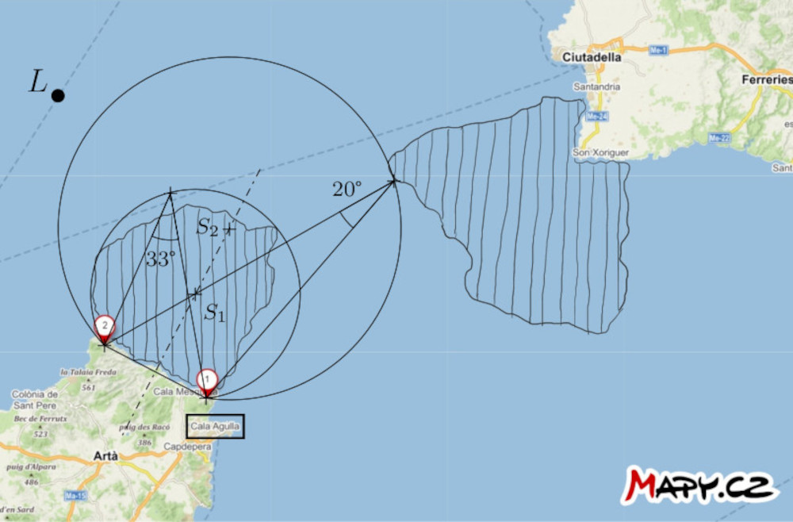

---
keywords:
- geometrie
- obvodové úhly
is_finished: True
difficulty: 2
time: 30
---

# Lodní navigace

Již od 15. století byli navigátoři vybaveni mechanickými pomůckami,
které jim umožňovaly změřit úhlovou vzdálenost dvou objektů (např.
hvězd, Slunce a horizontu nebo význačných bodů na vzdálené pevnině).
Z takových pomůcek zde zmíníme např. Jakubovu hůl, astroláb nebo námořní
sextant.[^1] Jako zajímavost poznamenejme, že i přes své stáří má
konkrétně sextant stále své místo jako záloha při náhlém výpadku signálu
GPS a dokonce se testuje i jeho potenciální nouzová využitelnost ve
vesmíru.[^2] Z dalších navigačních mechanických pomůcek zmiňme např.
trojramenný úhloměr, jehož role bude objasněna v poznámce po první
vyřešené úloze.

## Úlohy

V zadání následujících dvou úloh je mapa, do které žáci budou rýsovat,
přikládáme proto zadání také ve formě tisknutelného pracovního listu.

> **Úloha 1.** Na mapě jsou vyznačeny polohy tří majáků blízko města Bonifacio na
> Korsice. Kapitán lodi na moři změřil dvě
> úhlové vzdálenosti $\theta$ dvojice majáků následovně:
>
> * $\theta (2,3) = 52°$
> * $\theta (1,3) = 35°$
>
> Sestrojte na mapě bod označující polohu lodi v čase měření.
> Předpokládejme, že měření proběhla rychle za sebou, tzn. poloha lodi se
> prakticky nezměnila.

\iffalse

*Řešení.* Jestliže úhlová vzdálenost mezi majáky $2$ a $3$ činí $52°$, nachází se loď
někde na ekvigonále (tj. množině bodů v rovině, z kterých je danou úsečku vidět
pod daným úhlem) úsečky s koncovými body $2$ a $3$ příslušné řečenému
úhlu. Podobně se také nachází na ekvigonále úsečky s koncovými body $1$ a
$3$ příslušné úhlu $35°$, tedy se loď musí nacházet v průsečíku dvou
ekvigonál. Samozřejmě bereme v úvahu pouze ty kruhové oblouky, které dávají smysl.

\fi 

**Poznámka.** Pomůcka, která navigátory zbavila nutnosti konstrukce, je
již zmíněný trojramenný úhloměr, jehož tři ramena se nastavila na
mapě tak, ať prochází třemi polohami význačných bodů a svírají úhly
o naměřených velikostech. Průsečík ramen pak určil polohu lodi na mapě.

> **Úloha 2.** Na mapě úžiny mezi ostrovy Mallorca a Menorca jsou vyznačeny dva výrazné
> body na pevnině a poloha lodi $L$. Kromě toho se také na moři nachází
> dvě oblasti nebezpečných vod, ve kterých se nachází podvodní překážky.
>Najděte způsob, jak proplout lodí nebezpečnými vodami do přístavu Cala
>Agulla. Využijte toho, že kapitán lodi umí v libovolném okamžiku změřit
>úhlovou vzdálenost dvou řečených bodů.

\iffalse

*Řešení*. Sestrojme větší oblouky kružnic $k_1$ a
$k_2$, které prochází body $1$ a $2$ (tedy mají střed na ose
úsečky s koncovými body $1$ a $2$) a které mají následující další vlastnost:
oblouk kružnice $k_1$ těsně uzavírá přístavu bližší
nebezpečnou oblast a oblouk kružnice $k_2$ se dotýká
vzdálenější oblasti. Každý z těchto oblouků je přitom podmnožinou nějaké
ekvigonály úsečky $12$. Změřme nyní obvodové úhly příslušné těmto obloukům
– u našeho zadání je to přibližně $33°$ pro oblouk kružnice
$k_1$ a $20°$ pro oblouk kružnice $k_2$. 

Jestliže je oblouková vzdálenost bodů $1$ a $2$ vzhledem k lodi menší než
$33°$, můžeme říci, že se loď nachází s jistotou mimo nebezpečnou oblast
bližší přístavu. Naopak, jestliže bude řečená oblouková vzdálenost větší
než $20°$, loď se nachází mimo nebezpečnou oblast vzdálenější přístavu.

Formulujme nyní strategii proplutí: Kapitán lodi zamíří přímou cestou
např. k bodu $2$ a během plavby měří obloukovou vzdálenost bodů $1$ a $2$. Až
bude tato vzdálenost větší než $20°$ (ale stále menší než $33°$), stočí loď
vlevo ve směru plavby a obepluje nebezpečné místo tak, že úhlovou
vzdálenost obou bodů vzhledem k lodi udržuje mezi $20°$ a $33°$. Tak je
zajištěno, že loď zůstane v bezpečné oblasti mezi oběma oblouky.

\fi

## Odkazy a literatura

### Literatura

* Vondrák J. (2013). Historie navigace – od kvadrantu k GNSS. *Pokroky
  matematiky, fyziky a astronomie, 58 (1)*, 11–20.
* Gaskill M. (2018). *Deep Space Navigation: Tool Tested as Emergency Navigation Device*. NASA.
<https://www.nasa.gov/mission_pages/station/research/news/Sextant_ISS>

### Zdroje obrázků

-   Jakubova hůl  
    <https://upload.wikimedia.org/wikipedia/commons/thumb/f/fa/Jacobstaff.svg/800px-Jacobstaff.svg.png>
-   astroláb  
    <https://upload.wikimedia.org/wikipedia/commons/thumb/9/91/Astrolabio_Aveiro_Lisboa_ca1600.jpg/800px-Astrolabio_Aveiro_Lisboa_ca1600.jpg>
-   sextant  
    <https://upload.wikimedia.org/wikipedia/commons/5/55/A_sextant.JPG>
-   trojramenný úhloměr  
    <https://upload.wikimedia.org/wikipedia/commons/d/dd/HKMH_%E9%A6%99%E6%B8%AF%E6%AD%B7%E5%8F%B2%E5%8D%9A%E7%89%A9%E9%A4%A8_HK_Museum_of_History_%E4%B8%89%E6%A1%BF%E5%AE%9A%E4%BD%8D%E5%84%80_Station_pointer_March_2017_IX1.jpg>

[^1]: Více informací o historii navigace mohou zájemci najít např.
v článku Vondráka (2013).

[^2]: Gaskill (2018).
