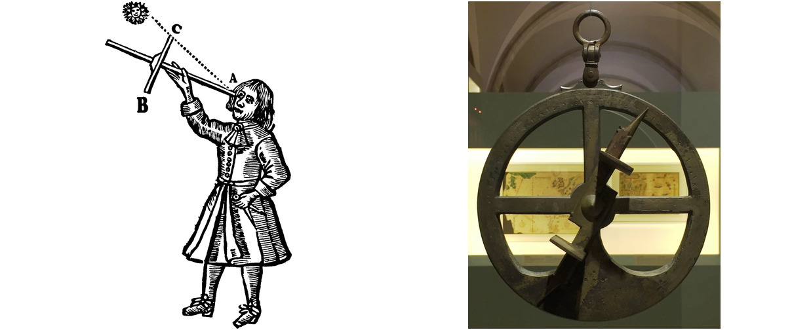
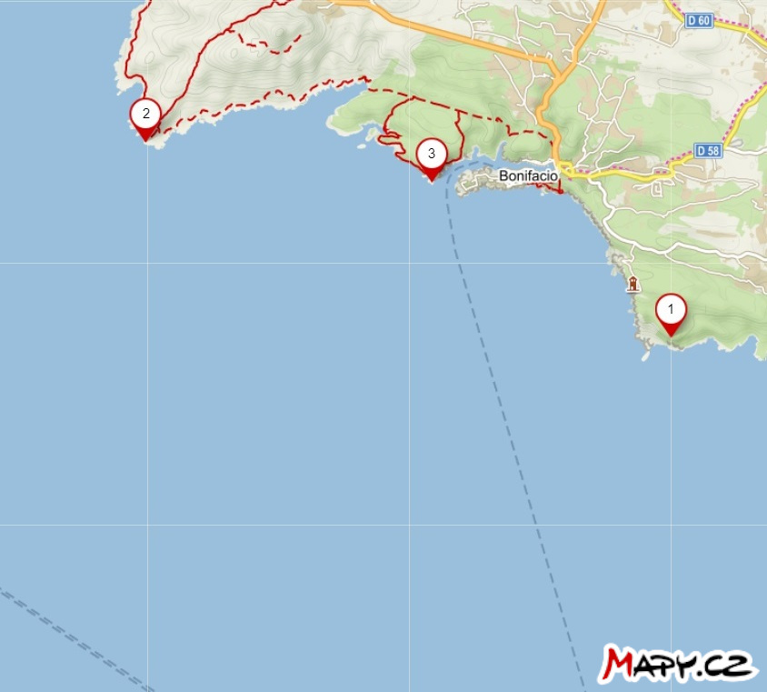
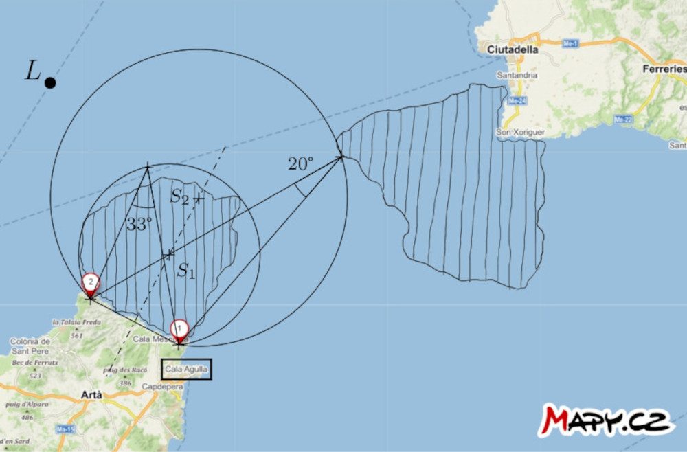

# Ship navigation

Since the 15th century, navigators have been equipped with mechanical
aids that allowed them to measure the angular distance between two
objects (such as stars, the Sun, and the horizon, or significant
points on a distant land).  Among such aids, we mention here the
Jacob's staff, the astrolabe, or the marine sextant.[^1] It is
interesting to note that despite its age, the sextant, in particular,
still has its place as a backup in case of a sudden loss of GPS signal
and is even being tested for its potential emergency use in space.
[^2] Among other mechanical navigation tools, let us mention the
station pointer, whose role will be explained in the note after the
solution of the first exercise.

## Exercises

The following two exercises involve a map that students will need to
draw on. Therefore, we provide the assignments also in the form of a
printable worksheets.

> **Exercise 1.** On the map, the positions of three lighthouses near
> the town of Bonifacio on Corsica are marked.  The captain of a ship at
> sea has measured two angular distances, denoted $\theta$, between
> two pairs of lighthouses as follows:
>
> * $\theta (2,3) = 52°$
> * $\theta (1,3) = 35°$
>
> Construct a point on the map indicating the position of the ship
> at the time of measurement.
> Assume that the measurements were taken in rapid succession,
> i.e., the ship's position practically did not change.

\iffalse

*Solution.* If the angular distance between lighthouses 2 and 3 is
52°, the ship is located somewhere on the circle that corresponds to a
locus of a vertex of the angle 52° subtending a line segment with
endpoints 2 and 3.
Similarly, it is also located on the circle that is a locus of a
vertex of the angle 35° subtending a line segment with endpoints 1 and
3.  So, the ship must be at the intersection of these two circles. Of
course, we only consider those circular arcs that make sense.

\fi

**Note.** The tool that freed navigators from this construction is the
station pointer (also called the three-armed protractor) we already
mentioned. Its three arms were set on the map in such a way that they
passed through positions of the three salient points and formed angles
of the measured sizes. The intersection of the arms then determined
the position of the ship on the map.

> **Exercise 2.** On the map of the strait between the islands of
> Mallorca and Menorca, two prominent points on the mainland and the
> position of the ship $L$ are marked. Additionally,
> two areas of dangerous waters, containing underwater obstacles, are
> indicated.  Find a way for the ship to navigate through the dangerous
> waters to the port of Cala Agulla.  Utilize the ship captain's ability
> to measure the angular distance between the two mentioned points at
> any given moment.

\iffalse

*Solution*. Let us construct the larger arcs of the circles, denoted
$k_1$ and $k_2$ passing through points $1$ and $2$. The centers of the
circles are on the axis of the line segment with endpoints $1$ and
$2$. The circles have the following additional property:
the arc of circle $k_1$ tightly encloses the dangerous area closer to
the port, and the arc of circle $k_2$ is tangent to the more distant
area. Each of these arcs is a subset of some locus of a vertex of an
angle subtending the line segment with endpoints $1$ and $2$. Now, let
us measure the inscribed angles corresponding to these arcs. In our
situation, the angle is approximately $33°$ for the arc of circle
$k_1$ and $20°$ for the arc of circle $k_2$.

If the angular distance between points $1$ and $2$ with respect to the
ship is less than $33°$, we can say that the ship is confidently
outside the danger zone closer to the port. Conversely, if the angular
distance exceeds $20°$, the ship is outside the danger zone farther
from the port.

Now, let us formulate a strategy for navigation: The captain of the
ship should head in a straight direction towards point $2$ and measure
the angular distance between points $1$ and $2$ during the journey.
When this distance becomes greater than $20°$ but still less than
$33°$, the ship should turn left in the direction of sailing, to
navigate around the danger zone, by maintaining the angular distance
between the two points relative to the ship between $20°$ and
$33°$. This approach ensures that the ship remains in the safe area
between the two arcs.

\fi

## References and literature

### Literature

* Vondrák J. (2013). History of navigation - from quadrant to GNSS. * Advances
of mathematics, physics and astronomy, 58 (1)*, 11-20.
* Gaskill M. (2018). *Deep Space Navigation: Tool Tested as Emergency
Navigation Device*. NASA.
<https://www.nasa.gov/mission_pages/station/research/news/Sextant_ISS>

### Image Sources

- Jacob's staff  
    <https://upload.wikimedia.org/wikipedia/commons/thumb/f/fa/Jacobstaff.svg/800px-Jacobstaff.svg.png>
- astrolabe  
    <https://upload.wikimedia.org/wikipedia/commons/thumb/9/91/Astrolabio_Aveiro_Lisboa_ca1600.jpg/800px-Astrolabio_Aveiro_Lisboa_ca1600.jpg>
- sextant  
    <https://upload.wikimedia.org/wikipedia/commons/5/55/A_sextant.JPG>
- three-arm protractor  
    <https://upload.wikimedia.org/wikipedia/commons/d/dd/HKMH_%E9%A6%99%E6%B8%AF%E6%AD%B7%E5%8F%B2%E5%8D%9A%E7%89%A9%E9%A4%A8_HK_Museum_of_History_%E4%B8%89%E6%A1%BF%E5%AE%9A%E4%BD%8D%E5%84%80_Station_pointer_March_2017_IX1.jpg>

[^1]: For more information about navigation, see Vondrák (2013).

[^2]: Gaskill (2018).
