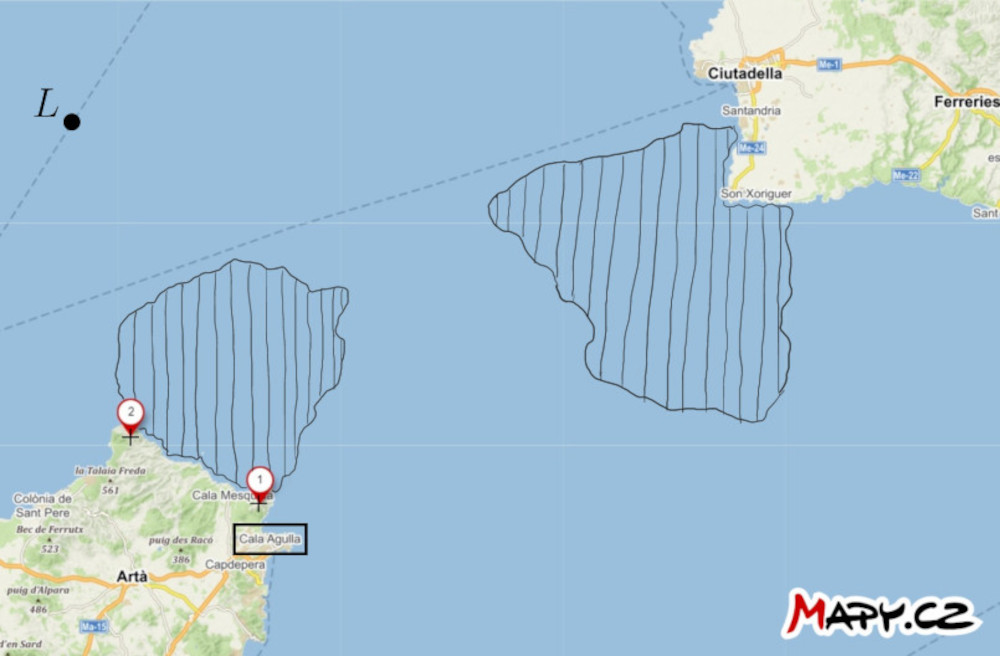

# Navegación marítima

Desde el siglo XV, los navegantes disponían de ayudas mecánicas que les permitían medir la distancia angular entre dos
objetos (como las estrellas, el Sol y el horizonte, o puntos significativos de una tierra lejana).  Entre tales ayudas, mencionamos aquí el
vara de Jacob, el astrolabio o el sextante marino.[^1] Es interesante observar que, a pesar de su antigüedad, el sextante, en particular,
todavía tiene su lugar como reserva en caso de pérdida repentina de la señal GPS
e incluso se está probando su posible uso de emergencia en el espacio.
[^2] Entre otras herramientas mecánicas de navegación, mencionemos el
trazador de tres brazos, cuya función se explicará en la nota tras la
solución del primer ejercicio.

## Ejercicios

Los dos siguientes ejercicios incluyen un mapa que los alumnos deberán
dibujar. Por lo tanto, proporcionamos las tareas también en forma de
hojas de trabajo imprimibles.

> **Ejercicio 1.** En el mapa están marcadas las posiciones de tres faros cercanos a la ciudad de Bonifacio, en Córcega. EL capitán de un barco en el mar ha medido dos distancias angulares, denotadas $\theta$, entre dos pares de faros de la siguiente manera:
>
> * $\theta (2,3) = 52°$
> * $\theta (1,3) = 35°$
>
> Construye un punto en el mapa indicando la posición del barco
> en el momento de medir.
> Supongamos que las mediciones se realizaron en rápida sucesión,
> es decir, la posición del barco prácticamente no cambió.

\iffalse

*Solución.* Si la distancia angular entre los faros 2 y 3 es de
52°, el barco se encuentra en algún punto del círculo que corresponde a un
lugar geométrico de un vértice del ángulo 52° que subtiende a un segmento de recta con
los puntos extremos 2 y 3.
Del mismo modo, también se encuentra en el círculo que es un lugar geométrico de un
vértice del ángulo 35° que subtiende un segmento de recta con los puntos extremos 1 y
3.  Por lo tanto, el barco debe estar en la intersección de estos dos círculos. 
Por supuesto, sólo consideramos los arcos circulares que tienen sentido.

\fi

**Nota.** La herramienta que liberó a los navegantes de esta construcción es el
(también llamado transportador de tres brazos) que ya hemos mencionado. 
Sus tres brazos se colocaban en el mapa de forma que
pasaban por las posiciones de los tres puntos salientes y formaban ángulos
de los tamaños medidos. La intersección de los brazos determinaba entonces
la posición del barco en el mapa.

> **Ejercicio 2.** En el mapa del estrecho entre las islas de
> Mallorca y Menorca, se marcan dos puntos destacados en tierra firme y la
> posición del barco $L$ están marcados. Además,
> dos zonas de aguas peligrosas, con obstáculos submarinos,
>  están indicadas.  Encuentra la manera de que el barco navegue a través de las aguas peligrosas
> hasta el puerto de Cala Agulla.  Utiliza la habilidad del capitán
> de medir la distancia angular entre los dos puntos mencionados en
> cualquier momento.

\iffalse

*Solución*. Construyamos los arcos mayores de las circunferencias, denominadas
$k_1$ y $k_2$ que pasan por los puntos $1$ y $2$. Los centros de las
circunferencias están en el eje del segmento de recta con puntos extremos $1$ y
$2$. Las circunferencias tienen la siguiente propiedad adicional:
el arco de la circunferencia $k_1$ encierra estrechamente la zona peligrosa más cercana al
del puerto, y el arco de la circunferencia $k_2$ es tangente a la zona más alejada.
Cada uno de estos arcos es un subconjunto de algún lugar de un vértice de un
ángulo que subtiende al segmento de recta con extremos $1$ y $2$. Ahora
midamos los ángulos inscritos correspondientes a estos arcos. En nuestra
situación, el ángulo es de aproximadamente $33°$ para el arco de círculo
$k_1$ y $20°$ para el arco de círculo $k_2$.

Si la distancia angular entre los puntos $1$ y $2$ con respecto al
barco es inferior a $33°$, podemos decir que el barco está con seguridad
fuera de la zona de peligro más próxima al puerto. Por el contrario, si la distancia angular 
es superior a $20°$, el barco está fuera de la zona de peligro más lejos
del puerto.

Formulemos ahora una estrategia de navegación: El capitán del
barco debe dirigirse en línea recta hacia el punto $2$ y medir
la distancia angular entre los puntos $1$ y $2$ durante el trayecto.
Cuando esta distancia sea superior a $20°$ pero inferior a
$33°$, el barco deberá girar a la izquierda en la dirección de navegación, para
navegar alrededor de la zona de peligro, manteniendo la distancia angular
entre los dos puntos relativos al barco entre $20°$ y
$33°$. Este enfoque garantiza que el barco permanezca en la zona segura
entre los dos arcos.

\fi

## Referencias y bibliografía

### Bibliografía

* Vondrák J. (2013). History of navigation - from quadrant to GNSS. * Advances
of mathematics, physics and astronomy, 58 (1)*, 11-20.
* Gaskill M. (2018). *Deep Space Navigation: Tool Tested as Emergency
Navigation Device*. NASA.
<https://www.nasa.gov/mission_pages/station/research/news/Sextant_ISS>

### Fuentes de imágenes

- Vara de Jacob 
    <https://upload.wikimedia.org/wikipedia/commons/thumb/f/fa/Jacobstaff.svg/800px-Jacobstaff.svg.png>
- astrolabio  
    <https://upload.wikimedia.org/wikipedia/commons/thumb/9/91/Astrolabio_Aveiro_Lisboa_ca1600.jpg/800px-Astrolabio_Aveiro_Lisboa_ca1600.jpg>
- sextante
    <https://upload.wikimedia.org/wikipedia/commons/5/55/A_sextant.JPG>
- trazador de tres brazos  
    <https://upload.wikimedia.org/wikipedia/commons/d/dd/HKMH_%E9%A6%99%E6%B8%AF%E6%AD%B7%E5%8F%B2%E5%8D%9A%E7%89%A9%E9%A4%A8_HK_Museum_of_History_%E4%B8%89%E6%A1%BF%E5%AE%9A%E4%BD%8D%E5%84%80_Station_pointer_March_2017_IX1.jpg>

[^1]: Para conseguir más información sobre la navegación, véase Vondrák (2013).

[^2]: Gaskill (2018).

