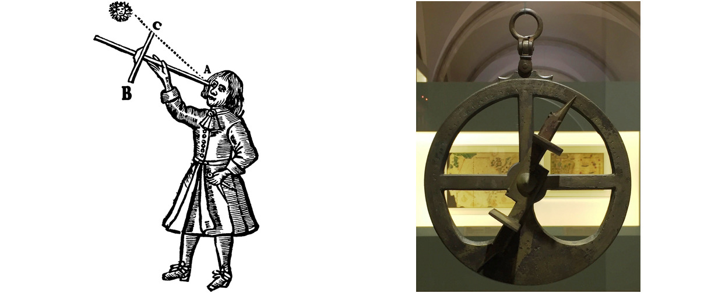
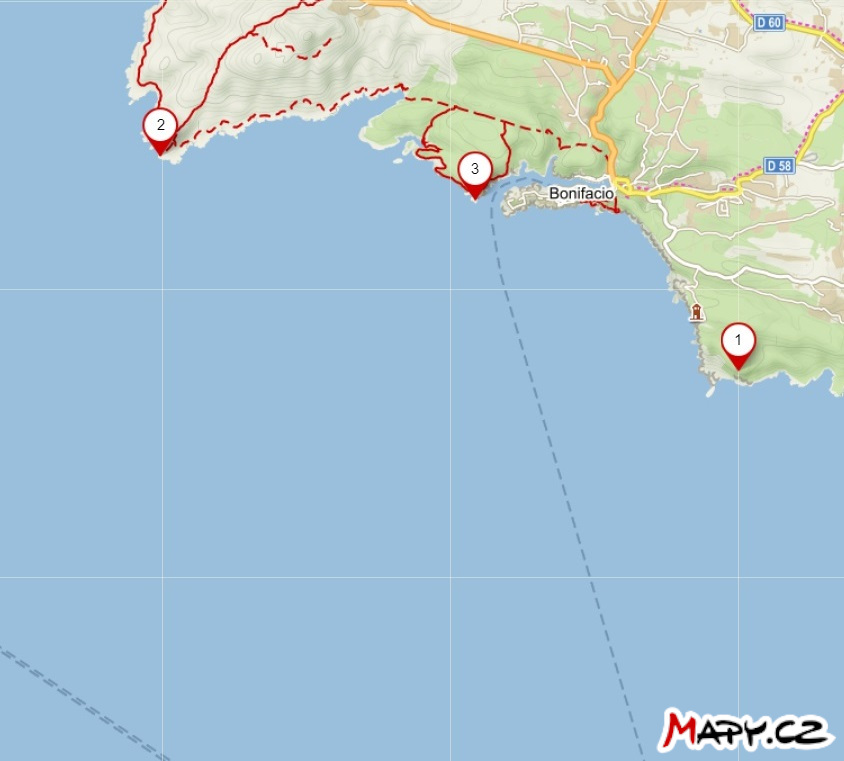
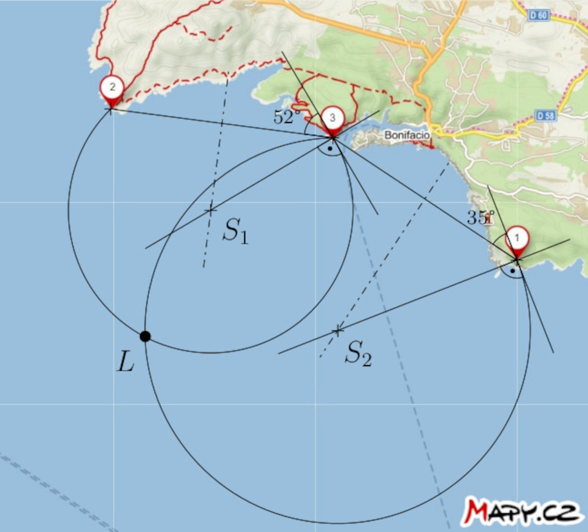
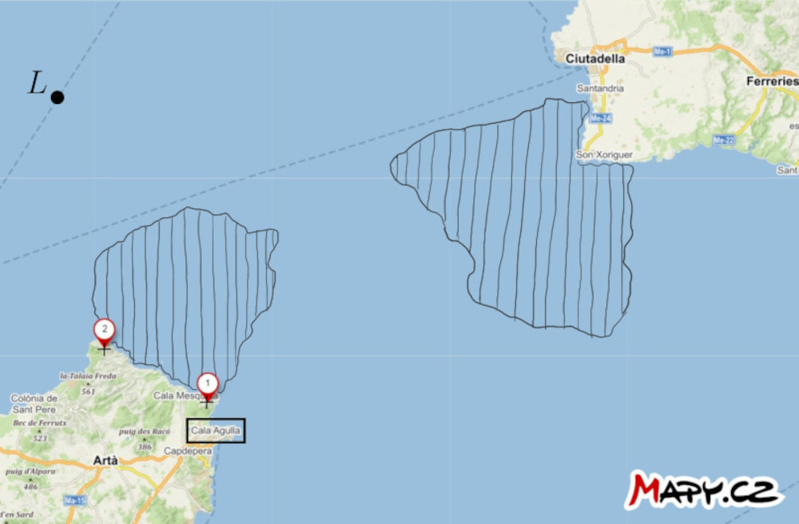
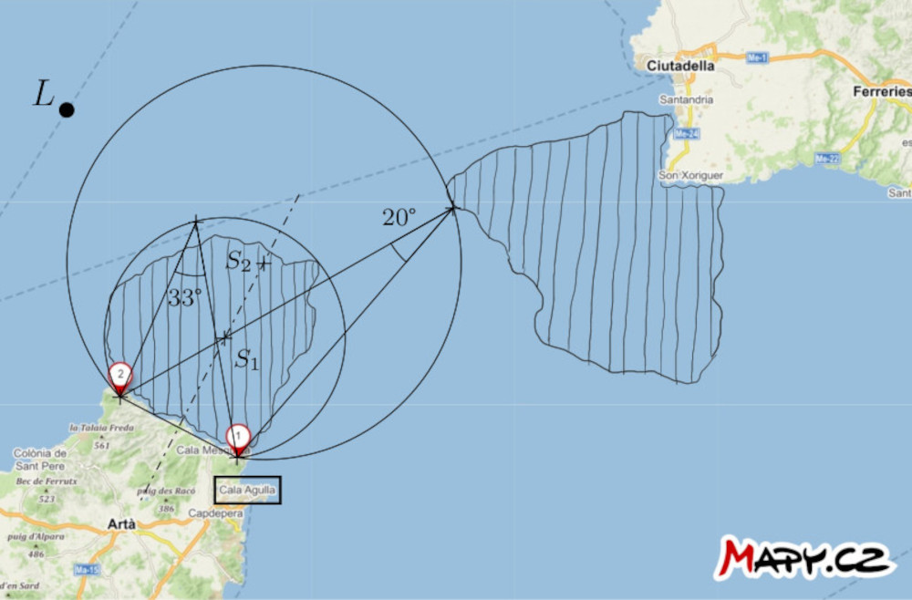

# Nawigacja na statku

Od XV wieku nawigatorzy byli wyposażeni w mechaniczne
pomoce, które pozwalały im mierzyć odległość kątową między dwoma obiektami 
(takimi jak gwiazdy, słońce i horyzont lub znaczące punkty na odległym lądzie).
 Wśród takich pomocy można wymienić laskę Jakuba, astrolabium czy sekstant morski.[^1] Warto zauważyć, że pomimo swojego wieku, sekstant, w szczególności,
nadal ma swoje miejsce jako kopia zapasowa w przypadku nagłej utraty sygnału GPS a nawet jest testowany pod kątem jego potencjalnego awaryjnego wykorzystania w kosmosie. [^2] Spośród innych mechanicznych narzędzi nawigacyjnych wspomnijmy o
wskaźniku stacji, którego rola zostanie wyjaśniona w notatce po rozwiązaniu pierwszego zadania.

## Zadania

Poniższe dwa zadania zawierają mapę, którą uczniowie będą musieli nakreślić. W związku z tym udostępniamy te zadania również w formie arkuszy do wydrukowania.

> **Zadanie 1.** Na mapie zaznaczono pozycje trzech latarni morskich w pobliżu
> miasta Bonifacio na Korsyce.  Kapitan statku na
> na morzu zmierzył dwie > odległości kątowe, oznaczone $\theta$, między
> dwiema parami latarni morskich w następujący sposób:
>
> * $\theta (2,3) = 52°$
> * $\theta (1,3) = 35°$
>
> Skonstruuj punkt na mapie wskazujący pozycję statku
> w momencie pomiaru.
> Załóżmy, że pomiary zostały wykonane w krótkim odstępie czasu,
> tzn. pozycja statku praktycznie się nie zmieniła.

\iffalse

*Rozwiązanie.* Jeśli odległość kątowa między latarniami 2 i 3 wynosi
52°, statek znajduje się gdzieś na okręgu, który odpowiada
położeniu wierzchołka kąta 52° odchodzącego od odcinka o końcach z punktami końcowymi 2 i 3.
Analogicznie, statek znajduje się również na okręgu, który jest punktem wierzchołka kąta 35° odejmującego odcinek o końcach 1 i
3.  Zatem statek musi znajdować się na przecięciu tych dwóch okręgów. Oczywiście bierzemy pod uwagę tylko te łuki okręgów, które mają sens.

\fi

**Notatka.** Narzędziem, które uwolniło nawigatorów od tej konstrukcji jest
wskaźnik stacji (zwany również trójramiennym kątomierzem), o którym już wspominaliśmy. Jego trzy ramiona były ustawione na mapie w taki sposób, że przechodziły przez pozycje trzech istotnych punktów i tworzyły kąty mierzonych wielkości. Przecięcie ramion wyznaczało następnie pozycję statku na mapie.

> **Zadanie 2.** Na mapie cieśniny między wyspami Majorka i Minorka, zaznaczone są dwa ważne punkty na stałym lądzie oraz  zaznaczono pozycję statku $L$. Dodatkowo, wskazano dwa obszary niebezpiecznych wód, zawierające podwodne przeszkody.  Znajdź sposób, aby statek mógł przepłynąć przez niebezpieczne wody do portu Cala Agulla.  Wykorzystaj umiejętność kapitana statku do zmierzenia odległości kątowej między dwoma wspomnianymi punktami w dowolnym momencie.

\iffalse

*Rozwiązanie*. Skonstruujmy większe łuki okręgów, oznaczone jako
$k_1$ i $k_2$ przechodzące przez punkty $1$ i $2$. Środki okręgów leżą na osi odcinka o końcach $1$ i
$2$. Okręgi mają następującą dodatkową własność:
łuk okręgu $k_1$ ciasno otacza niebezpieczny obszar bliżej portu, a łuk okręgu $k_2$ ciasno otacza niebezpieczny obszar bliżej portu,  a łuk okręgu $k_2$ jest styczny do bardziej odległego obszaru. Każdy z tych łuków jest podzbiorem pewnego miejsca wierzchołka kąta odejmującego odcinek o końcach $1$ i $2$. Zmierzmy teraz kąty wpisane odpowiadające tym łukom. W naszej
sytuacji kąt ten wynosi w przybliżeniu $33°$ dla łuku okręgu
$k_1$ i $20°$ dla łuku okręgu $k_2$.

Jeśli odległość kątowa między punktami $1$ i $2$ w odniesieniu do statku jest mniejsza niż $33°$, możemy powiedzieć, że statek jest pewnie poza strefą zagrożenia bliżej portu. I odwrotnie, jeśli odległość kątowa przekracza 20°$, statek znajduje się poza strefą niebezpieczną dalej od portu.

Sformułujmy teraz strategię nawigacji: Kapitan
powinien kierować się w prostym kierunku do punktu $2$ i mierzyć
odległość kątową między punktami $1$ i $2$ podczas podróży.
Gdy odległość ta będzie większa niż $20°$, ale wciąż mniejsza niż
$33°$, statek powinien skręcić w lewo w kierunku żeglugi, aby
nawigować wokół strefy niebezpiecznej, utrzymując odległość kątową
między dwoma punktami względem statku między $20°$ a $33°$.
Takie podejście zapewnia, że statek pozostaje w bezpiecznym obszarze
między dwoma łukami.

\fi

## Odniesienia i literatura

### Literatura

* Vondrák J. (2013). History of navigation - from quadrant to GNSS. * Advances
of mathematics, physics and astronomy, 58 (1)*, 11-20.
* Gaskill M. (2018). *Deep Space Navigation: Tool Tested as Emergency
Navigation Device*. NASA.
<https://www.nasa.gov/mission_pages/station/research/news/Sextant_ISS>

### Źródła obrazów

- Laska Jakuba  
    <https://upload.wikimedia.org/wikipedia/commons/thumb/f/fa/Jacobstaff.svg/800px-Jacobstaff.svg.png>
- astrolabium  
    <https://upload.wikimedia.org/wikipedia/commons/thumb/9/91/Astrolabio_Aveiro_Lisboa_ca1600.jpg/800px-Astrolabio_Aveiro_Lisboa_ca1600.jpg>
- sekstant  
    <https://upload.wikimedia.org/wikipedia/commons/5/55/A_sextant.JPG>
- trójramienny kątomierz  
    <https://upload.wikimedia.org/wikipedia/commons/d/dd/HKMH_%E9%A6%99%E6%B8%AF%E6%AD%B7%E5%8F%B2%E5%8D%9A%E7%89%A9%E9%A4%A8_HK_Museum_of_History_%E4%B8%89%E6%A1%BF%E5%AE%9A%E4%BD%8D%E5%84%80_Station_pointer_March_2017_IX1.jpg>

[^1]: Więcej informacji na temat nawigacji można znaleźć w artykule Vondrák (2013).

[^2]: Gaskill (2018).

