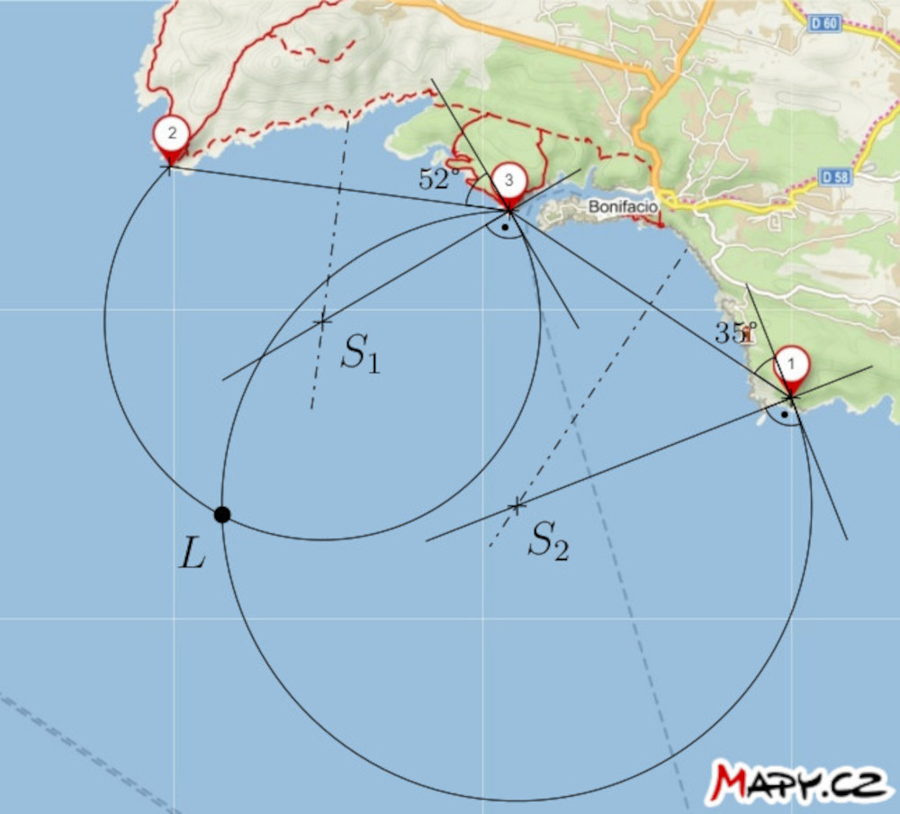

# Lodná navigácia

Od 15. storočia boli navigátori vybavení mechanickými
pomôckami, ktoré im umožňovali merať uhlovú vzdialenosť medzi dvoma
objektmi (napr. hviezd, Slnka a horizontu alebo významné
body na vzdialenej pevnine).  Spomedzi takýchto pomôcok spomenieme napr.
Jakubovu palicu, astroláb alebo námorný sextant[^1].
Ako zaujímavosť poznamenajme, že napriek svojmu veku má konkrétne sextant,
stále svoje miesto ako záloha v prípade náhlej straty signálu GPS
a dokonca sa testuje jeho potenciálne núdzové použitie vo vesmíre.
[^2] Z ďalších mechanických navigačných nástrojov spomeňme napr.
námorný uhlomer, ktorého úloha bude vysvetlená v poznámke po
vyriešení prvej úlohy.

## Úlohy

V zadaní nasledujúcich dvoch úloh je mapa, do ktorej majú žiaci kresliť,
preto prikladáme zadanie tiež vo forme pracovného listu na vytlačenie.

> **Úloha 1.** Na mape sú vyznačené polohy troch majákov blízko mesta Bonifacio na
> Korzike. Kapitán lode na mori zmeral dve
> uhlové vzdialenosti $\theta$ dvojice majákov nasledovne:
>
> * $\theta (2,3) = 52°$
> * $\theta (1,3) = 35°$
>
> Zostrojte na mape bod označujúci polohu lode v čase merania.
> Predpokladajme, že merania prebehli rýchlo za sebou, tzn. poloha lode sa
> prakticky nezmenila.

\iffalse

*Riešenie.* Ak je uhlová vzdialenosť medzi majákmi $2$ a $3$ nameraná $52°$, loď sa nachádza niekde na kružnici (množine G), ktorá zodpovedá vrcholu uhla $52°$, ktorý zviera úsečka s koncovými bodmi $2$ a $3$. Podobne sa nachádza aj na kružnici (množine G), ktorá zodpovedá vrcholu uhla $35°$, ktorý zviera úsečka s koncovými bodmi $1$ a $3$. Loď sa teda musí nachádzať v prieniku týchto dvoch kružníc. Samozrejme, berieme do úvahy len tie kružnicové oblúky, ktoré majú zmysel.
(Množina G, je množina bodov v rovine, z ktorých je danú úsečku vidieť
pod daným uhlom)

\fi

**Poznámka.** Nástroj, ktorý oslobodil navigátorov od tejto konštrukcie, je
námorný uhlomer (nazývaný aj trojramenný uhlomer), ktorý sme už spomenuli. Jeho tri ramená boli na mape nastavené tak, aby
prechádzali polohami troch význačných bodov a zvierali uhly nameraných veľkostí. Priesečník ramien potom určoval
polohu lode na mape.

> **Úloha 2.** Na mape úžiny medzi ostrovmi
Malorka a Menorka sú vyznačené dva výrazné body na pevnine a poloha lode $L$. Okrem toho sa tiež na mori nachádzajú dve oblasti nebezpečných vôd, v ktorých sú pod vodou prekážky. Nájdite spôsob, ako môže loď preplávať cez nebezpečné vody do prístavu Cala Agulla. Využite schopnosť kapitána lode zmerať uhlovú vzdialenosť medzi dvoma uvedenými bodmi v ľubovoľnom okamihu.

\iffalse

*Riešenie*. Zostrojme väčšie oblúky kružníc, označené $k_1$ a $k_2$ prechádzajúce bodmi $1$ a $2$. Stredy kružníc ležia na osi úsečky s koncovými bodmi $1$ a $2$. Kružnice majú ďalšiu nasledujúcu vlastnosť:
Oblúk kružnice $k_1$ tesne uzatvára prístavu bližšiu nebezpečnú oblasť 
a oblúk kružnice $k_2$ sa dotýka vzdialenejšej oblasti. Každý z týchto oblúkov je podmnožinou nejakej množiny G
nad úsečkou $12$. Zmerajme teraz obvodové uhly prislúchajúce týmto oblúkom. V našom
zadaní je tento uhol približne $33°$ pre oblúk kružnice $k_1$ a $20°$ pre oblúk kružnice $k_2$. 

Ak je uhlová vzdialenosť medzi bodmi $1$ a $2$ vzhľadom k lodi menšia ako $33°$, môžeme povedať, že loď je s istotou
mimo nebezpečnej oblasti bližšie k prístavu. Naopak, ak uhlová vzdialenosť
je väčšia ako $20°$, loď je mimo nebezpečnej oblasti ďalej od prístavu.

Teraz sformulujme stratégiu navigácie: Kapitán lode by sa mal vydať priamym smerom k bodu $2$ a merať uhlovú vzdialenosť medzi bodmi $1$ a $2$ počas cesty.
Ak táto vzdialenosť bude väčšia ako $20°$, ale stále menšia ako $33°$, stočí loď doľava v smere plavby a obopláva nebezpečnú oblasť tak, že uhlovú vzdialenosť
medzi týmito dvoma bodmi udrží vzhľadom na loď medzi $20°$ a $33°$. Tento postup zabezpečí, že loď zostane v bezpečnej oblasti medzi oboma oblúkmi. 

\fi

## Odkazy a literatúra

### Literatúra

* Vondrák J. (2013). Historie navigace – od kvadrantu k GNSS. *Pokroky
  matematiky, fyziky a astronomie, 58 (1)*, 11–20.
* Gaskill M. (2018). *Deep Space Navigation: Tool Tested as Emergency Navigation Device*. NASA.
<https://www.nasa.gov/mission_pages/station/research/news/Sextant_ISS>

### Zdroje obrázkov

-   Jakubova palica  
    <https://upload.wikimedia.org/wikipedia/commons/thumb/f/fa/Jacobstaff.svg/800px-Jacobstaff.svg.png>
-   astroláb  
    <https://upload.wikimedia.org/wikipedia/commons/thumb/9/91/Astrolabio_Aveiro_Lisboa_ca1600.jpg/800px-Astrolabio_Aveiro_Lisboa_ca1600.jpg>
-   námorný sextant  
    <https://upload.wikimedia.org/wikipedia/commons/5/55/A_sextant.JPG>
-   trojramenný uhlomer  
    <https://upload.wikimedia.org/wikipedia/commons/d/dd/HKMH_%E9%A6%99%E6%B8%AF%E6%AD%B7%E5%8F%B2%E5%8D%9A%E7%89%A9%E9%A4%A8_HK_Museum_of_History_%E4%B8%89%E6%A1%BF%E5%AE%9A%E4%BD%8D%E5%84%80_Station_pointer_March_2017_IX1.jpg>

[^1]: Viac informácií o histórii navigácie môžete nájsť napríklad v článku Vondráka (2013).

[^2]: Gaskill (2018).
