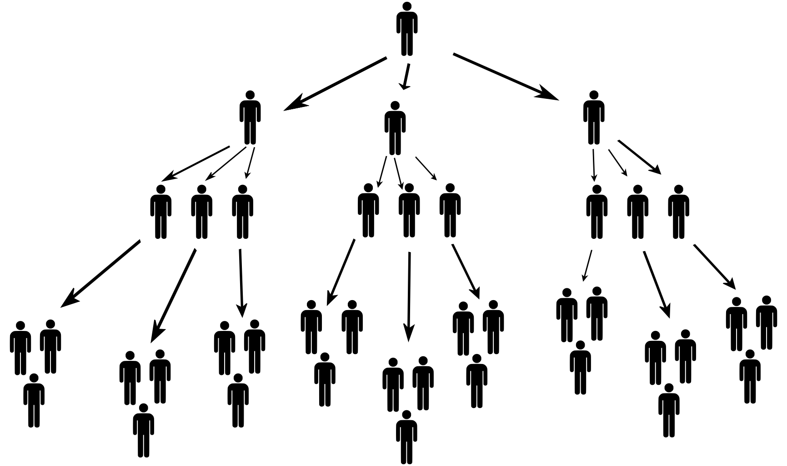
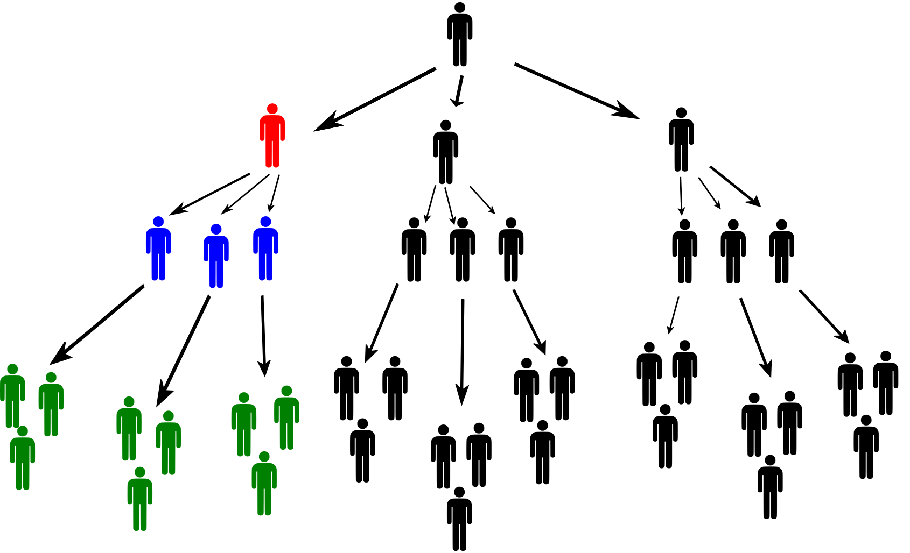

# Piramida finansowa
Wyobraź sobie, że ktoś w imieniu firmy inwestycyjnej oferuje ci szybki sposób na pomnożenie pieniędzy. Jedyne, co musisz zrobić, to przekonać trzech swoich znajomych, aby również zainwestowali. Twoje pieniądze nie zostaną jednak wykorzystane do zakupu złota lub akcji, ale zostaną podzielone między osoby, które dołączyły do firmy przed Tobą. Jeśli uda ci się przekonać trzech znajomych do dołączenia, otrzymasz część ich pieniędzy, a także część od kolejnych osób, które zostaną przekonane przez twoich znajomych.Trwa to tak długo, aż cały model upadnie z powodu braku nowych inwestorów, a właściciel firmy w tajemniczy sposób odleci na Bahamy. 
Trzeba powiedzieć, że tego typu rzeczy nie są dobre dla przyjaźni.

Właśnie padłeś ofiarą jednego z najbardziej rozpowszechnionych oszukańczych modeli biznesowych – *piramidy finansowej*.

## Zadanie 

Założyciel spółki (pierwszy poziom piramidy) rekrutuje trzech inwestorów (drugi poziom piramidy) i pobiera od każdego z nich stałą opłatę wstępną w wysokości 20 000 CZK.Zadaniem każdego z trzech inwestorów jest wprowadzenie do programu trzech nowych inwestorów (trzeci poziom piramidy) i pobranie od każdego z nich opłaty wstępnej w wysokości 20 000 CZK. Ten sam proces jest powtarzany dla kolejnych poziomów. Dla uproszczenia przyjmiemy, że rekrutacja nowych członków zawsze następuje dopiero po zapełnieniu całego poziomu piramidy.  Na przykład, rekrutacja nowych członków na czwarty poziom rozpoczyna się dopiero po zrekrutowaniu wszystkich dziewięciu inwestorów na trzeci poziom.

Wpisowe wpłacane przez nowych uczestników jest rozdzielane pomiędzy dotychczasowych uczestników w następujący sposób: 
6 000 CZK otrzyma osoba A, która wprowadziła nową osobę, 
1 000 CZK otrzyma osoba B, która wprowadziła osobę A, a kolejne
1 000 CZK otrzyma osoba C, która przyprowadziła kolejną osobę B
1 000 CZK trafi do osoby D, która przyprowadziła osobę C, i tak dalej, aż do podziału wpisowego. 
Jeśli pieniądze zostaną wypłacone założycielowi firmy, otrzyma on resztę opłaty.

>**Zadanie 1.** Kiedy nowicjusz otrzyma zwrot opłaty członkowskiej?

\iffalse

*Rozwiązanie.* Nowa osoba płaci wpisowe w wysokości 20 000 CZK. Aby odzyskać pieniądze, musi zrekrutować trzech nowych członków, od których otrzyma łącznie 18 000 CZK. Dodatkowo, każdy z tych zrekrutowanych członków musi przyprowadzić co najmniej dwóch kolejnych członków, od których nowicjusz otrzyma pozostałe 2 000 CZK.

\fi

>**Zadanie 2.**
>Po osiągnięciu określonego poziomu piramidy, założyciel 
>firmy  nie otrzymuje pieniędzy z opłat wpisowych po raz pierwszy.
>
>1. Który to poziom?
>2.  Po osiągnięciu tego poziomu, ile osób znajduje się w całej piramidzie? Porównaj tę liczbę z liczbą osób w twojej szkole lub społeczności.  
>3.   Określ procent osób, które są na stracie po osiągnięciu 
>    tego poziomu.

\iffalse

*Rozwiązania do zadania 2.*

*Rozwiązanie 2.1.* Jeśli założyciel firmy nie otrzyma żadnych pieniędzy z wpisowego nowego członka po raz pierwszy, oznacza to, że istnieje 16 poziomów powyżej tego członka (6 000 CZK trafia do osoby na wyższym poziomie, $14\cdot 1\ 000$ CZK do osób na 14 poziomach powyżej, a założyciel na pierwszym poziomie nie otrzymuje nic). Nowy członek jest więc na poziomie 17.

*Rozwiązanie 2.2.* Liczba osób na każdym poziomie tworzy ciąg geometryczny z pierwszym wyrazem $a_1=1$ i ilorazem $q=3$. 
Liczba osób w piramidzie składającej się z 17 poziomów jest więc sumą pierwszych 17 wyrazów tego ciągu. $$s_{n}=a_1\cdot\frac{q^n-1}{q-1},\qquad s_{17}=1\cdot\frac{3^{17}-1}{3-1}=64\ 570\ 081$$. 
Widzimy, że cała populacja większego kraju (w przybliżeniu odpowiadająca populacji Francji) musiałaby być zaangażowana w program.

*Rozwiązanie 2.3.* Z rozwiązania pierwszego zadania wynika, że stratna część piramidy składa się z dwóch ostatnich poziomów. Liczba stratnych osób jest zatem równa sumie szesnastego członu i siedemnastego członu ciągu geometrycznego: $a_{16}+a_{17}=3^{15}+3^{16}=57\ 395\ 628$. 
Teraz możemy określić procentowy udział osób w stracie: $$P=100\cdot\frac{57\ 395\ 628}{64\ 570\ 081}\,\%\doteq 88{,}89\,\%.$$

\fi

>**Zadanie 3.**
>W rzeczywistych przypadkach z Republiki Czeskiej liczba uczestników była rzędu tysięcy.
>Dlatego powiedzmy, że liczba uczestników w naszej piramidzie wynosi od 2 000 do 8 000, po osiągnięciu określonego poziomu.
>1. Który to poziom?
>2. Określ procent osób, które są teraz stratne.
>3. Określ całkowity zysk założyciela spółki.
>4.  Określ całkowity zysk inwestora na drugim poziomie piramidy.
>5. Jaki procent wszystkich zebranych opłat będzie
> wypłacany osobom na pierwszych trzech poziomach piramidy?

\iffalse

*Rozwiązania do zadania 3.*

*Rozwiązanie 3.1.*  Problem można rozwiązać poprzez stopniowe podstawianie liczb naturalnych do wzoru na sumę pierwszych $n$ wyrazów ciągu geometrycznego. 
Przedstawimy jednak rozwiązanie wykorzystujące nierówność wykładniczą.
Wynika z niej, że $2\ 000 \leq s_n \leq  8\ 000$, zatem po podstawieniu do wzoru ($a_1=1$, $q=3$) 
otrzymujemy: $$2\ 000  \leq  \dfrac{3^n-1}{2}  \leq  8\ 000$$ $$4\ 001  \leq   3^n  \leq   16\ 001$$ $$\log_3 4\ 001  \leq   n  \leq   \log_3 16\ 001.$$ Ponieważ $\log_3 4\ 001 \doteq 7{,}55$ and $\log_3 16\ 001 \doteq 8{,}81$,
piramida ma teraz osiem poziomów (przez podstawienie możemy zobaczyć, że liczba osób w piramidzie
wynosi teraz 3 280).

*Rozwiązanie 3.2.* Ponownie, przegrane części piramidy to dwa ostatnie poziomy. Podobnie jak w rozwiązaniu 2.3, liczba osób na stracie jest równa $a_7+a_8=3^6+3^7=2\ 916$. Określamy udział procentowy: $$P'=100\cdot\frac{2\ 916}{3\ 280}\,\%\doteq 88{,}90\,\%.$$
Możemy zauważyć, że wynik nie różni się zbytnio od wyniku z punktu 2.3, mimo że 
liczba rozważanych osób różni się o rzędy wielkości. 

*Rozwiązanie 3.3.* Założyciel spółki otrzymuje całą opłatę za wkład od każdej osoby na drugim poziomie (20 000 CZK).
(20 000 CZK), od każdej osoby na trzecim poziomie 14 000 CZK, od każdej osoby na czwartym poziomie 13 000 CZK itd.
na czwartym poziomie 13 000 CZK itd. Ponieważ piramida ma teraz osiem poziomów, całkowity zysk $Z_1$ założyciela wynosi  

$$Z_1=3\cdot 20\ 000 + 3^2\cdot 14\ 000 + 3^3\cdot 13\ 000 + \cdots + 3^7\cdot 9\ 000 = 31\ 155\ 000\,\text{CZK}.$$

*Rozwiązanie 3.4.* Aby wyjaśnić sytuację inwestora na drugim poziomie, zobacz poniższy rysunek.

 
Czerwony inwestor na drugim poziomie piramidy otrzymuje 6 000 CZK od każdego z trzech niebieskich inwestorów na trzecim poziomie. Ci trzej inwestorzy rekrutują następnie inne osoby do programu. Czerwony inwestor otrzymuje 1 000 CZK od każdego zielonego inwestora. Podobnie pobiera 1 000 CZK od osób zwerbowanych przez zielonych inwestorów i wszystkich innych osób w "jego" gałęzi piramidy.
  
 Obliczmy teraz zysk $Z_2$ czerwonego inwestora. Liczba osób, od których otrzyma on 1 000 CZK jest równa sumie $$3^2 + 3^3 + 3^4 + 3^5 + 3^6$$ (cała piramida powinna mieć osiem poziomów). Nie możemy również zapomnieć o odjęciu opłaty wpisowej. Zatem $$Z_2=3\cdot 6\ 000 + (3^2+3^3 + 3^4 + 3^5 + 3^6 )\cdot 1\ 000 - 20\ 000 = 1\ 087\ 000\,\text{CZK}.$$. 

*Rozwiązanie 3.5.* Z ćwiczenia 3.1 wiemy, że w piramidzie znajduje się łącznie 3 280 osób, z których każda, z wyjątkiem założyciela, zapłaciła 20 000 CZK za wstęp. Całkowita kwota zebranych pieniędzy wynosi zatem 65 580 000 CZK. Z części 3.3 i 3.4 znamy zysk założyciela i inwestora na drugim poziomie, więc obliczymy również zysk inwestora na trzecim poziomie (podobnie jak w części 3.4): $$Z_3=3\cdot 6\ 000 + (3^2+3^3 + 3^4 + 3^5 )\cdot 1\ 000 - 20\ 000 = 358\ 000\,\text{CZK}. $$ Teraz możemy określić udział środków wypłaconych osobom na pierwszych trzech poziomach ($S$ to całkowita kwota): $$P''=100\cdot\frac{Z_1 + 3\cdot Z_2 + 9\cdot Z_3}{S}=100\cdot\frac{37\ 638\ 000}{65\ 580\ 000}\doteq 57{,}39\ \%.$$ Dla lepszego zrozumienia ważne jest, aby zdać sobie sprawę, że ta część całkowitego "dochodu firmy" jest wypłacana tylko 13 osobom z 3280. Około $0{,}4\ \%$ osób w piramidzie otrzyma zatem ponad połowę zebranych pieniędzy. Nic więc dziwnego, że piramidy finansowe są zakazane jako model biznesowy w wielu krajach na całym świecie (niestety, Republika Czeska nie jest wśród nich od 2023 r.).

\fi

## Literatura

* Yates K. *The Math of Life and Death: 7 Mathematical Principles That Shape Our Lives*. Scribner; Standard Edition (January 7, 2020). 

* Illinois Attorney General. *Pyramid schemes* [online]. Dostępne na 
<https://ag.state.il.us/consumers/pyramid.html> [cit. 1.6.2023].

