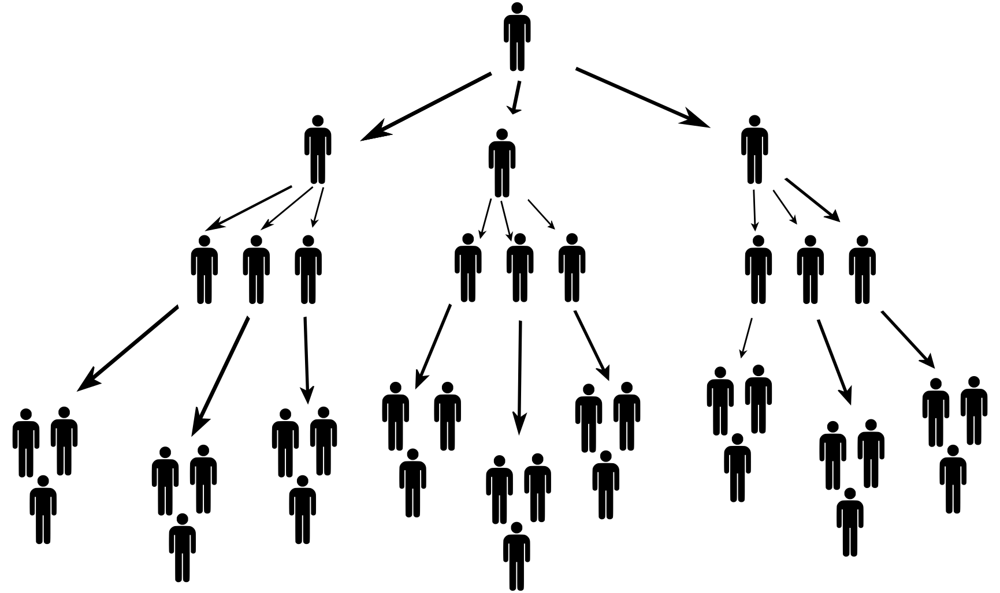
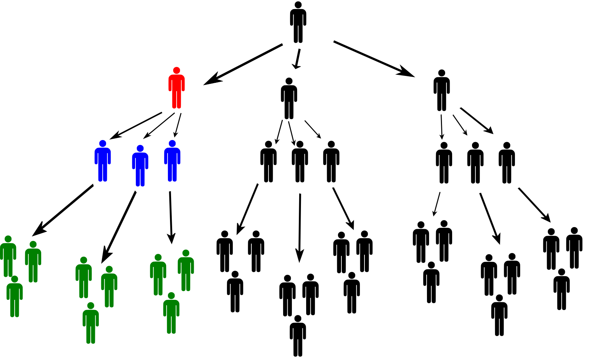

---
keywords:
- geometrická postupnosť
- finančná matematika
is_finished: True
---

# Pyramídová schéma

Predstavte si, že vám niekto v mene investičnej spoločnosti ponúkne 
rýchle zhodnotenie vašich peňazí a jediné, čo musíte urobiť, aby ste ich získali,
je presvedčiť ďalších troch priateľov, aby investovali. Vaše peniaze však v
skutočnosti nebudú použité na nákup zlata alebo akcií, ale budú rozdelené
medzi ľudí, ktorí sa do spoločnosti zaregistrovali pred vami. Ak sa vám podarí
presvedčiť troch priateľov, dostanete podiel z ich peňazí a
to isté od ďalších ľudí, ktorých presvedčia oni - až kým sa celý model
nezrúti pre nedostatok nových investorov a majiteľ spoločnosti záhadne
neodletí na Bahamy. Treba povedať, že taká vec priateľstvám vo všeobecnosti
neprospieva.

Práve ste naleteli na jeden z najrozšírenejších podnikateľských podvodov s názvom - pyramídová schéma.

## Zadanie 
Zakladateľ spoločnosti (prvá úroveň pyramídy) získa troch investorov
(druhá úroveň pyramídy) a od každého z nich vyberie pevný vstupný poplatok
20 000 Kč. Úlohou každého z troch investorov je priviesť do systému ďalších 
troch nových investorov (tretia úroveň pyramídy) a od každého z nich opäť vybrať
vstupný poplatok vo výške 20 000 Kč. To isté sa opakuje aj pri ďalších úrovniach. Pre
zjednodušenie budeme predpokladať, že nábor nových členov sa uskutočňuje vždy
až po naplnení celej úrovne pyramídy - t. j. nábor nových členov do
štvrtej úrovne sa začne až po tom, čo sa naplní všetkých deväť investorov v tretej
úrovni.

Vstupný poplatok nových členov sa rozdelí medzi existujúcich
nasledovne: 6 000 Kč dostane osoba A, ktorá nového člena priviedla,
1 000 Kč dostane osoba B, ktorá priviedla osobu A, ďalších
1 000 Kč dostane osoba C, ktorá priviedla osobu B, ďalších 1 000 Kč dostane osoba D, ktorá priviedla osobu C, a tak ďalej, až kým nebude vstupný poplatok rozdelený. Ak sa vyplácanie dostane až k zakladateľovi spoločnosti, dostane zvyšok poplatku.

> **Úloha 1.** 
> Kedy sa novému účastníkovi vrátia peniaze zo vstupného poplatku?

\iffalse

*Riešenie.* Nováčik zaplatí vstupný poplatok vo výške 20 000 Kč. Aby sa mu
peniaze vrátili, musí prijať troch nových členov (od ktorých vyberie spolu 18 000 Kč) 
a
tí ďalej musia nabrať aspoň ďalších dvoch členov (od ktorých dostane zvyšných 2 000
Kč).

\fi

>**Úloha 2.**
>Pri dosiahnutí určitej úrovne pyramídy prvý krát dôjde k tomu, že zakladateľ spoločnosti nedostane zo 
>vstupných poplatkov nových členov žiadne peniaze.

> 1. Ktorá je to úroveň?
> 2. Koľko ľudí je v celej pyramíde, keď sa dosiahne táto úroveň? 
> Porovnaj tento počet s počtom ľudí vo vašej škole alebo obci.
> 3. Určte percentuálny podiel ľudí, ktorí sú po naplnení tejto úrovne v strate.

\iffalse

*Riešenie.*

*Riešenie časti 2.1.* Ak zo vstupného poplatku nového člena
zakladateľ spoločnosti prvýkrát nedostane žiadne peniaze, znamená to, že nad týmto členom
existuje 16 úrovní (6 000 Kč dostane osoba o úroveň vyššie,  $14\cdot 1 000$ Kč dostanú osoby v štrnástich vyšších úrovniach a zakladateľ v prvej úrovni nedostane nič). Nový prichádzajúci člen sa preto nachádza v 17. úrovni.

*Riešenie časti 2.2.* Počty ľudí v jednotlivých úrovniach tvoria geometrickú
postupnosť s prvým členom $a_1=1$ a kvocientom $q=3$. 
Počet ľudí v pyramíde so 17 úrovňami je potom súčtom prvých sedemnástich členov tejto
postupnosti: $$s_{n}=a_1\cdot\frac{q^n-1}{q-1},\qquad
s_{17}=1\cdot\frac{3^{17}-1}{3-1}=64\ 570\ 081.$$ Je vidieť, že do diagramu by
musela byť zapojená celá populácia väčšieho štátu (približne zodpovedajúca populácii
Francúzska).

*Riešenie časti 2.3.* Z prvej úlohy vyplýva, že stratovú časť pyramídy tvoria
posledné dve úrovne. Počet ľudí v strate teda zodpovedá súčtu šestnásteho 
a sedemnásteho člena vyššie uvedenej geometrickej postupnosti:

$$
a_{16}+a_{17}=3^{15}+3^{16}=57\ 395\ 628.$$ 
Teraz môžeme určiť percentuálny podiel ľudí v strate:
$$P=100\cdot\frac{57\ 395\ 628}{64\ 570\ 081}\,\%\doteq 88{,}89\,\%.$$

\fi

>**Úloha 3.** 
>V reálnych prípadoch z Českej republiky sa počet účastníkov pohyboval v jednotkách 
>tisícov. Povedzme teda, že je počet účastníkov v našej
>pyramíde po naplnení určitej úrovne v rozmedzí 2 000 - 8 000.
>
>1.  O akú úroveň ide?
>2.  Určte percentuálny podiel ľudí, ktorí sú teraz v strate.
>3.  Určte celkový zisk zakladateľa spoločnosti.
>4.  Určte celkový zisk investora na druhej úrovni pyramídy.
>5.  Koľko percent zo všetkých vybraných vstupných poplatkov bude vyplatených ľuďom v prvých troch úrovniach? 

\iffalse

*Riešenie.*

*Riešenie časti 3.1.* Úlohu možno vyriešiť postupným dosadzovaním prirodzených čísel do
vzorca pre súčet prvých $n$ členov geometrickej postupnosti. Tu však uvedieme
riešenie pomocou exponenciálnej nerovnosti. Musí to byť 2000 $\leq s_n \leq 8\ 000$, takže po dosadení do vzorca ($a_1=1$, $q=3$) 
dostaneme: 
$$
2\ 000 \leq \dfrac{3^n-1}{2} \leq 8\ 000
$$ 
$$
4\ 001 \leq 3^n \leq 16\ 001
$$ 
$$
\log_3 4\ 001 \leq n \leq \log_3 16\ 001.
$$ 
Pretože
$\log_3 4\ 001 \doteq 7{,}55$ a $\log_3 16\ 001 \doteq 8{,}81$
pyramída má teraz osem úrovní (dosadením do $s_8$ sa môžeme presvedčiť, že počet ľudí v pyramíde je teraz 3 280).

*Riešenie časti 3.2.* Posledné dve úrovne opäť tvoria stratovú časť pyramídy.
Podobne ako v úlohe 2.3 je počet ľudí v strate rovný $a_7+a_8=3^6+3^7=2\ 916$.
Určíme percentuálny podiel: 
$$
P'=100\cdot\frac{2\ 916}{3\ 280}\,\%\doteq 88{,}90\,\%.
$$ 
Vidíme, že výsledok sa veľmi nelíši od výsledku úlohy
2.3, aj keď počty uvažovaných ľudí sú rádovo odlišné.

*Riešenie časti 3.3.* Zakladateľ spoločnosti dostane celý vstupný poplatok od každej osoby v druhej úrovni (20 000 Kč), od každej osoby v tretej úrovni 14 000 Kč, od každej osoby v štvrtej úrovni 13 000 Kč atď. Keďže pyramída má teraz osem úrovní, celkový zisk 
zakladateľa $Z_1$ vypočítame
$$Z_1=3\cdot 20\ 000 + 3^2\cdot 14\ 000 + 3^3\cdot 13\ 000 + \cdots + 3^7\cdot 9\ 000 = 31\  155\ 000\,\text{Kč}.$$

*Riešenie k časti 3.4.* Pre názornosť ilustrujeme situáciu investora na druhej úrovni obrázkom. Červeno podfarbený investor na druhej úrovni pyramídy dostane od každého z troch modro sfarbených investorov na tretej úrovni 6 000 Kč. Títo traja investori ďalej nabrali do schémy ďalších ľudí a od každého zeleno sfarbeného dostane
červený investor 1 000 Kč. Podobne vyberie 1 000 Kč aj od ľudí
naverbovaných zelenými investormi a od všetkých ďalších ľudí v "jeho" vetve pyramídy.

Určime teraz zisk $Z_2$ červeného investora. Počet ľudí, od ktorých dostane 1 000 Kč
sa rovná súčtu $$3^2 + 3^3 + 3^4 + 3^5 + 3^6$$ (celá pyramída by mala mať osem úrovní).
Nesmieme tiež zabudnúť odpočítať vstupné. Teda 
$$Z_2=3\cdot 6\ 000 + (3^2+3^3 + 3^4 + 3^5 + 3^6 )\cdot 1\ 000 - 20\ 000 = 1\ 087\ 000\,\text{Kč}.$$

*Riešenie časti 3.5.* Z časti 3.1 vieme, že v pyramíde je 3280 ľudí. Každý
okrem zakladateľa, zaplatil 20 000 Kč na vstupných poplatkoch. Celková suma
vyzbieraných peňazí je teda 65 580 000Kč. Z častí 3.3 a 3.4 poznáme zisk zakladateľa
a investora v druhej úrovni, vypočítajme teda zisk investora v tretej úrovni
(podobne ako v časti 3.4): 
$$Z_3=3\cdot 6\ 000 + (3^2+3^3 + 3^4 + 3^5)\cdot 1\ 000 - 20\ 000 = 358\ 000\,\text{Kč}.$$
Teraz môžeme určiť podiel prostriedkov vyplatených ľuďom na prvých troch úrovniach
($S$ je celková suma): 
$$P''=100\cdot\frac{Z_1 + 3\cdot Z_2 + 9\cdot Z_3}{S}=100\cdot\frac{37\ 638\ 000}{65\ 580\ 000}\doteq 57{,}39\,\%.$$
Pre lepšie pochopenie je dôležité si uvedomiť, že tento podiel z celkového "príjmu spoločnosti" sa vypláca len 13 ľuďom z 3 280. Približne $0{,}4\ \%$ ľudí v pyramíde dostane viac ako polovicu vybraných peňazí. Nie je teda prekvapujúce, že v
mnohých krajinách sveta sú pyramídové schémy ako obchodný model zakázané. 
Bohužiaľ, až do roku 2023 medzi nimi nie je Česká Republika.
Na Slovensku je pyramídová schéma (nazývaná tiež Ponziho schéma) nelegálna.

\fi

## Literatúra

* Yates K. (2021). *Matematika pro život*. Praha: Kniha Zlín.

* Illinois Attorney General. *Pyramid schemes* [online]. Dostupné z
<https://ag.state.il.us/consumers/pyramid.html> [cit. 1. 6. 2023].