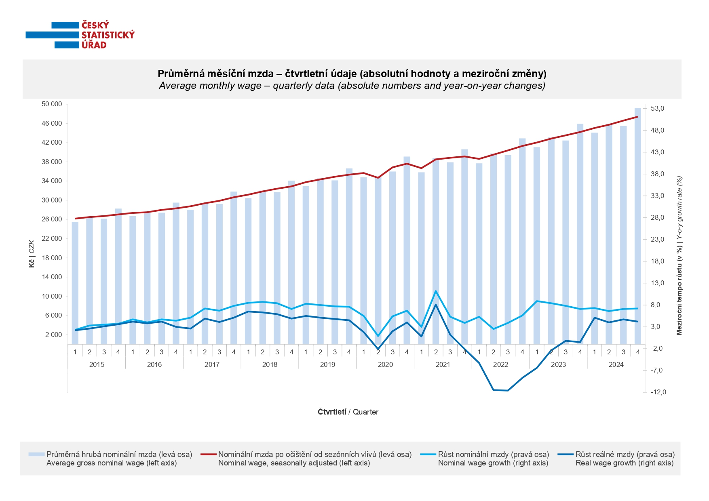
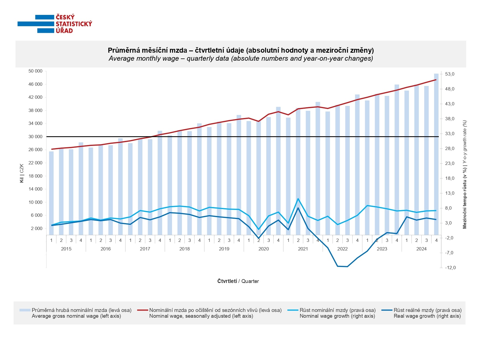

# Reading Data from a Graph

The Czech Statistical Office (CSO) was founded in 1969 and serves as the main institution responsible for official statistics in the country. 
Its role is to collect, process, and publish statistical data about various aspects of life in the Czech Republic and its regions. 
On the official website <https://www.czso.cz/>, you can freely access charts and tables summarizing, for example, 
population trends, election results, traffic accidents, housing prices, and unemployment rates. In the following exercises, we will analyze one 
of these charts.

Among the resources provided by the Czech Statistical Office, there is a graph showing the development of the average gross monthly wage, 
presented in Figure 2. The horizontal axis shows the quarters of the observed years. The blue bars represent the average gross nominal wage at that 
time, while the red line indicates the trend of the nominal wage adjusted for seasonal effects. Both of these values are read from the left vertical 
axis in Czech crowns. The light blue line shows the growth rate of the nominal wage (read from the right vertical axis in percent), and the dark 
blue line shows the growth rate of the real wage (also read from the right vertical axis).

**Glossary**

From the *gross wage* paid by the employer, amounts for health and social insurance and income tax are deducted. The employee then receives the net wage, which is lower by these deductions.

The *nominal wage* is the gross monthly wage expressed in Czech crowns. The nominal wage adjusted for seasonal effects is the nominal wage statistically modified to eliminate the influence of seasonal changes in employment and wages.

The nominal wage is a specific amount, while the *real wage* expresses how much an employee can actually buy for that amount. It can happen that the nominal wage increases, but if all goods and services become more expensive (in other words, if *inflation* is high), the real wage decreases.

The *growth rate* indicates how quickly wages are changing. The year-on-year growth rate shows how much wages (nominal and real) have increased over the past year. For example, if the year-on-year wage growth rate is 2%, it means that wages have risen by exactly 2% over the last year.

>**Exercise 1.** Decide for each statement whether it follows from the graph or not.
>
>1. Since 2018, the average gross nominal wage has never fallen below CZK $30{,}000$.
>
>2. If the average gross nominal wage increases, the nominal wage index also increases.
>
>3. The growth of real wages was the lowest in 2020 compared to the previous five years.

\iffalse

*Solution.* 

1. The statement is true – all the blue bars in the chart have been above CZK $30{,}000$ since 2018, as can be seen in Figure 3.

2. The statement is false – for example, between the third and fourth quarter of 2021, the average gross nominal wage increased, but the nominal wage index decreased.

3. The statement is false – the growth of real wages was lower in 2022 and 2023.

\fi

>**Exercise 2.** Determine the range of values for the variables over the observed period.

\iffalse

*Solution.* The average gross nominal wage during the observed period ranges between CZK $22{,}000$ and $50{,}000$.
The growth of the nominal wage is between $0\,\%$ and $13\,\%$, while the growth of the real wage ranges from $-12\,\%$ to $10\,\%$.

\fi

>**Exercise 2.** Try to explain the differences between the growth of nominal and real wages from about the third quarter of 2021. What can we say, on the other hand, about the situation in 2015–2016, when both values were comparable?

\iffalse

*Solution.* From the graph, we can see that starting from the third quarter of 2021, the real wage index dropped sharply, while the other two indicators did not (the gross nominal wage even slightly increased as in previous periods). This points to a likely cause – high inflation. We can confirm this suspicion on the CSO website <https://www.czso.cz/csu/czso/mira_inflace>, where tables tracking the inflation rate show that its growth began in the third quarter of 2021.

|  | 1 | 2 | 3 | 4 | 5 | 6 | 7 | 8 | 9 | 10 | 11 | 12 |
| - | -: | -: | -: | -: | -: | -: | -: | -: | -: | -: | -: | -: |
| **2020** | 2.9 | 3.0 | 3.1 | 3.1 | 3.1 | 3.1 | 3.2 | 3.2 | 3.3 | 3.3 | 3.2 | 3,2 |
| **2021** | 3.0 | 2.9 | 2.8 | 2.8 | 2.8 | 2.8 | 2.8 | 2.8 | 3.0 | 3.2 | 3.5 | 3,8 |
| **2022** | 4.0 | 5.2 | 6.1 | 7.0 | 8.1 | 9.4 | 10.6 | 11.7 | 12.7 | 13.5 | 14.4 | 15.1 |
| **2023** | 15.7 | 16.2 | 16.4 | 16.2 | 15.8 | 15.1 | 14.3 | 13.6 | 12.7 | 12.1 | 11.4 | 10.7 |
| **2024** | 9.4 | 8.2 | 7.1 | 6.3 | 5.6 | 4.9 | 4.4 | 3.9 | 3.5 | 3.1 | 2.7 | 2.4 |

It can be expected that in 2015–2016, the inflation rate was low. This can be verified at the same source mentioned in the previous paragraph.

|  | 1 | 2 | 3 | 4 | 5 | 6 | 7 | 8 | 9 | 10 | 11 | 12 |
| -- | --: | --: | --: | --: | --: | --: | --: | --: | --: | --: | --: | --: |
| **2015** | 0.3 | 0.3 | 0.3 | 0.4 | 0.4 | 0.5 | 0.5 | 0.4 | 0.4 | 0.4 | 0.3 | 0.3 |
| **2016** | 0.4 | 0.4 | 0.4 | 0.4 | 0.4 | 0.3 | 0.3 | 0.3 | 0.3 | 0.4 | 0.5 | 0.7 |
| **2017** | 0.8 | 1.0 | 1.2 | 1.3 | 1.5 | 1.7 | 1.8 | 2.0 | 2.2 | 2.3 | 2.4 | 2.5 |
| **2018** | 2.4 | 2.4 | 2.3 | 2.3 | 2.3 | 2.3 | 2.3 | 2.3 | 2.3 | 2.2 | 2.2 | 2.1 |

\fi
