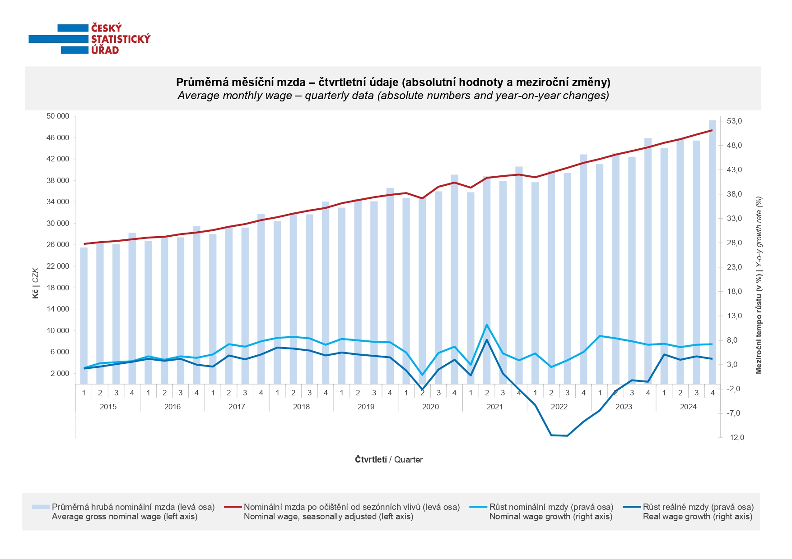

---
keywords:
- the first keyword
- another keyword
is_finished: False
---

### Instructions for translators

1. Open this file on GitHub server. If you see `https://um.mendelu.cz/...` in
   URL, click `View on GitHub` to open this file on github.com.
1. If you see this file on GitHub server, you can edit the content of the file.
   Open the file in an editor. You can use simple editor (pres `e` on GitHub).
   However, an advanced VS Code editor (press `.` on GitHub) is better, since it
   provides preview how the Markdown code renders. Alternatively press pencil
   for simple editor or press triangle next to the pencil to get access to VS
   Code described as `github.dev`. 
1. Fix the keywords in the preamble.
1. Depending on which language version you want to use as a source for your
   translation, delete either English or Czech version below.
1. Translate to your language. Keep Markdown marking and math notation. If you
   use a tool to get first version of the translation, make sure that the markup
   is preserved. 
1. In VS Code you can open the preview in another window by pressing `Ctrl+V`
   and `K`. Keep the preview open as you work, or close using a mouse.
1. Instead of saving, you have to commit and push the changes to the repository.
   Fill the Message under `Source control` (describe your changes, such as
   "Polish translation started") and then press Commit&Push.
1. Make sure that your changes appear in the commit history. In rare cases
   (if you work with simultaneously with someone else) you have to download
   /Pull/ and merge his and yours changes. Usualy Sync (Pull & Push) should
   work.
1. When you finish the translation, change `is_finished: False` in header to `is_finished: True`.

### Instrukce pro překladatele

1. Otevřete tento soubor na serveru GitHub. Pokud máte soubor otevřen na `https://um.mendelu.cz/...`, otevřete jej na serveru github.com.
1. Pokud tento soubor vidíte na serveru GitHub, můžete obsah souboru upravit.
   Otevřete soubor v editoru. Můžete použít jednoduchý editor (stiskněte `e` na GitHubu).
   Lepší je však pokročilý editor VS Code (stikněte `.` na GitHubu), protože poskytuje náhled, jak se kód Markdown interpretuje. Případně stiskněte tužku
   pro jednoduchý editor nebo stiskněte trojúhelníček vedle tužky, abyste získali přístup k editoru VS
   Code popsaný jako `github.dev`. 
1. Opravte klíčová slova v preambuli.
1. V závislosti na tom, kterou jazykovou verzi chcete použít jako zdrojový kód pro svůj
   překladu, odstraňte níže uvedenou anglickou nebo českou verzi.
1. Přeložte do svého jazyka. Ponechte značení Markdown a matematický zápis. Pokud
   použijete nástroj typu DeepL pro získání první verze překladu, ujistěte se, že zápis matematických výrazů
   byl zachován. 
1. Ve VS Code můžete náhled otevřít v jiném okně stisknutím `Ctrl+V`.
   a `K`. Během práce nechte náhled otevřený nebo jej zavřete pomocí myši.
1. Místo uložení musíte změny zaregistrovat a odeslat do úložiště.
   Vyplňte zprávu v poli `Zpráva` (popište své změny, např.
   "Zahájen překlad do polštiny") a poté stiskněte tlačítko Commit&Push.
1. Ujistěte se, že se vaše změny objeví v historii revizí. Ve výjimečných případech
   (pokud pracujete současně s někým jiným) musíte stáhnout
   /Pull/ a sloučit jeho a vaše změny. Obvykle by synchronizace (Pull & Push) měla
   fungovat.
1. Po dokončení překladu změňte `is_finished: False` v záhlaví na `is_finished: True`.

---
---

### Czech source

# Čtení údajů z grafu 

Český statistický úřad (ČSÚ) byl zřízen v roce 1969 a jako hlavní orgán státní statistické 
služby se zabývá získáváním údajů, zpracováváním, vytvářením a zveřejňováním statistických 
informací o různých aspektech vývoje České republiky a jejích částí. Na oficiálních stránkách 
ČSÚ <https://www.czso.cz/> tak můžeme zdarma nalézt grafy a tabulky shrnující 
např. populační vývoj, volební statistiky, dopravní nehodovost, vývoje cen bytů a vývoj nezaměstnanosti. 
Jeden z grafů budeme analyzovat v následujících úlohách.

Na stránkách Českého statistického úřadu lze nalézt graf vývoje průměrné hrubé měsíční mzdy, 
který vidíme na Obrázku 2. Na vodorovné ose jsou vyznačena čtvrtletí sledovaných let, modré sloupce odpovídají 
tehdejší průměrné hrubé nominální mzdě, červená křivka sleduje vývoj nominální mzdy očištěné 
od sezónních vlivů. Obojí se odečítá se na levé svislé ose v korunách. 
Světle modrá křivka udává sleduje růst nominální mzdy (odečítá se na pravé svislé ose v procentech) 
a tmavě modrá křivka udává růst reálné mzdy (rovněž se odečítá na pravé svislé ose).

**Slovníček**

* Z *hrubé mzdy*, kterou platí zaměstnavatel zaměstnanci, jsou strženy částky za zdravotní
  a sociální pojištění a daň z příjmu. Zaměstnanec pak dostává *mzdu čistou*, která je o tyto výlohy nižší.

* *Nominální mzda* je hrubá měsíční mzda vyjádřená v korunách. *Nominální mzda očištěná od sezónních vlivů*
  je nominální mzda, která byla statisticky upravena tak, aby eliminovala vliv sezónních změn v zaměstnanosti a mzdách.

* Nominální mzda je konkrétní částka, zatímco *reálná mzda* vyjadřuje, kolik si toho za tuto částku může
  zaměstnanec koupit. Může se tak stát, že se sice zaměstnanci zvedne nominální mzda, ale protože
  všichni obchodníci více zdražují své zboží a služby (jinými slovy, je velká *inflace*), reálná mzda mu klesne.

* *Tempo růstu*, je míra dynamiky mzdového vývoje. Meziroční tempo růstu udává, jak vzrostly mzdy (nominální a reálná)
  za poslední rok. Například, pokud je meziroční tempo růstu mzdy 2%, znamená to, že mzda se za poslední rok zvýšila právě o 2%. 

>**Úloha 1.** Rozhodněte o každém z tvrzení, zda z grafu vyplývá, nebo ne.
>
>1. Od roku 2018 průměrná hrubá nominální mzda neklesla pod $30\,000\,\text{Kč}$.
>2. Jestliže se zvyšuje průměrná hrubá nominální mzda, pak se také zvyšuje index nominální mzdy.
>3. Růst reálné mzdy byl v roce 2020 nejnižší za posledních pět let.

\iffalse

*Řešení.* 

1. Tvrzení je pravdivé - všechny modré sloupce v tabulce přesahují od roku 2018 hladinu $30\,000\,\text{Kč}$,
   což je vidět z Obrázku 3.

2. Tvrzení není pravdivé - např. při přechodu z třetího na čtvrté čtvrtletí roku 2021 došlo
   k navýšení průměrné hrubé nominální mzdy, ale k poklesu indexu nominální mzdy.

3. Tvrzení není pravdivé - hodnoty růstu reálné mzdy z let 2022 a 2023 jsou nižší.

\fi

>**Úloha 2.** Vymezte hodnoty, mezi kterými se pohybují hodnoty veličin za sledované období.

\iffalse

*Řešení.* Průměrná hrubá nominální mzda se za sledované období pohybuje mezi $22\,000$ - $50\,000\,\text{Kč}$. 
Růstu nominální mzdy je mezi $0\,\%$ a $13\,\%$, hodnoty růstu reálné mzdy se pohybují mezi $-12\,\%$ a $10\,\%$.

\fi

> **Úloha 3** Pokuste se vysvětlit rozdíly mezi růstem nominální a reálné mzdy cca od
> třetího čtvrtletí roku 2021. Co lze naopak říci o situaci z let 2015 - 2016, kdy
> byly obě hodnoty srovnatelné?

\iffalse

*Řešení.* Z grafu vidíme, že se od třetího čtvrtletí roku 2021 index reálné mzdy prudce propadl, 
zatímco zbylé dva ukazatele nikoliv (hrubá nominální mzda dokonce mírně rostla jako v předchozích obdobích). 
To ukazuje na možného viníka - vysokou inflaci. Podezření si můžeme potvrdit na stránkách 
ČSÚ <https://www.czso.cz/csu/czso/mira_inflace>, kde lze v 
tabulkách sledujících míru inflace dohledat začátek zvyšování růstu právě ve třetím čtvrtletí roku 2021. 

|  | 1 | 2 | 3 | 4 | 5 | 6 | 7 | 8 | 9 | 10 | 11 | 12 |
| - | -: | -: | -: | -: | -: | -: | -: | -: | -: | -: | -: | -: |
| **2020** | 2,9 | 3,0 | 3,1 | 3,1 | 3,1 | 3,1 | 3,2 | 3,2 | 3,3 | 3,3 | 3,2 | 3,2 |
| **2021** | 3,0 | 2,9 | 2,8 | 2,8 | 2,8 | 2,8 | 2,8 | 2,8 | 3,0 | 3,2 | 3,5 | 3,8 |
| **2022** | 4,0 | 5,2 | 6,1 | 7,0 | 8,1 | 9,4 | 10,6 | 11,7 | 12,7 | 13,5 | 14,4 | 15,1 |
| **2023** | 15,7 | 16,2 | 16,4 | 16,2 | 15,8 | 15,1 | 14,3 | 13,6 | 12,7 | 12,1 | 11,4 | 10,7 |
| **2024** | 9,4 | 8,2 | 7,1 | 6,3 | 5,6 | 4,9 | 4,4 | 3,9 | 3,5 | 3,1 | 2,7 | 2,4 |

Lze očekávat, že v letech 2015 - 2016 byla míra inflace naopak nízká, což si lze opět ověřit na stejném místě jako v předchozím odstavci.

|  | 1 | 2 | 3 | 4 | 5 | 6 | 7 | 8 | 9 | 10 | 11 | 12 |
| -- | --: | --: | --: | --: | --: | --: | --: | --: | --: | --: | --: | --: |
| **2015** | 0,3 | 0,3 | 0,3 | 0,4 | 0,4 | 0,5 | 0,5 | 0,4 | 0,4 | 0,4 | 0,3 | 0,3 |
| **2016** | 0,4 | 0,4 | 0,4 | 0,4 | 0,4 | 0,3 | 0,3 | 0,3 | 0,3 | 0,4 | 0,5 | 0,7 |
| **2017** | 0,8 | 1,0 | 1,2 | 1,3 | 1,5 | 1,7 | 1,8 | 2,0 | 2,2 | 2,3 | 2,4 | 2,5 |
| **2018** | 2,4 | 2,4 | 2,3 | 2,3 | 2,3 | 2,3 | 2,3 | 2,3 | 2,3 | 2,2 | 2,2 | 2,1 |

\fi

---
---

### English source

# Reading Data from a Graph

The Czech Statistical Office (CSO) was founded in 1969 and serves as the main institution responsible for official statistics in the country. 
Its role is to collect, process, and publish statistical data about various aspects of life in the Czech Republic and its regions. 
On the official website <https://www.czso.cz/>, you can freely access charts and tables summarizing, for example, 
population trends, election results, traffic accidents, housing prices, and unemployment rates. In the following exercises, we will analyze one 
of these charts.

Among the resources provided by the Czech Statistical Office, there is a graph showing the development of the average gross monthly wage, 
presented in Figure 2. The horizontal axis shows the quarters of the observed years. The blue bars represent the average gross nominal wage at that 
time, while the red line indicates the trend of the nominal wage adjusted for seasonal effects. Both of these values are read from the left vertical 
axis in Czech crowns. The light blue line shows the growth rate of the nominal wage (read from the right vertical axis in percent), and the dark 
blue line shows the growth rate of the real wage (also read from the right vertical axis).

**Glossary**

From the *gross wage* paid by the employer, amounts for health and social insurance and income tax are deducted. The employee then receives the net wage, which is lower by these deductions.

The *nominal wage* is the gross monthly wage expressed in Czech crowns. The nominal wage adjusted for seasonal effects is the nominal wage statistically modified to eliminate the influence of seasonal changes in employment and wages.

The nominal wage is a specific amount, while the *real wage* expresses how much an employee can actually buy for that amount. It can happen that the nominal wage increases, but if all goods and services become more expensive (in other words, if *inflation* is high), the real wage decreases.

The *growth rate* indicates how quickly wages are changing. The year-on-year growth rate shows how much wages (nominal and real) have increased over the past year. For example, if the year-on-year wage growth rate is 2%, it means that wages have risen by exactly 2% over the last year.

>**Exercise 1.** Decide for each statement whether it follows from the graph or not.
>
>1. Since 2018, the average gross nominal wage has never fallen below CZK $30{,}000$.
>
>2. If the average gross nominal wage increases, the nominal wage index also increases.
>
>3. The growth of real wages was the lowest in 2020 compared to the previous five years.

\iffalse

*Solution.* 

1. The statement is true – all the blue bars in the chart have been above CZK $30{,}000$ since 2018, as can be seen in Figure 3.

2. The statement is false – for example, between the third and fourth quarter of 2021, the average gross nominal wage increased, but the nominal wage index decreased.

3. The statement is false – the growth of real wages was lower in 2022 and 2023.

\fi

>**Exercise 2.** Determine the range of values for the variables over the observed period.

\iffalse

*Solution.* The average gross nominal wage during the observed period ranges between CZK $22{,}000$ and $50{,}000$.
The growth of the nominal wage is between $0\,\%$ and $13\,\%$, while the growth of the real wage ranges from $-12\,\%$ to $10\,\%$.

\fi

>**Exercise 2.** Try to explain the differences between the growth of nominal and real wages from about the third quarter of 2021. What can we say, on the other hand, about the situation in 2015–2016, when both values were comparable?

\iffalse

*Solution.* From the graph, we can see that starting from the third quarter of 2021, the real wage index dropped sharply, while the other two indicators did not (the gross nominal wage even slightly increased as in previous periods). This points to a likely cause – high inflation. We can confirm this suspicion on the CSO website <https://www.czso.cz/csu/czso/mira_inflace>, where tables tracking the inflation rate show that its growth began in the third quarter of 2021.

|  | 1 | 2 | 3 | 4 | 5 | 6 | 7 | 8 | 9 | 10 | 11 | 12 |
| - | -: | -: | -: | -: | -: | -: | -: | -: | -: | -: | -: | -: |
| **2020** | 2.9 | 3.0 | 3.1 | 3.1 | 3.1 | 3.1 | 3.2 | 3.2 | 3.3 | 3.3 | 3.2 | 3,2 |
| **2021** | 3.0 | 2.9 | 2.8 | 2.8 | 2.8 | 2.8 | 2.8 | 2.8 | 3.0 | 3.2 | 3.5 | 3,8 |
| **2022** | 4.0 | 5.2 | 6.1 | 7.0 | 8.1 | 9.4 | 10.6 | 11.7 | 12.7 | 13.5 | 14.4 | 15.1 |
| **2023** | 15.7 | 16.2 | 16.4 | 16.2 | 15.8 | 15.1 | 14.3 | 13.6 | 12.7 | 12.1 | 11.4 | 10.7 |
| **2024** | 9.4 | 8.2 | 7.1 | 6.3 | 5.6 | 4.9 | 4.4 | 3.9 | 3.5 | 3.1 | 2.7 | 2.4 |

It can be expected that in 2015–2016, the inflation rate was low. This can be verified at the same source mentioned in the previous paragraph.

|  | 1 | 2 | 3 | 4 | 5 | 6 | 7 | 8 | 9 | 10 | 11 | 12 |
| -- | --: | --: | --: | --: | --: | --: | --: | --: | --: | --: | --: | --: |
| **2015** | 0.3 | 0.3 | 0.3 | 0.4 | 0.4 | 0.5 | 0.5 | 0.4 | 0.4 | 0.4 | 0.3 | 0.3 |
| **2016** | 0.4 | 0.4 | 0.4 | 0.4 | 0.4 | 0.3 | 0.3 | 0.3 | 0.3 | 0.4 | 0.5 | 0.7 |
| **2017** | 0.8 | 1.0 | 1.2 | 1.3 | 1.5 | 1.7 | 1.8 | 2.0 | 2.2 | 2.3 | 2.4 | 2.5 |
| **2018** | 2.4 | 2.4 | 2.3 | 2.3 | 2.3 | 2.3 | 2.3 | 2.3 | 2.3 | 2.2 | 2.2 | 2.1 |

\fi