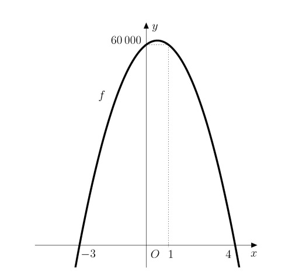

# Nákup vozů pro taxislužbu

V České Republice majitel Pražské taxislužby zvažuje, zda pořídit další vozy a kolik jich pořídit 
tak, aby jeho zisk byl co největší. Momentálně má 3 vozy a z každého vozu má průměrný měsíční výdělek 60 000 Kč. Dle letitých zkušeností v oboru však 
očekává, že s každým nakoupeným vozem průměrný výdělek každého vozu klesne 
o 5 000 Kč, neboť dojde k částečnému přelivu zákazníků do nového vozu. Musí 
také počítat s tím, že náklady na řidiče a vůz za jeden měsíc činí 40 000 Kč.

>**Úloha 1.** Jaký je měsíční zisk majitele taxislužby nyní?

\iffalse

*Řešení.* Každý ze tří vozů majiteli taxislužby přináší čistý zisk (po odečtení nákladů)
20 000 Kč.  Dohromady tak současný čistý zisk ze tří vozů činí 60 000 Kč.

\fi

>**Úloha 2.** Určete funkci, která vyjadřuje zisk majitele taxislužby v závislosti na počtu nově dokoupených vozů. O jakou funkci se jedná a jak vypadá její graf?

\iffalse

*Řešení.* Označme $x$ počet nově pořízených vozů a $y$ zisk majitele za jeden měsíc. 
Víme, že čistý zisk jednoho ze stávajících tří vozů je 20 000 Kč. Od této částky je třeba odečíst 
částku snížení tržby z jednoho vozu při dokoupení $x$ vozů. Celkem tedy jeden vůz přinese 
majiteli zisk $20\ 000-5\ 000x$ Kč. Celkový zisk při dokoupení $x$ vozů dostaneme vynásobením tohoto výrazu novým počtem aut:

$$
y=(20\ 000-5\ 000x)(x+3)
$$

Po roznásobení a úpravě pravé strany jde vidět, že funkce $$f\colon y= -5\ 000x^2 + 5\ 000x + 60\ 000$$ 
je kvadratická. Jejím grafem je konkávní parabola, protože koeficient u kvadratického členu je záporný.

\fi

>**Úloha 3** Určete jaký je maximální možný zisk majitele. O kolik se tento zisk liší od současného? Kolik vozů musí majitel koupit (nebo eventuálně prodat)?

\iffalse

*Řešení.* 
Naším úkolem je nyní určit maximum funkce $f$. To se nachází v bodě, který je 
aritmetickým průměrem reálných kořenů kvadratického polynomu (za předpokladu, 
že existují). Tyto kořeny nyní určíme:

$$
\begin{aligned}
-5\ 000x^2 + 5\ 000x + 60\ 000 &= 0 \\
x^2  - x - 12 &= 0\\
(x-4)(x+3)&=0
\end{aligned}
$$

Kořeny kvadratické rovnice jsou $x_1=4$ a $x_2=-3$, tedy maximum funkce $f$ je 
v bodě $$x_{max}=\frac{-3+4}{2}=\frac{1}{2}.$$ 

Toto maximum je však nedosažitelné (nelze 
koupit půl auta). Nejvyšší funkční hodnota, kterou má smysl uvažovat, se v 
tomto případě nachází v nejbližších celočíselných bodech, tj. $x=0$ nebo $x=1$ 
(v obou bodech je stejná, jak plyne ze symetrie paraboly). To však znamená, 
že pro majitele není výhodné pořizovat další auta, protože jeho aktuální zisk 
je rovněž maximálním.

\fi
