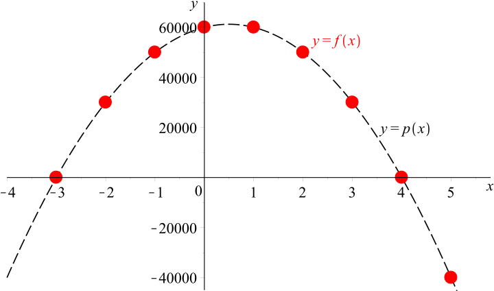
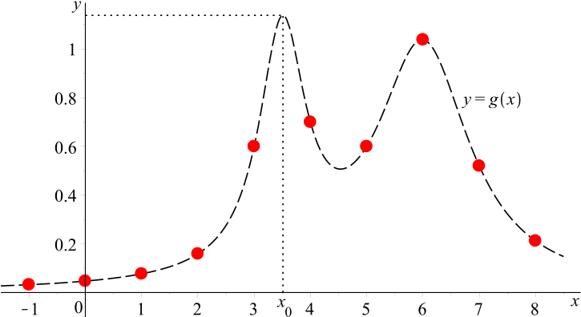

# Nákup vozů pro taxislužbu

Pan Petr si chce založit novou taxislužbu. Ze stávající taxislužby, kterou už provozuje mnoho let, si chce přesunout nějaké vozy do nové živnosti. Uvažuje však, kolik vozů se mu nejvíce vyplatí. Ze svých letitých zkušeností ví, že když měl tři vozy, pak byl jeho průměrný měsíční výdělek (bez započítání nákladů na údržbu a řidiče) $60\,000$ Kč z každého vozu. Ví také, že s každým přidaným vozem průměrný výdělek každého vozu v jeho vozovém parku klesal o $5\,000$ Kč. Naopak, když vozy odebíral, pak s každým odebraným vozem průměrný výdělek každého vozu v jeho vozovém parku rostl o $5\,000$ Kč. Náklady na údržbu a řidiče jsou při jakémkoliv počtu aut stále stejné, a to $40\,000$ Kč na každé auto. 

<!--- STARÁ VERZE----
V České Republice majitel pražské taxislužby zvažuje, zda pořídit další vozy a kolik jich pořídit 
tak, aby jeho zisk byl co největší. Momentálně má $3$ vozy a z každého vozu (bez započítání nákladů na údržbu a řidiče) má průměrný měsíční výdělek $60\,000$ Kč. Dle letitých zkušeností v oboru však 
očekává, že s každým nakoupeným vozem průměrný výdělek každého vozu klesne 
o $5\,000$ Kč, neboť dojde k částečnému přelivu zákazníků do nového vozu. Naopak, s každým prodaným vozem tento výdělek o $5\,000$ Kč vzroste. Ještě dodejme, že dříve zmíněné náklady na řidiče a vůz za jeden měsíc činí $40\,000$ Kč.
-->

>**Úloha 1.** Jaký byl (po odečtení nákladů na údržbu a řidiče) celkový čistý měsíční zisk majitele taxislužby v době, kdy provozoval tři vozy? 

<!--- STARÁ VERZE----
Jaký je (po odečtení nákladů na údržbu a řidiče) měsíční zisk  majitele taxislužby nyní? 
-->

\iffalse

*Řešení.* Každý ze tří vozů majiteli taxislužby přinesl (po odečtení nákladů) čistý zisk 
$60\,000 - 40\,000 = 20\,000$ Kč.  Dohromady tak čistý zisk ze tří vozů činil $3 \cdot 20\,000 = 60\,000$ Kč.

\fi

>**Úloha 2.** Určete předpis funkce, která vyjadřuje čistý zisk majitele taxislužby v závislosti na počtu provozovaných vozů. O jakou funkci se jedná a jak vypadá její graf?

\iffalse

*Řešení.* Označme $x \in \mathbb{N}$ počet provozovaných vozů a $f(x)$ celkový čistý zisk majitele za jeden měsíc. 
Víme, že v případě $x=3$ byl čistý zisk z každého vozu $20\,000$ Kč a že s každým přidaným (resp. odebraným) vozem klesne (resp. vzroste) zisk z každého vozu o $5\,000$ Kč. Proto je při obecném počtu vozů $x \in \mathbb{N}$ čistý zisk z každého vozu roven 

$$
 20\,000 - 5000(x-3) = (35\,000-5000x) \, \text{ Kč}.
$$  

Protože je provozováno $x$ vozů, pro celkový čistý zisk majitele taxislužby platí 

$$
 f(x) = x(35\,000-5000x).
$$

Po roznásobení obdržíme 

$$
 f(x) = -5000x^2+35\,000x. 
$$

Uvědomme si, že definičním oborem funkce $f$ je množina $\mathbb{N}$, což znamená, že jejím grafem je množina izolovaných bodů ležících na grafu (kvadratické) funkce $p(x)=-5000x^2+35\,000x$, jejímž grafem je parabola (viz obrázek).  

\fi

>**Úloha 3.** Určete, kolik vozů má majitel provozovat, aby byl jeho celkový čistý zisk maximální. Určete také výši tohoto zisku. 

\iffalse

*Řešení.* 
Naším úkolem je nyní najít $x \in \N$, pro které je $f(x)$ maximální, a toto maximum určit. Jedním ze způsobů, jak to lze provést, je použít tzv. úpravu na čtverec: 

$$
\begin{align*}
 f(x) &= -5000x^2+35\,000x = 
 -5000 \left( x^2 - 7x \right) = \\
 &= -5000 \left[ \left( x-\frac{7}{2} \right)^2 -\frac{49}{4}\right]
 = -5000 \left( x-\frac{7}{2} \right)^2 + 61\,250
\end{align*}
$$

Nyní je hezky vidět, že maximalitu $f(x)$ zajistíme, pokud bude výraz $\left( x-\frac{7}{2} \right)^2$ co nejmenší. To je jasné, protože tento výraz je nezáporný a v předpisu $f(x)$ se objevuje jeho záporný násobek. 
Vzhledem k tomu, že nás zajímají pouze hodnoty $x \in \mathbb{N}$, je zřejmé, že výraz $\left( x-\frac{7}{2} \right)^2$ je nejmenší (a $f(x)$ tedy největší) pro $x=3$ a pro $x=4$. Poslední krok naší úvahy má i pěknou geometrickou interpretaci. Není těžké si rozmyslet, že $\left( x-\frac{7}{2} \right)^2=\left| x-\frac{7}{2} \right|^2$, a proto $\left( x-\frac{7}{2} \right)^2$ představuje druhou mocninu vzdálenosti čísel $x$ a $\frac{7}{2}$ na číselné ose. Ale přirozená čísla, která jsou nejblíže k bodu $\frac{7}{2}$ jsou právě čísla $3$ a $4$. 

Zjistili jsme, že stav, kdy majitel provozoval tři vozy, je optimální a celkový čistý zisk (jak už víme z úlohy 1) je $60\,000$ Kč. Hodonotu $60\,000$ bychom samozřejmě dostali i jako funkční hodnotu funkce $f$ v bodě $3$, tzn. $f(3)$ (vyzkoušejte si to). 
Stejného čistého zisku by majitel docílil i se čtyřmi auty. 
Jakýkoliv jiný počet vozů by vedl ke snížení čistého zisku. 

*Poznámka.*
Pokud by definičním oborem funkce $f$ byla množina všech reálných čísel, maximum by se realizovalo v bodě $x=\frac{7}{2}$. 

\fi

*Poznámka.*
Mohlo by nás napadnout postupovat tak, že bychom si nejprve uvědomili, že naše kvadratická funkce   

$$
 p(x)=-5000x^2+35\,000x 
$$

nabývá svého maxima v bodě $x=\frac{7}{2}$. To lze mimochodem zjistit více způsoby - úpravou na čtverec, s použitím kořenů kvadratické rovnice, případně s použitím derivací. 

Protože zadaná úloha vyžaduje, aby $x$ bylo přirozené, musí maximum v oboru přirozených čísel nastat v nejbližším přirozeném čísle, tj. v bodě $x=3$ nebo v bodě $x=4$. V naší úloze tomu tak skutečně bylo. 
Existují ale situace, ve kterých se podobné úvahy mohou krutě vymstít. 

\iffalse

Uvažujme funkci $g$, jejíž graf můžeme vidět na obrázku. Všimněme si, že maximum funkce $g$ (na $\mathbb{R}$) nastává v bodě $x_0$, který sice není přesně roven číslu $\frac{7}{2}$, ale nachází se v intervalu $(3,4)$. Výše uvedená úvaha by nás opět vedla k závěru, že maximum funkce $g$ na množině přirozených, popř. celých čísel nastane v bodě $x=3$ nebo v bodě $x=4$, což (jak vidíme z obrázku) není pravda. Maximum funkce $g$ na množině celých čísel nastává totiž v bodě $x=6$ (viz červené body na obrázku). 

Pro zajímavost uveďme, že funkce $g$ byla zadána předpisem 

$$
 g(x)=\frac{1}{1+(2x-7)^2}+\frac{1}{1+(x-6)^2}. 
$$

Znalost tohoto předpisu však není důležitá pro pochopení nesprávnosti popsané úvahy. 

\fi 

### Otázky k zamyšlení (bez počítání)

* Jaké předpoklady o chování zákazníků a trhu se skrývají za tvrzením, že s každým dalším vozem klesne průměrný výdělek každého vozu právě o $5\,000$ Kč? Jsou tyto předpoklady realistické v reálném podnikání?​
* Co by se v modelu změnilo, kdyby se ukázalo, že pokles tržeb na jeden vůz není lineární? Jak by se to projevilo v grafu funkce zisku?​

* Jak si prakticky vysvětlíte, že zmenšení počtu vozů může zvýšit zisk na jeden vůz?​

* V modelu předpokládáme, že náklady na řidiče a údržbu jsou u všech vozů stejné a nemění se s jejich počtem. Jaké typy nákladů v reálné firmě mohou tento předpoklad porušovat (fixní náklady, flotilové slevy, náklady na dispečink,  atd.)?​

* Jak by se rozhodování majitele změnilo, kdyby plánoval podnikání na delší dobu, například na několik let dopředu (opotřebení vozů, změna poptávky, konkurence, regulace města)? Jaké nové faktory by musel do modelu zapojit?​

* Z řešení úlohy 3 vyplývá, že stav se třemi vozy i stav se čtyřmi vozy dávají stejný (maximální) zisk. Jaké  argumenty by mohl majitel použít, aby se rozhodl mezi variantou "zůstat na 3 vozech" a "koupit 4. vůz" (riziko, flexibilita, marketing, spokojenost řidičů atd.)?​

* V textu se ukazuje, že maximum kvadratické funkce $p$ se realizuje v bodě $x=\frac{7}{2}$, ale povolené jsou jen celočíselné hodnoty $x$. Proč je obecně nebezpečné automaticky předpokládat, že optimální celočíselné řešení leží "v nejbližším celém čísle" kolem bodu, ve kterém se realizuje maximum na množině všech reálných čísel? Pokuste se slovně shrnout, co ilustruje funkce $g$ v tomto textu.​

<!-- STARÁ VERZE 

To se nachází v bodě, který je 
aritmetickým průměrem reálných kořenů kvadratického polynomu (za předpokladu, 
že existují). Tyto kořeny nyní určíme:

$$
\begin{aligned}
-5\ 000x^2 + 5\ 000x + 60\ 000 &= 0 \\
x^2  - x - 12 &= 0\\
(x-4)(x+3)&=0
\end{aligned}
$$

Kořeny kvadratické rovnice jsou $x_1=4$ a $x_2=-3$, tedy maximum funkce $f$ je 
v bodě $$x_{max}=\frac{-3+4}{2}=\frac{1}{2}.$$ 

Toto maximum je však nedosažitelné (nelze 
koupit půl auta). Nejvyšší funkční hodnota, kterou má smysl uvažovat, se v 
tomto případě nachází v nejbližších celočíselných bodech, tj. $x=0$ nebo $x=1$ 
(v obou bodech je stejná, jak plyne ze symetrie paraboly). To však znamená, 
že pro majitele není výhodné pořizovat další auta, protože jeho aktuální zisk 
je rovněž maximálním.
-->

