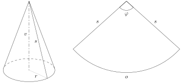
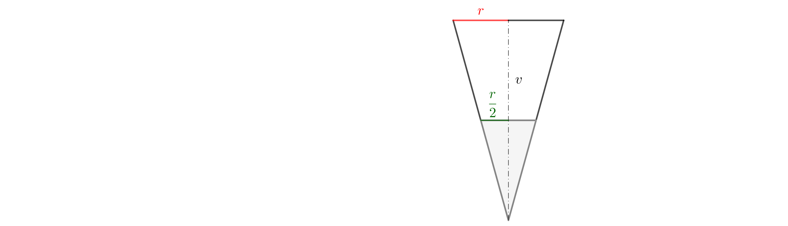

# Conical cap

Eight-year-old Annie wants to go to a children's carnival in a white lady costume, which will include a white cone-shaped hat. The parents took the opportunity to practice their geometric imagination with Anna and decided to make the hat with her instead of buying it.

> **Exercise 1.** Anna and her mother found out with a tape measure that the circumference of Anna's head is 52 cm. Together they further agreed that the hat would be 30 cm high. How will they create the hat?

\iffalse

*Solution.* The cap is formed by the lateral surface/face of a cone, where we know the perimeter of the base $o$ (52 cm) and the height of the cone $v$ (30 cm). The unrolled lateral face of the cone is then a circular sector with an unknown radius $s$ (the slant height of the cone) and an unknown central angle $\varphi$. We need to calculate these data. Furthermore, we know that the arc length of a circular sector is equal to the perimeter of $o$.

First, we calculate the radius of the base $r$ from the perimeter of the base and then the length of the slant height $s$ using the Pythagorean theorem.

$$
r = \frac{o}{2\pi} = \frac{52}{2\pi} \doteq 8{,}28\,\text{cm}
$$

$$
s = \sqrt{v^2 + r^2} = \sqrt{30^2 + 8{,}28^2} \doteq 31{,}12\,\text{cm}
$$

Now we determine the angle $\varphi$. First, we calculate the perimeter $O$ of the whole circle of radius $s$, we get 

$$
O = 2\pi s \doteq 195{,}53 \,\text{cm}.
$$ 

Next, we use the direct proportionality between the arc length of this circle and the corresponding central angle to calculate the angle $\varphi$: 

$$
\varphi = \frac{o}{O}\cdot 360^{\circ} = \frac{52}{195{,}53}\cdot 360^{\circ} \doteq 95^{\circ}44'.
$$

Annie and her parents create a hat out of a circular sector with a radius approximately 31 cm and a central angle of approximately $96^{\circ}$.

\fi

> **Exercise 2.** At the end of the carnival, there were competitions, and Annie won a bag of candies in the very first contest. She used a cone-shaped hat as a cone and poured the candies into it. The candies filled the cone up to half of its height. How many more bags of candies (of the same type) does she need to win to fill the cone to the top?

\iffalse

*Solution.* We will solve the problem generally (though it can also be solved with specific dimensions from the first problem). We know that the volume of a cone-shaped cone can be calculated using the formula $V=\frac{1}{3}\pi r^2v$. 

The cone filled with candies (shown in gray in the figure) has half the height and therefore half the radius (this follows from the similarity of triangles), and its volume is calculated as

$$
V'=\frac{1}{3}\pi \left(\frac{r}{2}^2\right)\frac{v}{2}=\frac{1}{3}\pi\frac{r^2}{4}\frac{v}{2}=\frac{1}{24}\pi r^2v=\frac{1}{8}V.
$$

The volume of the remaining empty space in the cone is then $V-V'=\frac{7}{8}V$. 
It remains to determine how many times $V'$ fits into this empty space, i.e.,

$$
\frac{V-V'}{V'}= \frac{\frac{7}{8}V}{\frac{1}{8}V}=7.
$$

Annie needs to win 7 more bags of candies to fill the cone to the top.

\fi
