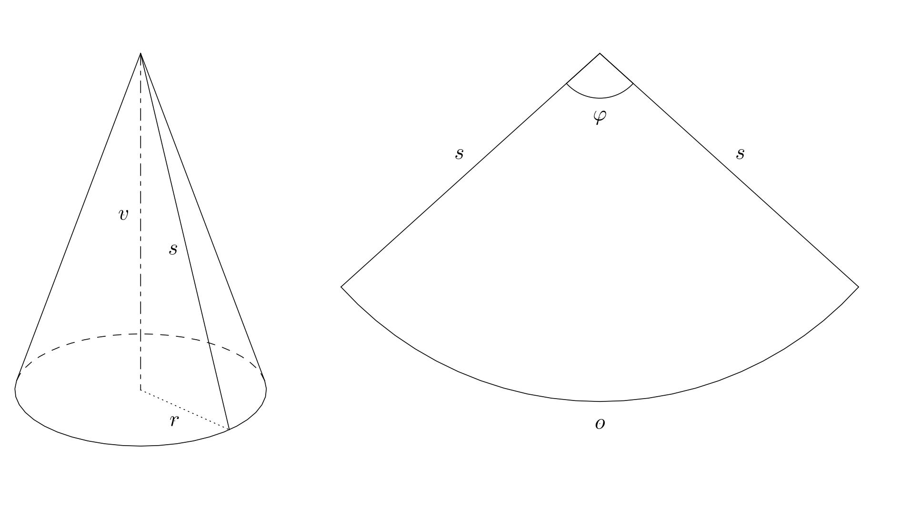

# Carnival Hat
<!--“cap” je kšiltovka, navíc název neodpovídal české verzi-->

Eight-year-old Annie wants to attend a children's carnival in a white lady costume, complete with a conical-shaped white hat. Her parents took the opportunity to involve Annie into honing her geometric imagination and decided to craft the hat with her instead of buying it.
<!-- Úpravy v tomto odstavci jsou spíše kosmetické, ale myslím, že k lepšímu. Tj, neměním význam vět. Podobně i dále. Další komentáře jsou k důležitějším změnám.-->

**Exercise.** Annie and her mom used a tailor’s tape to measure and found out that the circumference of Annie's head is 52 cm. Then they agreed that the hat should be 30 cm tall. How will they create the hat?
<!--tady se jméno Annie změnilo na Anna ?? Přijde mi lepší v příkladu zůstat konzistentně u jedné varianty jména. -->

*Solution.* The hat is formed from the lateral surface of a cone, where we know the base circumference $o$ (52 cm) and the cone height $v$ (30 cm). The unfolded lateral surface of the cone is then a circular sector with an unknown radius $s$ (the length of the cone’s side) and an unknown central angle $\varphi$. We need to calculate these values. Additionally, the length of the circular sector’s arc matches the base circumference $o$ of the cone.
<!-- Pro obvod kruhu a délku je správný termín “circumference”.  “perimeter” je obvod obdelníkové oblasti nebo oblasti ohraničené rovnými úseky. -->

First, we calculate the base radius $r$ from the known base circumference:

$$
r = \frac{o}{2\pi} = \frac{52}{2\pi} \doteq 8{,}28\,\text{cm}
$$

Then, using the Pythagorean theorem, we find the side length $s$:

$$
s = \sqrt{v^2 + r^2} = \sqrt{30^2 + 8{,}28^2} \doteq 31{,}12\,\text{cm}
$$

Now, we determine the angle $\varphi$. First, we calculate the perimeter $O$ of the whole circle of radius $s$: 

$$
O = 2\pi s \doteq 195{,}53 \,\text{cm}.
$$ 

Next, we use the direct proportionality between an arc length and the corresponding central angle of a circular sector for the given circle to calculate the measure of the angle $\varphi$: 
<!--“of this circle” je správně přeloženo z češtiny, ale nedává mi to správný smysl.  Tj. přímá úměrnost mezi délkou oblouku a velikostí vnitřního úhlu platí obecně pro daný poloměr. Formulaci jsem upravila tak, aby přesněji vystihovala popisovaný vztah. (Formulace není moc šikovná ani v češtině - možná by to taky stálo za zpřesnění.)-->

$$
\varphi = \frac{o}{O}\cdot 360^{\circ} = \frac{52}{195{,}53}\cdot 360^{\circ} \doteq 95^{\circ}44'.
$$

Annie and her parents will create the hat from a circular sector with an approximate radius of 31 cm and the central angle of approximately $96^{\circ}$.
