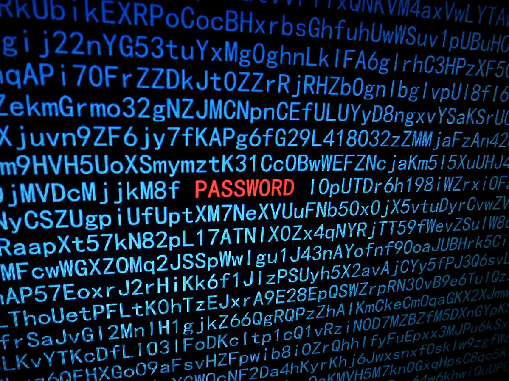

# Password cracking

With the development of the internet and remote communication went hand in hand the need to verify whether the person on the other side of the screen is genuinely the individual with whom we are communicating or simply an imposter. Similar to the way two friendly spies verify each other’s identity in a foreign territory, the option of using a password has emerged. Nowadays, one encounters passwords in cyberspace on a daily basis, whether it’s logging into email, school or work accounts, or online banking.
But does the mere existence of passwords guarantee secure user authentication? Ongoing reports of new hacks and stolen accounts tell us otherwise. The methods by which attackers get to a user's password can be broadly categorized into two groups, depending on whether it is stolen or guessed. Since the following task deals with the second case, let's take a closer look at it.
*Brute Force Attack*,  as introduced in the task, involves trying out all possible passwords. Depending on the computer’s processing power and the software used, the speed of password testing can range from thousands to several hundred billion passwords per second. Thus, very short passwords can be guessed by a computer in a relatively short time (i.e., instantly or within hours).

A more sophisticated form of brute force attack is the *Dictionary Attack*, where the computer does not randomly try out passwords but selects them from a dictionary of prepared words. In addition to actual words, this dictionary contains commonly used passwords such as `password1234` or `password`. If the victim's password is in the attacker's dictionary, the cracking time is significantly reduced compared to a conventional brute force attack.

Essential protection against both types of attacks is the use of sufficiently long passwords (at least 12 characters) made up of  upper- and lowercase letters, digits, and other special characters. 

## Assignment

The hacking program in a brute force attack is guaranteed to crack an eight-character password made up of upper- and lowercase letters of the English alphabet in at most about 22 minutes (for a certain specified computational power of a computer). Also, let’s assume that the set of keyboard characters to be tested can be set in the program’s settings.

> **Exercise 1.** How many passwords can the program try out in one second?

*Solution.* Since the English alphabet has 26 characters, there are 52 possibilities at each position of an eight-character password (upper- and lowercase letters). Using the combinatorial product rule, we can deduce that the total number of possible passwords is $52^{8}$.

Then, the number of passwords the program can test in one second is approximately
$$\frac{52^8}{22\cdot 60} \doteq 40\ 500\ 000\ 000.$$ 

> **Exercise 2.** How long at most would it take for the program to guaranteedly crack an eight-character password if we also allowed the use of digits?

*Solution.* By adding ten new characters, there are 62 different characters possible at each position. According to the combinatorial product rule, the number of possible passwords is $62^8$; using the result of the previous exercise, the time $t$  for the program to test all passwords is given by
$$
t=\frac{62^8}{40\ 500\ 000\ 000} \doteq 5\ 391\ \text{s} \doteq 90\ \text{min}.
$$

> **Exercise 3.** How many characters should a password consisting of digits and lowercase or uppercase letters of the English alphabet have to be strong enough, i.e., guaranteed time for cracking would be at least 100 years? How does the result change if we allow for the possible use of an additional 40 special keyboard characters?

*Solution.* We assume that each year has 365 days, i.e., 31 536 000 seconds. Let's denote by $n$ the required number of characters, and substitute similarly to the  previous exercise. However, this time, we get an exponential equation with the unknown $n$, which we solve:

$$
\begin{aligned}
\frac{62^n}{40\ 500\ 000\ 000} &= 100\cdot 31\ 536\ 000 \\
62^n&= 40\ 500\ 000\ 000 \cdot 3\ 153\ 600\ 000 \\
n \log 62 &= \log (40\ 500\ 000\ 000 \cdot 3\ 153\ 600\ 000)\\
n &= \frac{\log (40\ 500\ 000\ 000 \cdot 3\ 153\ 600\ 000)}{\log 62} \doteq 11{,}22
\end{aligned}
$$

Therefore, a password with the required security would have to be at least 12 characters long.

If we allow an additional 40 characters of the keyboard,  a similar calculation gives the result:

$$
n' = \frac{\log (40\ 500\ 000\ 000 \cdot 3\ 153\ 600\ 000)}{\log 102} \doteq 10{,}01.
$$

Now, a password with the required security must have at least 11 characters.

## References and literature

### Literature

*  Raza, Mudassar \& Iqbal, Muhammad \& Sharif, Muhammad \& Haider, Waqas. (2012). A Survey of Password Attacks and Comparative Analysis on Methods for Secure Authentication. *World Applied Sciences Journal*. 19. 439--444.

* National  Cyber and Information Security Agency. *Bezpečný pohyb v kybersvětě* [online]. Available from <https://www.nukib.cz/cs/kyberneticka-bezpecnost/vzdelavani/verejnost/> [cit. 30. 6. 2023].

### Sources of images

* Hacking password, Santeri Viinamäki, CC BY-SA 4.0, available from <https://commons.wikimedia.org/wiki/File:Hacking_password_illustration.jpg> [cit. 30. 6. 2023].
