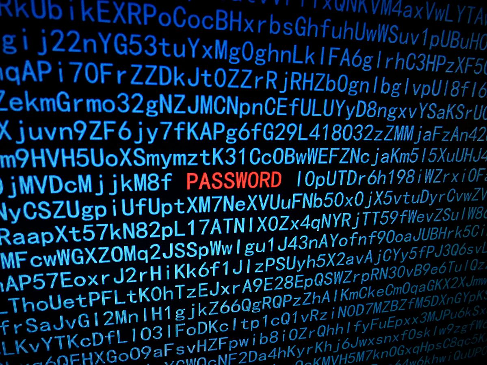

---
keywords:
- combinatoria, probabilidad y estadística
- combinatoria
- regla del producto
is_finished: true
---

# Descifrado de contraseña

Con el desarrollo de Internet y la comunicación a larga distancia surgió la necesidad de verificar si la persona que está al otro lado del monitor es realmente la persona con la que nos comunicamos o sólo alguien que finge ser un conocido. De forma similar, cuando se presentan dos espías amigos en un territorio extranjero, se ofrece la posibilidad de utilizar una contraseña. Hoy en día, uno se encuentra a diario con contraseñas en el ciberespacio, al entrar en el correo electrónico, las cuentas de la escuela o el trabajo, o la banca en línea.

Pero, ¿garantiza la mera existencia de contraseñas la autenticación segura de los usuarios? Los continuos informes sobre nuevos hackeos y cuentas robadas nos dicen que no. Los métodos por los que los atacantes llegan a la contraseña de un usuario pueden dividirse básicamente en dos grupos, dependiendo de si es robada o adivinada. Como el siguiente problema trata del segundo caso, vamos a examinarlo más detenidamente.

*El ataque de fuerza bruta*, que conoceremos en la tarea, consiste en probar todas las contraseñas posibles. Dependiendo de la potencia de cálculo del ordenador y del software utilizado, la velocidad de las pruebas puede oscilar entre unos pocos miles y varios cientos de miles de millones de contraseñas por segundo. Así, contraseñas muy cortas pueden ser adivinadas por el ordenador en un tiempo relativamente corto (es decir, instantáneamente o en cuestión de horas).

Una forma más sofisticada de ataque de fuerza bruta es el *ataque de diccionario*, en el que el ordenador no prueba contraseñas al azar, sino que las selecciona de un diccionario de palabras preparadas. Además de palabras reales, éste contiene contraseñas de uso común como `password1234` o `password`. Si la contraseña de la víctima está en el diccionario del atacante, el tiempo de descifrado se reduce significativamente en comparación con un ataque de fuerza bruta convencional.

Una protección esencial contra ambos tipos de ataques es el uso de contraseñas suficientemente largas (al menos 12 caracteres) compuestas por letras mayúsculas y minúsculas, números y otros caracteres especiales.

## Tarea

El programa hacker, en un ataque de fuerza bruta, tiene garantizado descifrar una contraseña de ocho caracteres formada por letras mayúsculas y minúsculas del alfabeto inglés en unos 22 minutos. (Supongamos que el conjunto de caracteres del teclado que se van a probar se puede establecer en la configuración del programa).

> **Ejercicio 1.** ¿Cuántas contraseñas intenta el programa en 1 segundo?

\iffalse

*Solución.* Como el alfabeto inglés tiene 26 caracteres, puede haber 52 posibilidades en cada posición de una contraseña de ocho caracteres (mayúsculas y minúsculas). Utilizando la regla del producto combinatorio, podemos deducir que el número total de contraseñas posibles es igual a $52^{8}$.

El número de contraseñas que el programa intenta en un segundo es el total de 
$$
\frac{52^8}{22\cdot 60} \doteq 40\ 500\ 000\ 000.
$$ 

\fi

> **Ejercicio 2.** ¿Cuánto tardaría el programa en descifrar una contraseña de ocho caracteres si también permitimos utilizar dígitos?

\iffalse

*Solución.* Añadiendo diez nuevos caracteres, puede haber 62 caracteres diferentes en cada posición. Según la regla del producto combinatorio, el número de contraseñas posibles es $62^8$; utilizando el resultado del problema anterior, obtenemos el tiempo $t$ en el que el programa prueba todas las contraseñas como

$$
t=\frac{62^8}{40\ 500\ 000\ 000} \doteq 5\ 391\ \text{s} \doteq 90\ \text{min}.
$$

\fi

> **Ejercicio 3.** ¿Cuántos caracteres debería tener una contraseña formada por números y letras minúsculas o mayúsculas del alfabeto inglés para ser lo suficientemente fuerte, es decir, para garantizar que se tarda al menos 100 años en descifrarla? ¿Cómo cambia el resultado si permitimos el posible uso de otros 40 caracteres especiales del teclado?

\iffalse

*Solución.* Suponemos que cada año tiene 365 días, es decir, 31 536 000 segundos. Denotemos $n$ el número necesario de caracteres y sumémoslos como en el problema anterior. Pero ahora obtenemos una ecuación exponencial con $n$ desconocida, que resolvemos:

$$
\begin{aligned}
\frac{62^n}{40\ 500\ 000\ 000} &\geq 100\cdot 31\ 536\ 000 \\
62^n&\geq 40\ 500\ 000\ 000 \cdot 3\ 153\ 600\ 000 \\
n \log 62 &\geq \log (40\ 500\ 000\ 000 \cdot 3\ 153\ 600\ 000)\\
n &\geq \frac{\log (40\ 500\ 000\ 000 \cdot 3\ 153\ 600\ 000)}{\log 62} \doteq 11{,}22
\end{aligned}
$$

Una contraseña con la seguridad requerida debería tener al menos 12 caracteres.

Si permitimos 40 caracteres adicionales en el teclado, obtendremos mediante un cálculo similar un resultado de la forma

$$
n' \geq \frac{\log (40\ 500\ 000\ 000 \cdot 3\ 153\ 600\ 000)}{\log 102} \doteq 10{,}01.
$$

Una contraseña con la seguridad requerida debe tener ahora al menos 11 caracteres.

\fi

## Referencias y literatura

### Literatura

*  Raza, Mudassar \& Iqbal, Muhammad \& Sharif, Muhammad \& Haider, Waqas. (2012). A Survey of Password Attacks and Comparative Analysis on Methods for Secure Authentication. *World Applied Sciences Journal*. 19. 439--444.

* National  Cyber and Information Security Agency. *Bezpečný pohyb v kybersvětě* [online]. Accesible de <https://www.nukib.cz/cs/kyberneticka-bezpecnost/vzdelavani/verejnost/> [cit. 30. 6. 2023].

### Fuentes de imágenes

* Hacking password, Santeri Viinamäki, CC BY-SA 4.0, accesible de <https://commons.wikimedia.org/wiki/File:Hacking_password_illustration.jpg> [cit. 30. 6. 2023].

