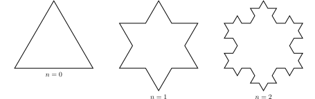

# Fractal geometry 

A fractal is an object whose geometric structure repeats within itself. The
characteristic property of fractals is their self-similarity. Examples
of fractals in nature include clouds, trees, or a cauliflower
head. The word "fractal" comes from the Latin word "fractus", which
translates broken or shattered. It was coined by Benoit B. Mandelbrot,
considered the father of fractal geometry, renowned for
his book The Fractal Geometry of Nature (1982). 

In study of fractals, their dimension plays an important role. The
topological dimension, known from classical Euclidean geometry, proved
insufficient in describing fractals. Therefore, another type of
dimension was needed. It was introduced by Felix Hausdorff, known as
the Hausdorff dimension. For simple objects, we can understand it as
the number:
$$d=\frac{\ln N}{\ln\frac{1}{r}}, $$
where $N$ is the number of parts the object is composed of, formed by
self-similarity with the coefficient $r$ from the
original object. For example, for a square is true that it can be
composed of four smaller squares that arise from it by
self-similarity with the coefficient $r=\frac{1}{2}$, i.e.,
$$d=\frac{\ln 4}{\ln2}=2.$$
Thus, for a square, its fractal dimension (Hausdorff dimension) is the
same as its normal intuitive dimension (topological dimension).

## Koch snowflake

The *Koch snowflake* is a curve in the plane created by an iterative
process from an equilateral triangle.

At the beginning, there is an equilateral triangle with sides of
length 1. In each subsequent step, the following is performed:

1. Each line segment is divided into thirds.
2. An equilateral triangle is constructed above the middle third of the segment.
3. The base of the constructed triangle (formerly the middle third of
   the line segment) is removed.

From the figure, we can see that to determine the length of one side
of the snowflake after the first iteration, we need 4 sides of the
triangle that was formed by reducing the side of the original triangle
from the zero step with a self-similarity coefficient $r=\frac{1}{3}$,
i.e.,
$$
d=\frac{\ln4}{\ln3}\approx 1{,}26.
$$
Since the Koch snowflake is a curve, we would expect its dimension to be
$1$. This discrepancy is due to the fact that the Koch snowflake is finally so
fragmented that the resulting fractal has an infinite
length but bounds a finite area plane structure.

> **Exercise 1.** Calculate the perimeter of the Koch snowflake after
> the first, second, and third iterations.

\iffalse

*Solution.* Initially, we have an equilateral triangle with a
perimeter $o_0=3$. In the first iteration, each of the three line
segments is divided into thirds, and the middle third is replaced by
two segments of length $\frac{1}{3}$. Each side of the original
triangle is extended by $\frac{1}{3}$, resulting in a perimeter after
the first iteration of
$$o_1=3+3\cdot\frac{1}{3}=4.$$

In the second iteration, each side of the original triangle is divided
into four line-segments of one-third of the original length, which are
further divided into
thirds and extended by $\frac{1}{9}$. This leads to a perimeter of
$$
o_2=3+3\cdot\frac{1}{3}+3\cdot\frac{4}{9}=\frac{16}{3}.
$$ 
In the third iteration, we extend 16 line-segments on each side
by $\frac{1}{27}$, resulting in  a perimeter of
$$o_3=3+3\cdot\frac{1}{3}+3\cdot\frac{4}{9}+3\cdot\frac{16}{27}=3+1+\frac{4}{3}+\frac{16}{9}=\frac{64}{9}.$$

\fi

> **Exercise 2.** What is the perimeter of the Koch snowflake after the
> $n$-th iteration? Prove that the perimeter of the Koch snowflake
> is infinite.

\iffalse

*Solution.* From the above calculations, we see that each line segment
is one-third the length of the line segment from the previous
iteration, and at the same time each segment is in the next iteration
extended by one third, i.e., the segment is extended to $\frac{4}{3}$
of its previous length. The perimeter of the Koch snowflake after the
$n$-th iteration can be expressed using the sum of a geometric series
with the common ratio of $\frac{4}{3}$ for $n\in\mathbb{N}$:
$$
o_n=3+\left(\frac{4}{3}\right)^0+\left(\frac{4}{3}\right)^1+\left(\frac{4}{3}\right)^2+\cdots+\left(\frac{4}{3}\right)^{n-1}=3+\sum_{i=1}^n\left(\frac{4}{3}\right)^{i-1}.
$$   
If we continued in this way indefinitely, we would obtain an infinite
geometric series in the second term of the above sum. Since the ratio
of the corresponding geometric sequence is greater than one, the
series is divergent, and the perimeter of the Koch snowflake is
infinite.

\fi

> **Exercise 3.** Calculate the area of the Koch snowflake after the
> first and second iterations.

\iffalse

*Solution.* At the beginning, let us realize that the height of an
equilateral triangle with side length $a$ is
$\frac{\sqrt{3}}{2}a$, and its area is given by
$$
S=\frac{\sqrt{3}}{4}a^2.
$$
The area of the initial equilateral triangle is
$S_0=\frac{\sqrt{3}}{4}$. In the first iteration, we divide the three
line segments into thirds and we place a smaller equilateral triangle
with side length $\frac{1}{3}$ in the middle third. The resulting area
after the first iteration is
$$
S_1=\frac{\sqrt{3}}{4}+3\cdot\frac{\sqrt{3}}{4}\cdot\left(\frac{1}{3}\right)^2=\frac{\sqrt{3}}{4}\cdot\frac{4}{3}.
$$ 
In the second iteration, each side of the original triangle is divided
into four segments, and a smaller equilateral triangle with side
length $\frac{1}{9}$ is placed on each segment.
 The area after the second iteration will increase to 
$$
S_2=\frac{\sqrt{3}}{4}+3\cdot\frac{\sqrt{3}}{4}\cdot\left(\frac{1}{3}\right)^2+3\cdot4\cdot\frac{\sqrt{3}}{4}\cdot\left(\frac{1}{9}\right)^2=\frac{\sqrt{3}}{4}\left(1+\frac{1}{3}+\frac{1}{3}\cdot\frac{4}{9}\right)=\frac{\sqrt{3}}{4}\cdot\frac{40}{27}.
$$

\fi

> **Exercise 4.** What is the area of the Koch snowflake after the $n$-th
> iteration? How many times larger is the area of the Koch snowflake
> relative to the original equilateral triangle?

\iffalse

*Solution.* From the previous considerations, it follows that the
number of segments, where we add a new triangle, is four times greater
in each iteration. At the same time, the side of our new triangle
shrinks to a third of its previous size, so its area decreases to
one-ninth.  We obtain terms of a geometric sequence with a ratio of
$\frac{4}{9}$, and the area of the Koch snowflake after the $n$-th
iteration is formed by the area of the original triangle and the sum
of the first $n$ terms of that geometric sequence:
$$S_n=\frac{\sqrt{3}}{4}\left[1+\frac{1}{3}+\frac{1}{3}\cdot\frac{4}{9}+\dots+\frac{1}{3}\left(\frac{4}{9}\right)^{n-1}\right]=\frac{\sqrt{3}}{4}\left[1+\frac{1}{3}\sum_{i=1}^n\left(\frac{4}{9}\right)^{i-1}\right].$$
Since the ratio of the geometric sequence is less than one, by continuing to infinity, we obtain a convergent geometric series. Using the formula for its sum, we get the area of the Koch snowflake after an infinite number of iterations.
$$S=\frac{\sqrt{3}}{4}\left(1+\frac{1}{3}\cdot\frac{1}{1-\frac{4}{9}}\right)=\frac{\sqrt{3}}{4}\left(1+\frac{1}{3}\cdot\frac{9}{5}\right)=\frac{8}{5}\cdot\frac{\sqrt{3}}{4}= 1{,}6 \cdot S_0.$$

The Koch snowflake has an infinite perimeter enclosing a finite area
that is approximately 1.6 times larger than the area of the original
equilateral triangle.

\fi

## Literature

* MathWorld. *Koch snowflake* [online]. Available from <https://mathworld.wolfram.com/KochSnowflake.html> [cit. 13. 7. 2023].
* *Koch curve* [online]. Available from <https://cs.wikipedia.org/wiki/Kochova_k%C5%99ivka> [cit. 13. 7. 2023].
