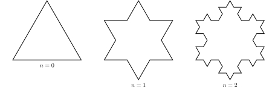

---
keywords:
- postupnosti a rady
- geometrická postupnosť
- fraktál
- Kochova vločka
is_finished: true
---

# Fraktálna geometria 

Fraktál je objekt vybudovaný pomocou rekurzie (jeho geometrická štruktúra sa opakuje v ňom samom). Ide o "nepravidelný, fragmentovaný geometrický tvar, ktorý môže byť rozdelený na časti, z ktorých je každá aspoň približne podobná, zmenšená kópia celého geometrického tvaru". Táto vlastnosť tiež býva nazývaná sebepodobnosť. Príklady fraktálov v prírode sú oblaky, stromy alebo karfiol. Slovo "fraktál" pochádza z latinského slova "fractus", ktoré v preklade znamená zlomené alebo roztrieštené. Slovo vymyslel Benoit B. Mandelbrot, ktorý sa považuje za otca fraktálnej geometrie a preslávil sa
knihou *The Fractal Geometry of Nature* (1982).
 

Pri štúdiu fraktálov zohráva dôležitú úlohu ich rozmer (dimenzia). Dimenzia, tzv. topologická dimenzia známa z klasickej euklidovskej geometrie sa ukázala
pri opise fraktálov ako nedostatočná. 
Felix Hausdorff preto zaviedol iný typ fraktálnej dimenzie, označovanú ako
Hausdorffova dimenzia. Pre jednoduché objekty ju môžeme chápať ako
číslo:
$$d=\frac{\ln N}{\ln\frac{1}{r}}, $$
kde $N$ je počet častí, z ktorých sa objekt skladá a ktoré vzniknú
pomocou rovnoľahlosti s koeficientom $r$ z
pôvodného objektu. Napríklad pre štvorec platí, že môže byť
zložený zo štyroch menších štvorcov, ktoré z neho vzniknú pomocou
rovnoľahlosti s koeficientom $r=\frac{1}{2}$, i.e.,
$$d=\frac{\ln 4}{\ln2}=2.$$
Pre štvorec je teda jeho fraktálna dimenzia (Hausdorffova dimenzia)
rovnaká ako jeho normálna intuitívna dimenzia (topologická dimenzia).

## Kochova vločka

*Kochova vločka* je krivka v rovine, ktorá vzniká iteračním procesom z rovnostranného trojuholníka.(iterácia: postup v matematike, pri ktorom sa opakovane používa nejaká operácia/funkcia s cieľom postupne sa priblížiť ku konečnému výsledku) 

Na začiatku je rovnostranný trojuholník so stranami dĺžky 1.
V každom ďalšom kroku sa vykoná nasledovné:

1. Každá úsečka je rozdelená na tretiny.
2. Nad strednou tretinou úsečky sa vytvorí rovnostranný trojuholník.
3. Základňa trojuholníka (predchádzajúca prostredná tretina úsečky) sa odstráni. 

Z obrázku vidíme, že na určenie dĺžky jednej strany snehovej vločky v prvej iterácii, potrebujeme 4 strany
trojuholníka, ktorý vznikol zmenšením strany pôvodného trojuholníka
v nultom kroku s koeficientom podobnosti
 $r=\frac{1}{3}$,
i.e.,
$$
d=\frac{\ln4}{\ln3}\approx 1{,}26.
$$
Keďže Kochova vločka je krivka, očakávali by sme, že jej dimenzia je
$1$. Táto nezrovnalosť je daný tým, že Kochova vločka je na koniec natoľko
členitá, že výsledný fraktál má nekonečnú dĺžku, ale ohraničuje útvar
konečného obsahu.

> **Úloha 1.** vypočítajte obvod Kochovej snehovej vločky po
> prvej, druhej a tretej iterácii.

\iffalse

*Riešenie.* 
Na začiatku máme rovnostranný trojuholník s obvodom $o_0=3$. V prvej iterácii rozdelíme tri úsečky na tretiny, prostrednú
tretinu z nich odoberieme a nahradíme ju 
dvoma úsečkami dĺžky $\frac{1}{3}$. Každá strana pôvodného
trojuholníka sa predĺži o $\frac{1}{3}$, čím vznikne obvod po
prvej iterácii
$$o_1=3+3\cdot\frac{1}{3}=4.$$

V druhej iterácii dostaneme na každej strane pôvodného trojuholníka štyri
úsečky tretinovej dĺžky, ktoré rozdelíme na tretiny a predĺžime ich o $\frac{1}{9}$. To vedie k obvodu $$o_2=3+3\cdot\frac{1}{3}+3\cdot\frac{4}{9}=\frac{16}{3}.$$ 
Pri tretej iterácii budeme predlžovať na každej strane 16 úsečiek o $\frac{1}{27}$, a preto obvod po tretej iterácii bude 
$$o_3=3+3\cdot\frac{1}{3}+3\cdot\frac{4}{9}+3\cdot\frac{16}{27}=3+1+\frac{4}{3}+\frac{16}{9}=\frac{64}{9}.$$

\fi

> **Úloha 2.** Aký je obvod Kochovej snehovej vločky po
> $n$-tej iterácii? Ukážte, že obvod Kochovej snehovej vločky
> je nekonečný.

*Riešenie.* Z uvedených výpočtov vyplýva, že každá úsečka
je jedna tretina dĺžky úsečky z predchádzajúcej
iterácie a zároveň je každá úsečka v nasledujúcej iterácii
predĺži o jednu tretinu, t. j. úsečka sa predĺži na $\frac{4}{3}$.
svojej predchádzajúcej dĺžky. Obvod Kochovej snehovej vločky po
$n$-tej iterácii možno vyjadriť ako súčet členov geometrickej postupnosti
s kvocientom $\frac{4}{3}$ pre $n\in\mathbb{N}$:
$$
o_n=3+\left(\frac{4}{3}\right)^0+\left(\frac{4}{3}\right)^1+\left(\frac{4}{3}\right)^2+\cdots+\left(\frac{4}{3}\right)^{n-1}=3+\sum_{i=1}^n\left(\frac{4}{3}\right)^{i-1}.
$$   
Ak by sme takto pokračovali donekonečna, 
tak by sme v druhom člene súčtu dostali nekonečný geometrický rad. 
Keďže kvocient príslušnej geometrickej postupnosti je väčší ako jedna, je
rad divergentný a obvod Kochovej snehovej vločky je nekonečný.

\fi

> **Úloha 3.** Vypočítajte obsah Kochovej vločky po
> prvej a druhej iterácii.

\iffalse

*Riešenie.* Na začiatku si treba uvedomiť, že výška
rovnostranného trojuholníka so stranou dĺžky $a$ je
$\frac{\sqrt{3}}{2}a$ a obsah rovnostranného trojuholníka je 
$$S=\frac{\sqrt{3}}{4}a^2.$$
Obsah rovnostranného trojuholníka z ktorého vychádzame je
$S_0=\frac{\sqrt{3}}{4}$. V prvej iterácii rozdelíme tri
úsečky na tretiny a na prostrednú tretinu umiestnime rovnostranný trojuholník so
stranou dĺžky $\frac{1}{3}$. Výsledný obsah
po prvej iterácii je
$$
S_1=\frac{\sqrt{3}}{4}+3\cdot\frac{\sqrt{3}}{4}\cdot\left(\frac{1}{3}\right)^2=\frac{\sqrt{3}}{4}\cdot\frac{4}{3}.
$$ 
V druhom kroku budeme mať na každej strane pôvodného trojuholníka
štvornásobný počet úsečiek, kam budeme umiestňovať trojuholník so stranou
dĺžky $\frac{1}{9}$.
Obsah sa po druhej iterácii zväčší na 
$$
S_2=\frac{\sqrt{3}}{4}+3\cdot\frac{\sqrt{3}}{4}\cdot\left(\frac{1}{3}\right)^2+3\cdot4\cdot\frac{\sqrt{3}}{4}\cdot\left(\frac{1}{9}\right)^2=\frac{\sqrt{3}}{4}\left(1+\frac{1}{3}+\frac{1}{3}\cdot\frac{4}{9}\right)=\frac{\sqrt{3}}{4}\cdot\frac{40}{27}.
$$

\fi

> **Úloha 4.** Aký je obsah Kochovej snehovej vločky po $n$-tej
> iterácii? Koľkokrát je obsah Kochovej snehovej vločky väčší
> vzhľadom na pôvodný rovnostranný trojuholník?

\iffalse

*Riešenie.* Z predchádzajúcich úvah vyplýva, že počet úsečiek do ktorých pridáme nový trojuholník, je štyrikrát väčší
v každej iterácii. Zároveň strana nášho nového trojuholníka
sa zmenší na tretinu svojej predchádzajúcej veľkosti, takže jeho obsah sa zmenší na
na jednu devätinu.  Získame tak členy geometrickej postupnosti s kvocientom
$\frac{4}{9}$ a obsah Kochovej snehovej vločky po $n$-tej
iterácii je vytvorený obsahom pôvodného trojuholníka a súčtom
prvých $n$ členov tejto geometrickej postupnosti:
$$S_n=\frac{\sqrt{3}}{4}\left[1+\frac{1}{3}+\frac{1}{3}\cdot\frac{4}{9}+\dots+\frac{1}{3}\left(\frac{4}{9}\right)^{n-1}\right]=\frac{\sqrt{3}}{4}\left[1+\frac{1}{3}\sum_{i=1}^n\left(\frac{4}{9}\right)^{i-1}\right].$$
Keďže kvocient geometrickej postupnosti je menší ako jedna, pokračovaním do nekonečna dostaneme konvergentný geometrický rad. Pomocou vzorca pre jeho súčet dostaneme plochu Kochovej snehovej vločky po nekonečnom počte iterácií.
$$S=\frac{\sqrt{3}}{4}\left(1+\frac{1}{3}\cdot\frac{1}{1-\frac{4}{9}}\right)=\frac{\sqrt{3}}{4}\left(1+\frac{1}{3}\cdot\frac{9}{5}\right)=\frac{8}{5}\cdot\frac{\sqrt{3}}{4}= 1{,}6 \cdot S_0.$$

Kochova snehová vločka má nekonečný obvod ohraničujúci konečnú plochu,
ktorá je približne 1,6-krát väčšia ako obsah pôvodného
rovnostranného trojuholníka.

\fi

## Literatúra

* MathWorld. *Koch snowflake* [online]. Available from <https://mathworld.wolfram.com/KochSnowflake.html> [cit. 13. 7. 2023].
* *Kochova krivka* [online]. Dostupné z <https://sk.wikipedia.org/wiki/Kochova_krivka> [cit. 13. 7. 2023].

