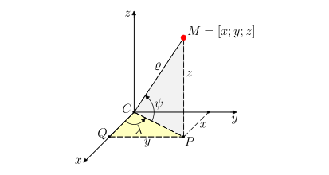

# Vzdálenosti na zemském povrchu

Která z cest mezi Lisabonem $(L)$ a Washingtonem $(W)$ znázorněných na mapě je ve skutečnosti kratší? 

Zdánlivě jednoduchý dotaz má, jak si ověříte v této úloze, 
překvapivou odpověď. To, co se na mapě jeví jako úsečka $LW$, ve skutečnosti není nejkratší cesta mezi místy $L$ a $W$ na zeměkouli. Důvodem 
je zkreslení vzdáleností ve zvoleném zobrazení zemského povrchu. 
Vidíme, že úsečka $LW$ na mapě je přibližně rovnoběžná s 
geografickými rovnoběžkami na Zemi, tedy ve skutečnosti odpovídá 
oblouku na kružnici, která se velmi podobá rovnoběžce (viz 
kružnice $k$ se středem $O$ na obrázku). 

Na kulovém povrchu (který budeme v této úloze považovat za povrch Země) je však nejkratší vzdálenost mezi místy $L$ a $W$ jiný oblouk. 
Tento oblouk leží na kružnici $h$, jejíž střed $C$ je středem Země. 
Takové spojnice označujeme jako *ortodromy* a všechny kružnice s uvedenou vlastností nazýváme *hlavními kružnicemi*. 

Dá se ukázat (není to vidět na první pohled), že nejkratší cestou spojující dva body na povrchu koule je vždy část odpovídající hlavní kružnice, tj. kružnice mající střed ve středu uvažované koule a procházející dvěma danými body na povrchu koule.  

O kolik kilometrů si však cestou po ortodromě polepšíme? Odpověď na tuto otázku je již potřeba spočítat.

### Slovníček 
* *Zeměpisná šířka* místa na zemském povrchu (vyjádřená ve 
stupních) je odchylka přímky, která 
prochází daným místem a středem Země, od roviny rovníku. Tuto odchylku opatříme znaménkem takto: místům na severní polokouli (tj. na sever od rovníku) budeme přiřazovat kladné zeměpisné šířky, zatímco místům na polokouli jižní přiřadíme záporné zeměpisné šířky. Někdy (především v běžné řeči) se znaménko nepoužívá a mluví se o severní, popř. jižní, zeměpisné šířce. Zeměpisnou šířku budeme označovat písmenem $\psi$, kde $\psi$ může nabývat hodnot od $-90^{\circ}$ (jižní pól) do $+90^{\circ}$ (severní pól).  
* *Zeměpisná délka* místa na zemském povrchu (vyjádřená ve 
stupních) je odchylka dvou polorovin, jejichž společnou hraniční přímkou je spojnice severního a jižního pólu. První polorovina navíc prochází Greenwichem a druhá daným místem. Tuto odchylku opatříme znaménkem takto: místům na východní polokouli (tj. na východ od Greenwiche) budeme přiřazovat kladné zeměpisné délky, zatímco místům na polokouli západní přiřadíme záporné zeměpisné délky. Někdy se (podobně jako u zeměpisné šířky) znaménko nepoužívá a mluví se o východní, popř. západní, zeměpisné délce. 
Zeměpisnou délku budeme označovat písmenem $\lambda$, kde $\lambda$ může nabývat hodnot od $-180^{\circ}$ do $+180^{\circ}$. 

### Jak mapa zkresluje Zem?

* Na skutečné Zemi (koule): Rovnoběžky jsou kružnice, jejichž poloměr se postupně zmenšuje směrem k pólům. Poledníky jsou půlkružnice sbíhající se v pólech.

* Na mapě (např. Mercatorovo zobrazení): Všechny rovnoběžky se protáhnou do rovných čar stejné délky (jako rovník). Poledníky zůstávají rovné a kolmé na rovnoběžky. Tím se vzdálenost dvou míst ležících na stejné rovnoběžce blízko pólu "nafouknou" – úsečka na mapě odpovídá delší cestě po rovnoběžce!

> **Úloha 1.** Lisabon i Washington se nachází přibližně na stejné 
> rovnoběžce (asi $39^{\circ}$ severní šířky). O kolik kilometrů 
> méně uletí letadlo pohybující se po ortodromě oproti cestě po 
> rovnoběžce? Lisabon se nachází na přibližně $9^{\circ}$ 
> západní délky, Washington na $77^{\circ}$ západní délky.
Předpokládejme, že je Země koulí se středem $C$ a 
poloměrem $6\ 371\,\text{km}$ a že letadlo letí v průměrné výšce 
$10\,\text{km}$ (vzlet a přistání brát do úvahy nebudeme). Proto 
budeme ve všech úvahách pracovat s koulí o poloměru 
$\varrho=6\ 381\,\text{km}$. 

\iffalse

*Řešení.* Určeme nejdříve, kolik kilometrů 
urazí letadlo při cestě po rovnoběžce. Označme rovnoběžku 
na $39^{\circ}$ severní šířky jako kružnici $k$ se středem $O$ a 
poloměrem $r$. Ve vhodném pravoúhlém průmětu zeměkoule (viz 
obrázek, kde $S$ a $J$ jsou póly) se řečená kružnice zobrazí 
jako úsečka $AB$ se středem $O$. 

Z obrázku je zřejmá rovnost $\lvert\sphericalangle CBO\rvert = \lvert\sphericalangle BCD\rvert = 39^{\circ}$ 
(úhly jsou střídavé) a užitím funkce kosinus v pravoúhlém trojúhelníku $BCO$ dostáváme $r=\varrho\cdot \cos 39^{\circ}$.

Dráhu letadla pohybujícího se po rovnoběžce (v obrázku níže je 
trajektorie letadla znázorněná kratším obloukem $LW$) určíme 
přímou úměrou. Celá kružnice $k$ má délku 
$2\pi r =2\pi\varrho\cdot\cos 39^{\circ} \,\text{km}$, tedy 
délka kratšího oblouku $LW$ je rovna
$$
\frac{(77-9)}{360}\cdot 2\pi\varrho\cdot \cos 39^{\circ} \doteq 5\ 885{,}4\,\text{km}.
$$

Nyní zjistíme, kolik kilometrů uletí letadlo pohybující se po ortodromě. Jedná se vlastně o vzdálenost dvou bodů na pomyslné sféře o poloměru $\varrho=6\ 381\,\text{km}$. Na obrázku lze vidět, že ortodroma mezi body $L$ a 
$W$ je obloukem jisté hlavní kružnice $h$ s neznámým středovým úhlem $\varphi$. Tento úhel musíme určit.

Uvažme rovnoramenný trojúhelník $OWL$, který rozpůlíme výškou na 
základnu $LW$ na dva shodné pravoúhlé trojúhelníky. V libovolném 
z těchto dvou trojúhelníků pak platí 
$\frac{|LW|}{2}=r\cdot \sin 34^{\circ}$, a tedy 
$|LW|=2r\cdot\sin 34^{\circ}$. Pokud provedeme podobnou  úvahu 
pro rovnoramenný trojúhelník $CWL$, dostáváme rovnost 
$|LW|=2\varrho \cdot \sin\frac{\varphi}{2}$. Porovnáním pravých 
stran obou odvozených rovností vypočítáme hledaný úhel $\varphi$:

$$
2r\sin34^{\circ} = 2\varrho \sin\frac{\varphi}{2}
$$

$$
\tag{1}
\sin\frac{\varphi}{2} = \frac{r\sin34^{\circ}}{\varrho}
= \frac{\varrho \cos39^{\circ}\sin 34^{\circ}}{\varrho} = \cos 39^{\circ}\sin 34^{\circ} \doteq 0{,}43457
$$

$$
\frac{\varphi}{2}  
\doteq 25^{\circ}45' 30''\quad \Rightarrow \quad \varphi \doteq 51^{\circ}31'.
$$

Dráhu letadla pohybujícího se po ortodromě určíme podobně jako v 
případě rovnoběžky přímou úměrou. Délka celé kružnice $h$ je rovna $2\pi\varrho$, pro délku kratšího oblouku $LW$ pak platí

$$
\frac{51{,}5}{360}\cdot 2\pi\varrho \doteq 5\ 735{,}5 \,\text{km}.
$$

Vidíme, že se obě dráhy liší přibližně o $150 \,\text{km}$.

\fi

>**Úloha 2.**
Pokuste se zobecnit výše uvedený postup a odvodit obecný vzorec pro nejkratší vzdálenost dvou míst na Zemi, pokud $\varrho$ je zemský poloměr, $\psi$ je zeměpisná šířka obou míst (místa leží na stejné rovnoběžce) a $\lambda_1$, $\lambda_2$ jsou zeměpisné délky jednotlivých míst.  

\iffalse

*Řešení.* Úplně stejným postupem jako  v úloze 1 bychom došli ke vztahu 

$$
 \sin \frac{\varphi}{2} = \cos \psi \sin \frac{\Delta\lambda}{2}, 
$$

kde $\Delta\lambda$ je rozdíl zeměpisných délek obou míst, tj. $\Delta\lambda=|\lambda_1-\lambda_2|$. Právě odvozený vztah je zobecněním vztahu $(1)$. Spočítat nejkratší vzdálenost je už snadné. Pokud máme úhel $\varphi$ vyjádřený v radiánech, pak pro nejkratší vzdálenost $d$ platí vztah 

$$
 d = \varrho \varphi. 
$$

V případě, že úhel $\varphi$ máme vyjádřen ve stupních, pak 

$$
 d = \frac{\varphi}{360} \cdot 2\pi\varrho. 
$$

\fi

Jinou technikou bychom mohli odvodit ještě obecnější výsledek. Toto odvození by vyžadovalo jisté znalosti analytické geometrie v prostoru, zejména odchylky dvou vektorů. 

**Obecný vzorec pro nejkratší vzdálenost.**
Předpokládejme, že Země je koule s poloměrem $\varrho$ a uvažujme dvě místa na Zemi. První místo má zeměpisnou šířku $\psi_1$ a zeměpisnou délku $\lambda_1$, zatímco druhé má zeměpisnou šířku $\psi_2$ a zeměpisnou délku $\lambda_2$. Pak lze nejkratší vzdálenost $d$ těchto dvou míst vypočítat podle vzorce  

$$
\tag{2}
 d = \varrho \varphi, 
$$

kde $\varphi$ je úhel (v radiánech)  splňující podmínku 

$$
\tag{3}
 \sin^2 \frac{\varphi}{2} = \sin^2 \frac{\Delta\psi}{2} + \cos \psi_1 \cos \psi_2 \cdot \sin^2 \frac{\Delta\lambda}{2}  
$$

a 
$\Delta\psi = |\psi_1-\psi_2|$, 
$\Delta\lambda = |\lambda_1-\lambda_2|$ jsou rozdíly zeměpisných šířek a délek obou míst. 

**Poznámka 1.**
Vzorec pro nejkratší vzdálenost bychom (vzhledem k $(2)$ a $(3)$) mohli také psát ve tvaru 

$$
\tag{4}
 d = 2\varrho \cdot \arcsin \left( 
 \sqrt{
 \sin^2 \frac{\Delta\psi}{2} + \cos \psi_1 \cos \psi_2 \cdot \sin^2 \frac{\Delta\lambda}{2}
 }
 \right). 
$$

**Poznámka 2.**
Všimněme si, že v případě dvou míst se stejnou zeměpisnou šířkou $\psi_1=\psi_2=\psi$ máme $\Delta \psi = 0$, což znamená, že vztah $(3)$ lze zapsat ve tvaru 

$$
 \sin^2 \frac{\varphi}{2} = \cos^2 \psi \sin^2 \frac{\Delta\lambda}{2}, 
$$

tj. 

$$
 \sin \frac{\varphi}{2} = \cos \psi \sin \frac{\Delta\lambda}{2}. 
$$

\iffalse

Srovnejte poslední rovnost s výsledkem úlohy 2.  

\fi

\iffalse

**Vysvětlení vztahu (4).**
Uvažujme standardní pravoúhlou soustavu souřadnic v třírozměrném prostoru s počátkem ve středu Země (bod $C$, tzn. $C=[0;0;0]$) umístěnou tak, že osa $x$ je průsečnicí rovníkové roviny a roviny nultého poledníku, osa $y$ leží v rovníkové rovině a je kolmá k ose $x$ a osa $z$ prochází oběma zemskými póly (tzn. prochází středem Země a je kolmá na osu $x$ i $y$). Pokud má nějaké místo $M$ na Zemi zeměpisnou šířku $\psi$ a zeměpisnou délku $\lambda$, pak pro jeho (kartézské) souřadnice platí 

$$
\tag{5}
\begin{aligned}
x &= \varrho \cos\psi \cos\lambda, \\
y &= \varrho \cos\psi \sin\lambda, \\
z &= \varrho \sin\psi, 
\end{aligned}
$$

kde $\varrho$ je poloměr Země. Vztahy $(5)$ lze odvodit na základě znalosti goniometrických funkcí a obrázku 6 níže. 

Skutečně, z pravoúhlého trojúhelníku $CPM$ (pravý úhel je při vrcholu $P$) vidíme, že  

$$
 \cos \psi = \frac{|CP|}{|CM|}=\frac{|CP|}{\varrho}. 
$$

Odtud 

$$
 |CP|=\varrho \cos\psi. 
$$

Z pravoúhlého trojúhelníku $CQP$ (pravý úhel je při vrcholu $Q$) podobně dostaneme 

$$
 \cos\lambda = \frac{|CQ|}{|CP|} \quad \text{a} \quad 
\sin\lambda = \frac{|QP|}{|CP|}, 
$$

odkud 

$$
\begin{aligned}
 x &= |CQ|=|CP|\cos\lambda = \varrho \cos\psi \cos\lambda, \\
 y &= |QP|=|CP|\sin\lambda = \varrho \cos\psi \sin\lambda. 
 \end{aligned}
$$

Použijeme-li ještě jednou pravoúhlý trojúhelník $CPM$, dostaneme 

$$
 \sin\psi = \frac{|PM|}{|CM|}=\frac{|PM|}{\varrho}. 
$$

Odtud ihned máme i poslední vztah 

$$
 z=|PM|=\varrho \sin\psi. 
$$

Uvažujme nyní dvě místa $A$ a $B$ na zemském povrchu. Jedno se zeměpisnou šířkou $\psi_1$ a zeměpisnou délkou $\lambda_1$ a druhé se zeměpisnou šířkou $\psi_2$ a zeměpisnou délkou $\lambda_2$. Střed Země máme označený jako $C$ a nachází se v počátku souřadného systému, tj. $C=[0;0;0]$. Nyní nás zajímá (stejně jako v úloze 1) velikost úhlu $\varphi$, který svírají vektory $\overrightarrow{CA}$ a $\overrightarrow{CB}$. Přitom platí 

$$
\tag{6}
\begin{aligned}
\overrightarrow{CA} &= (\varrho \cos\psi_1 \cos\lambda_1; \, \varrho \cos\psi_1 \sin\lambda_1; \, \varrho \sin\psi_1), \\ 
\overrightarrow{CB} &= (\varrho \cos\psi_2 \cos\lambda_2; \, \varrho \cos\psi_2 \sin\lambda_2; \, \varrho \sin\psi_2). 
\end{aligned}
$$

Protože obě místa $A$ i $B$ leží na zemském povrchu, je jejich vzdálenost od středu Země $C$ rovna $\varrho$. Proto 

$$
\tag{7}
 \left|\overrightarrow{CA}\right| = \left|\overrightarrow{CB}\right|=\varrho. 
$$

Vzhledem ke vztahům $(6)$ a $(7)$  dostaneme 

$$
\begin{gathered}
\cos\varphi = \frac{\overrightarrow{CA} \cdot \overrightarrow{CB}}{\left|\overrightarrow{CA}\right| \cdot \left|\overrightarrow{CB}\right|}= \\
=\cos\psi_1 \cos\lambda_1 \cos\psi_2 \cos\lambda_2 + 
\cos\psi_1 \sin\lambda_1 \cos\psi_2 \sin\lambda_2 + 
\sin\psi_1 \sin\psi_2= \\
=\cos\psi_1 \cos\psi_2 \cdot \left(
\cos\lambda_1 \cos\lambda_2 + \sin\lambda_1 \sin\lambda_2 \right) + 
\sin\psi_1 \sin\psi_2
= \\
=\cos\psi_1 \cos\psi_2 \cdot \cos (\lambda_1-\lambda_2) + 
\sin\psi_1 \sin\psi_2 = \\
=\cos\psi_1 \cos\psi_2 \cdot \cos \Delta\lambda + 
\sin\psi_1 \sin\psi_2. 
\end{gathered}
$$

Proto platí (použijeme vzorec pro sinus polovičního úhlu) 

$$
\begin{gathered}
2 \sin^2 \frac{\varphi}{2} = 1-\cos\varphi = 1 - \cos\psi_1 \cos\psi_2 \cdot \cos \Delta\lambda - \sin\psi_1 \sin\psi_2= \\
=1 - \cos\psi_1 \cos\psi_2 - \sin\psi_1 \sin\psi_2 + \cos\psi_1 \cos\psi_2 - \cos\psi_1 \cos\psi_2 \cdot \cos \Delta\lambda = \\
=(1-\cos\Delta\psi) + \cos\psi_1 \cos\psi_2 \cdot (1-\cos\Delta\lambda) =2 \sin^2 \frac{\Delta\psi}{2} + \cos\psi_1 \cos\psi_2 \cdot 2 \sin^2 \frac{\Delta\lambda}{2}. 
\end{gathered}
$$

Odtud po vydělení číslem $2$ dostaneme vztah $(3)$. Vztahy $(2)$ a následně $(4)$ jsou potom již jasné. 

\fi

### Otázky k zamyšlení (bez počítání)

* Uvažujte, že letíte letadlem a na obrazovce vidíte "zakřivenou" trasu letu po ortodromě. Proč může být pro pasažéra překvapivé, že let přes severní oceán a "blíž k pólu" je kratší než "rovnější" trasa blíž k rovnoběžce?​

* V úloze předpokládáme, že Země je dokonalá koule a letadlo letí stále ve stejné výšce. Jaké skutečné vlivy takový model zanedbává (např. vítr, tvar Země, omezení letových koridorů, politické hranice)? Ve kterých situacích může být nejkratší matematická trasa ve skutečnosti nevhodná?

* Jaký dopad může mít nevhodně zvolená projekce mapy (např. pro navigaci, plánování námořních tras, leteckou dopravu nebo geolokační aplikace v mobilu)? Vymyslete konkrétní situaci, kdy nesprávná představa o "nejkratší cestě" na mapě může vést k chybnému rozhodnutí.

* V letectví se používají speciální letecké mapy (nejen "obyčejná" nástěnná mapa světa). Proč podle vás piloti potřebují jiné mapy než turisté? Jaké informace navíc musí taková mapa obsahovat?

* Představte si, že pilot plánuje let jen podle mapy, která silně zkresluje vzdálenosti ve vyšších zeměpisných šířkách. K jakým chybám by mohlo dojít při odhadu délky letu, spotřeby paliva nebo nouzových letišť?

* Letové trasy dopravních letadel jsou často vedené po "vzdušných koridorech" a body, které jsou definované zeměpisnými souřadnicemi nebo radiomajáky. Čím se podle vás liší plánování trasy letadla od plánování silniční cesty autem?

* Letadla dnes využívají satelitní navigaci (např. GPS). Jaké výhody má podle vás satelitní určování polohy oproti klasické mapě a kompasu? A jaká rizika nebo omezení vás naopak napadají?

* Představte si, že by GPS přestala dočasně fungovat (porucha, rušení signálu). Jaké rezervní způsoby navigace by pilot nebo námořník mohl použít? Které dovednosti z "klasické" kartografie a trigonometrie by se v tu chvíli hodily?

* Mapy v mobilu většinou automaticky „narovnají" obraz tak, aby vypadal přehledně a známě. Jaká nedorozumění může u běžného uživatele vzniknout, když si neuvědomuje, že krátká čára na displeji nemusí vždy znamenat skutečně nejkratší cestu na Zemi?

### Literatura
* Novák V., Murdych Z. *Kartografie a topografie.* Praha: Státní pedagogické nakladatelství. (1988)
* Hradecký F., Koman M., Vyšín J. *Několik úloh z geometrie jednoduchých těles.* Praha: Škola mladých matematiků. (1977). 36--38.

### Odkazy
* Ortodroma - https://cs.wikipedia.org/wiki/Ortodroma
* Matematické metody v kartografii - https://web.natur.cuni.cz/~bayertom/images/courses/mmk/mk2.pdf

### Zdroje obrázků
* Mercator projection. Strebe – Vlastní dílo, CC BY-SA 4.0, dostupné z <https://commons.wikimedia.org/wiki/File:Mercator_projection_Square.JPG> [cit. 14. 8. 2023]
