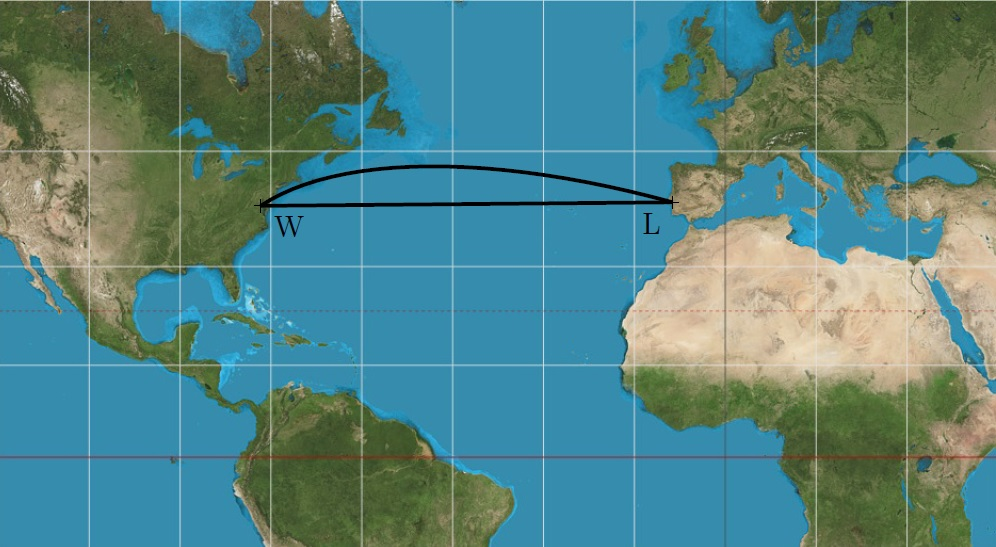

---
keywords:
- geometrie v prostoru
- stereometrie
- planimetrie
- kružnice
- zeměpis
is_finished: true
difficulty: 2
time: 25
---
# Vzdálenosti na zemském povrchu

Která z cest mezi Lisabonem a Washingtonem znázorněných na mapě je kratší? 

Zdánlivě jednoduchý dotaz má, jak si ověříte v této úloze, 
překvapivou odpověď. Kratší trasa je oblouk, delší je úsečka. Důvodem 
je zkreslení vzdáleností ve zvoleném zobrazení zemského povrchu. 
Vidíme, že úsečka $LW$ na mapě je přibližně rovnoběžná s 
geografickými rovnoběžkami na Zemi, tedy ve skutečnosti odpovídá 
oblouku na kružnici, která se velmi podobá rovnoběžce (viz 
kružnice $k$ se středem $O$ na obrázku). 

Na kulovém povrchu (který budeme v této úloze považovat za povrch Země) je však nejkratší vzdálenost jiný oblouk. 
Tento oblouk leží na kružnici $h$, jejíž střed $C$ je středem Země. 
Takové spojnice označujeme jako *ortodromy* a všechny kružnice s uvedenou vlastností nazýváme *hlavními kružnicemi*. 
O kolik kilometrů si však cestou po ortodromě polepšíme? Odpověď na tuto otázku je již potřeba spočítat.

### Slovníček 
* *Zeměpisná šířka* místa na zemském povrchu (vyjádřená ve 
stupních a orientaci sever/jih) je odchylka přímky, která 
prochází daným místem a středem Země, od roviny rovníku.
* *Zeměpisná délka* místa na zemském povrchu (vyjádřená ve 
stupních a orientaci východ/západ) je odchylka roviny poledníku, 
který prochází daným místem, od roviny nultého poledníku.

> **Úloha.** Lisabon i Washington se nachází přibližně na stejné 
> rovnoběžce (asi $39^{\circ}$ severní šířky). O kolik kilometrů 
> méně uletí letadlo pohybující se po ortodromě oproti cestě po 
> rovnoběžce? Lisabon se nachází na přibližně $9^{\circ}$ 
> západní délky, Washington na $77^{\circ}$ západní délky.
Předpokládejme, že je Země koulí se středem $C$ a 
poloměrem $6\ 371\,\text{km}$ a že letadlo letí v průměrné výšce 
$10\,\text{km}$ (vzlet a přistání brát do úvahy nebudeme). Proto 
budeme ve všech úvahách pracovat s koulí o poloměru 
$\varrho=6\ 381\,\text{km}$. 

\iffalse

*Řešení.* Určeme nejdříve, kolik kilometrů 
urazí letadlo při cestě po rovnoběžce. Označme rovnoběžku 
na $39^{\circ}$ severní šířky jako kružnici $k$ se středem $O$ a 
poloměrem $r$. Ve vhodném pravoúhlém průmětu zeměkoule (viz 
obrázek, kde $S$ a $J$ jsou póly) se řečená kružnice zobrazí 
jako úsečka $AB$ se středem $O$. 

Z obrázku je zřejmá rovnost $\lvert\sphericalangle CBO\rvert = \lvert\sphericalangle BCD\rvert$ 
(úhly jsou střídavé) a užitím funkce kosinus v pravoúhlém trojúhelníku $BSO$ dostáváme $r=\varrho\cdot \cos 39^{\circ}$.

Dráhu letadla pohybujícího se po rovnoběžce (v obrázku níže je 
trajektorie letadla znázorněná kratším obloukem $LW$) určíme 
přímou úměrou. Celá kružnice $k$ má délku 
$2\pi r =2\pi\varrho\cdot\cos 39^{\circ} \,\text{km}$, tedy 
délka kratšího oblouku $LW$ je rovna
$$
\frac{(77-9)}{360}\cdot 2\pi\varrho\cdot \cos 39^{\circ} \doteq 5\ 885{,}4\,\text{km}.
$$

Nyní zjistíme, kolik kilometrů uletí letadlo pohybující se po ortodromě. Jedná se vlastně o vzdálenost dvou bodů na pomyslné sféře o poloměru $\varrho=6\ 381\,\text{km}$. Na obrázku lze vidět, že ortodroma mezi body $L$ a 
$W$ je obloukem jisté hlavní kružnice $h$ s neznámým středovým úhlem $\varphi$. Tento úhel musíme určit.

Uvažme rovnoramenný trojúhelník $OWL$, který rozpůlíme výškou na 
základnu $LW$ na dva shodné pravoúhlé trojúhelníky. V libovolném 
z těchto dvou trojúhelníků pak platí 
$\frac{|LW|}{2}=r\cdot \sin 34^{\circ}$, a tedy 
$|LW|=2r\cdot\sin 34^{\circ}$. Pokud provedeme podobnou  úvahu 
pro rovnoramenný trojúhelník $CWL$, dostáváme rovnost 
$|LW|=2\varrho \cdot \sin\frac{\varphi}{2}$. Porovnáním pravých 
stran obou odvozených rovností vypočítáme hledaný úhel $\varphi$:

$$
2r\sin34^{\circ} = 2\varrho \sin\frac{\varphi}{2}
$$

$$
\sin\frac{\varphi}{2} = \frac{r\sin34^{\circ}}{\varrho}
= \frac{\varrho \cos39^{\circ}\sin 34^{\circ}}{\varrho} = \cos 39^{\circ}\sin 34^{\circ}
$$

$$
\frac{\varphi}{2}= \arcsin \left( \cos 39^{\circ}\sin 34^{\circ} \right) \doteq 25^{\circ}45' \quad \Rightarrow \quad \varphi \doteq 51^{\circ}30'.
$$

Dráhu letadla pohybujícího se po ortodromě určíme podobně jako v 
případě rovnoběžky přímou úměrou. Délka celé kružnice $h$ je rovna $2\pi\varrho$, pro délku kratšího oblouku $LW$ pak platí

$$
\frac{51{,}5}{360}\cdot 2\pi\varrho \doteq 5\ 735{,}5 \,\text{km}.
$$

Vidíme, že se obě dráhy liší přibližně o $150 \,\text{km}$.

\fi

## Literatura
* Novák V., Murdych Z. *Kartografie a topografie.* Praha: Státní pedagogické nakladatelství. (1988)
* Hradecký F., Koman M., Vyšín J. *Několik úloh z geometrie jednoduchých těles.* Praha: Škola mladých matematiků. (1977). 36--38.

## Zdroje obrázků
* Mercator projection. Strebe – Vlastní dílo, CC BY-SA 4.0, dostupné z <https://commons.wikimedia.org/wiki/File:Mercator_projection_Square.JPG> [cit. 14. 8. 2023]
