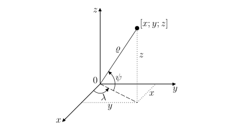

# Vzdálenosti na zemském povrchu

Která z cest mezi Lisabonem a Washingtonem znázorněných na mapě je kratší? 

Zdánlivě jednoduchý dotaz má, jak si ověříte v této úloze, 
překvapivou odpověď. Kratší trasa je oblouk, delší je úsečka. Důvodem 
je zkreslení vzdáleností ve zvoleném zobrazení zemského povrchu. 
Vidíme, že úsečka $LW$ na mapě je přibližně rovnoběžná s 
geografickými rovnoběžkami na Zemi, tedy ve skutečnosti odpovídá 
oblouku na kružnici, která se velmi podobá rovnoběžce (viz 
kružnice $k$ se středem $O$ na obrázku). 

Na kulovém povrchu (který budeme v této úloze považovat za povrch Země) je však nejkratší vzdálenost jiný oblouk. 
Tento oblouk leží na kružnici $h$, jejíž střed $C$ je středem Země. 
Takové spojnice označujeme jako *ortodromy* a všechny kružnice s uvedenou vlastností nazýváme *hlavními kružnicemi*. 
O kolik kilometrů si však cestou po ortodromě polepšíme? Odpověď na tuto otázku je již potřeba spočítat.

### Slovníček 
* *Zeměpisná šířka* místa na zemském povrchu (vyjádřená ve 
stupních a orientaci sever/jih) je odchylka přímky, která 
prochází daným místem a středem Země, od roviny rovníku. Zeměpisnou šířku budeme označovat písmenem $\psi$, kde $\psi$ může nabývat hodnot od $-90^{\circ}$ (jižní pól) do $+90^{\circ}$ (severní pól). Záporné hodnoty odpovídají místům na jižní polokouli, zatímco kladné hodnoty místům na severní polokouli. 
* *Zeměpisná délka* místa na zemském povrchu (vyjádřená ve 
stupních a orientaci východ/západ) je odchylka roviny poledníku, 
který prochází daným místem, od roviny nultého poledníku. Zeměpisnou délku budeme označovat písmenem $\lambda$, kde $\lambda$ může nabývat hodnot od $-180^{\circ}$ do $+180^{\circ}$. Záporné hodnoty odpovídají místům na západní polokouli a kladné hodnoty místům na východní polokouli. 

> **Úloha 1.** Lisabon i Washington se nachází přibližně na stejné 
> rovnoběžce (asi $39^{\circ}$ severní šířky). O kolik kilometrů 
> méně uletí letadlo pohybující se po ortodromě oproti cestě po 
> rovnoběžce? Lisabon se nachází na přibližně $9^{\circ}$ 
> západní délky, Washington na $77^{\circ}$ západní délky.
Předpokládejme, že je Země koulí se středem $C$ a 
poloměrem $6\ 371\,\text{km}$ a že letadlo letí v průměrné výšce 
$10\,\text{km}$ (vzlet a přistání brát do úvahy nebudeme). Proto 
budeme ve všech úvahách pracovat s koulí o poloměru 
$\varrho=6\ 381\,\text{km}$. 

\iffalse

*Řešení.* Určeme nejdříve, kolik kilometrů 
urazí letadlo při cestě po rovnoběžce. Označme rovnoběžku 
na $39^{\circ}$ severní šířky jako kružnici $k$ se středem $O$ a 
poloměrem $r$. Ve vhodném pravoúhlém průmětu zeměkoule (viz 
obrázek, kde $S$ a $J$ jsou póly) se řečená kružnice zobrazí 
jako úsečka $AB$ se středem $O$. 

Z obrázku je zřejmá rovnost $\lvert\sphericalangle CBO\rvert = \lvert\sphericalangle BCD\rvert = 39^{\circ}$ 
(úhly jsou střídavé) a užitím funkce kosinus v pravoúhlém trojúhelníku $BCO$ dostáváme $r=\varrho\cdot \cos 39^{\circ}$.

Dráhu letadla pohybujícího se po rovnoběžce (v obrázku níže je 
trajektorie letadla znázorněná kratším obloukem $LW$) určíme 
přímou úměrou. Celá kružnice $k$ má délku 
$2\pi r =2\pi\varrho\cdot\cos 39^{\circ} \,\text{km}$, tedy 
délka kratšího oblouku $LW$ je rovna
$$
\frac{(77-9)}{360}\cdot 2\pi\varrho\cdot \cos 39^{\circ} \doteq 5\ 885{,}4\,\text{km}.
$$

Nyní zjistíme, kolik kilometrů uletí letadlo pohybující se po ortodromě. Jedná se vlastně o vzdálenost dvou bodů na pomyslné sféře o poloměru $\varrho=6\ 381\,\text{km}$. Na obrázku lze vidět, že ortodroma mezi body $L$ a 
$W$ je obloukem jisté hlavní kružnice $h$ s neznámým středovým úhlem $\varphi$. Tento úhel musíme určit.

Uvažme rovnoramenný trojúhelník $OWL$, který rozpůlíme výškou na 
základnu $LW$ na dva shodné pravoúhlé trojúhelníky. V libovolném 
z těchto dvou trojúhelníků pak platí 
$\frac{|LW|}{2}=r\cdot \sin 34^{\circ}$, a tedy 
$|LW|=2r\cdot\sin 34^{\circ}$. Pokud provedeme podobnou  úvahu 
pro rovnoramenný trojúhelník $CWL$, dostáváme rovnost 
$|LW|=2\varrho \cdot \sin\frac{\varphi}{2}$. Porovnáním pravých 
stran obou odvozených rovností vypočítáme hledaný úhel $\varphi$:

$$
2r\sin34^{\circ} = 2\varrho \sin\frac{\varphi}{2}
$$

$$
\tag{1}
\sin\frac{\varphi}{2} = \frac{r\sin34^{\circ}}{\varrho}
= \frac{\varrho \cos39^{\circ}\sin 34^{\circ}}{\varrho} = \cos 39^{\circ}\sin 34^{\circ} \doteq 0{,}43457
$$

$$
\frac{\varphi}{2} 
%=\frac{180}{\pi} \cdot \arcsin \left( %\cos 39^{\circ}\sin 34^{\circ} \right) 
\doteq 25^{\circ}45' 30''\quad \Rightarrow \quad \varphi \doteq 51^{\circ}31'.
$$

Dráhu letadla pohybujícího se po ortodromě určíme podobně jako v 
případě rovnoběžky přímou úměrou. Délka celé kružnice $h$ je rovna $2\pi\varrho$, pro délku kratšího oblouku $LW$ pak platí

$$
\frac{51{,}5}{360}\cdot 2\pi\varrho \doteq 5\ 735{,}5 \,\text{km}.
$$

Vidíme, že se obě dráhy liší přibližně o $150 \,\text{km}$.

\fi

>**Úloha 2.**
Pokuste se zobecnit výše uvedený postup a odvodit obecný vzorec pro nejkratší vzdálenost dvou míst na Zemi, pokud $\varrho$ je zemský poloměr, $\psi$ je zeměpisná šířka obou míst (místa leží na stejné rovnoběžce) a $\lambda_1$, $\lambda_2$ jsou zeměpisné délky jednotlivých míst.  

\iffalse

*Řešení.* Úplně stejným postupem jako  v úloze 1 bychom došli ke vztahu 

$$
 \sin \frac{\varphi}{2} = \cos \psi \sin \frac{|\lambda_1-\lambda_2|}{2}, 
$$

který je zobecněním vztahu $(1)$. Spočítat nejkratší vzdálenost je už snadné. Pokud máme úhel $\varphi$ vyjádřený v radiánech, pak pro nejkratší vzdálenost $d$ platí vztah 

$$
 d = \varrho \varphi. 
$$

V případě, že úhel $\varphi$ máme vyjádřen ve stupních, pak 

$$
 d = \frac{\varphi}{360} \cdot 2\pi\varrho. 
$$

\fi

Jinou technikou bychom mohli odvodit ještě obecnější výsledek. Toto odvození by vyžadovalo jisté znalosti analytické geometrie v prostoru, zejména odchylky dvou vektorů. 

**Obecný vzorec pro nejkratší vzdálenost.**
Předpokládejme, že Země je koule s poloměrem $\varrho$ a uvažujme dvě místa na Zemi. První místo má zeměpisnou šířku $\psi_1$ a zeměpisnou délku $\lambda_1$, zatímco druhé má zeměpisnou šířku $\psi_2$ a zeměpisnou délku $\lambda_2$. Pak lze nejkratší vzdálenost $d$ těchto dvou míst vypočítat podle vzorce  

$$
\tag{2}
 d = \varrho \varphi, 
$$

kde $\varphi$ je úhel (v radiánech)  splňující podmínku 

$$
\tag{3}
 \sin^2 \frac{\varphi}{2} = \sin^2 \frac{\Delta\psi}{2} + \cos \psi_1 \cos \psi_2 \cdot \sin^2 \frac{\Delta\lambda}{2}  
$$

a 
$\Delta\psi = |\psi_1-\psi_2|$, 
$\Delta\lambda = |\lambda_1-\lambda_2|$ jsou rozdíly zeměpisných šířek a délek obou míst. 

**Poznámka 1.**
Vzorec pro nejkratší vzdálenost bychom (vzhledem k $(2)$ a $(3)$) mohli také psát ve tvaru 

$$
\tag{4}
 d = 2\varrho \cdot \arcsin \left( 
 \sqrt{
 \sin^2 \frac{\Delta\psi}{2} + \cos \psi_1 \cos \psi_2 \cdot \sin^2 \frac{\Delta\lambda}{2}
 }
 \right). 
$$

**Poznámka 2.**
Všimněme si, že v případě dvou míst se stejnou zeměpisnou šířkou $\psi_1=\psi_2=\psi$ máme $\Delta \psi = 0$, což znamená, že vztah $(3)$ lze zapsat ve tvaru 

$$
 \sin^2 \frac{\varphi}{2} = \cos^2 \psi \sin^2 \frac{\Delta\lambda}{2}, 
$$

tj. 

$$
 \sin \frac{\varphi}{2} = \cos \psi \sin \frac{\Delta\lambda}{2}. 
$$

Srovnejte poslední rovnost se vztahem $(1)$. 

\iffalse

**Vysvětlení vztahu (4).**
Uvažujme standardní pravoúhlou soustavu souřadnic v třírozměrném prostoru s počátkem ve středu Země umístěnou tak, že osa $x$ je průsečnicí rovníkové roviny a roviny nultého poledníku, osa $y$ leží v rovníkové rovině a je kolmá k ose $x$ a osa $z$ prochází oběma zemskými póly (tzn. prochází středem Země a je kolmá na osu $x$ i $y$). Pokud má nějaké místo na zemi zeměpisnou šířku $\psi$ a zeměpisnou délku $\lambda$, pak jsou jeho souřadnice 

$$
\tag{5}
\begin{aligned}
x &= \varrho \cos\psi \cos\lambda, \\
y &= \varrho \cos\psi \sin\lambda, \\
z &= \varrho \sin\psi, 
\end{aligned}
$$

kde $\varrho$ je poloměr Země. Vztahy $(5)$ lze odvodit na základě znalosti goniometrických funkcí a obrázku 6 níže. 

Uvažujme nyní dvě místa $A$ a $B$ na zemském povrchu. Jedno se zeměpisnou šířkou $\psi_1$ a zeměpisnou délkou $\lambda_1$ a druhé se zeměpisnou šířkou $\psi_2$ a zeměpisnou délkou $\lambda_2$. Střed Země si označme jako $C$ (počátek soustavy souřadnic). Nyní nás zajímá velikost úhlu $\varphi$, který svírají vektory $\overrightarrow{CA}$ a $\overrightarrow{CB}$. Vzhledem ke vztahům $(5)$ dostaneme 

$$
\begin{gathered}
\cos\varphi = \frac{\overrightarrow{CA} \cdot \overrightarrow{CB}}{\left|\overrightarrow{CA}\right| \cdot \left|\overrightarrow{CB}\right|}= \\
=\cos\psi_1 \cos\lambda_1 \cos\psi_2 \cos\lambda_2 + 
\cos\psi_1 \sin\lambda_1 \cos\psi_2 \sin\lambda_2 + 
\sin\psi_1 \sin\psi_2= \\
=\cos\psi_1 \cos\psi_2 \cdot \left(
\cos\lambda_1 \cos\lambda_2 + \sin\lambda_1 \sin\lambda_2 \right) + 
\sin\psi_1 \sin\psi_2
= \\
=\cos\psi_1 \cos\psi_2 \cdot \cos (\lambda_1-\lambda_2) + 
\sin\psi_1 \sin\psi_2 = \\
=\cos\psi_1 \cos\psi_2 \cdot \cos \Delta\lambda + 
\sin\psi_1 \sin\psi_2. 
\end{gathered}
$$

Proto platí (použijeme vzorec pro sinus polovičního úhlu) 

$$
\begin{gathered}
2 \sin^2 \frac{\varphi}{2} = 1-\cos\varphi = 1 - \cos\psi_1 \cos\psi_2 \cdot \cos \Delta\lambda - \sin\psi_1 \sin\psi_2= \\
=1 - \cos\psi_1 \cos\psi_2 - \sin\psi_1 \sin\psi_2 + \cos\psi_1 \cos\psi_2 - \cos\psi_1 \cos\psi_2 \cdot \cos \Delta\lambda = \\
=(1-\cos\Delta\psi) + \cos\psi_1 \cos\psi_2 \cdot (1-\cos\Delta\lambda) =2 \sin^2 \frac{\Delta\psi}{2} + \cos\psi_1 \cos\psi_2 \cdot 2 \sin^2 \frac{\Delta\lambda}{2}. 
\end{gathered}
$$

Odtud po vydělení číslem $2$ dostaneme vztah $(3)$. Vztahy $(2)$ a následně $(4)$ jsou potom již jasné. 

\fi

## Literatura
* Novák V., Murdych Z. *Kartografie a topografie.* Praha: Státní pedagogické nakladatelství. (1988)
* Hradecký F., Koman M., Vyšín J. *Několik úloh z geometrie jednoduchých těles.* Praha: Škola mladých matematiků. (1977). 36--38.

## Odkazy
* Ortodroma - https://cs.wikipedia.org/wiki/Ortodroma
* Matematické metody v kartografii - https://web.natur.cuni.cz/~bayertom/images/courses/mmk/mk2.pdf

## Zdroje obrázků
* Mercator projection. Strebe – Vlastní dílo, CC BY-SA 4.0, dostupné z <https://commons.wikimedia.org/wiki/File:Mercator_projection_Square.JPG> [cit. 14. 8. 2023]
