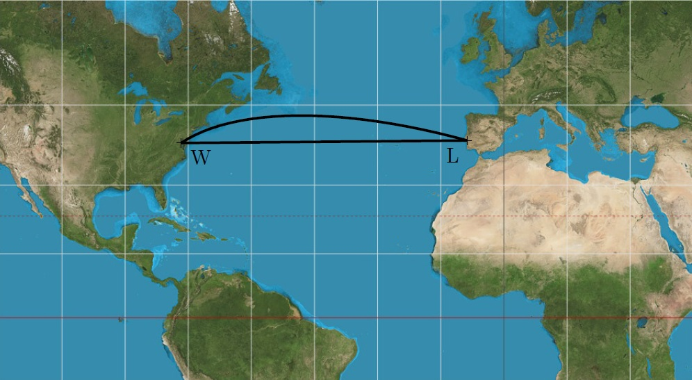
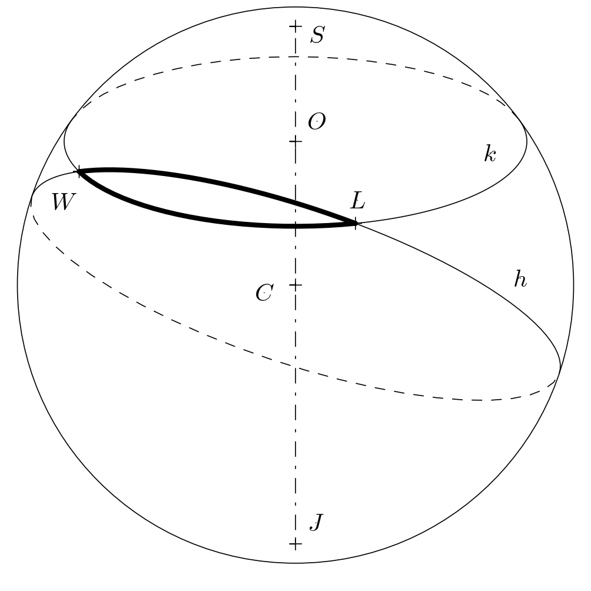
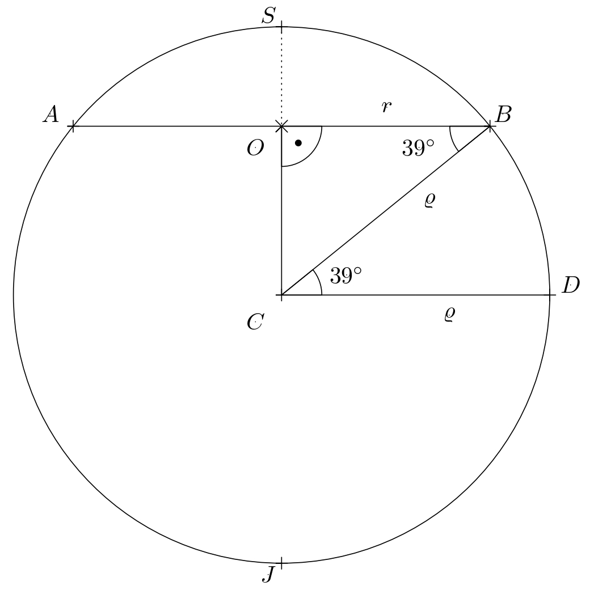
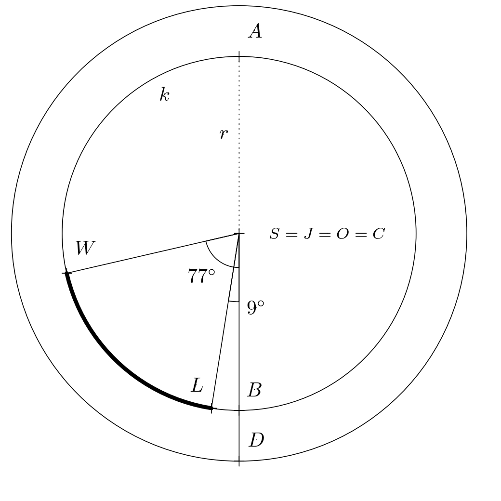
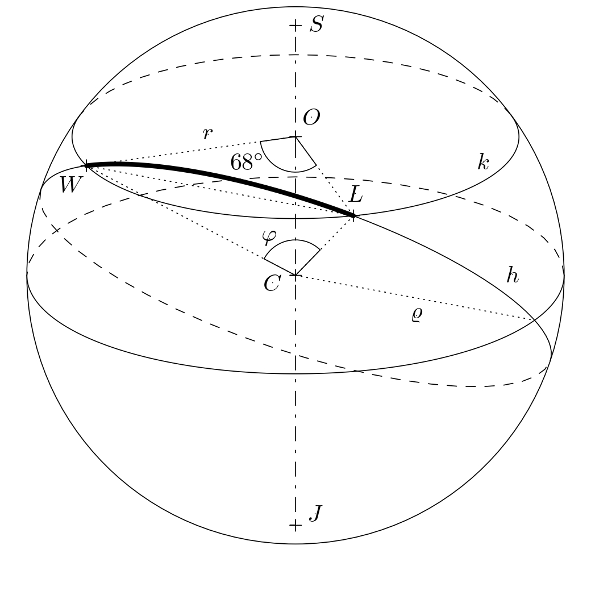

# Vzdialenosti na zemskom povrchu

Ktorá z trás medzi Lisabonom a Washingtonom zobrazených na mape je kratšia? 

V tejto úlohe uvidíte, že táto zdanlivo jednoduchá otázka má prekvapujúcu odpoveď. Kratšia trasa je oblúk a dlhšia je úsečka. 
Dôvodom je skreslenie vzdialeností vo zvolenom zobrazení zemského povrchu.
Vidíme, že úsečka $LW$ na mape je približne rovnobežná s geografickými rovnobežkami na Zemi. V skutočnosti teda zodpovedá oblúku na kružnici a veľmi sa podobá rovnobežke
(pozri kružnicu $k$ so stredom $O$ na obrázku).

Avšak na guľovom povrchu (ktorý v tejto úlohe budeme považovať za zemský povrch) je najkratšou vzdialenosťou iný oblúk. Tento oblúk je časťou kružnice $h$, ktorej stred $C$ je stredom Zeme. Takéto trasy nazývame orthodrómy a všetky kružnice s touto vlastnosťou označujeme ako *hlavné kružnice*.
Koľko kilometrov ušetríme, ak budeme cestovať po orthodróme?
Odpoveď na túto otázku je potrebné vypočítať.

### Slovníček 
* *Zemepisná šírka* miesta na zemskom povrchu (vyjadrená v stupňoch a orientácii sever/juh) je odchýlka priamky, ktorá prechádza daným miestom a stredom Zeme, od roviny rovníka.
* *Zemepisná dĺžka* miesta na zemskom povrchu (vyjadrená v stupňoch a orientácii východ/západ) je odchýlka roviny poludníka, ktorý prechádza daným miestom, od roviny nultého poludníka.

> **Úloha.** Lisabon a Washington sa nachádzajú približne na rovnakej rovnobežke (približne $39^{\circ}$ severnej zemepisnej šírky).
Koľko kilometrov ušetrí lietadlo, ak poletí po orthodrómickej dráhe v porovnaní s letom po rovnobežke?
Lisabon sa nachádza približne na $9^{\circ}$ západnej zemepisnej dĺžky.
Washington sa nachádza na $77^{\circ}$ západnej zemepisnej dĺžky.
Predpokladajme, že Zem je guľa so stredom $C$ a polomerom $6\ 371\,\text{km}$ a že lietadlo letí v priemernej výške $10\,\text{km}$ (vzlet a pristátie neuvažujeme).
Vo všetkých úvahách teda budeme pracovať s guľou o polomere $\varrho=6\ 381\,\text{km}$.

\iffalse

*Riešenie.* Najskôr určíme, koľko kilometrov preletí lietadlo pri ceste po rovnobežke. Označme rovnobežku na $39^{\circ}$ severnej šírky ako kružnicu $k$ so stredom $O$ a polomerom $r$. Vo vhodnom pravouhlom prieniku zemegule (pozri obrázok, kde $S$ a $J$ sú póly) sa uvedená kružnica zobrazí ako úsečka $AB$ so stredom $O$.

Z obrázku je zrejmá rovnosť $\lvert\sphericalangle CBO\rvert = \lvert\sphericalangle BCD\rvert$ 
(uhly sú striedavé) a využitím funkcie kosínus v pravouhlom trojuholníku $BSO$ dostávame $r=\varrho\cdot \cos 39^{\circ}$.

Trajektória lietadla pohybujúceho sa po rovnobežke (na obrázku nižšie je trajektória lietadla znázornená kratším oblúkom $LW$)
sa určí pomocou priamej úmernosti: celá kružnica $k$ má dĺžku
$2\pi r = 2\pi\varrho\cdot\cos 39^{\circ}\text{km}$,
čiže dĺžka kratšieho oblúka $LW$ sa rovná
$$
\frac{(77-9)}{360}\cdot 2\pi\varrho\cdot \cos 39^{\circ} \doteq 5\ 885{,}4\,\text{km}.
$$

Teraz určme, koľko kilometrov lietadlo preletí po ortodrome.
Ide v podstate o vzdialenosť medzi dvoma bodmi na pomyselnej guli s polomerom $\varrho=6\ 381\,\text{km}$.
Obrázok ukazuje, že ortodroma medzi bodmi $L$ a $W$ je istý oblúk hlavnej kružnice $h$ s neznámym stredovým uhlom $\varphi$.
Potrebujeme určiť veľkosť tohto uhla.

Uvažme rovnoramenný trojuholník $OWL$, ktorý rozdelíme výškou na 
základnu $LW$ na dva zhodné pravouhlé trojuholníky. V ľubovoľnom 
z týchto dvoch trojuholníkov platí 
$\frac{|LW|}{2}=r\cdot \sin 34^{\circ}$, a preto 
$|LW|=2r\cdot\sin 34^{\circ}$. Ak budeme uvažovať podobne pre rovnoramenný trojuholník $CWL$, dostaneme rovnosť 
$|LW|=2\varrho \cdot \sin\frac{\varphi}{2}$. Porovnáním pravých 
strán oboch odvodených rovností vypočítáme hľadaný uhol $\varphi$:

$$
2r\sin34^{\circ} = 2\varrho \sin\frac{\varphi}{2}
$$

$$
\sin\frac{\varphi}{2} = \frac{r\sin34^{\circ}}{\varrho}
= \frac{\varrho \cos39^{\circ}\sin 34^{\circ}}{\varrho} = \cos 39^{\circ}\sin 34^{\circ}
$$

$$
\frac{\varphi}{2}= \arcsin \left( \cos 39^{\circ}\sin 34^{\circ} \right) \doteq 25^{\circ}45' \quad \Rightarrow \quad \varphi \doteq 51^{\circ}30'.
$$

Dráhu lietadla pohybujúceho sa po ortodrome určujeme podobne ako v prípade rovnobežky, teda priamou úmerou. Dĺžka celej kružnice $h$ je rovná $2\pi\varrho$. Pre dĺžku kratšieho oblúka $LW$ potom platí

$$
\frac{51{,}5}{360}\cdot 2\pi\varrho \doteq 5\ 735{,}5 \,\text{km}.
$$

Vidíme, že sa dráhy lišia približne o $150 \,\text{km}$.

\fi

## Literatúra
* Novák V., Murdych Z. *Kartografie a topografie.* Praha: Státní pedagogické nakladatelství. (1988)
* Hradecký F., Koman M., Vyšín J. *Několik úloh z geometrie jednoduchých těles.* Praha: Škola mladých matematiků. (1977). 36--38.

## Zdroje obrázkov
* Mercator projection. Strebe – Vlastní dílo, CC BY-SA 4.0, dostupné z <https://commons.wikimedia.org/wiki/File:Mercator_projection_Square.JPG> [cit. 14. 8. 2023]
