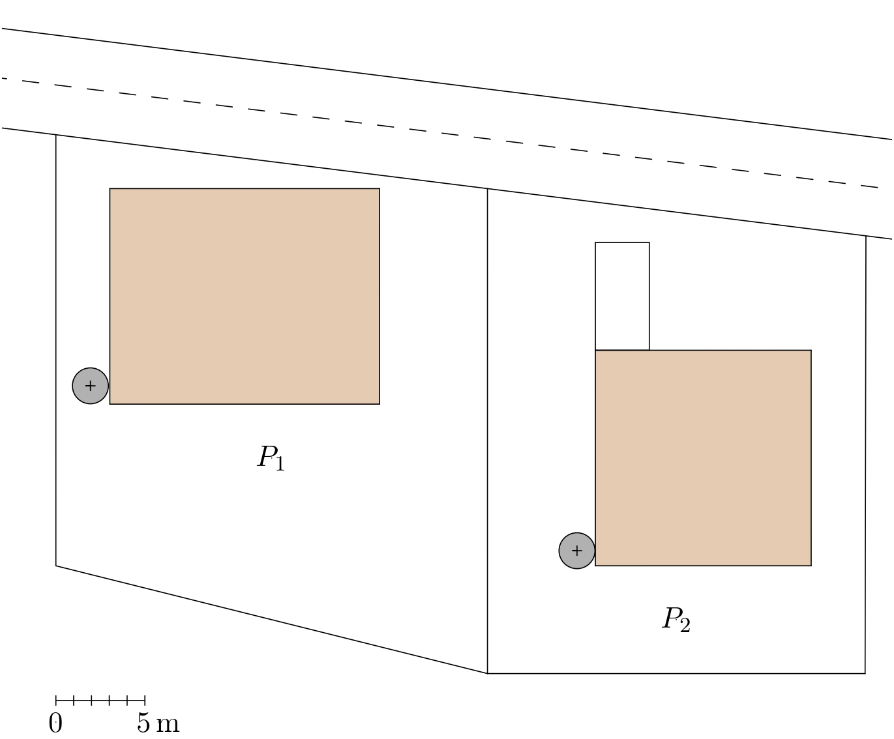
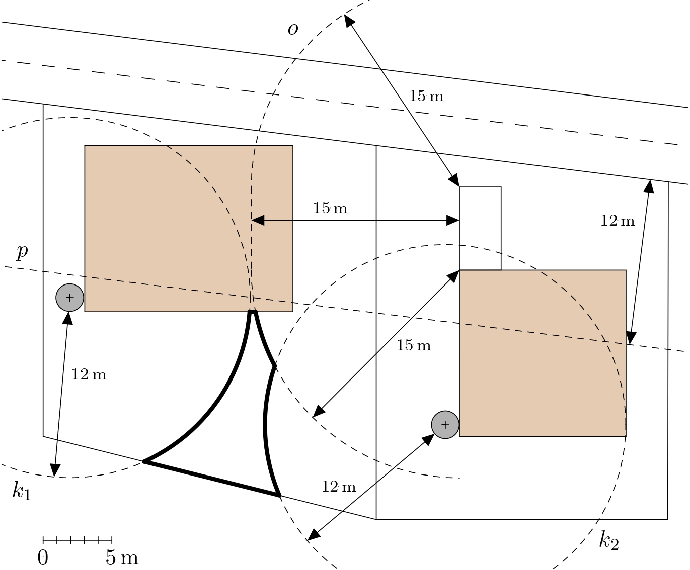

---
keywords:
- planimetrie
- množiny bodů daných vlastností
is_finished: True
difficulty: 1
time: 20
---

# Vymezení místa pro studnu

Chceme-li na pozemku mít studnu, musíme dobře zvážit její umístění,
abychom dodrželi dostatečný odstup studny od zdrojů možného
znečištění.

Tyto vzdálenosti jsou různé podle druhu možného znečištění. Řekněme, že
pro málo prostupné prostředí jsou dány následovně:

1. žumpy, malé čistírny, kanalizační přípojky: $12 \text{ m}$;
2. nádrže tekutých paliv pro individuální vytápění umístěné v obytné
   budově nebo samostatné pomocné budově: $7 \text{ m}$;
3. chlévy, močůvkové jímky a hnojiště při drobném ustájení
   jednotlivých kusů hospodářských zvířat: $10 \text{ m}$;
4. veřejné pozemní komunikace: $12 \text{ m}$;
5. individuální umývací plochy motorových vozidel a od nich vedoucí
   odtokové potrubí a strouhy: $15 \text{ m}$.

> **Úloha.** Na pozemku $P_1$ (znázorněném na plánu na obrázku) je třeba postavit studnu.
> Z plánu je vidět, kde je na pozemku $P_1$ umístěn dům (obdélník) a
> žumpa (kruh), a kde se na sousedním pozemku $P_2$ nachází dům
> (čtverec), žumpa (kruh) a prostor na mytí aut (obdélník). Rovněž je
> na plánu vidět silnice vedoucí kolem obou pozemků. Vyznačte v plánu
> prostor, do kterého je možné studnu dle pravidel umístit.
>
> 

\iffalse

*Řešení.* Vyznačíme do plánu oblasti, kde studna být nesmí. 

Protože od žumpy musí být studna minimálně 12 m vzdálená, v plánu bude
tato zakázaná oblast zobrazena jako kruh soustředný s vyznačeným
kruhem a poloměrem o 12 m větším. Hranice zakázaných oblastí pro obě
žumpy reprezentují na obrázku kružnice $k_1$ a $k_2$.

Zakázanou oblastí vztahující se k silnici je na plánu pás, jehož
hranici tvoří kraj silnice přiléhající k pozemkům a přímka s ním
rovnoběžná ve vzdálenosti 12 m (na obrázku je to přímka $p$).

Konečně sestrojíme hranici zakázané oblasti vztahující se k mycí ploše
pro auto. Tou je v plánu ovál $o$, který se skládá ze čtyř úseček,
rovnoběžných se stranami obdélníku a od nich vzdálených o 15 m, a čtyř
kružnic se středy ve vrcholech obdélníku a poloměrem 15 m. V obrázku
je vyznačena relevantní část tohoto oválu.

Nyní je možné vymezit prostor vhodný k vyhloubení studny. Jedná se o
tu venkovní část pozemku $P_1$, která neleží v ani jedné ze zakázaných
oblastí. Její hranice je v obrázku vyznačena tlustou čarou.

\fi
