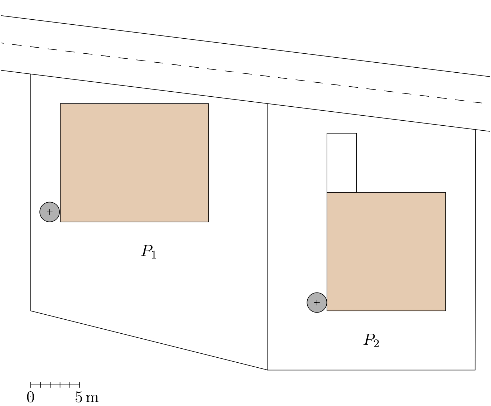

---
keywords:
- planimetry
- set of points that share a property
is_finished: False
---

# Locating a Well on the Property 
<!-- V nadpisech/názvech by měla být slova s velkými písmeny.  Formulace názvu mi přišla méně šikovná s chybným členem u studny, tak navrhuji trochu pozměnit. -->
If we want to have a well on our property, we must carefully consider
its placement to maintain a sufficient distance  from potential sources of possible contamination.
<!-- Určitě na tomto místě doporučuji nahradit "pollution" slovem "contamination". Slova mají velmi podobný význam, ale v kontextu tohot textu, zcela jistě patří použít "contamination". -->

These required distances vary according to the type of potential contamination. Let's say that for less permeable environments, the required distances are given as follows:

1. cesspools, small sewage treatment plants, sewage connections: $12 \text{ m}$;
2. liquid fuel tanks for individual heating located in a residential building or a separate auxiliary building: $7 \text{ m}$;
3. stables, urine pits and manure pits for the small-scale housing of individual livestock: $10 \text{ m}$;
4. public roadways: $12 \text{ m}$;
5. individual washing areas for motor vehicles and drain pipes and ditches leading from them: $15 \text{ m}$.

> **Exercise.** A well needs to be built on the plot $P_1$ (shown on the plan in the figure).
> The plan shows where a house (rectangle) and a cesspool (circle) are
> located on the plot $P_1$, and where a house (square), a cesspool
> (circle) and a car wash area (rectangle) are located on the
> neighboring plot $P_2$.  The plan also shows the road passing by  
both plots. Mark on the plan the area where the well can
 be placed according to the rules.
>
> 

*Solution.* We mark on the plan the areas where the well must not be placed. 

Since the well must be at least 12 m away from a cesspool, this
prohibited area on the plan will be shown as a circle centered on 
a marked circle with  radius 12 m larger. The boundaries of the
prohibited areas for both cesspools are represented by circles $k_1$
and $k_2$ in the figure.

The prohibited area related to the road on the plan is the strip
bounded by the edge of the road adjacent to the plots $P_1$ and $P_2$ and a line
parallel to it at the distance of 12 m (in the figure, it is the line
$p$).

Finally, we construct the border of the forbidden area related to the
car wash area.  The border has shape of an oval denoted $o$ in the plan. This oval consists of four line segments, parallel to the sides of the rectangle in distance of 15 m and parts of four circles with centers at the vertices of the rectangle with a radius of 15 m.   Only the relevant part of this oval is
marked in the figure.
Now, it is possible to define the area suitable for digging a well. It
is the part in the plot $P_1$, which is the outer part in the sense that it does not lie in any of the
prohibited areas. Its border is marked with a bold line in the figure.
<!-- Formulace v posledním odstavci není anglicky špatně, ale významově neodpovídá.  Tj. výraz "outer part of the plot $P_1$" nedává myslím správný smysl.  To by znamenalo, že oblast je úplně mimo pozemek P1, což být nemůže, když studna má být na pozemku.
Proto jsem formulaci upravila.-->

