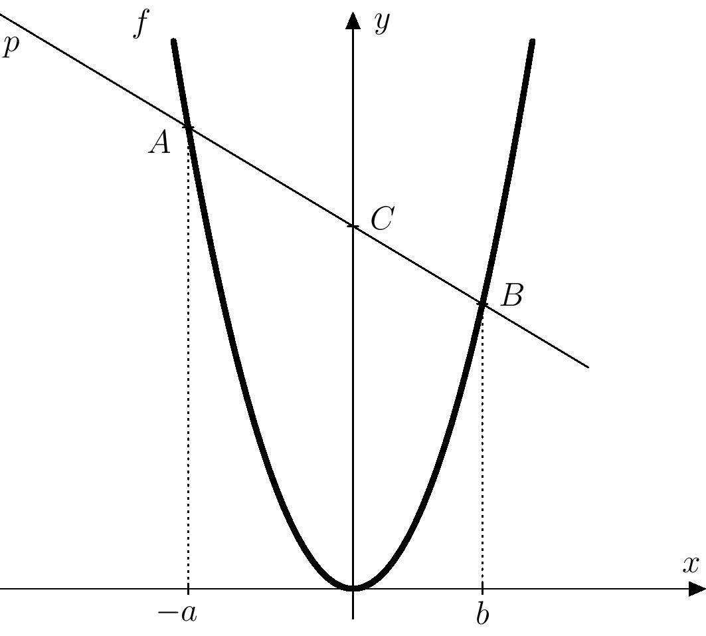

# Parabolická kalkulačka

Eva našla při surfování na internetu jednu zajímavost týkající se grafu funkce
$f(x) = x^2$, který může posloužit jako kalkulačka k vynásobení dvou čísel
$a$ a $b$.[^1] Postup je následující:

 1. Na ose $x$ se vyznačí obrazy čísel $-a$ a $b$.
 2. V těchto bodech se vztyčí kolmice k ose $x$ a sestrojí se jejich průsečíky s grafem funkce $f$.
 3. Přímka procházející právě sestrojenými průsečíky protne osu $y$ v bodě,
    jehož $y$-ová souřadnice je rovna součinu $ab$.

Uvedený postup si můžete vyzkoušet v přiloženém pracovním listu, jeho
ilustrace je možná také v GeoGebře. Interaktivní applet najdete na
stránkách <https://www.geogebra.org/m/sj5cjbaf>.

> **Úloha.** Funguje výše uvedený postup pro všechny dvojice čísel $a$ a $b$, nebo jen pro
> některé? Dokažte. 

\iffalse

*Řešení.* Z postupu je patrné, že jestliže obrazy čísel $-a$ a $b$ splynou,
přímku popisovanou ve třetím bodě nebude možné jednoznačně sestrojit. Uvedený
postup proto nebude fungovat, bude-li platit $-a=b$. Ukážeme, že kromě tohoto
případu uvedený postup funguje pro všechny ostatní dvojice čísel $a$ a $b$.

Sestrojme na ose $x$ dle postupu ze zadání obrazy čísel $-a$ a $b$ a dále vztyčme
v těchto bodech kolmice k ose $x$. Průsečíky těchto kolmic s parabolou $y=x^2$ označme
$A$ a $B$, přímku $AB$ pak označme jako $p$. Přímka $p$ protíná osu $y$ v bodě
$C$, o kterém dokážeme, že má $y$-ovou souřadnici rovnou součinu $ab$. 

Přímka $p$ je dána dvěma body $A[-a;a^2]$ a $B[b;b^2]$, tedy její směrový vektor je

$$
\overrightarrow{v}=\overrightarrow{AB}= (b+a; b^2-a^2).
$$

Vynásobením vektoru $\overrightarrow{v}$ číslem $\frac{1}{b+a}$ dostaneme

$$
\overrightarrow{u}=(1; b-a), 
$$ 

což je také směrový vektor přímky $p$. 
Tuto úpravu je možné provést, neboť pro náš případ  $b\neq -a$ je $b+a\neq0$. Přímka $p$ má tedy parametrické vyjádření 

$$
p\colon \, X = A + t\cdot\overrightarrow{u}, \; t\in\mathbb{R}. 
$$

Následným rozepsáním pak dostaneme  

$$
\begin{aligned}
p\colon \, x &= -a + t \\
y &= a^2 + t\cdot (b-a), \; t\in\mathbb{R}\,.
\end{aligned}
$$ 

Bod $C$ ležící na přímce $p$ má $x$-ovou souřadnici nulovou (průsečík s osou $y$), a proto dosazením $x=0$ do první rovnice dostaneme $t=a$. Jestliže provedeme následné dosazení tohoto $t$ do druhé rovnice, dostaneme 

$$
 y=a^2 + t\cdot (b-a)=a^2 + a\cdot (b-a)=ab,  
$$

což jsme měli dokázat.

\fi

>**Doplňující otázka k rozmyšlení.**
Co by se stalo, kdybychom 
na ose $x$ nevyznačovali čísla $-a$ a $b$, ale čísla $a$ a $b$? 
Fungovala by parabolická kalkulačka i v tomto případě? 

\iffalse

*Odpověď na otázku.*
Je jasné, že by nastal problém v případě $a=b$. Dále proto předpokládejme, že $a \neq b$. Nyní potřebujeme napsat rovnici přímky $q$ procházející body $A[a;a^2]$ a $B[b;b^2]$. Její směrový vektor je

$$
\overrightarrow{v}=\overrightarrow{AB}= (b-a; b^2-a^2).
$$

Vynásobením vektoru $\overrightarrow{v}$ číslem $\frac{1}{b-a}$ dostaneme

$$
\overrightarrow{u}=(1; b+a), 
$$ 

což je také směrový vektor naší přímky. 
Tuto úpravu je možné provést, neboť jsme předpokládali, že $a \neq b$, tj. $b-a \neq 0$. Přímka $q$ má parametrické vyjádření 

$$
q\colon \, X = A + t\cdot\overrightarrow{u}, \; t\in\mathbb{R}. 
$$

Následným rozepsáním dostaneme 

$$
\begin{aligned}
q\colon \, x &= a + t \\
y &= a^2 + t\cdot (b+a), \; t\in\mathbb{R}\,.
\end{aligned}
$$ 

Průsečík této přímky s osou $y$ má $x$-ovou souřadnici nulovou. 
Dosazením $x=0$ do první rovnice dostaneme $t=-a$. Jestliže provedeme následné dosazení tohoto $t$ do druhé rovnice, dostaneme 

$$
 y=a^2 + t\cdot (b+a)=a^2 + (-a)\cdot (b+a)=-ab.  
$$

Vidíme tedy, že v tomto případě dostaneme stejnou konstrukcí bod, jehož $y$-ová souřadnice není $ab$ ale $-ab$. To znamená, že parabolická kalkulačka funguje (až na znaménko) i v tomto případě.

\fi

>**Jedna zajímavost na závěr.**
Na principu parabolické kalkulačky funguje geometrická verze dobře známého Eratosthenova síta pro hledání prvočísel.  
Funguje to tak, že každý bod $[-a;a^2]$, kde $a \in \mathbb{N} \setminus \{1\}$, spojíme s každým bodem $[b;b^2]$, kde $b \in \mathbb{N} \setminus \{1\}$. Tyto spojnice nám na ose $y$ protnou  všechna složená čísla. Zbylá přirozená čísla jsou právě všechna prvočísla a číslo 1 (viz obrázek). Promyslete si detailně, proč to opravdu takto funguje. 

## Odkazy 
* A Parabola Sieve for Prime Numbers - https://demonstrations.wolfram.com/AParabolaSieveForPrimeNumbers/
* A Geometric Sieve for the Prime Numbers - 
https://thatsmaths.com/2017/04/27/a-geometric-sieve-for-the-prime-numbers/

[^1]: Obecně se grafům, díky kterým můžeme provádět aritmetické operace
    geometrickými konstrukcemi, říká *nomogramy*.
