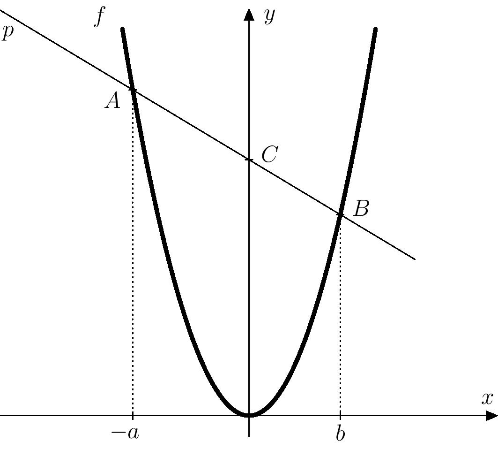
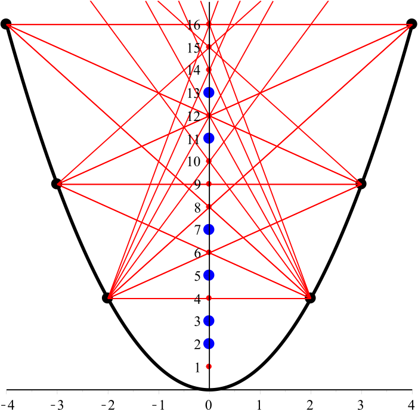

# Parabolic calculator

While surfing the web, Eva found an interesting geometric trick connected with the graph of the function
$f\colon y = x^2$ that  can be used as a calculator for multiplying two numbers
$a$ and $b$.[^1] The procedure is as follows:

 1.In a Cartesian coordinate system, draw the graph of the function $f(x)=x^2$.

 2. On the $x$-axis mark the points corresponding to the numbers $-a$ and $b$, i.e. the points $[-a;0]$ and $[b;0]$.

 3. At these points, draw lines perpendicular to the $x$-axis and
    construct their intersections with the parabola $f$.
 4. The line passing through the two intersection points 
    intersects the $y$-axis at a point whose $y$-coordinate equals the product $ab$.    
You can try the procedure in the attached worksheet; an illustration is also possible in GeoGebra. An interactive applet is available at <https://www.geogebra.org/m/sj5cjbaf>

> **Exercise.** Does the procedure described above work for all pairs of real
> numbers $a$ and $b$, or only for some? Prove your answer.

\iffalse

*Solution.* From the procedure it is clear that if the two points $-a$ and $b$ marked on the $x$-axis coincide, the line in the fourth step cannot be constructed uniquely. Therefore, the procedure will not work when $-a=b$. We will show that apart from this exceptional case the procedure works for all other pairs of numbers $a$ and $b$. 

Mark the points $-a$ and $b$ on the $x$-axis and construct perpendiculars at these points. Let the intersections of these perpendiculars with the parabola $y=x^2$ be $A$ and $B$, and denote the line through $A$ and $B$ by $p$. We will show that the intersection $C$ of line $p$ with the $y$-axis has $y$-coordinate equal to the product $ab$ (see figure 1). 

The line $p$ is determined by the two points $A=(-a;a^2)$ and $B=(b;b^2)$, so its direction vector is

$$
\overrightarrow{v}=\overrightarrow{AB}= [b+a; b^2-a^2].
$$

Multiplying the vector $\overrightarrow{v}$ by the scalar $\frac{1}{b+a}$ we obtain:

$$
\overrightarrow{u}=[1; b-a].
$$ 

which is also a direction vector of the line $p$. This operation is possible because in our case $-a\neq b$, hence $b+a\neq0$. Thus, the line $p$ has the parametric representation

$$
p\colon \; X = A + t\cdot\overrightarrow{u}, \quad t\in\mathbb{R}. 
$$

Expanding this gives  

$$
\begin{aligned}
p\colon \; x &= -a + t, \\
y &= a^2 + t\cdot (b-a), \quad t\in\mathbb{R}.
\end{aligned}
$$ 

The point $C$ on line $p$ that lies on the $y$-axis has $x$-coordinate $0$ (intersection with the $y$-axis), so substituting $x=0$ into the first equation yields $t=a$. Substituting this value into the second equation gives

$$
 y=a^2 + t\cdot (b-a)=a^2 + a\cdot (b-a)=ab,  
$$

which is what we wanted to prove.

>**Follow-up question to consider.**
What would happen if, on the $x$-axis, we marked images of the numbers $a$ and $b$ (instead of $-a$ and $b$)? Would the parabolic calculator still work in that case? 

\iffalse

*Answer to the question.* 
It is clear that a problem occurs when $a=b$. Therefore assume $a\neq b$. We need to write the equation of the line $q$ passing through the points $A=(a;a^2)$ and $B=(b;b^2)$. Its direction vector is

$$
\overrightarrow{v}=\overrightarrow{AB}= [b-a; b^2-a^2].
$$

Multiplying the vector $\overrightarrow{v}$ by the number $\frac{1}{b-a}$ we obtain:

$$
\overrightarrow{u}=[1; b+a], 
$$ 

which is also a direction vector of our line. This operation is valid since we assumed that $a \neq b$, and so $b-a\neq0$. The parametric equation of $q$ is:

$$
q\colon \; X = A + t\cdot\overrightarrow{u}, \quad t\in\mathbb{R}. 
$$

Expanding gives

$$
\begin{aligned}
q\colon \, x &= a + t, \\
y &= a^2 + t\cdot (b+a), \; t\in\mathbb{R}.
\end{aligned}
$$ 

The intersection of this line with the $y$-axis has $x$-coordinate zero. Substituting $x=0$ into the first equation gives $t=-a$. Substituting this $t$ into the second equation yields:

$$
 y=a^2 + t\cdot (b+a)=a^2 + (-a)\cdot (b+a)=-ab.  
$$

Thus in this case the construction produces a point whose $y$-coordinate is $-ab$, not $ab$. In other words, the parabolic calculator still works, but returns the product with the opposite sign.

\fi

>**One interesting remark to finish.**
The idea behind the parabolic calculator is the basis of a geometric version of the Sieve of Eratosthenes used to find prime numbers. The construction is: for every point $(-a;a^2)$ with $a\in\mathbb{N}\setminus\{1\}$ connect it with every point $(b;b^2)$ with $b\in\mathbb{N}\setminus\{1\}$. These connecting lines hit all composite numbers on the $y$-axis. The remaining natural numbers on the $y$-axis are precisely the primes and the number 1 (see figure 2). Think through the details to understand why this works. 

## References 
* A Parabola Sieve for Prime Numbers — https://demonstrations.wolfram.com/AParabolaSieveForPrimeNumbers/
* A Geometric Sieve for the Prime Numbers — 
https://thatsmaths.com/2017/04/27/a-geometric-sieve-for-the-prime-numbers/

