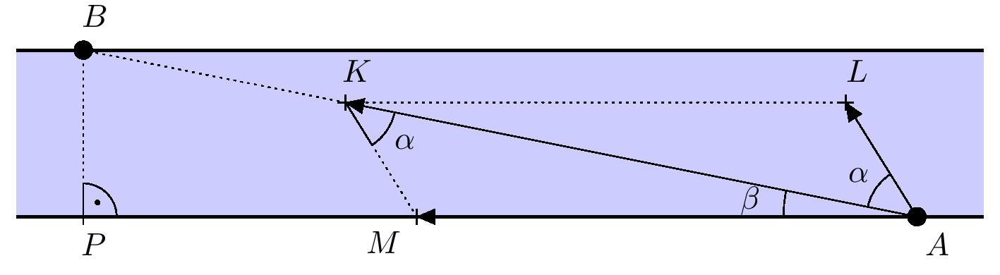

# Crossing the river

The ferryman must get from his dock on one river bank to the other
dock, which is located on the opposite bank, $500\ \text{m}$
downstream. The river between the docks is straight and 
$100\ \text{m}$ wide. The speed of the current is $2\ \text{m}/\text{s}$.
We also know that the ferryman's boat moves at a speed of $12\
\text{km}/\text{h}$ relative to the water.

> **Exercise 1.** The ferryman wants to travel directly from one dock
to the other. He can achieve this by angling the boat across the river
and maintaining this direction. By what angle should the ferryman turn
his boat from the direct path to travel straight to the other dock?

\iffalse

*Solution.* Let us denote by $A$ and $B$ the starting and destination
point. Also, denote by $P$ the foot of the perpendicular line from
point $B$ to the opposite bank of the river.  Next, mark the vectors
of the current's velocity, the boat’s velocity relative to the water,
and the resulting velocity of the boat (boat’s velocity relative to
the river's bottom) all with their initial points at point A and
endpoints as follows (see the figure):

- $\overrightarrow{AM}$ is the vector of the current's velocity.
- $\overrightarrow{AL}$ is the vector of the boat’s velocity relative to the water (not including
   current).
- $\overrightarrow{AK}$ is the vector of the resulting velocity of the boat relative to the river's bottom
   (current + boat velocity).

Since $K\in AB$, our task is to determine the angle $KAL$, which we denote by
$\alpha$. By the vector addition rule, the quadrilateral $MALK$ is a parallelogram.

Further, let's denote $\lvert \sphericalangle MAK \rvert = \beta$. Then $\lvert \sphericalangle MAL \rvert  = \alpha + \beta$. 
It is given that $|BP|=100\ \text{m}$ and $|AP|=500\ \text{m}$. By using the tangent function in the right-angled
triangle $PAB$ we get $\beta = \arctan\frac{1}{5} \approx 11^{\circ}19'$.

Since a parallelogram is bisected by its diagonal into two congruent triangles, it holds that
$\lvert \sphericalangle AKM \rvert= \lvert \sphericalangle KAL \rvert = \alpha$.
To calculate $\alpha$, we use the law of sines for the triangle $AKM$.
After converting the side lengths to a common unit (km per hour in our solution), we get specifically
$|KM|=12\,\text{km/h}$ and $|AM|=2\cdot 3.6=7.2\,\text{km/h}$. We now express $\alpha$ from the law of sines:

$$
\frac{|KM|}{\sin \beta} = \frac{|AM|}{\sin \alpha}
$$
$$
\sin \alpha = \frac{|AM|}{|KM|}\cdot \sin\beta \qquad \Rightarrow \qquad \alpha = \arcsin \left( \frac{|AM|}{|KM|}\cdot \sin\beta \right) 
$$
After substituting the values, we obtain $\alpha
\approx 6^{\circ}45'$. Thus, the ferryman has to turn his boat by approximately $7^{\circ}$
to the right from the direct course to the destination.

\fi

>**Exercise 2.** If the digital clock on the boat shows 11:00 at the moment of departure
>(without showing seconds), what time will the clock show at the moment the boat arrives at the other
>dock? 

\iffalse

*Solution.* Let's first determine the distance between the two docks using the Pythagorean theorem in the right-angled triangle $ABP$:

$$
\begin{aligned}
|AB| &= \sqrt{|AP|^2 + |BP|^2}\\
|AB| &= \sqrt{0.5^2 + 0.1^2}\,\text{km}\\
|AB| &\approx 0.51\,\text{km}.
\end{aligned}
$$

Now, we determine the magnitude of the resultant velocity of the boat relative to the river’s bottom, which is
equal to the length of the line segment $AK$. This, for example, can be determined using the law of cosines in
triangle $AKM$. We denote the interior angle $\lvert \sphericalangle AMK \rvert =\gamma$, which measures $180^{\circ}-\alpha - \beta \approx 161^{\circ}56'$. 
Then for $|AK|$ we can write:

$$
\begin{aligned}
|AK| &= \sqrt{|KM|^2 + |AM|^2 - 2\cdot |KM| \cdot |AM| \cdot \cos \gamma}\\
|AK| &= \sqrt{12^2 + 2^2 - 2\cdot 12 \cdot 2 \cdot \cos(161^{\circ}56')}\,\text{km/h}\\
|AK| &\approx 19.0\,\text{km/h}
\end{aligned}
$$
The boat travels a direct path of $0.51\ \text{km}$ at an average speed of $19\ \text{km}/\text{h}$, which takes:
$$
\begin{aligned}
t &= \frac{\text{distance traveled}}{\text{average speed}}\\
t &= \frac{0.51}{19}\ \text{h}\\
\end{aligned}
$$

which is approximately 97 seconds. Therefore, the clock will show 11:01 or 11:02 upon arrival at the target dock. 

\fi
