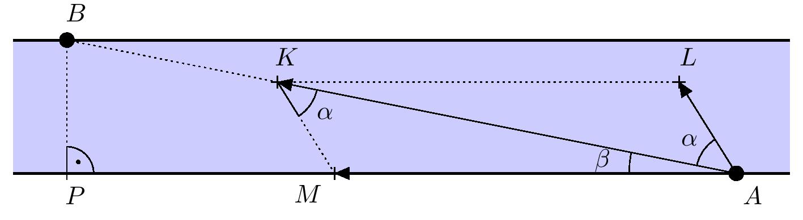

---
keywords:
- trigonometría
- ley de los senos
- ley de los cosenos
is_finished: true
---

# Cruzando el río

El barquero debe llegar desde su embarcadero en una orilla del río hasta el otro muelle, que se encuentra en la orilla opuesta, $500\ \text{m}$
río abajo. El río entre los muelles es recto y 
$100\ \text{m}$ de ancho. La velocidad de la corriente es de $2\ \text{m}/\text{s}$.
También sabemos que la barca del barquero se mueve a una velocidad de $12\ \text{km}/\text{h}$ respecto al agua.

> **Problema 1.** El barquero quiere viajar directamente de un muelle
al otro. Él puede lograr esto inclinando el barco a través del río
y manteniendo esta dirección. ¿Con qué ángulo debe el barquero desviarse de la trayectoria directa para llegar directamente al otro muelle?

\iffalse

*Solución.* Denotemos por $A$ y $B$ el punto de partida y de llegada. Denotemos también por $P$ el pie de la recta perpendicular desde el punto $B$ hasta la orilla opuesta del río.  A continuación, marquemos los vectores de la velocidad de la corriente, la velocidad de la embarcación respecto al agua y la velocidad resultante de la embarcación (velocidad de la embarcación respecto al fondo del río) todos ellos con sus puntos iniciales en el punto A y sus puntos finales de la siguiente forma (ver figura):

- $\overrightarrow{AM}$ es el vector de la velocidad de la corriente.
- $\overrightarrow{AL}$ es el vector de la velocidad del barco con respecto al agua (sin incluir la corriente).
- $\overrightarrow{AK}$ es el vector de la velocidad resultante de la embarcación respecto al fondo del río (corriente + velocidad de la embarcación).

Como $K\in AB$, nuestra tarea es determinar el ángulo $KAL$, que denotamos por $\alpha$. Por la regla de adición de vectores, el cuadrilátero $MALK$ es un paralelogramo.

Además, vamos a denotar $\lvert \sphericalangle MAK \rvert = \beta$. Entonces $\lvert \sphericalangle MAL \rvert  = \alpha + \beta$. 
Se da que $|BP|=100\ \text{m}$ y $|AP|=500\ \text{m}$. Utilizando la función tangente en el triángulo rectángulo $PAB$ obtenemos $\beta = \arctan\frac{1}{5} \doteq 11^{\circ}19'$.

Como un paralelogramo se divide por su diagonal en dos triángulos congruentes, se cumple que
$\lvert \sphericalangle AKM \rvert= \lvert \sphericalangle KAL \rvert = \alpha$.
Para calcular $\alpha$, utilizamos la ley de los senos para el triángulo $AKM$.
Tras convertir las longitudes de los lados a una unidad común (km/h en nuestra solución), obtenemos concretamente
$|KM|=12\,\text{km/h}$ y $|AM|=2\cdot 3.6=7.2\,\text{km/h}$. Expresamos ahora $\alpha$ a partir de la ley de los senos:

$$
\frac{|KM|}{\sin \beta} = \frac{|AM|}{\sin \alpha}
$$
$$
\sin \alpha = \frac{|AM|}{|KM|}\cdot \sin\beta \qquad \Rightarrow \qquad \alpha = \arcsin \left( \frac{|AM|}{|KM|}\cdot \sin\beta \right) 
$$
Tras sustituir los valores, obtenemos $\alpha
\doteq 6^{\circ}45'$. Así, el barquero tiene que girar su barco aproximadamente 7^{circ}$ a la derecha desde el rumbo directo al destino.

\fi

>**Problema 2.** Si el reloj digital del barco marca las 11:00 en el momento de la salida (sin mostrar los segundos), ¿qué hora marcará el reloj en el momento en que el barco llegue al otro muelle? 

\iffalse

*Solución.* Determinemos primero la distancia entre los dos muelles utilizando el teorema de Pitágoras en el triángulo rectángulo $ABP$:

$$
\begin{aligned}
|AB| &= \sqrt{|AP|^2 + |BP|^2}\\
|AB| &= \sqrt{0.5^2 + 0.1^2}\,\text{km}\\
|AB| &\doteq 0.51\,\text{km}.
\end{aligned}
$$

Ahora determinamos la magnitud de la velocidad resultante de la barca respecto al fondo del río, que es igual a la longitud del segmento de recta $AK$. Esto, por ejemplo, se puede determinar utilizando la ley de los cosenos en el triángulo $AKM$. Denotamos el ángulo interior $\lvert \sphericalangle AMK \rvert =\gamma$, que mide $180^{\circ}-\alpha - \beta \doteq 161^{\circ}56'$. 
Entonces para $|AK|$ podemos escribir:

$$
\begin{aligned}
|AK| &= \sqrt{|KM|^2 + |AM|^2 - 2\cdot |KM| \cdot |AM| \cdot \cos \gamma}\\
|AK| &= \sqrt{12^2 + 2^2 - 2\cdot 12 \cdot 2 \cdot \cos(161^{\circ}56')}\,\text{km/h}\\
|AK| &\doteq 19.0\,\text{km/h}
\end{aligned}
$$
El barco recorre un trayecto directo de $0.51\ \text{km}$ a una velocidad media de $19\ \text{km}/\text{h}$, lo que tarda:
$$
\begin{aligned}
t &= \frac{\text{espacio recorrido}}{\text{velocidad}}\\
t &= \frac{0.51}{19}\ \text{h}\\
\end{aligned}
$$

que son aproximadamente 97 segundos. Por lo tanto, el reloj mostrará las 11:01 o las 11:02 al llegar al muelle de destino. 

\fi
