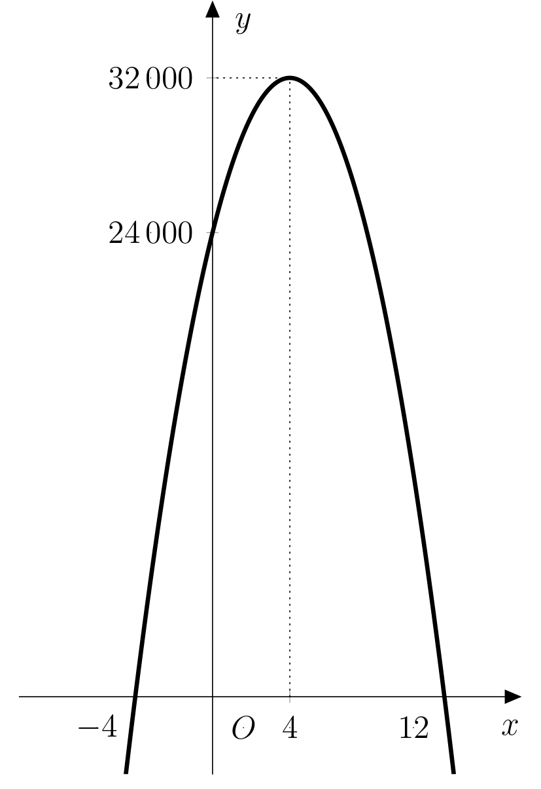

# Optimální cena vstupenky

Majitel kolotoče chce určit vstupné na svou atrakci 
tak, aby jeho zisk byl maximální. 
Pro jednoduchost stanovuje vstupné v násobcích 10 Kč. 
Ví, že při stávající ceně 50 Kč může očekávat návštěvnost asi 
600 lidí za den. Z minulých let také odhaduje, že 
při nárůstu ceny vstupenky o 10 korun přijde za den 
asi o 50 návštěvníků méně, zatímco při poklesu ceny 
vstupenky o 10 korun přijde naopak o 50 návštěvníků 
více.
Pro zvýšení atraktivity dostane každý třetí 
návštěvník při odchodu cukrovou vatu v hodnotě 30 
Kč na účet kolotočáře. 

Protože kolotočářův syn shodou okolností studuje matematiku, rozhodl
se, že otci s problémem pomůže.

>**Úloha 1.** Po chvíli uvažování napsal syn vzorec 
>$$ y= (50+10x)\cdot (600-50x) - \frac{600-50x}{3}\cdot 30.$$
>Rozklíčujte jednotlivé části tohoto vzorce.

\iffalse

*Řešení.* Roli jednotlivých částí rovnice objasní následující tabulka:

| Část rovnice  | Význam | 
| ------------- | ------------- | 
| $10x$ |  změna ceny vstupenky  | 
| $50+10x$  | nová cena vstupenky  | 
| $600-50x$  | odhadovaný počet návštěvníků po změně ceny | 
| $(50+10x)(600-50x)$ | denní příjem ze vstupenek  | 
| $\frac{600-50x}{3}$  | denní počet obdarovaných návštěvníků | 
| $\frac{600-50x}{3}\cdot 30$  | denní náklady na cukrovou vatu  | 
| $y$  | celkový denní zisk  | 

\fi

>**Úloha 2.** Chápeme-li předchozí vzorec jako funkci 
>proměnné $x$, o jakou funkci se jedná a jak vypadá její 
>graf?

\iffalse

*Řešení.* Úpravou pravé strany vzorce jej převedeme na tvar
$$
y=-500x^2+4\ 000x+24\ 000\ .
$$ 
Dostáváme tak kvadratickou funkci,
jejímž grafem je parabola. Tato parabola je kvůli zápornému
koeficientu u kvadratického členu konkávní.

\fi

>**Úloha 3.** Při jaké ceně vstupenky by majitel dosáhl maximálního zisku?

\iffalse

*Řešení.* Naším úkolem je určit maximum funkce
$$f\colon y=-500x^2+4\ 000x+24\ 000\ .$$
Víme, že graf funkce $f$ 
protíná osu $x$ v bodech odpovídajících kořenům 
kvadratického polynomu. Ve středu úsečky, která spojuje 
tyto body, pak najdeme hledané maximum funkce (jak plyne ze 
symetrie paraboly). Určíme proto kořeny kvadratického polynomu.
$$\begin{aligned}
-500x^2 + 4\,000x + 24\,000 &= 0 \\
x^2 - 8x - 48 &= 0\\
(x-12)(x+4)&=0
\end{aligned}$$

Řešením rovnice jsou kořeny $x_1=12$ a $x_2=-4$, tedy maximum funkce
$f$ je v bodě $x_{max}=\frac{12-4}{2}=4$. Pro maximální zisk je tedy potřeba navýšit cenu vstupenky o $4\cdot 10\ \text{Kč}$
na novou cenu $90\ \text{Kč}$.

\fi

>**Úloha 4.** O kolik korun je maximální zisk vyšší, než by byl zisk
>při původní ceně?

\iffalse

*Řešení.* Odpověď na tuto úlohu je rozdílem $f(4)-f(0)$. Postupným
dosazením obou hodnot do předpisu funkce $f$ dostáváme $f(4)=32 000$
a $f(0)=24 000$. Rozdíl obou částek je pak roven
$8 000\ \text{Kč}$.
Graf funkce $f$ s vyznačenými hodnotami $f(4)$ a $f(0)$
je na obrázku:

\fi

>**Úloha 5.** Při sestavování vzorce si syn jednu věc zjednodušil. 
>Poznáte kterou? Dokázali byste úlohu vyřešit bez tohoto zjednodušení? 
>Porovnejte pak svůj model s modelem kolotočářova syna.

\iffalse

*Řešení.* Vzorec kolotočářova syna je přesný pouze v případě, že je 
počet návštěvníků za den $600-50x$ dělitelný třemi. Pokud dělitelný
třemi není, pak je počet obdarovaných návštěvníků roven 
tzv. *dolní celé části* čísla $\frac{600-50x}{3}$; značíme $\left\lfloor\frac{600-50x}{3}\right\rfloor$. 

*Dolní celá část čísla* je funkce, která každému reálnému číslu $x$
přiřazuje největší celé číslo $m$ takové, že $m\leq x$,
např. $\left\lfloor \frac{5}{2}\right\rfloor = 2$, $\left\lfloor
\pi\right\rfloor = 3$ nebo $\left\lfloor -8{,}3\right\rfloor = -9$.

Porovnejme nyní dříve použitou funkci $f$ s novou funkcí $g$, která
počítá s dolní celou částí:
$$
g\colon y = (50+10x)\cdot (600-50x) - \left\lfloor\frac{600-50x}{3}\right\rfloor\cdot 30.
$$
Porovnání provedeme pro okolí již stanoveného maxima $x_{max}=4$. Za
$x$ tak budeme dosazovat smysluplné hodnoty z intervalu $\langle
3{,}5;4{,}5 \rangle$, přičemž za smysluplné považujeme takové hodnoty,
aby byla cena vstupenky i počet návštěvníků celočíselné. Jde vidět, že
se stačí omezit na celočíselnost ceny vstupenky, a ta bude celočíselná
pro právě takové hodnoty, které mají v dekadickém zápisu nejvýše jedno
desetinné místo.

Postupným dosazováním můžeme výsledky přehledně shrnout v tabulce (s
výhodou můžeme použít software typu MS Excel):

$$
\begin{array}{c|ccccccccccc}
x & 3{,}5 & 3{,}6 & 3{,}7 & 3{,}8 & 3{,}9 & 4{,}0 & 4{,}1 & 4{,}2 & 4{,}3 & 4{,}4 & 4{,}5 \\\hline
f(x) & 31\,875 & 31\,920 & 31\,955 & 31\,980 & 31\,995 & 32\,000 & 31\,995 & 31\,980 & 31\,955 & 31\,920 & 31\,875 \\\hline
g(x) & 31\,895 & 31\,920 & 31\,965 & 32\,000 & 31\,995 & 32\,010 & 32\,015 & 31\,980 & 31\,965 & 31\,940 & 31\,875 \\
\end{array}
$$

Denní zisk určený pomocí funkce $g$ je vždy větší nebo roven dennímu 
zisku určenému funkcí $f$. Rovněž maximum funkce $g$ se nachází v jiném 
bodě, kterým je $4{,}1$, čemuž odpovídá cena vstupenky $91\ \text{Kč}$ a 
odhadovaná denní návštěvnost 395 lidí. 

Můžeme si všimnout následujících věcí:

- Rozdíly mezi zisky jsou velmi malé, ve zlomcích ceny jedné vstupenky. 
Nezáleží tak na tom, jestli vstupenka bude stát 90 nebo 91 Kč, protože 
jediný člověk, který oproti odhadům přijde navíc (resp. nepřijde), 
spolehlivě smaže veškeré rozdíly mezi zisky obou modelů.

- Zatímco maximum funkce $f$ stanovíme přímým a poměrně jednoduchým 
výpočtem, maximum funkce $g$ jsme museli stanovit dosazováním všech 
přípustných hodnot (a~to ještě z poměrně úzkého intervalu).

Proto je možné říct, že i přes zjednodušení je dostačující (a vlastně
i výhodnější) použít k výpočtu maximálního zisku funkci $f$.

\fi
