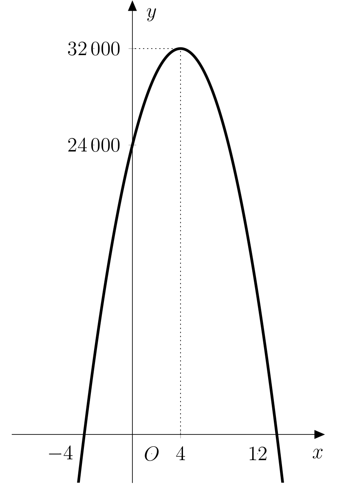

---
keywords:
- optymalizacja
- równanie kwadratowe 
- funkcja podłogi
is_finished: True
---
# Optymalna cena biletu

Właściciel karuzeli chce ustalić cenę biletu na swoją atrakcję tak, aby zmaksymalizować swój zysk.
Dla uproszczenia, ustala opłatę za wstęp jako wielokrotność 10 CZK.
Wie, że przy obecnej cenie 50 CZK może spodziewać się około 600 odwiedzających dziennie.
Na podstawie poprzednich lat szacuje, że jeśli cena biletu wzrośnie o 10 CZK, dziennie odwiedzi go około 50 osób mniej. I odwrotnie, jeśli cena biletu spadnie o 10 CZK, odwiedzi go o 50 osób więcej.
Dodatkowo, aby zwiększyć zainteresowanie odwiedzających, co trzeci odwiedzający otrzyma watę cukrową o wartości 30 CZK na koszt właściciela karuzeli.

Ponieważ syn właściciela karuzeli studiuje matematykę, postanawia pomóc ojcu w rozwiązaniu tego problemu.

>**Zadanie 1.** Po namyśle syn napisał wzór
>$$ y= (50+10x)\cdot (600-50x) - \frac{600-50x}{3}\cdot 30.$$
>Zinterpretuj poszczególne części tego wzoru.

\iffalse

*Rozwiązanie.* Poniższa tabela wyjaśnia znaczenie każdej części wzoru:

| Część wzoru  | Znaczenie | 
| ------------- | ------------- | 
| $10x$ |  zmiana ceny biletu o $x\cdot 10\ \text{CZK}$  | 
| $50+10x$  | nowa cena biletu  | 
| $600-50x$  | szacowana liczba odwiedzających po zmianie ceny | 
| $(50+10x)(600-50x)$ | dzienne zarobki z biletów  | 
| $\frac{600-50x}{3}$  |liczba odwiedzających otrzymujących watę cukrową | 
| $\frac{600-50x}{3}\cdot 30$  | dzienny koszt waty cukrowej  | 
| $y$  | całkowity dzienny zysk  | 

\fi

>**Zadanie 2.** Jeśli rozważymy poprzedni wzór jako funkcję zmiennej $x$,
>Jakiego typu jest to funkcja i jak wygląda jej wykres?
*Rozwiązanie.* Upraszczając prawą stronę wzoru, przekształcamy go do postaci
$$
y=-500x^2+4\ 000x+24\ 000\ .
$$ 
Jest to funkcja kwadratowa, której wykresem jest parabola.
Ze względu na ujemny współczynnik wyrażenia kwadratowego parabola ta jest wklęsła w dół. 

\iffalse

>**Zadanie 3.** Przy jakiej cenie biletu właściciel osiągnąłby maksymalny zysk?

\iffalse

*Rozwiązanie.* Naszym zadaniem jest wyznaczenie maksimum funkcji
$$f(x)=-500x^2+4\ 000x+24\ 000\ .$$
Wiemy, że wykres funkcji $f$ przecina oś $x$ w punktach odpowiadających pierwiastkom wielomianu kwadratowego.
W punkcie środkowym odcinka łączącego te punkty możemy znaleźć maksimum szukanej funkcji (ze względu na symetrię paraboli).
Wyznaczamy zatem pierwiastki wielomianu kwadratowego.
$$\begin{aligned}
-500x^2 + 4\,000x + 24\,000 &= 0 \\
x^2 - 8x - 48 &= 0\\
(x-12)(x+4)&=0
\end{aligned}$$
Rozwiązaniami równania są pierwiastki $x_1=12$ i $x_2=-4$, więc maksimum funkcji $f$ znajduje się w punkcie $x_{max}=\frac{12-4}{2}=4$.
Podnieśliśmy zatem pierwotną cenę biletu o $40$ do nowej ceny $90\text{CZK}$, aby osiągnąć maksymalny zysk.

\fi

>**Zadanie 4.** O ile większy jest maksymalny zysk od zysku przy pierwotnej cenie biletu?

\iffalse

*Rozwiązanie.* The answer to this problem is the difference $f(4)-f(0)$.
Podstawiając obie wartości do funkcji $f$, otrzymujemy $f(4)=32 000$ and $f(0)=24 000$. Różnica między tymi dwiema kwotami wynosi $8 000\ \text{CZK}$.
Wykres funkcji $f$ z zaznaczonymi wartościami $f(4)$ i $f(0)$ przedstawiono na rysunku:

\fi

>**Zadanie 5.** Tworząc formułę, syn uprościł jeden aspekt problemu.
>Czy wiesz, który z nich? Czy można rozwiązać zadanie bez tego uproszczenia?
>Porównaj swój model z modelem stworzonym przez syna właściciela karuzeli.

\iffalse

*Rozwiązanie.* Wzór syna jest dokładny tylko wtedy, gdy
liczba odwiedzających dziennie $600-50x$ jest podzielna przez trzy. Jeśli nie jest podzielna przez trzy, to liczba odwiedzających, którzy otrzymali prezent, wynosi
dolna część całkowita liczby $\frac{600-50x}{3}$, oznaczona jako $\left\lfloor\frac{600-50x}{3}\right\rfloor$.

Funkcja, która na wejściu przyjmuje liczbę rzeczywistą $x$
i daje na wyjściu największą liczbę całkowitą $m$ taką, że $m\leq x$ nazywana jest *funkcją podłogi*.
Na przykład, $\left\lfloor \frac{5}{2}\right\rfloor = 2$, $\left\lfloor
\pi\right\rfloor = 3$ nebo $\left\lfloor -8{,}3\right\rfloor = -9$.

Teraz porównajmy poprzednio używaną funkcję $f$ z nową funkcją $g$, która 
używa dolnej części liczby całkowitej:
$$
g(x) = (50+10x)\cdot (600-50x) - \left\lfloor\frac{600-50x}{3}\right\rfloor\cdot 30.
$$
 $x_{max}=4$. 
Porównamy wyniki wokół już określonego maksimum, $x_{max}=4$.
Dla $x$ podstawimy wartości z przedziału $\langle
3{,}5;4{,}5 \rangle$, biorąc pod uwagę wartości, dla których zarówno cena biletu, jak i liczba odwiedzających są liczbami całkowitymi. Można zauważyć
że wystarczy upewnić się, że cena biletu jest liczbą całkowitą, co nastąpi dla wartości $x$ z co najwyżej jednym miejscem po przecinku. 

Wartości funkcji można podsumować w tabeli
(do obliczeń korzystne jest użycie oprogramowania takiego jak MS Excel):

$$
\begin{array}{c|ccccccccccc}
x & 3{,}5 & 3{,}6 & 3{,}7 & 3{,}8 & 3{,}9 & 4{,}0 & 4{,}1 & 4{,}2 & 4{,}3 & 4{,}4 & 4{,}5 \\\hline
f(x) & 31\,875 & 31\,920 & 31\,955 & 31\,980 & 31\,995 & 32\,000 & 31\,995 & 31\,980 & 31\,955 & 31\,920 & 31\,875 \\\hline
g(x) & 31\,895 & 31\,920 & 31\,965 & 32\,000 & 31\,995 & 32\,010 & 32\,015 & 31\,980 & 31\,965 & 31\,940 & 31\,875 \\
\end{array}
$$

Dzienny zysk określony przez funkcję $g$ jest zawsze większy lub równy dziennemu zyskowi
określony przez funkcję $f$. Ponadto maksimum funkcji $g$ znajduje się w innym punkcie,
konkretnie $4{,}1$, co odpowiada cenie biletu w wysokości $91\,\text{CZK}$
i szacowanej dziennej frekwencji 395 osób.

Możemy zaobserwować następujące fakty:

- Różnice między zyskami są bardzo małe, w granicach ułamków ceny pojedynczego biletu.
Nie ma znaczenia, czy bilet kosztuje 90 czy 91 CZK, ponieważ
jedyna osoba, która wchodzi dodatkowo (lub nie wchodzi) w porównaniu z szacunkami,
niezawodnie usuwa wszelkie różnice między zyskami dwóch modeli.

- Podczas gdy maksimum funkcji $f$ wyznaczamy za pomocą bezpośrednich i stosunkowo prostych obliczeń,
musieliśmy wyznaczyć maksimum funkcji $g$ poprzez podstawienie wszystkich dopuszczalnych wartości (ze stosunkowo wąskiego przedziału).
dopuszczalnych wartości (ze stosunkowo wąskiego przedziału).

Dlatego, pomimo uproszczenia, użycie funkcji $f$ do obliczenia maksymalnego zysku jest zarówno wystarczające, jak i wygodniejsze.

\fi