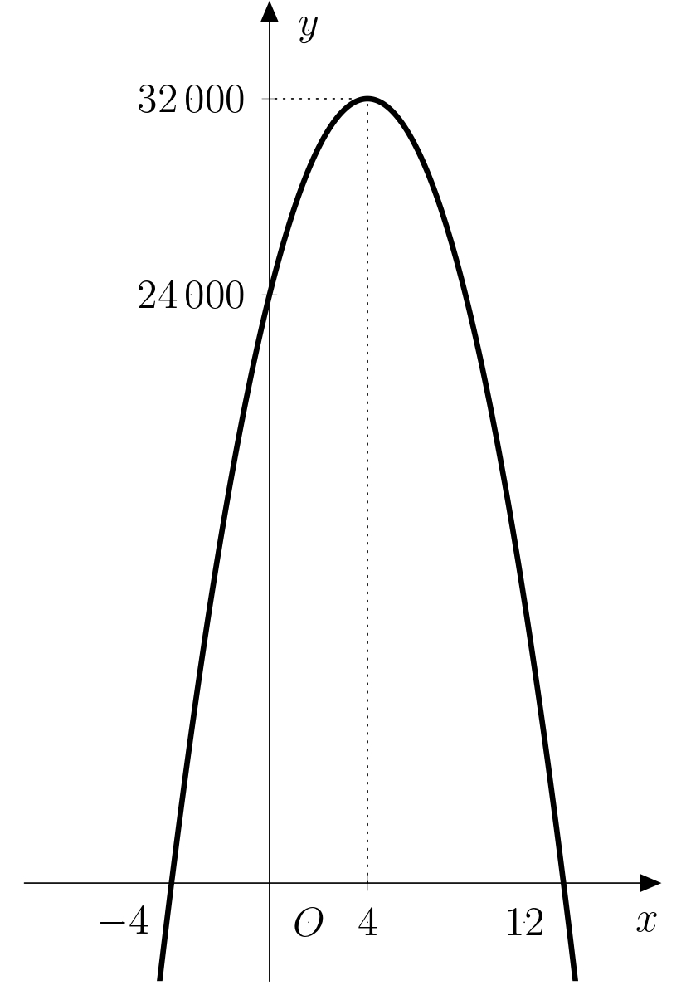

---
keywords:
- funkcie
- optimalizácia
- kvadratická rovnica
- dolná celá časť čísla
is_finished: true
---

# Optimálna cena vstupenky

Majiteľ kolotoča chce nastaviť cenu lístka na svoju atrakciu tak, aby maximalizoval svoj zisk.
Pre jednoduchosť stanoví vstupné v násobkoch 10 Kč.
Vie, že pri súčasnej cene 50 Kč môže očakávať približne 600 návštevníkov denne.
Z predchádzajúcich rokov odhaduje, že ak sa cena lístka zvýši o 10 Kč, príde denne asi o 50 návštevníkov menej. Naopak, ak sa cena lístka zníži o 10 Kč, príde o 50 návštevníkov viac.
Navyše, aby zvýšil záujem návštevníkov, každý tretí návštevník dostane cukrovú vatu v hodnote 30 Kč na náklady majiteľa kolotoča.

Keďže syn majiteľa kolotoča študuje matematiku, rozhodol sa pomôcť svojmu otcovi s týmto problémom.

>**Úloha 1.** Po chvíli premýšľania napísal syn vzorec.
>$$ y= (50+10x)\cdot (600-50x) - \frac{600-50x}{3}\cdot 30.$$
>Vysvetlite jednotlivé časti tohto vzorca.

\iffalse

*Riešenie.* Nasledujúca tabuľka vysvetľuje význam každej časti vzorca:

| Časť rovnice  | Význam | 
| ------------- | ------------- | 
| $10x$ | zmena ceny lístka o $x\cdot 10\ \text{Kč}$  | 
| $50+10x$  | nová cena vstupenky  | 
| $600-50x$  | odhadovaný počet návštevníkov po zmene ceny | 
| $(50+10x)(600-50x)$ |denný príjem zo vstupeniek  | 
| $\frac{600-50x}{3}$  | počet návštevníkov, ktorí dostanú cukrovú vatu | 
| $\frac{600-50x}{3}\cdot 30$  | denné náklady na cukrovú vatu  | 
| $y$  | celkový denný zisk  | 

\fi

>**Úloha 2.** Ak považujeme predchádzajúci vzorec za funkciu premennej $x$,
o aký typ funkcie ide a ako vyzerá jej graf?

\iffalse

*Riešenie.* 
Zjednodušením pravej strany vzorca ju prevedieme do tvaru
$$
y=-500x^2+4\ 000x+24\ 000\ .
$$ 
Ide o kvadratickú funkciu, ktorej grafom je parabola.
Vzhľadom na záporný koeficient kvadratického člena je táto parabola konkávna.

\fi

>**Úloha 3.** Pri akej cene lístka by majiteľ dosiahol maximálny zisk?

\iffalse

*Riešenie.* Našou úlohou je určiť maximum funkcie
$$f(x)=-500x^2+4\ 000x+24\ 000\ .$$
Vieme, že graf funkcie $f$ pretína os $x$ v bodoch zodpovedajúcich koreňom kvadratického polynómu.
V strede úsečky spájajúcej tieto body môžeme nájsť maximum hľadanej funkcie (vďaka symetrii paraboly).
Preto určíme korene kvadratického polynómu.
$$\begin{aligned}
-500x^2 + 4\,000x + 24\,000 &= 0 \\
x^2 - 8x - 48 &= 0\\
(x-12)(x+4)&=0
\end{aligned}$$
Riešením rovnice sú korene $x_1=12$ a $x_2=-4$, takže maximum funkcie $f$ je v bode $x_{max}=\frac{12-4}{2}=4$.
Pôvodnú cenu lístka sme teda zvýšili o $4\cdot 10\ \text{Kč}$, čím sme dosiahli novú cenu $90\ \text{Kč}$ na dosiahnutie maximálneho zisku.

\fi

>**Úloha 4.** O koľko je maximálny zisk väčší než zisk pri pôvodnej cene lístka?

\iffalse

*Riešenie.* Odpoveďou na tento problém je rozdiel $f(4)-f(0)$.
Dosadením oboch hodnôt do funkcie $f$ dostaneme $f(4)=32 000$ a $f(0)=24 000$. Rozdiel medzi týmito dvomi hodnotami je $8 000\ \text{Kč}$.
Graf funkcie $f$ s vyznačenými hodnotami $f(4)$ a $f(0)$ je zobrazený na obrázku:

\fi

>**Úloha 5.** Pri tvorbe vzorca syn zjednodušil jeden aspekt problému. 
>Viete, ktorý to bol? Dokázali by ste problém vyriešiť bez tohto zjednodušenia?
>Porovnajte svoj model s tým, ktorý vytvoril syn majiteľa kolotoča.

\iffalse

*Riešenie.* Synov vzorec je presný iba vtedy, ak je počet návštevníkov za deň $600-50x$ deliteľný tromi. Ak nie je deliteľný tromi, potom počet návštevníkov, ktorí dostali darček, je dolná celočíselná časť tohto čísla. $\frac{600-50x}{3}$, označíme ako $\left\lfloor\frac{600-50x}{3}\right\rfloor$.

Dolná celá časť čísla je funkcia, ktorá každému reálnému číslu $x$ priradí najväčšie celé číslo $m$, pre ktoré platí $m\leq x$, napr: $\left\lfloor \frac{5}{2}\right\rfloor = 2$, $\left\lfloor \pi\right\rfloor = 3$ alebo $\left\lfloor -8{,}3\right\rfloor = -9$.
Teraz porovnajme predtým použitú funkciu $f$ s novou funkciou $g$, ktorá používa dolnú celočíselnú časť:
$$
g(x) = (50+10x)\cdot (600-50x) - \left\lfloor\frac{600-50x}{3}\right\rfloor\cdot 30.
$$
 $x_{max}=4$. 
 Porovnáme výsledky okolo už určeného maxima, $x_{max}=4$.
Pre $x$ budeme dosadzovať hodnoty z intervalu $\langle 3{,}5;4{,}5 \rangle$, pričom budeme brať do úvahy hodnoty, pre ktoré sú cena lístka aj počet návštevníkov celé čísla.
Môžeme pozorovať, že stačí, aby bola cena lístka celé číslo, čo sa stane pre hodnoty $x$ s maximálne jedným desatinným miestom.

Hodnoty funkcií môžeme zhrnúť do tabuľky
(je výhodné na výpočty použiť softvér, ako je MS Excel):

$$
\begin{array}{c|ccccccccccc}
x & 3{,}5 & 3{,}6 & 3{,}7 & 3{,}8 & 3{,}9 & 4{,}0 & 4{,}1 & 4{,}2 & 4{,}3 & 4{,}4 & 4{,}5 \\\hline
f(x) & 31\,875 & 31\,920 & 31\,955 & 31\,980 & 31\,995 & 32\,000 & 31\,995 & 31\,980 & 31\,955 & 31\,920 & 31\,875 \\\hline
g(x) & 31\,895 & 31\,920 & 31\,965 & 32\,000 & 31\,995 & 32\,010 & 32\,015 & 31\,980 & 31\,965 & 31\,940 & 31\,875 \\
\end{array}
$$

Denný zisk určený funkciou $g$ je vždy väčší alebo rovný dennému zisku určenému funkciou $f$. Tiež maximum funkcie $g$ je v inom bode, konkrétne v $4{,}1$, čo zodpovedá cene lístka $91\ \text{Kč}$ a odhadovanej dennej návštevnosti 395 ľudí.

Môžeme pozorovať nasledujúce skutočnosti:

- Rozdiely medzi ziskami sú veľmi malé, v rámci ceny jedného lístka. Nezáleží na tom, či lístok stojí 90 alebo 91 Kč, pretože jediná osoba, ktorá príde navyše (alebo nepríde) v porovnaní s odhadmi, spoľahlivo vymaže akýkoľvek rozdiel medzi ziskami oboch modelov.
- Zatiaľ čo maximum funkcie $f$ určujeme priamo a relatívne jednoduchým výpočtom, maximum funkcie $g$ sme museli určiť dosadzovaním všetkých povolených hodnôt (z relatívne úzkeho intervalu).

Preto, napriek zjednodušeniu, použitie funkcie $f$ na výpočet maximálneho zisku je nielen dostatočné, ale aj pohodlnejšie.

\fi
