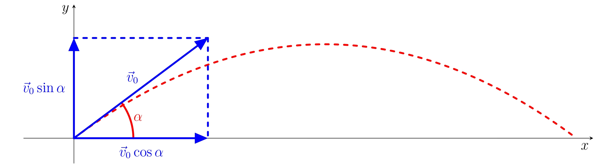

---
keywords:
- diferenciální a integrální počet
- optimalizace
- kvadratická rovnice
- derivace
is_finished: true
difficulty: 3
time: 30
---

# Odpal golfového míčku

## Šikmý vrh

Šikmý vrh je nejobecnější způsob uvedení tělesa v homogenním tíhovém
poli do pohybu.  Předpokládejme, že hmotný bod byl šikmo vržen v
prostředí bez odporu počáteční rychlostí $v_0$, přičemž příslušný vektor počáteční rychlosti $\vec {v}_0$ svírá s
vodorovnou rovinou úhel $\alpha \in \left(0,\frac{\pi}{2}\right)$. Při zavedení kartézského souřadného
systému s osou $x$ vodorovnou a osou $y$ svislou vzhůru
bude pro tento vektor platit 

$$\vec{v}_0=(v_0\cos\alpha,v_0\sin\alpha).$$

Pohyb tělesa je ovlivněn tíhovým zrychlením o velikosti $g$ mířícím
svisle dolů. Vodorovná komponenta tíhového zrychlení je nulová, a
proto ve vodorovném směru pohyb není tíhovým polem ovlivněn. Ve směru
svislém je pohyb tělesa ovlivněn zrychlením $-g$ s počáteční rychlostí $v_0\sin\alpha$.

Pro souřadnice $[x(t),y(t)]$ polohy hmotného bodu v čase $t \geq 0$ bude platit

$$
\begin{aligned}
        x(t) &= v_0 t\cos\alpha,\\
        y(t) &= v_0t\sin\alpha-\frac{1}{2}gt^2.
\end{aligned}\tag{1}
$$

## Odpal golfového míčku

Hráč golfu odpaluje míček počáteční rychlostí $v_0$ svírající s
vodorovnou rovinou úhel $\alpha$. Předpokládejme, že na míček působí
zanedbatelné odporové síly. Pohyb míčku tedy splňuje podmínky pro
pohyb šikmo vrženého tělesa v prostředí bez odporu vzduchu.

>**Úloha 1.**  Dokažte, že trajektorií golfového míčku je parabola.

\iffalse

*Řešení.* Pro nalezení rovnice trajektorie, tedy funkce $y=f(x)$, je
nutné z rovnic (1) určujících polohu bodu odstranit parametr $t$.

Proto vyjádříme z první rovnice čas $t=\frac{x}{v_0\cos\alpha}$ a
dosadíme ho do rovnice druhé:

$$
 y = f(x) = v_0\sin\alpha\, \frac{x}{v_0\cos\alpha} -\frac{1}{2}g\frac{x^2}{v_0^2\cos^2\alpha}= -\frac{g}{2v_0^2\cos^2\alpha}\cdot x^2+\frac{\sin\alpha}{\cos\alpha}\cdot x\ .
$$

Odtud vidíme, že $y$-ová souřadnice trajektorie je kvadratickou funkcí
$x$-ové souřadnice a trajektorií golfového míčku je proto parabola.

\fi

>**Úloha 2.** Vypočítejte výšku vrhu, tj. maximální výšku $y_{max}$, do které se dostane odpálený míček.

\iffalse

*Řešení.* Pro výpočet výšky vrhu potřebujeme vypočítat extrém funkce $f$ z
předchozí úlohy:

$$
 f(x) = -\frac{g}{2v_0^2\cos^2\alpha}\cdot x^2+\frac{\sin\alpha}{\cos\alpha}\cdot x\ .
$$

Vypočítáme derivaci funkce $f$

$$
f'(x) = -\frac{g}{2v_0^2\cos^2\alpha}\cdot2x+\frac{\sin\alpha}{\cos\alpha}\ .
$$

Pro nalezení stacionárního bodu položíme derivaci rovnu nule a
dostaneme rovnici

$$
\frac{g}{v_0^2\cos^2\alpha}\cdot x=\frac{\sin\alpha}{\cos\alpha}\ .
$$

Jejím řešením je

$$
x_{max}=\frac{v_0^2\sin\alpha\cos\alpha}{g}\ .
$$

Vzhledem k tomu, že trajektorií pohybu je konkávní kvadratická funkce,
musí být nalezený stacionární bod $x_{max}$ i bodem jejího maxima. 
 
Výšku vrhu $y_{max}$ vypočítáme dosazením získané souřadnice $x_{max}$ do funkce $f$. Po jednoduchých úpravách obdržíme: 

$$
 y_{max}=\frac{v_0^2\sin^2\alpha}{2g}\ .
$$

\fi

> **Úloha 3.** Vypočítejte, při jakém úhlu $\alpha$ doletí 
> míček při dané počáteční rychlosti do 
> maximální vzdálenosti.

\iffalse

*Řešení.* Pro výpočet úhlu maximálního dostřelu potřebujeme získat $x$-ovou
souřadnici $x_d$ místa dopadu jako funkci úhlu $\alpha$ a tuto funkci
maximalizovat, tj. najdeme maximum funkce $x_d(\alpha).$ Vzhledem k
tomu, že při dopadu míčku bude $y=0$, dosadíme do funkce

$$
 y = f(x) = -\frac{g}{2v_0^2\cos^2\alpha}\cdot x^2+\frac{\sin\alpha}{\cos\alpha}\cdot x
$$

za $y$ nulovou výšku a vyřešíme získanou rovnici: 

$$
 0 = -\frac{g}{2v_0^2\cos^2\alpha}\cdot x^2+\frac{\sin\alpha}{\cos\alpha}\cdot x\ ,
$$

$$
 0 = x\cdot\left(-\frac{g}{2v_0^2\cos^2\alpha}\cdot x+\frac{\sin\alpha}{\cos\alpha}\right)\ .
$$

Tato rovnice v součinovém tvaru má dvě řešení. První 
řešení $x=0$ odpovídá místu odpalu míčku a druhé řešení $x_d$ místu dopadu. 
Snadno se vidí, že 

$$
x_d(\alpha) = \frac{2v_0^2\sin\alpha\cos\alpha}{g}=\frac{v_0^2}{g}\sin2\alpha\ .
$$ 

Nyní je nutné nalézt maximum funkce $x_d(\alpha)$. 
To je ale snadné, neboť pro $\alpha \in \left(0,\frac{\pi}{2}\right)$ je hodnota $\sin 2\alpha$ maximální, právě když 
$\alpha=\frac{\pi}{4}$. 

Maximálního dostřelu při golfu docílíme při odpalu pod úhlem
$\alpha=\frac{\pi}{4}$ a míček dopadne do vzdálenosti

$$
x_d \left(\frac{\pi}{4} \right) =\frac{v_0^2}{g}\sin\left(2\cdot \frac{\pi}{4} \right)=\frac{v_0^2}{g}\ .
$$ 

Funkci $x_d(\alpha) = \frac{v_0^2}{g}\sin2\alpha$ jsme mohli získat i snadněji využitím 
symetrie paraboly. Vrchol paraboly totiž leží uprostřed trajektorie míčku. 
Proto pro místo dopadu $x_{d}$ platí $x_d(\alpha) = 2\cdot x_{max}$. 
Tím se vyhneme řešení kvadratické rovnice v součinovém tvaru získané dosazením $y=0$ do funkce $y=f(x)$.

\fi

## Literatura

1. Kubera, Miroslav; Nečas, Tomáš; Beneš, Vojtěch. *Online učebnice
   fyziky pro gymnázia - Vrhy* [online]. Dostupné z
   <https://e-manuel.cz/kapitoly/pouziti-pohybovych-zakonu/vyklad/vrhy/>
   [cit. 27.9.2023].
2. Moc, Ondřej; Eisenmann, Petr. *Šikmý vrh z rozhledny*
   [online]. Dostupné z
   <https://mfi.upol.cz/files/26/2602/mfi_2602_129_137.pdf>
   [cit. 27.9.2023]
