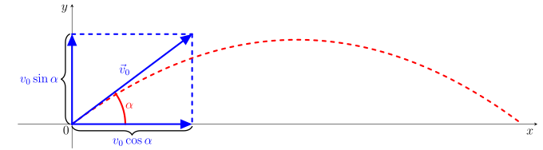

# Odpal golfového míčku

Chceme-li popsat trajektorii odpáleného golfového míčku, je potřeba si připomenout pár věcí týkajících se šikmého vrhu. Šikmý vrh je nejobecnější způsob uvedení tělesa v homogenním tíhovém
poli do pohybu.  Předpokládejme, že hmotný bod byl šikmo vržen v
prostředí bez odporu počáteční rychlostí $v_0$, přičemž příslušný vektor počáteční rychlosti $\vec {v}_0$ svírá s
vodorovnou rovinou úhel $\alpha \in \left(0,\frac{\pi}{2}\right)$. V kartézské soustavě souřadnic bude pro tento vektor platit (viz obrázek)

$$\vec{v}_0=(v_0\cos\alpha;v_0\sin\alpha).$$

Pohyb tělesa je ovlivněn tíhovým zrychlením o velikosti $g$ mířícím
svisle dolů. Ve vodorovném směru na těleso nepůsobí žádná složka tíhového zrychlení, a proto je pohyb ve vodorovném směru rovnoměrný. Naopak, ve směru svislém se pohyb odehrává pod vlivem tíhového zrychlení. Proto pro vektor $\vec{v}=(v_x;v_y)$ okamžité rychlosti v čase $t \geq 0$ platí 

$$
\begin{aligned}
        v_x=v_x(t) &= v_0 \cos\alpha,\\
        v_y=v_y(t) &= v_0\sin\alpha-gt.
\end{aligned}
$$

Pro souřadnice $[x;y]$ polohy hmotného bodu v čase $t \geq 0$ tedy bude platit 

$$
\begin{aligned}
        x = x(t) &= v_0 t\cos\alpha,\\
        y = y(t) &= v_0t\sin\alpha-\frac{1}{2}gt^2,
\end{aligned}\tag{1}
$$

protože okamžitá rychlost v čase $t$ je derivací polohy v čase $t$. Přesněji, $v_x(t)=x'(t)$ a $v_y(t)=y'(t)$. 

Nyní přejděme ke slíbenému odpalu golfového míčku. 

Hráč golfu odpaluje míček počáteční rychlostí $v_0$ pod úhlem $\alpha \in \left(0,\frac{\pi}{2}\right)$. Předpokládejme, že na míček nepůsobí žádné odporové síly. Pohyb míčku tedy splňuje podmínky pro
pohyb šikmo vrženého tělesa v prostředí bez odporu vzduchu.

>**Úloha 1.**  Dokažte, že trajektorií golfového míčku je část paraboly.

\iffalse

*Řešení.* Chceme nalézt rovnici trajektorie ve tvaru $y=f(x)$. Proto je nutné převést parametrické vyjádření (1) této trajektorie na obecnou rovnici. 

Nejprve vyjádříme z první rovnice čas $t$, tj. $t=\frac{x}{v_0\cos\alpha}$, a
dosadíme ho do rovnice druhé:

$$
 y = v_0\sin\alpha\, \frac{x}{v_0\cos\alpha} -\frac{1}{2}g\frac{x^2}{v_0^2\cos^2\alpha}= -\frac{g}{2v_0^2\cos^2\alpha}\cdot x^2+\frac{\sin\alpha}{\cos\alpha}\cdot x
$$

Odtud vidíme, že funkce $f$ popisující trajektorii míčku je kvadratická funkce 

$$
 f(x)=Ax^2+Bx, 
$$

kde 

$$
 A=-\frac{g}{2v_0^2\cos^2\alpha} \quad \text{a} \quad 
 B=\frac{\sin\alpha}{\cos\alpha}.
$$

Grafem funkce $f$ je parabola. Tím je dokázáno, že trajektorie golfového míčku je jistou částí této paraboly. 

\fi

>**Úloha 2.** Vypočítejte maximální výšku $y_{\text{max}}$, do které se dostane odpálený míček.

\iffalse

*Řešení.* Pro výpočet maximální výšky, do které se dostane odpálený míček, potřebujeme najít extrém funkce $f$ popisující trajektorii míčku:

$$
 f(x) = -\frac{g}{2v_0^2\cos^2\alpha}\cdot x^2+\frac{\sin\alpha}{\cos\alpha}\cdot x
$$

Vypočítáme derivaci funkce $f$:

$$
f'(x) = -\frac{g}{2v_0^2\cos^2\alpha}\cdot2x+\frac{\sin\alpha}{\cos\alpha}
$$

Pro nalezení stacionárního bodu položíme derivaci rovnu nule a
dostaneme rovnici

$$
\frac{g}{v_0^2\cos^2\alpha}\cdot x=\frac{\sin\alpha}{\cos\alpha}.
$$

Jejím řešením je

$$
x_{0}=\frac{v_0^2\sin\alpha\cos\alpha}{g}.
$$

Vzhledem k tomu, že funkce $f$ je konkávní kvadratickou  funkcí, musí být nalezený stacionární bod $x_{0}$ i bodem jejího (lokálního i globálního) maxima. 
 
Maximální výšku $y_{\text{max}}$ vypočítáme dosazením $x_{0}$ do funkce $f$. Po jednoduchých úpravách obdržíme  

$$
 y_{\text{max}}=f(x_{0})=\frac{v_0^2\sin^2\alpha}{2g}.
$$

\fi

> **Úloha 3.** Určete, jaký musí být úhel $\alpha$, aby (při dané počáteční rychlosti) míček doletěl do maximální vzdálenosti.

\iffalse

*Řešení.* Pro výpočet úhlu maximálního dostřelu potřebujeme získat $x$-ovou
souřadnici $x_d$ místa dopadu jako funkci úhlu $\alpha$ a tuto funkci
maximalizovat, tj. najít maximum funkce $x_d$. Vzhledem k
tomu, že při dopadu míčku bude jeho výška nulová, položíme ve vztahu 

$$
 y = -\frac{g}{2v_0^2\cos^2\alpha}\cdot x^2+\frac{\sin\alpha}{\cos\alpha}\cdot x
$$

$y=0$ a vyřešíme získanou rovnici: 

$$
\begin{aligned}
 0 &= -\frac{g}{2v_0^2\cos^2\alpha}\cdot x^2+\frac{\sin\alpha}{\cos\alpha}\cdot x \\[3mm]
 0 &= x\cdot\left(-\frac{g}{2v_0^2\cos^2\alpha}\cdot x+\frac{\sin\alpha}{\cos\alpha}\right)
\end{aligned}
$$

Tato rovnice v součinovém tvaru má dvě řešení. První 
řešení $x=0$ odpovídá místu odpalu míčku a druhé řešení $x_d$ místu dopadu. 
Snadno se vidí, že 

$$
x_d = x_d(\alpha) = \frac{2v_0^2\sin\alpha\cos\alpha}{g}=\frac{v_0^2}{g}\sin2\alpha.
$$ 

Nyní je nutné nalézt maximum funkce $x_d$. 
To je ale snadné, neboť pro $\alpha \in \left(0,\frac{\pi}{2}\right)$ je hodnota $\sin 2\alpha$ maximální, právě když 
$\alpha=\frac{\pi}{4}$. 

Maximálního dostřelu tedy docílíme při odpalu míčku pod úhlem
$\alpha=\frac{\pi}{4}$ a míček dopadne do vzdálenosti

$$
x_d \left(\frac{\pi}{4} \right) =\frac{v_0^2}{g}\sin\left(2\cdot \frac{\pi}{4} \right)=\frac{v_0^2}{g}.
$$ 

Funkci $x_d(\alpha) = \frac{v_0^2}{g}\sin2\alpha$ jsme mohli získat i snadněji využitím 
symetrie paraboly. Vrchol paraboly totiž leží uprostřed trajektorie míčku. 
Proto pro místo dopadu $x_{d}$ platí $x_d = 2\cdot x_{0}$, kde $x_0$ je hodnota vypočtená v úloze 2. 
Tím se vyhneme řešení kvadratické rovnice v součinovém tvaru získané dosazením $y=0$ do vztahu $y=f(x)$.

\fi

> **Doplňující otázky k rozmyšlení.** Rozmyslete si, jak by se situace změnila v případě, že golfový míček odpalujeme z vyvýšeného místa, které se nachází ve výšce $h$ nad okolním terénem. 
>
>1) Bude trajektorií stále nějaká část paraboly? 
>2) Do jaké maximální výšky míček vyletí? 
>3) Jak daleko míček doletí? 
>4) Pod jakým úhlem je třeba (při dané počáteční rychlosti) míček odpálit, aby dolétl co nejdále? 

\iffalse

*Odpověď na otázku 1.*
Pro souřadnice $[x;y]$ polohy míčku v čase $t \geq 0$ bude v tomto případě platit

$$
\begin{aligned}
       x &= v_0 t\cos\alpha,\\
       y &= h+v_0t\sin\alpha-\frac{1}{2}gt^2.
\end{aligned}\tag{2}
$$

Podobně jako v úloze 1 bychom došli k závěru, že trajektorie je částí grafu funkce $f$ dané předpisem 

$$
 y = h+v_0\sin\alpha\, \frac{x}{v_0\cos\alpha} -\frac{1}{2}g\frac{x^2}{v_0^2\cos^2\alpha}, 
$$

tj. 

$$
 y = -\frac{g}{2v_0^2\cos^2\alpha}\cdot x^2+\frac{\sin\alpha}{\cos\alpha}\cdot x + h. 
$$

Tato kvadratická funkce se od kvadratické funkce odvozené v úloze 1 liší pouze v absolutním členu (jejich grafy jsou vzájemně posunuté o $h$ ve směru osy $y$).  

*Odpověď na otázku 2.*
Při výpočtu maximální dosažené výšky odpáleného míčku dojdeme ke vztahu 

$$
x_{0}=\frac{v_0^2\sin\alpha\cos\alpha}{g}, 
$$

který je stejný jako vztah odvozený dříve v úloze 2. To souvisí s tím, že derivace konstantní funkce je funkce nulová (rozmyslete si). 

 Dosazením $x_{0}$ do funkce $f$ pak dojdeme k tomu, že 

$$
 y_{\text{max}}=f(x_{0})=h+\frac{v_0^2\sin^2\alpha}{2g}.
$$

*Odpověď na otázku 3.*
Ve vztahu 

$$
 y = -\frac{g}{2v_0^2\cos^2\alpha}\cdot x^2+\frac{\sin\alpha}{\cos\alpha}\cdot x + h 
$$

položíme $y=0$ a získáme opět kvadratickou rovnici

$$
 -\frac{g}{2v_0^2\cos^2\alpha}\cdot x^2+\frac{\sin\alpha}{\cos\alpha}\cdot x + h = 0. 
$$

 Tentokrát však tato rovnice není v součinovém tvaru, a proto ji budeme řešit použitím obecného vzorce pro nalezení kořenů kvadratické rovnice. Nejprve však bude dobré z rovnice odstranit zlomky vynásobením výrazem $-2v_0^2 \cos^2\alpha$. Získáme tak kvadratickou rovnici 

 $$
 gx^2-2v_0^2\sin\alpha \cos\alpha \cdot x - 2hv_0^2 \cos^2\alpha = 0.
 $$

Tato rovnice má dvě řešení: 

$$
x_{1,2}=\frac{2v_0^2\sin\alpha \cos\alpha \pm \sqrt{4v_0^4\sin^2\alpha \cos^2\alpha+8ghv_0^2\cos^2\alpha}}{2g}
$$
 
Úpravou dostaneme  

$$
x_{1,2}=\frac{v_0\cos\alpha}{g} \cdot \left( v_0\sin\alpha \pm \sqrt{v_0^2\sin^2\alpha+2gh}\right). 
$$

Není těžké si rozmyslet, že jeden z kořenů (konkrétně ten se znaménkem mínus) je záporný, a proto naší úloze vyhovuje jen jeden kořen (se znaménkem plus). To znamená, že odpálený golfový míček doletí do vzdálenosti 

$$
x_d = \frac{v_0\cos\alpha}{g} \cdot \left( v_0\sin\alpha + \sqrt{v_0^2\sin^2\alpha+2gh}\right).
$$

Všimněme si, že v případě $h=0$ dostaneme vztah 

$$
x_d = \frac{v_0\cos\alpha}{g} \cdot \left( v_0\sin\alpha + \sqrt{v_0^2\sin^2\alpha}\right)=
\frac{v_0\cos\alpha}{g} \cdot 2v_0\sin\alpha=
\frac{v_0^2}{g} \sin 2\alpha, 
$$

který byl odvozen už dříve v úloze 3. 

*Odpověď na otázku 4.*
Zde je situace mnohem složitější. Museli bychom totiž hledat maximum funkce  

$$
x_d(\alpha) = \frac{v_0\cos\alpha}{g} \cdot \left( v_0\sin\alpha + \sqrt{v_0^2\sin^2\alpha+2gh}\right), 
$$

což by bylo poměrně komplikované. Přeskočme tedy odvození a uveďme si jen výsledek. Maximum nastává pro úhel $\alpha$ splňující rovnost  

$$
\sin\alpha = \frac{v_0}{\sqrt{2v_0^2+2gh}}. 
$$

Vidíme, že v tomto případě optimální úhel závisí na počáteční rychlosti $v_0$ golfového míčku, výšce $h$ místa, ze kterého míček odpalujeme, a dokonce i na tíhovém zrychlení $g$. 

Můžeme si ale všimnout, že v případě $h=0$ se poslední vztah změní na 

$$
\sin\alpha = \frac{v_0}{\sqrt{2v_0^2}}=\frac{\sqrt{2}}{2},  
$$

což odpovídá dříve nalezenému optimálnímu úhlu $\alpha=\frac{\pi}{4}$. 

\fi

## Literatura

1. Kubera, Miroslav; Nečas, Tomáš; Beneš, Vojtěch. *Online učebnice
   fyziky pro gymnázia - Vrhy* [online]. Dostupné z
   <https://e-manuel.cz/kapitoly/pouziti-pohybovych-zakonu/vyklad/vrhy/>
   [cit. 27.9.2023].
2. Moc, Ondřej; Eisenmann, Petr. *Šikmý vrh z rozhledny*
   [online]. Dostupné z
   <https://mfi.upol.cz/files/26/2602/mfi_2602_129_137.pdf>
   [cit. 27.9.2023]

## Odkazy
* Vrh šikmý - https://cs.wikipedia.org/wiki/Vrh_%C5%A1ikm%C3%BD
