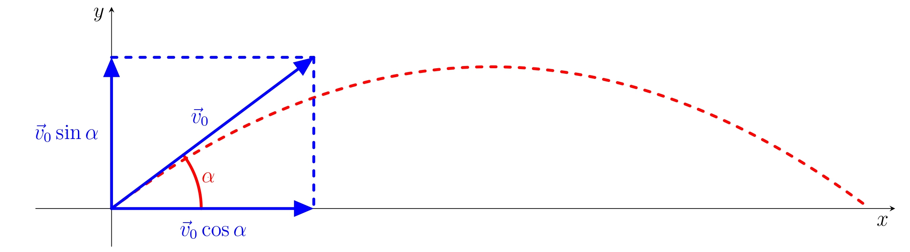

---
keywords:
- optymalizacja
- równanie kwadratowe
- wyprowadzenie
is_finished: True
---

# Strzał piłką golfową

## Skośny ruch pocisku

Ruch pocisku jest najbardziej ogólnym sposobem wprawiania w ruch obiektu znajdującego się w jednorodnym polu grawitacyjnym. Załóżmy, że ciało (masa punktowa) jest wyrzucane ukośnie w przestrzeń bez oporu. Prędkość początkowa wynosi $\vec{v}_0$, a kąt pomiędzy wektorem $\vec{v}_0$ i kierunkiem poziomym wynosi
\alfa$. Wprowadźmy kartezjański układ współrzędnych z poziomą osią $x$ i pionową osią $y$, jak pokazano na rysunku. Współrzędne
wektora prędkości początkowej są następujące $$\vec{v}_0=(v_0\cos\alpha,v_0\sin\alpha).$$

Ruch ciała jest regulowany przez przyspieszenie grawitacyjne $g$
skierowane pionowo w dół. Pozioma składowa przyspieszenia grawitacyjnego
wynosi zero, dlatego ruch w kierunku
poziomym pozostaje bez wpływu pola grawitacyjnego.
Pionowa składowa ruchu jest pod wpływem
ujemnego przyspieszenia $-g$. Stąd jest to ruch ze stałym
(równomiernym) opóźnieniem i prędkością początkową $v_0t\sin\alpha$.

Możemy użyć wzorów na odległość ruchu ze stałą prędkością
i stałym przyspieszeniu do ilościowego określenia współrzędnych
punktu masy. W ten sposób otrzymujemy

$$
\begin{aligned}
        x(t) &= v_0 t\cos\alpha,\\
        y(t) &= v_0t\sin\alpha-\frac{1}{2}gt^2.
\end{aligned}\tag{1}
$$

## Ruch piłki golfowej

Golfista uderza piłkę z prędkością początkową $v_0$. Kąt
między prędkością początkową a płaszczyzną poziomą wynosi
$\alpha$ . Załóżmy, że siła oporu jest pomijalna. Ruch
kuli spełnia warunki ruchu pocisku wystrzelonego pod kątem w środowisku bez oporu powietrza.

> **Ćwiczenie 1.** Udowodnij, że trajektoria piłki golfowej podąża ścieżką paraboliczną.

\iffalse

*Rozwiązanie:* Znajdz równanie trajektorii w postaci
$y=f(x)$ . Konieczne jest wyeliminowanie parametru $t$ z układu (1).

Rozwiązujemy pierwsze równanie względem czasu
$t=\frac{x}{v_0\cos\alpha}$ 
i podstawiamz do drugiego równania:
$$y(x) = v_0\sin\alpha\,\frac{x}{v_0\cos\alpha} -\frac{1}{2}g\frac{x^2}{v_0^2\cos^2\alpha}= -\frac{g}{2v_0^2\cos^2\alpha}\cdot x^2+\frac{\sin\alpha}{\cos\alpha}\cdot x\ .$$
Stąd widzimy, że współrzędna $y$ trajektorii jest funkcją
kwadratową współrzędnej $x$, a trajektoria piłki golfowej jest zatem opisana przez parabolę.

\fi

> **Ćwiczenie 2.** Oblicz wysokość rzutu, tj. maksymalną wysokość piłki golfowej.
>wysokość $y_{max}$ jaką osiągnie wystrzelona kula.

\iffalse

*Rozwiązanie:* Wysokość rzutu (ruch pocisku)  to maksimum funkcji
z poprzedniego ćwiczenia:
$$f\colon y = -\frac{g}{2v_0^2\cos^2\alpha}\cdot x^2+\frac{\sin\alpha}{\cos\alpha}\cdot x\ .$$

Pochodną funkcji $f$ obliczamy jako

$$
y'=-\frac{g}{2v_0^2\cos^2\alpha}\cdot2x+\frac{\sin\alpha}{\cos\alpha}\ .
$$

Aby znaleźć punkt stacjonarny, ustawiamy pochodną równą zero i
otrzymujemz równanie

$$
\frac{g}{v_0^2\cos^2\alpha}\cdot x=\frac{\sin\alpha}{\cos\alpha}\ .
$$

Rozwiązaniem tego równania jest

$$
x_{max}=\frac{v_0^2\sin\alpha\cos\alpha}{g}\ .
$$

Ponieważ trajektoria ruchu jest wklęsłą funkcją kwadratową,
zlokalizowany punkt stacjonarny jest maksimum, a współrzędna pionowa tego punktu jest wysokością rzutu.

Wysokość rzutu oblicza się poprzez obliczenie funkcji $f$
w uzyskanej współrzędnej $x_{max}$:

$$y_{max}=\frac{v_0^2\sin^2\alpha}{2g}\ .$$

\fi

> **Ćwiczenie 3.** Biorąc pod uwagę stałą prędkość początkową, znajdź kąt
> $\alpha$ który gwarantuje maksymalną odległość między punktem początkowym a
> punktem końcowym trajektorii.

\iffalse

*Rozwiązanie* Aby znaleźć maksymalny kąt zasięgu, musimy uzyskać
punkt końcowy $x_d$ trajektorii jako funkcję kąta

$\alpha$ i znaleźć maksimum funkcji $x_d(\alpha)$ Biorąc pod uwagę
że $y=0$, gdy piłka uderza w ziemię, znajdujemy zero funkcji

$$y(x) = -\frac{g}{2v_0^2\cos^2\alpha}\cdot x^2+\frac{\sin\alpha}{\cos\alpha}\cdot x.$$

Stąd otrzymujemy:

$$0 = -\frac{g}{2v_0^2\cos^2\alpha}\cdot x^2+\frac{\sin\alpha}{\cos\alpha}\cdot x\ ,$$

$$0 = x\cdot\left(-\frac{g}{2v_0^2\cos^2\alpha}\cdot x+\frac{\sin\alpha}{\cos\alpha}\right)\ .$$

To równanie ma dwa rozwiązania.
Pierwsze rozwiązanie
$x=0$ odpowiada miejscu wystrzelenia piłki, a drugie rozwiązanie $x_d$ do miejsca uderzenia

$$
x_d(\alpha) = \frac{2v_0^2\sin\alpha\cos\alpha}{g}=\frac{v_0^2}{g}\sin2\alpha\ .
$$ 

Teraz musimy znaleźć maksimum funkcji $x_d(\alpha)$. Wystarczy
znaleźć punkt stacjonarny, ponieważ wykazano, że trajektoria
jest parabolą, która otwiera się w dół. Obliczamy
pochodną funkcji $x_d(\alpha)$ względem $\alpha$

$$
x_d'(\alpha)=\frac{v_0^2}{g}\cdot\cos2\alpha\cdot 2\ .
$$ 

Ustawiając pochodną równą zero, otrzymujemy
$\cos2\alpha=0$, który jest spełniony dla $2\alpha=90^\circ$ (
piłka zostanie wystrzelona, oczywiście
$\alpha\in\langle0^\circ,90^\circ\rangle$, więc rozwiązanie jest
jednoznaczne). Tak więc punkt stacjonarny to $\alpha=45^\circ$.

Maksymalny zasięg w golfie osiąga się uderzając piłkę pod kątem
$\alpha=45^\circ$ a piłka ląduje w odległości

$$
x_d(45^\circ) =\frac{v_0^2}{g}\sin(2\cdot45^\circ)=\frac{v_0^2}{g}.
$$ 

Należy zauważyć, że możliwe jest uzyskanie funkcji 
$x_d(\alpha) =
\frac{v_0^2}{g}\sin2\alpha$ bez rachunku różniczkowego, wykorzystując symetrię
paraboli. Wierzchołek paraboli znajduje się w
środku punktów zerowych. Dlatego współrzędna $x
punktu uderzenia można określić ilościowo jako $x_d(\alpha) = 2\cdot x_{max}$.  
Pozwala nam to uniknąć rozwiązywania równania kwadratowego otrzymanego przez podstawienie
$y=0$ do funkcji $y(x)$ i faktoryzując prawą stronę.

\fi

## Literatura

1. Kubera, Miroslav; Nečas, Tomáš; Beneš, Vojtěch. *Podręcznik online
fizyka dla szkół średnich - Linie* [online]. Dostępne pod adresem
<https://e-manuel.cz/kapitoly/pouziti-pohybovych-zakonu/vyklad/vrhy/>.
[cytowany 2023 września 27].
2. Moc, Ondřej; Eisenmann, Petr. *Pochyły szczyt z wieży*.
[online]. Dostępne pod adresem
<https://mfi.upol.cz/files/26/2602/mfi_2602_129_137.pdf>
[cytowany 27.9.2023]

