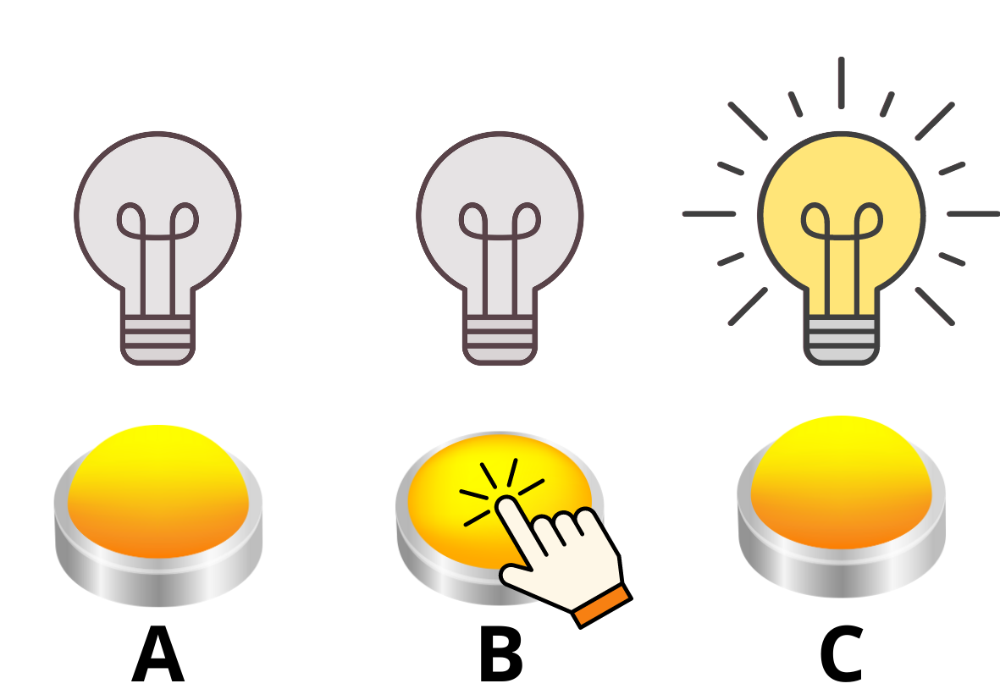
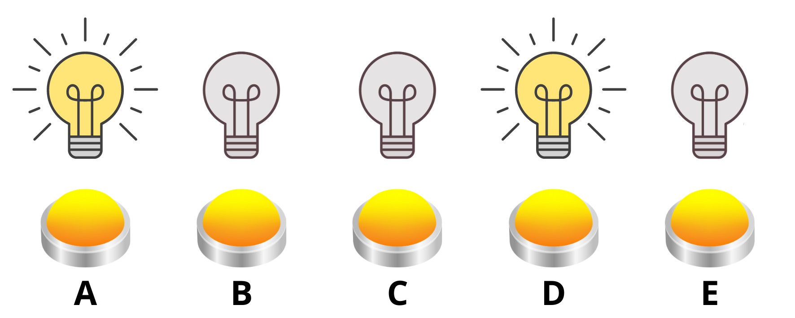
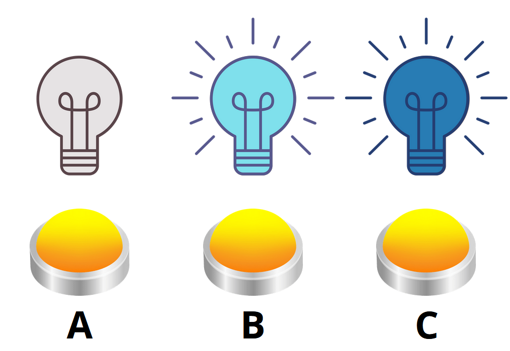

---
keywords:
- rovnice a nerovnice
- konečné lineární hry
- soustavy rovnic
- modulární aritmetika
is_finished: true
difficulty: 2
time: 40
---

# Konečné lineární hry   

Mnoho počítačových i mobilních her je 
založených na bázi hádanek, ve kterých je k 
dosažení cíle třeba provést určitou kombinaci 
tahů, například pomačkat některé z nabízených 
spínačů, aby fungoval jimi řízený stroj. 
Takové spínače mají navíc konečný počet 
stavů, v nichž se mohou nacházet: jsou buď 
zapnuté, nebo vypnuté. Uveďme si to na 
příkladu žárovky. Ta buď svítí, nebo nesvítí, 
a její spínač tak provádí pouze dvě akce. 
Když je žárovka vypnutá, prvním zmáčknutím 
spínače ji zapneme a druhým opět vypneme. V 
informatice je takových systémů, které mají 
omezený počet stavů, mnoho, a konkrétně hry, 
v nichž je potřeba uvedeným způsobem navolit 
optimální kombinaci tahů, díky níž dostaneme 
správný výsledek, se nazývají konečné 
lineární hry.

## Hra se třemi žárovkami

Představme si síť tří žárovek, které jsou pro 
začátek všechny vypnuté a pod každou z nich 
je spínací tlačítko. Každé z tlačítek změní 
stav (zapne nebo vypne) žárovky nad sebou 
a současně žárovek s ní přímo sousedících. 
Pojmenujeme-li žárovky a k nim příslušná 
tlačítka A, B, C, potom stisknutím tlačítka A 
se rozsvítí žárovka A, ale protože je na 
kraji, společně s ní se rozsvítí už jen 
žárovka B. Totéž platí pro žárovku C, také má 
souseda jen po jedné straně, takže stisknutím 
tlačítka C se rozsvítí žárovky C a B. Pouze 
žárovka B sousedí s A i C, proto tlačítko B 
mění stav všech tří žárovek.

Na následujících třech obrázcích můžeme 
sledovat, jak by se žárovky postupně 
rozsvěcovaly a zhasínaly při postupném 
stisknutí tlačítek A a B.  Důležité je si 
uvědomovat, že nezáleží na pořadí, v němž 
jsou tlačítka zmáčknuta. Můžeme si 
představit, že kdybychom nejprve stiskli B, 
rozsvítí se všechny žárovky, a následný stisk 
A zhasne žárovky A a B, takže zůstane svítit 
pouze C.

Pro následující úlohy je stěžejní pojem 
konečného počtu. V případě žárovek, které 
vždy buď svítí, nebo nesvítí, můžeme 
identifikovat několik situací, které se buď 
dějí („ano“), nebo nedějí („ne“), a protože 
jsme v matematice, místo slov můžeme používat 
značení: ano = 1, ne = 0, tj.

- žárovka svítí (1), nebo nesvítí (0),
- tlačítko danou žárovku ovládá (1), nebo na ni nemá vliv (0),
- tlačítko zmáčkneme (1), nebo jej nevyužijeme (0).

V tomto označení navíc platí $1+1=0$ 
nebo také $2k=0$, $k\in\mathbb{Z}$, a 
současně $1=-1$. V případě žárovek totiž platí, že když dvakrát zmáčkneme 
stejné tlačítko, příslušnou žárovku to 
rozsvítí a zase zhasne (nebo naopak), takže 
se dostane do původního stavu a vychází to 
nastejno, jako kdybychom toto tlačítko 
nezmáčkli vůbec.

Vliv jednotlivých tlačítek na všechny žárovky 
můžeme zapsat vektorově. Vektory $\textbf{a}$, 
$\textbf{b}$, $\textbf{c}$ budou popisovat činnost tlačítek A, B, C. Každá souřadnice vektoru popisuje příslušnou žárovku v pořadí: první A, druhá B, třetí C. Označení 1 znamená, že 
tlačítko mění stav dané žárovky, a 0, že na 
ni nemá vliv. Podle uvedených vlastností 
tlačítek platí

$$
\textbf{a}=\begin{bmatrix}1\\1\\0\end{bmatrix},\quad \textbf{b}=\begin{bmatrix}1\\1\\1\end{bmatrix},\quad
\textbf{c}=\begin{bmatrix}0\\1\\1\end{bmatrix}.
$$

Pomocí vektorů lze popsat i konkrétní stavy 
žárovek. Žárovka svítí: 1, nebo nesvítí: 0. 
Počáteční stav, kdy nesvítí žádná žárovka, by 
popsal vektor 
$$
\textbf{s}=\begin{bmatrix}
0\\0\\0\end{bmatrix}.
$$
Následným stisknutím tlačítek A a B jsme se dostali ke třetímu
obrázku. Vektorově zapsáno za využití sčítání v soustavě popisující stav žárovek platí

$$
\textbf{s}+\textbf{a}+\textbf{b}=
\begin{bmatrix}0\\0\\0\end{bmatrix}+
\begin{bmatrix}1\\1\\0\end{bmatrix}+
\begin{bmatrix}1\\1\\1\end{bmatrix}=
\begin{bmatrix} 0+1+1 \\ 0+1+1 \\ 0+0+1 \end{bmatrix}=
\begin{bmatrix}0\\0\\1\end{bmatrix}.
$$

> **Úloha 1.** Určete kombinaci tlačítek, 
>které je potřeba stisknout, aby svítily 
>pouze žárovky A a C, pokud jsou na počátku 
>všechny tři žárovky zhasnuté.

\iffalse

*Řešení.* Hledaný výsledný stav lze popsat vektorem 
$$
\textbf{t}=\begin{bmatrix}1\\0\\1\end{bmatrix}.
$$ 
Úlohu vyřešíme jako soustavu lineárních rovnic 
$$\textbf{s} + x_1\textbf{a} + x_2\textbf{b} + x_3\textbf{c} = \textbf{t},
$$
kde vektory ${\textbf{a}}$, ${\textbf{b}}$, ${\textbf{c}}$
popisují, které žárovky jsou daným tlačítkem ovládány, jak bylo
uvedeno výše, a proměnné $x_1, x_2, x_3$ nabývají hodnot 1 nebo 0
podle toho, zda příslušné tlačítko využijeme, či nikoliv.

Napoprvé soustavu uvedeme i s nulovými 
koeficienty, aby bylo jasně vidět, jak jsou 
do soustavy přepsány souřadnice vektorů ${\textbf{a}}$, ${\textbf{b}}$, ${\textbf{c}}$.

$$
\begin{aligned}
0 + 1x_1 + 1x_2 + 0x_3 &= 1\\
0 + 1x_1 + 1x_2 + 1x_3 &= 0\\
0 + 0x_1 + 1x_2 + 1x_3 &= 1
\end{aligned}
$$

Soustavu řešíme například dosazovací metodou:

$$
\begin{alignedat}{3}
x_1 &+ x_2& &&     &= 1 \Rightarrow x_1 = 1-x_2\\
x_1 &+ x_2& &+ x_3&&= 0\\
    &&  x_2 &+ x_3&&= 1 \Rightarrow x_3 = 1-x_2
\end{alignedat}
$$

Dosadíme do druhé rovnice:

$$
\begin{aligned}
(1-x_2) + x_2 + (1-x_2) &= 0\\
2 - x_2 &= 0\\
x_2 &= 2,
\end{aligned}
$$

ale protože pracujeme v naší soustavě máme 
$2=0$, platí $x_2 = 0$. Dosazením dostáváme 
$x_1=1, x_3=1$, což znamená, že máme zmáčknout 
tlačítka A a C, abychom docílili toho, že budou 
svítit žárovky A a C a žárovka B bude zhasnutá.

*Poznámka.* Úlohy pro tři žárovky lze velice 
snadno vyřešit z hlavy, jelikož každé tlačítko 
mačkáme nanejvýš jednou. Víckrát to ani nemá 
smysl, když dvě zmáčknutí stejného tlačítka 
vycházejí stejně jako žádné zmáčknutí. V 
následující úloze proto zvětšíme počet žárovek, 
to však povede na soustavu více než tří 
lineárních rovnic o více než třech neznámých, 
které už se v běžné výuce matematiky 
pravděpodobně nepočítají. Úlohy proto mohou 
posloužit do speciálního semináře, ve kterém 
jsou žáci seznámeni s maticovým počtem a mohou 
ho tím procvičit na konkrétní slovní úloze.

\fi

> **Úloha 2.** Síť žárovek rozšíříme na pět 
>kusů a tlačítka mají stále stejnou vlastnost, 
>že ovládají žárovku nad sebou a její přímé 
>sousedy. Na počátku nejsou všechny žárovky 
>zhasnuty, ale už svítí žárovky A a D.
>
>
>
>Zjistěte, jakou kombinaci tlačítek zmáčknout, 
>aby na konci 
>- byly všechny žárovky zhasnuté,
>- svítila pouze žárovka E.

\iffalse

*Řešení.* Kromě počtu lineárních rovnic a 
proměnných v soustavě se řešení bude lišit také 
pozměněným počátečním stavem, kdy všechny 
žárovky nejsou ve stavu 0 = zhasnuté. Počáteční 
stav můžeme zapsat vektorem

$$
\textbf{s} = \begin{bmatrix}1\\0\\0\\1\\0\end{bmatrix}
$$
a chování tlačítek A až E popisují vektory
$$
\textbf{a}=\begin{bmatrix}1\\1\\0\\0\\0\end{bmatrix},\quad \textbf{b}=\begin{bmatrix}1\\1\\1\\0\\0\end{bmatrix},\quad
\textbf{c}=\begin{bmatrix}0\\1\\1\\1\\0\end{bmatrix},\quad
\textbf{d}=\begin{bmatrix}0\\0\\1\\1\\1\end{bmatrix},\quad
\textbf{e}=\begin{bmatrix}0\\0\\0\\1\\1\end{bmatrix}.
$$

Pokud chceme, aby všechny žárovky byly zhasnuté, tak řešíme soustavu rovnic

$$
\textbf{s} + x_1\textbf{a} + x_2\textbf{b} + x_3\textbf{c} + x_4\textbf{d} + x_5\textbf{e}= \textbf{t},
$$
kde
$$
\textbf{s} = \begin{bmatrix}1\\0\\0\\1\\0\end{bmatrix}, \quad  \textbf{t} = \begin{bmatrix}0\\0\\0\\0\\0\end{bmatrix}.
$$

Vektor ${\textbf{s}}$ převedeme na pravou stranu

$$
x_1\textbf{a} + x_2\textbf{b} + x_3\textbf{c} + x_4\textbf{d} + x_5\textbf{e}= \textbf{t} - \textbf{s},
$$
a zapíšeme soustavu pěti lineárních rovnic o pěti neznámých
$$
\begin{alignedat}{8}
 x_1 &+& &x_2& &&   &&   &&   &&   && &= 0-1 \\
 x_1 &+& &x_2& &+& &x_3& &&   &&   && &= 0 \\
     &&  &x_2& &+& &x_3& &+& &x_4& && &=0 \\
     &&   &&   &&  &x_3& &+& &x_4& &+& x_5 &=0-1 \\
     &&   &&   &&   &&   &&  &x_4& &+& x_5 &=0 
\end{alignedat}
$$
Při řešení pamatujeme na to, že v námi uvažované soustavě platí $-1=1$ a
$2=0$. Soustava má dvě řešení, jimiž jsou uspořádané pětice
$(0,1,1,0,0)$ a $(1,0,1,1,1)$.

Má-li na konci svítit pouze žárovka E, platí 
$$
\textbf{t} = \begin{bmatrix}0\\0\\0\\0\\1\end{bmatrix}.
$$
Po pár úpravách (sčítací metodou nebo při práci 
s maticemi Gaussovou eliminační metodou) bychom 
zjistili, že pro takové zadání soustava nemá řešení. Nelze tedy žárovky z původního stavu, kdy svítí pouze A a D, dostat do stavu, 
aby svítila samotná žárovka E.

\fi

> **Úloha 3.** Nové, modře svítící žárovky se 
>od předchozích liší tím, že mohou svítit ve 
>dvou různých odstínech modré. Pokud je tato 
>žárovka zhasnutá, prvním stisknutím tlačítka, 
>které ji ovládá, se rozsvítí světle modře, 
>druhým stisknutím tmavě modře a po třetím 
>stisknutí opět zhasne. Tlačítka mají stále 
>stejnou vlastnost, tedy ovládají žárovku nad 
>sebou a její přímé sousedy. Kolikrát musíte 
>stisknout které z tlačítek A, B a C, abyste ze 
>stavu na obrázku všechny žárovky 
>zhasli?
> 

\iffalse

*Řešení.* Protože mají žárovky nyní tři stavy, v jakých mohou být,
přesouváme se k následujícímu značení a uvažování. Označme žárovka
„nesvítí“ = 0, „svítí světle modře“ = 1 a „svítí tmavě modře“ = 2. 
A platí $3k=0$, $k\in\mathbb{Z}$, $3l+1=1$, $l\in\mathbb{Z}$ a $3m+2=2$, $m\in\mathbb{Z}$

Tlačítka A, B, C však danou žárovku mohou pouze 
ovládat, nebo neovládat, žádná třetí možnost 
není, proto platí stále stejně

$$
\textbf{a}=\begin{bmatrix}1\\1\\0\end{bmatrix},\quad \textbf{b}=\begin{bmatrix}1\\1\\1\end{bmatrix},\quad
\textbf{c}=\begin{bmatrix}0\\1\\1\end{bmatrix}.
$$

Pro počáteční stav ${\textbf{s}}$ a 
požadovaný závěrečný stav ${\textbf{t}}$ platí

$$
\textbf{s} = \begin{bmatrix}0\\1\\2\end{bmatrix}, \quad \textbf{t} = \begin{bmatrix}0\\0\\0\end{bmatrix}.
$$

Podle již uvedeného zápisu 

$$
\textbf{s} + x_1\textbf{a} + x_2\textbf{b} + x_3\textbf{c} = \textbf{t},
$$
můžeme sestavit soustavu tří lineárních rovnic
$$
\begin{aligned}
0 + 1x_1 + 1x_2 + 0x_3 &= 0\\
1 + 1x_1 + 1x_2 + 1x_3 &= 0\\
2 + 0x_1 + 1x_2 + 1x_3 &= 0
\end{aligned}
$$
a vyřešíme ji.
$$
\begin{alignedat}{3}
x_1 &+ x_2& &&     &= 0 \\
x_1 &+ x_2& &+ x_3&&= -1\\
    &&  x_2 &+ x_3&&= -2 
\end{alignedat}
$$
Z prvního a třetího řádku vyjádříme $x_1$ a $x_3$ v závislosti na $x_2$
$$
\begin{aligned}
    x_1 &= -x_2\\
    x_3 &= -2-x_2
\end{aligned}
$$
a dosadíme do druhé rovnice
$$
\begin{aligned}
    -x_2 + x_2 -2-x_2 &= -1 \\
    -x_2 &= 1 \\
     x_2 &= -1.
\end{aligned}
$$
Jelikož platí $3k=0$, $k\in\mathbb{Z}$, 
$3l+1=1$, $l\in\mathbb{Z}$ a $3m+2=2$, $m\in\mathbb{Z}$, tedy $-1=2$ nebo 
také $-2=1$, a proto $x_2 = 2$, $x_1 = -2 = 1$ a $x_3 = -1 = 2$.

Výsledkem je, že když jednou zmáčkneme tlačítko A, 
dvakrát tlačítko B a dvakrát tlačítko C, z 
původního stavu na obrázku všechny žárovky zhasneme.

\fi

*Poznámka:* Vzdělanější matematik si všimne, že vlastně počítáme se zbytkovýmí třídami a provadíme aritmetiku nad $(\mathbb{Z}_2,+)$, resp. $(\mathbb{Z}_3,+)$. Řešení úloh ovšem fungují i bez zavádění těchto struktur.
