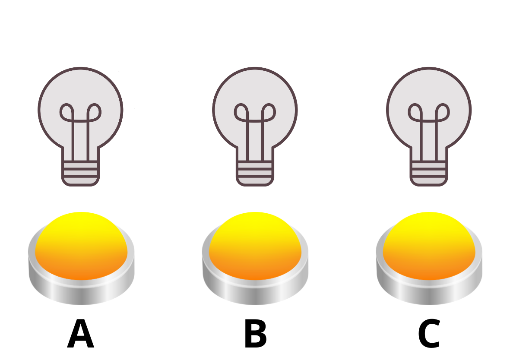

---
keywords:
- finite linear games
- systems of equations
- modular arithmetic
is_finished: False
---

# Finite linear games

Many computer and mobile games are based on puzzles where achieving the goal requires performing a certain combination of
moves. For example, flipping some of the offered switches to activate a
device controlled by them.  Moreover, such systems of switches usually have a finite number of states, with the switches mainly being either on
or off.  Let's take a light bulb as an example. It is either
on or off, so its switch only performs two actions.  When the bulb is
off, the first use of the switch turns it on, and the second use turns it off. In computer science, there are many such systems that
have a limited number of states. Specifically, the games in which it is necessary to
set up the optimal combination of moves to bring the system to the desired state are called finite linear games.

<!-- Tento odstaveček jsem potřebovala více přeformulovat.  Část mi nedávala správný smysl – musím řici ani v češtině. Změn jsem udělala více, ale ne vše zvládnu zde zdůvodňovat.  Pokud by jste s navrženými změnami nesouhlasili , něco nedávalo smysl, můžeme změny probrat osobně. 
Např. v angličtině raději třeba “flip the switch”  ale ne “press the switch”
když “press” tak  “button” aj. …-->

## Game with three light bulbs

Imagine a circuit with three light bulbs that are initially all turned off, each with a switch button underneath. Each of these buttons changes
the state (turns on or off) of the bulb above it and at the same time the
two bulbs directly adjacent to it.  If we name the bulbs and their
corresponding buttons A, B, C, then pressing button A will light bulb
A, but because it is on the edge, only bulb B will light up with it. The
same applies to bulb C, it also only has one neighbour, so
pressing button C will light up bulbs C and B. Only bulb B is adjacent
to both A and C, so button B changes the state of all three bulbs.
<!-- “network of light bulbs” je divné slovní spojení. Běžně se používá v češtině I v angličtině “obvod se žárovkami” tj. “circuit with light buulbs”.
V tomto odstavečku je použito “switches A,B,C” zatímco v dalším  odstavci “buttons A, B, C”, tak měním pro konzistenci na “buttons” -->

In the following three images, we can observe how the light bulbs
would gradually turn on and off when buttons A and B are pressed sequentially.  It is important to realize that the order in which the buttons
are pressed does not matter.  We can imagine that if we first pressB, all the bulbs will light up, and then pressing A will turn off
bulbs A and B, so only the bulb C stays lit up.

For the following exercises, the key concept is the existence of a finite number of possible states. In the case of light bulbs that are always either on or
off, we can identify several situations, which either occur
("yes") or do not occur ("no"), and since we are in math, instead of words, we can use binary notation: yes = 1, no = 0, i.e.,

- the bulb is on (1) or off (0),
- the button controls the respective bulb (1) or has no effect on it (0),
- the button is prssed(1) or not used (0).

In addition, in the binary system holds $1+1=0$, $1+0=1$, 
or equivalently  $2k=0$, $2k+1=1$ for $k\in\mathbb{Z}$, and also $1=-1$. In the case of light bulbs, this translates into the following: 
If we press the same button twice, 
the corresponding bulb turns on and off (or vice versa). 
It goes back to its original state, and it is the same, 
as if we hadn't pressed the button at all.

The effect of each button on all bulbs can be represented by a vector. Vectors $\textbf{a}$, $\textbf{b}$, $\textbf{c}$
will describe the effects of buttons A, B, C respectively.
Each coordinate of a vector corresponds to the bulb in the given order: first coordinate - bulb A, second coordinate - bulb B, third coordinate – bulb C.  The number 1 in a coordinate of a vector
means that the button changes the state of that bulb, and 0 means it
has no effect on it. According to the above button properties, the
following applies:

$$
\textbf{a}=\begin{bmatrix}1\\1\\0\end{bmatrix},\quad \textbf{b}=\begin{bmatrix}1\\1\\1\end{bmatrix},\quad
\textbf{c}=\begin{bmatrix}0\\1\\1\end{bmatrix}.
$$

The vectors can also be used to describe the actual states of all bulbs. The bulb is lit: 1, or bulb is not lit: 0. 
The initial state, when no bulb is lit, is described by the vector: 
$$
\textbf{s}=\begin{bmatrix}
0\\0\\0\end{bmatrix}.
$$
By pressing buttons A and B subsequently, we arrived at the state illustrated in the third picture.
Using vectors, this can be expressed by vector addition with addition of coordinates done in the binary system.
$$
\textbf{s}+\textbf{a}+\textbf{b}=
\begin{bmatrix}0\\0\\0\end{bmatrix}+
\begin{bmatrix}1\\1\\0\end{bmatrix}+
\begin{bmatrix}1\\1\\1\end{bmatrix}=
\begin{bmatrix} 0+1+1 \\ 0+1+1 \\ 0+0+1 \end{bmatrix}=
\begin{bmatrix}0\\0\\1\end{bmatrix}.
$$

> **Exercise 1.** Determine the button combination to light up bulbs A and C only, starting from the initial state where all three bulbs are off.

*Solution.* The desired resulting state is described by the vector 
$$
\textbf{t}=\begin{bmatrix}1\\0\\1\end{bmatrix}.
$$ 
We solve the problem as a system of linear equations: 
$$\textbf{s} + x_1\textbf{a} + x_2\textbf{b} + x_3\textbf{c} = \textbf{t},
$$
where the vectors ${\textbf{a}}$, ${\textbf{b}}$, ${\textbf{c}}$ describe
which bulbs are controlled by the respective buttons, as stated above,
and the variables $x_1, x_2, x_3$ take values 1 or 0 depending on whether we use the corresponding button or not

At first, we present the system including the zero coefficients, 
to make clear how the coordinates of the vectors 
${\textbf{a}}$, ${\textbf{b}}$, and ${\textbf{c}}$ are rewritten into the system.
The system is:
$$
\begin{aligned}
0 + 1x_1 + 1x_2 + 0x_3 &= 1\\
0 + 1x_1 + 1x_2 + 1x_3 &= 0\\
0 + 0x_1 + 1x_2 + 1x_3 &= 1
\end{aligned}
$$

We solve the system, for instance, using the substitution method:

$$
\begin{alignat*}{3}
x_1 &+ x_2& &&     &= 1 \Rightarrow x_1 = 1-x_2\\
x_1 &+ x_2& &+ x_3&&= 0\\
    &&  x_2 &+ x_3&&= 1 \Rightarrow x_3 = 1-x_2
\end{alignat*}
$$

Substituting into the second equation:

$$
\begin{aligned}
(1-x_2) + x_2 + (1-x_2) &= 0\\
2 - x_2 &= 0\\
x_2 &= 2,
\end{aligned}
$$

but in the binary system $2=0$, so $x_2 = 0$. Substituting back, we get $x_1=1, x_3=1$, meaning  we have to press buttons A and C to achieve  that bulbs A and C lit up while bulb B remains off.

*Note.* The problems for three bulbs can be easily solved mentally since each button can be pressed at most once. 
Pressing the same button more than once doesn't make sense as pressing it twice yields the same result as not pressing it at all. In the following problem, we therefore increase the number of bulbs, 
but this will lead to a system of more than three 
linear equations with more than three unknowns, 
which is likely beyond the scope of typical mathematics classes.
Therefore, these problems can be used in a special seminar 
in which students are introduced to matrix calculus 
and can thus practise it on specific word problems.

> **Exercise 2.** We extend the bulb circuit to five bulbs.
>The buttons still have the same property of controlling the bulb above them and its immediate neighbours.
>Initially, not all the bulbs are off,
>but bulbs A and D are already lit.
>
>
>
>Find out what combination of buttons to press to end up with 
>- all the bulbs off,
>- only bulb E remains lit.

*Solution.* Besides the number of linear equations 
and variables in the system, the solution will also differ 
 due to the modified initial state, 
where not all the bulbs are in the state 0 = off.
The initial state can be represented by the vector
$$
\textbf{s} = \begin{bmatrix}1\\0\\0\\1\\0\end{bmatrix}
$$
and the behaviour of buttons A through E is described by vectors
$$
\textbf{a}=\begin{bmatrix}1\\1\\0\\0\\0\end{bmatrix},\quad \textbf{b}=\begin{bmatrix}1\\1\\1\\0\\0\end{bmatrix},\quad
\textbf{c}=\begin{bmatrix}0\\1\\1\\1\\0\end{bmatrix},\quad
\textbf{d}=\begin{bmatrix}0\\0\\1\\1\\1\end{bmatrix},\quad
\textbf{e}=\begin{bmatrix}0\\0\\0\\1\\1\end{bmatrix}.
$$

If we want all the bulbs to be off, we solve the following system of equations

$$
\textbf{s} + x_1\textbf{a} + x_2\textbf{b} + x_3\textbf{c} + x_4\textbf{d} + x_5\textbf{e}= \textbf{t},
$$
where
$$
\textbf{s} = \begin{bmatrix}1\\0\\0\\1\\0\end{bmatrix}, \quad  \textbf{t} = \begin{bmatrix}0\\0\\0\\0\\0\end{bmatrix}.
$$

We move the vector ${\textbf{s}}$ to the right side

$$
x_1\textbf{a} + x_2\textbf{b} + x_3\textbf{c} + x_4\textbf{d} + x_5\textbf{e}= \textbf{t} - \textbf{s},
$$
and we write down a system of five linear equations with five unknowns
$$
\begin{alignat*}{8}
 x_1 &+& &x_2& &&   &&   &&   &&   && &= 0-1 \\
 x_1 &+& &x_2& &+& &x_3& &&   &&   && &= 0 \\
     &&  &x_2& &+& &x_3& &+& &x_4& && &=0 \\
     &&   &&   &&  &x_3& &+& &x_4& &+& x_5 &=0-1 \\
     &&   &&   &&   &&   &&  &x_4& &+& x_5 &=0 
\end{alignat*}
$$
While doing computations, remember that in the binary system $-1=1$ and $2=0$. 
When solving this system, one of the equations will result to have all coefficients zeros. If we were working in an infinite calculus, allowing computations with all real numbers, this system would have infinite number of solutions. 
<!-- "That  normally means, that the system has infinitely many solutions." Tohle tvrzení je nepravdivé, matematicky špatně, proto ho vypouštím. -->  
However, in finite calculus, performing calculations in the binary system, this is not the case.
Our system has exactly two solutions, which are the following two vectors of order five
$(0,1,1,0,0)$ a $(1,0,1,1,1)$.

If only bulb E is to remain lit, the following vector represents the final state
$$
\textbf{t} = \begin{bmatrix}0\\0\\0\\0\\1\end{bmatrix}.
$$
After a few steps using the addition method or 
the Gaussian elimination method (working with matrices) 
we would find that one of the equations of the system has no solution. Therefore, the whole system has no solution for this assignment.
That is why we cannot turn the bulbs from their original state, 
where only A and D are lit, to the state where bulb E alone is lit.

> **Exercise 3.** In this exercise, the new, blue-glowing light bulbs differ from the previous ones in that
> they can glow in two different shades of blue.
>When such bulb is off, the first press of the button, 
>which controls it, will make it glow in light blue, 
>the second press in dark blue, and the third press turns it off again.
>The buttons still have the same property of controlling the bulb above them and its immediate neighbours.
>How many times and which of the buttons A, B and C, do you have to press 
>to turn off all the bulbs from the initial state shown in the picture?
> 
*Solution.* Because the bulbs now have three states 
they can be in, we switch to counting
in the ternary system. Let's denote the bulb "is off" = 0, 
"glows light blue" = 1, and "glows dark blue" = 2.

However, buttons A, B, C can still only control the given bulb, or not control it. There is no a third option, so still the same applies

$$
\textbf{a}=\begin{bmatrix}1\\1\\0\end{bmatrix},\quad \textbf{b}=\begin{bmatrix}1\\1\\1\end{bmatrix},\quad
\textbf{c}=\begin{bmatrix}0\\1\\1\end{bmatrix}.
$$

For the initial state ${\textbf{s}}$ and 
the desired final state ${\textbf{t}}$ the following holds true

$$
\textbf{s} = \begin{bmatrix}0\\1\\2\end{bmatrix}, \quad \textbf{t} = \begin{bmatrix}0\\0\\0\end{bmatrix}.
$$

According to the above notation we have

$$
\textbf{s} + x_1\textbf{a} + x_2\textbf{b} + x_3\textbf{c} = \textbf{t},
$$
and we can set up a system of three linear equations
$$
\begin{aligned}
0 + 1x_1 + 1x_2 + 0x_3 &= 0\\
1 + 1x_1 + 1x_2 + 1x_3 &= 0\\
2 + 0x_1 + 1x_2 + 1x_3 &= 0
\end{aligned}
$$
and solve it.
$$
\begin{aligned}
x_1 &+ x_2& &&     &= 0 \\
x_1 &+ x_2& &+ x_3&&= -1\\
    &&  x_2 &+ x_3&&= -2 
\end{aligned}
$$
From the first and third row we express $x_1$ and $x_3$ in terms of  $x_2$
$$
\begin{aligned}
    x_1 &= -x_2\\
    x_3 &= -2-x_2
\end{aligned}
$$
and substitute into the second equation
$$
\begin{aligned}
    -x_2 + x_2 -2-x_2 &= -1 \\
    -x_2 &= 1 \\
     x_2 &= -1.
\end{aligned}
$$
In the ternary system $3k=0$, $k\in\mathbb{Z}$, 
$3l+1=1$, $l\in\mathbb{Z}$, and $3m+2=2$, $m\in\mathbb{Z}$, so $-1=2$ and $-2=1$, and therefore $x_2 = 2$, $x_1 = -2 = 1$, and $x_3 = -1 = 2$.

As a result, by pressing button A once, button B twice, and
button C twice, we turn off all the bulbs from the original state shown in the picture.
