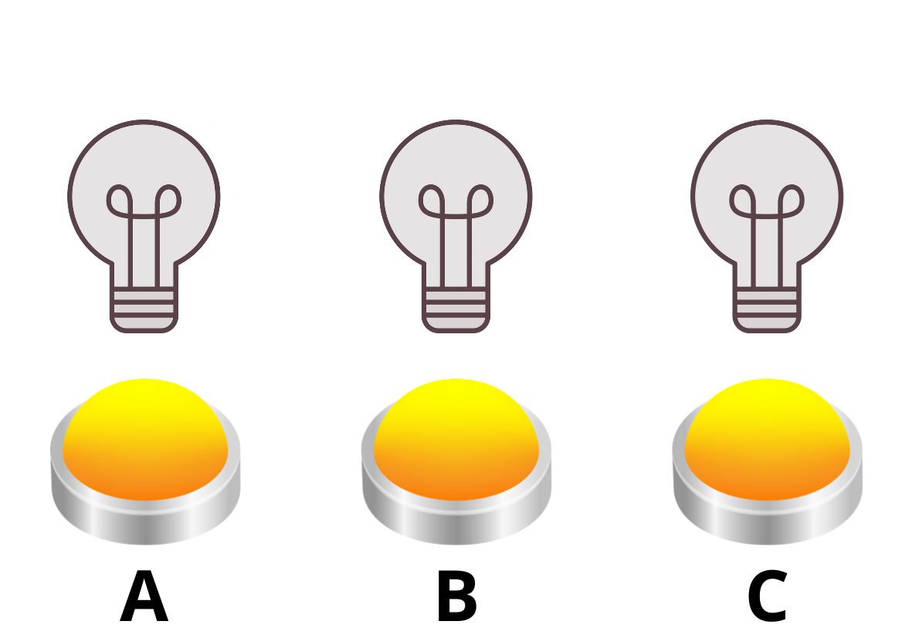
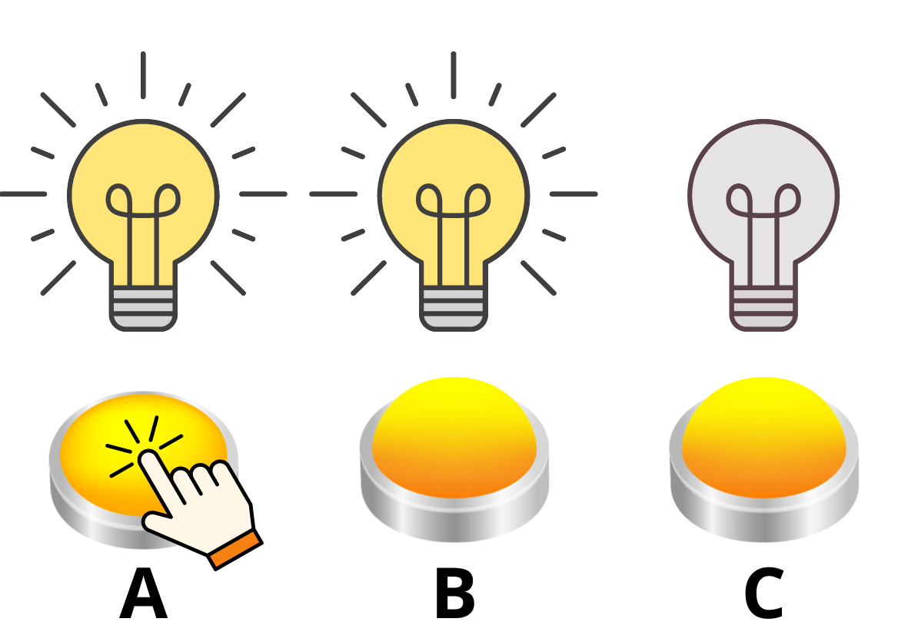
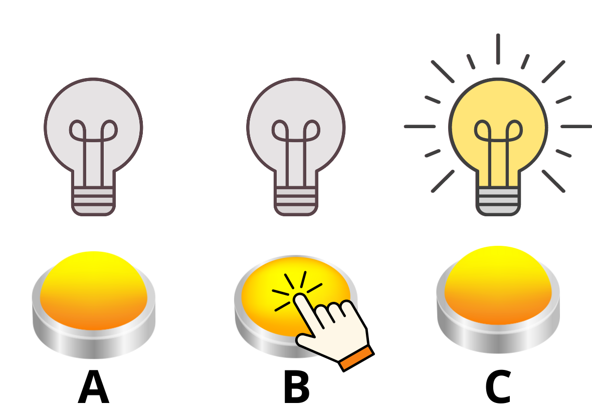
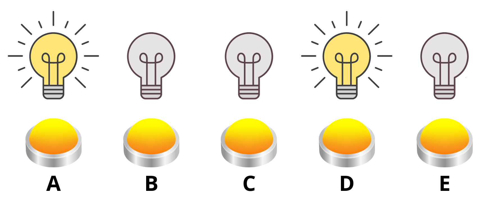
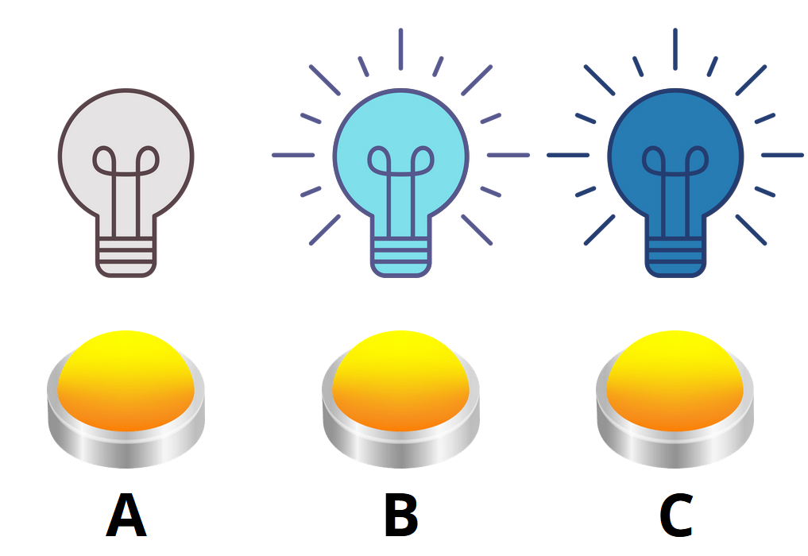

---
keywords:
- ecuaciones e inecuaciones
- juegos lineales finitos
- sistemas de ecuaciones
- aritmética modular
is_finished: true
---

# Juegos lineales finitos

Muchos juegos de ordenador y móvil se basan en rompecabezas, en los que hay que realizar una determinada combinación de movimientos para lograr un objetivo, por ejemplo, pulsar alguno de los interruptores que se ofrecen para que funcione la máquina que controlamos. Estos interruptores también tienen un número finito de estados en los que se pueden encontrar: encendidos o apagados. Tomemos el ejemplo de una bombilla. Puede estar encendida o apagada, por lo que su interruptor sólo realiza dos acciones. Cuando la bombilla está apagada, la primera pulsación del interruptor la enciende y la segunda la apaga de nuevo. En informática, hay muchos sistemas de este tipo que tienen un número limitado de estados y, en general, los juegos en los que la combinación óptima de movimientos para obtener el resultado correcto debe elegirse de la forma anterior se denominan juegos lineales finitos.

## El juego de las tres bombillas

Imaginemos una red de tres bombillas que, para empezar, están todas apagadas y debajo de cada una de ellas hay un interruptor. Cada uno de los interruptores cambia al mismo tiempo el estado (encendido o apagado) de la bombilla que tiene encima y de las bombillas directamente adyacentes. Si denominamos A, B, C a las bombillas y sus correspondientes interruptores, al pulsar el botón A se encenderá la bombilla A, pero como está en el borde, sólo se encenderá la bombilla B junto con ella. Lo mismo ocurre con la bombilla C, también tiene una vecina en un solo lado, por lo que al pulsar el botón C se encenderán las bombillas C y B. Sólo la bombilla B es adyacente tanto a A como a C, por lo que el botón B cambia el estado de las tres bombillas.

En las tres imágenes siguientes, podemos ver cómo las bombillas se encienden y se apagan gradualmente cuando se pulsan los interruptores A y B en secuencia. Es importante señalar que el orden en que se pulsan los interruptores es indiferente. Podemos imaginar que si pulsáramos primero B, se encenderían todas las bombillas, y una pulsación posterior de A apagaría las bombillas A y B, dejando sólo encendida C.

El concepto de número finito es fundamental en los siguientes problemas. En el caso de las bombillas, que siempre están encendidas o apagadas, podemos identificar varias situaciones que se dan («sí») o no se dan («no»), y como estamos en matemáticas, podemos utilizar notación binaria en lugar de palabras: sí = 1, no = 0, es decir: 

- la bombilla está encendida (1) o apagada (0), 
- el interruptor controla la bombilla (1) o no tiene ningún efecto (0), 
- el interruptor está pulsado (1) o no se utiliza (0). 

Además, en este caso vale que  $1+1=0$
o también $2k=0$, $k\in\mathbb{Z}$, y al mismo tiempo $1=-1$.
En el caso de las bombillas, esto se manifiesta por el hecho de que si pulsamos dos veces el mismo interruptor, la bombilla correspondiente se enciende y se vuelve a apagar (o viceversa), por lo que vuelve a su estado original y queda igual que si no hubiéramos pulsado el interruptor. 

El efecto de cada interruptor sobre todas las bombillas puede escribirse como un vector. Los vectores  $\textbf{a}$, $\textbf{b}$, $\textbf{c}$
will describe the operation of buttons A, B, C describirán el funcionamiento de los botones A, B, C en secuencia, de modo que cada coordenada del vector describe a su vez la bombilla correspondiente en el orden de primero A, segundo B, tercero C. Un 1 significa que el interruptor cambia el estado de la bombilla, y un 0 significa que no tiene ningún efecto sobre la bombilla. Según las propiedades de los interruptores, se procede de la siguiente manera:

$$
\textbf{a}=\begin{bmatrix}1\\1\\0\end{bmatrix},\quad \textbf{b}=\begin{bmatrix}1\\1\\1\end{bmatrix},\quad
\textbf{c}=\begin{bmatrix}0\\1\\1\end{bmatrix}.
$$

Los vectores también pueden utilizarse para describir estados específicos de la bombilla. La bombilla está encendida: 1, o no está encendida: 0. El estado inicial, cuando no hay ninguna bombilla encendida, se describiría mediante el vector  
$$
\textbf{s}=\begin{bmatrix}
0\\0\\0\end{bmatrix}.
$$
Pulsando los interruptores A y B, llegamos a la tercera imagen. El vector obtenido por adición en el sistema que describe el estado de las bombillas es:

$$
\textbf{s}+\textbf{a}+\textbf{b}=
\begin{bmatrix}0\\0\\0\end{bmatrix}+
\begin{bmatrix}1\\1\\0\end{bmatrix}+
\begin{bmatrix}1\\1\\1\end{bmatrix}=
\begin{bmatrix} 0+1+1 \\ 0+1+1 \\ 0+0+1 \end{bmatrix}=
\begin{bmatrix}0\\0\\1\end{bmatrix}.
$$

> **Problema 1.** Determina la combinación de interruptores que deben pulsarse para encender únicamente las bombillas A y C si inicialmente las tres bombillas están apagadas.

\iffalse

*Solución.* El estado resultante de la búsqueda puede describirse mediante un vector 
$$
\textbf{t}=\begin{bmatrix}1\\0\\1\end{bmatrix}.
$$ 
Resolvemos el problema como un sistema de ecuaciones lineales  
$$\textbf{s} + x_1\textbf{a} + x_2\textbf{b} + x_3\textbf{c} = \textbf{t},
$$
donde los vectores ${\textbf{a}}$, ${\textbf{b}}$, ${\textbf{c}}$ describen qué bombillas están controladas por el interruptor, como se ha mencionado anteriormente, y las variables $x_1, x_2, x_3$ toman los valores 1 or 0, dependiendo de si se utiliza el interruptor o no.

La primera vez, también presentaremos el sistema con coeficientes nulos para ver claramente cómo se transcriben las coordenadas de los vectores a, b, c en el sistema. 
${\textbf{a}}$, ${\textbf{b}}$, ${\textbf{c}}$.

$$
\begin{aligned}
0 + 1x_1 + 1x_2 + 0x_3 &= 1\\
0 + 1x_1 + 1x_2 + 1x_3 &= 0\\
0 + 0x_1 + 1x_2 + 1x_3 &= 1
\end{aligned}
$$

Por ejemplo, resolvemos el sistema por el método de la suma:

$$
\begin{alignedat}{3}
x_1 &+ x_2& &&     &= 1 \Rightarrow x_1 = 1-x_2\\
x_1 &+ x_2& &+ x_3&&= 0\\
    &&  x_2 &+ x_3&&= 1 \Rightarrow x_3 = 1-x_2
\end{alignedat}
$$

Se añade a la segunda ecuación:

$$
\begin{aligned}
(1-x_2) + x_2 + (1-x_2) &= 0\\
2 - x_2 &= 0\\
x_2 &= 2,
\end{aligned}
$$

pero como estamos trabajando en nuestro sistema tenemos $2=0$, por lo que $x_2 = 0$.  Por adición obtenemos $x_1=1, x_3=1$, lo que significa que tenemos que pulsar los interruptores A y C para que las bombillas A y C se enciendan y la bombilla B se apague.

\fi

*Observación.* Los problemas para tres bombillas se pueden resolver muy fácilmente de memoria, ya que cada interruptor se pulsa como máximo una vez - no tiene sentido hacerlo más de una vez, ya que dos pulsaciones del mismo interruptor dan el mismo resultado que si no se pulsa. En el siguiente problema, por tanto, aumentamos el número de bombillas, pero esto conducirá a un sistema de más de tres ecuaciones lineales con más de tres incógnitas, que probablemente ya no se resuelvan en las clases normales de matemáticas. Por tanto, los problemas pueden utilizarse en un seminario especial en el que se introduzca a los alumnos en el cálculo matricial y puedan así practicarlo en un problema de términos específicos.

> **Problema 2.** Ampliamos la red a cinco bombillas y los interruptores siguen teniendo la misma propiedad de controlar la bombilla que tienen encima y sus vecinas más próximas. Inicialmente, no todas las bombillas están apagadas, sino que las bombillas A y D ya están encendidas.
>
>
>
>Averigua qué combinación de interruptores debes pulsar para que al final todas las bombillas estén apagadas/sólo la bombilla E permanezca encendida.

\iffalse

*Solución.* Además del número de ecuaciones lineales y variables en el sistema, la solución también diferirá por el estado inicial alterado donde todas las bombillas no están en el estado 0 = apagado. El estado inicial se puede describir con el vector

$$
\textbf{s} = \begin{bmatrix}1\\0\\0\\1\\0\end{bmatrix}
$$
y el comportamiento de los interruptores A a E se describe mediante los vectores
$$
\textbf{a}=\begin{bmatrix}1\\1\\0\\0\\0\end{bmatrix},\quad \textbf{b}=\begin{bmatrix}1\\1\\1\\0\\0\end{bmatrix},\quad
\textbf{c}=\begin{bmatrix}0\\1\\1\\1\\0\end{bmatrix},\quad
\textbf{d}=\begin{bmatrix}0\\0\\1\\1\\1\end{bmatrix},\quad
\textbf{e}=\begin{bmatrix}0\\0\\0\\1\\1\end{bmatrix}.
$$

Si queremos que todas las bombillas estén apagadas, resolvemos el sistema de ecuaciones

$$
\textbf{s} + x_1\textbf{a} + x_2\textbf{b} + x_3\textbf{c} + x_4\textbf{d} + x_5\textbf{e}= \textbf{t},
$$
donde
$$
\textbf{s} = \begin{bmatrix}1\\0\\0\\1\\0\end{bmatrix}, \quad  \textbf{t} = \begin{bmatrix}0\\0\\0\\0\\0\end{bmatrix}.
$$

Se transfiere el vector s al lado derecho ${\textbf{s}}$

$$
x_1\textbf{a} + x_2\textbf{b} + x_3\textbf{c} + x_4\textbf{d} + x_5\textbf{e}= \textbf{t} - \textbf{s},
$$
y se escribe un sistema de cinco ecuaciones lineales con cinco incógnitas
$$
\begin{alignedat}{8}
 x_1 &+& &x_2& &&   &&   &&   &&   && &= 0-1 \\
 x_1 &+& &x_2& &+& &x_3& &&   &&   && &= 0 \\
     &&  &x_2& &+& &x_3& &+& &x_4& && &=0 \\
     &&   &&   &&  &x_3& &+& &x_4& &+& x_5 &=0-1 \\
     &&   &&   &&   &&   &&  &x_4& &+& x_5 &=0 
\end{alignedat}
$$
Al resolver, recordemos que en el sistema que estamos considerando, $-1=1$ y $2=0$. 
El sistema tiene dos soluciones, que son los grupos de cinco ordenados
$(0,1,1,0,0)$ y $(1,0,1,1,1)$.

Si sólo la bombilla E ha de permanecer encendida, se cumple lo siguiente
$$
\textbf{t} = \begin{bmatrix}0\\0\\0\\0\\1\end{bmatrix}.
$$
Después de algunos ajustes (por el método de adición o trabajando con matrices por el método de eliminación de Gauss) nos encontraríamos con que una de las ecuaciones del sistema no tiene solución, y por tanto todo el sistema no tiene solución para este problema. De este modo, no podríamos conseguir que las bombillas pasaran de su estado original, en el que sólo están encendidas A y D, a un estado en el que sólo estuviera encendida la bombilla E.

\fi

> **Problema 3.** Las nuevas bombillas azules se diferencian de las anteriores en que pueden brillar en dos tonos diferentes de azul. Cuando se apaga esta bombilla, la primera pulsación del interruptor que la controla ilumina en azul claro, la segunda la vuelve azul oscuro y la tercera la apaga de nuevo. Los interruptores siguen teniendo la misma propiedad, es decir, controlan la bombilla que tienen encima y sus vecinas más próximas. ¿Cuántas veces debes pulsar cualquiera de los interruptores A, B y C para apagar todas las bombillas del estado que se muestra en la imagen?
> 
> 

\iffalse

*Solución.* Como ahora las bombillas pueden estar en tres estados, pasamos a contar en el sistema de ternas. Vamos a etiquetar la bombilla como "no encendida" = 0, 
"encendida azul claro" = 1 y "encendida azul oscuro" = 2.

Sin embargo, los interruptores A, B, C sólo pueden controlar o no controlar la bombilla, no hay una tercera opción, por lo que se aplica lo dicho anteriormente.

$$
\textbf{a}=\begin{bmatrix}1\\1\\0\end{bmatrix},\quad \textbf{b}=\begin{bmatrix}1\\1\\1\end{bmatrix},\quad
\textbf{c}=\begin{bmatrix}0\\1\\1\end{bmatrix}.
$$

Para el estado inicial  ${\textbf{s}}$ y 
el estado final ${\textbf{t}}$ deseado

$$
\textbf{s} = \begin{bmatrix}0\\1\\2\end{bmatrix}, \quad \textbf{t} = \begin{bmatrix}0\\0\\0\end{bmatrix}.
$$

Según la notación anterior

$$
\textbf{s} + x_1\textbf{a} + x_2\textbf{b} + x_3\textbf{c} = \textbf{t},
$$
podemos construir un sistema de tres ecuaciones lineales
$$
\begin{aligned}
0 + 1x_1 + 1x_2 + 0x_3 &= 0\\
1 + 1x_1 + 1x_2 + 1x_3 &= 0\\
2 + 0x_1 + 1x_2 + 1x_3 &= 0
\end{aligned}
$$
y resolverlo.
$$
\begin{aligned}
x_1 &+ x_2& &&     &= 0 \\
x_1 &+ x_2& &+ x_3&&= -1\\
    &&  x_2 &+ x_3&&= -2 
\end{aligned}
$$
A partir de la primera y tercera líneas, expresamos $x_1$ y $x_3$ en términos de $x_2$
$$
\begin{aligned}
    x_1 &= -x_2\\
    x_3 &= -2-x_2
\end{aligned}
$$
y las introducimos en la segunda ecuación
$$
\begin{aligned}
    -x_2 + x_2 -2-x_2 &= -1 \\
    -x_2 &= 1 \\
     x_2 &= -1.
\end{aligned}
$$
En un sistema ternario $3k=0$, $k\in\mathbb{Z}$, 
$3l+1=1$, $l\in\mathbb{Z}$ y $3m+2=2$, $m\in\mathbb{Z}$, por lo que $-1=2$ o 
también $-2=1$, y por tanto $x_2 = 2$, $x_1 = -2 = 1$ y $x_3 = -1 = 2$.

El resultado es que si pulsas el interruptor A una vez, el interruptor B dos veces y el interruptor C dos veces, todas las bombillas se apagarán a partir del estado original de la imagen.

\fi
