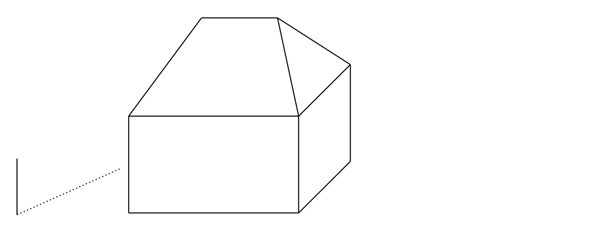
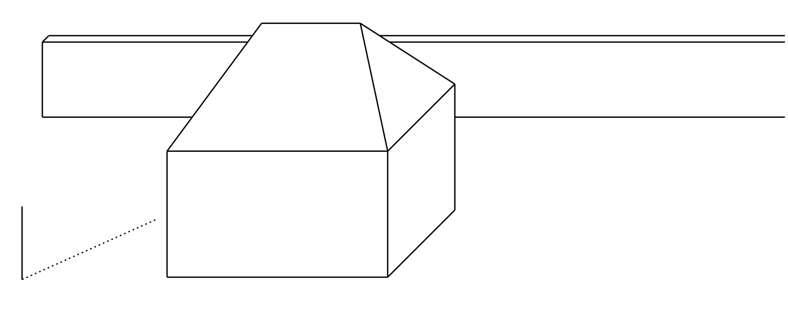
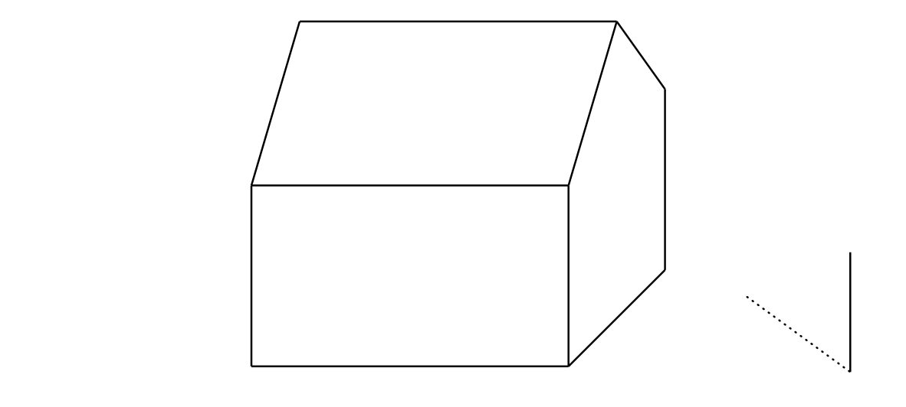

# Stín domu

Martin si chce rozvrhnout místo na plátně, aby mohl 
nakreslit dům za slunečného dne. Znázornil si proto ve 
volném rovnoběžném promítání jednoduchý model domu, 
který stojí na vodorovném pozemku, tvořený kvádrem s 
jednoduchou valbovou střechou. *Valbová střecha* je střecha domu 
tvořená dvěma rovnoramennými trojúhelníky a dvěma rovnoramennými 
lichoběžníky. Všechny čtyři střešní roviny mají stejný 
spád. Na plátně dále vedle domku umístil svislou tyč a její stín (viz obrázek).

Pro popis řešení budeme potřebovat následující pojmy:

* *Vlastní stín* objektu je neosvětlená část povrchu objektu. 
Uzavřená čára na povrchu objektu, která odděluje osvětlenou a 
neosvětlenou část, se nazývá *hranice vlastního stínu*.
* *Vržený stín* objektu je průmět objektu ve směru světelných 
paprsků do dané roviny. Platí, že *hranice vrženého stínu je vržený 
stín hranice stínu vlastního*

> **Úloha 1.** Vyznačte v obrázku vlastní stín domu a 
> stín vržený na zem Sluncem. Vzdálenost Slunce od povrchu Země je tak velká, že sluneční paprsky můžeme považovat za navzájem rovnoběžné.
>
>

\iffalse

*Řešení.* Označme $P$ patu tyče, $Q$ její horní konec a $R$ vržený 
stín bodu $Q$. Orientovaná úsečka $QR$ tak určuje směr a orientaci 
světelných paprsků, přímka $PR$ je pravoúhlý průmět přímky $QR$ do 
roviny země. Tu budeme v dalším textu označovat $\pi$. Označme dále 
vrcholy kvádru $ABCDEFGH$ a koncové body hřebene střechy 
označme $S$ a $T$.

Osvětlenou částí domu jsou levá boční a přední stěna kvádru a příslušné části střechy. Hranicí vlastního stínu je tak uzavřená lomená čára 
$ABFTSHDA$. K určení hranice vrženého stínu domu tak stačí 
sestrojit vržené stíny vrcholů této lomené čáry. Z nich $A$, $B$ a 
$D$ již v rovině $\pi$ leží a jsou tedy zároveň vlastními vrženými 
stíny. Stačí proto sestrojit vržené stíny bodů $F$, $T$, $S$ a 
$H$. 
 
Vržený stín bodu $T$ je průsečíkem světelného paprsku, který jím 
prochází, s kolmým průmětem tohoto paprsku do roviny $\pi$. 
Připomeňme, že směr světelných paprsků je určen přímkou $QR$ a 
směr kolmého průmětu paprsků do roviny $\pi$ je určen přímkou 
$PR$. Kolmý průmět paprsku dále prochází bodem $T_1$, který je 
kolmým průmětem bodu $T$ do roviny $\pi$. Označíme-li vržený stín 
bodu $T$ jako $T'$, jeho konstrukci znázorňuje obrázek.

Obdobně sestrojíme i vržené stíny $F'$, $S'$, $H'$ bodů $F$, $S$ a 
$H$. Hranicí vrženého stínu domu je pak mnohoúhelník 
$ABF'T'S'H'D$. Při stínování dále zohledníme viditelné části 
vlastního i vrženého stínu.

\fi

> **Úloha 2.** Narýsujte vržený stín domu, je-li za domem přítomná 
> neprůhledná zeď, která je rovnoběžná s přední a zadní stěnou 
> domu.
>
>

\iffalse

*Řešení.*  Vlastní stín domu, jeho hranice a vržené stíny bodů do roviny $\pi$, které se nachází z našeho pohledu před zdí, zůstanou nezměněny. Označme $\sigma$ 
rovinu, ve které leží přední stěna přidané zdi. Pro trojici bodů $T$, 
$S$ a $H$ je třeba sestrojit jejich vržené stíny do této roviny. 
Blíže popíšeme konstrukci opět jen pro bod $T$.

Uvažme body $T_1$ a $T'$ z minulé úlohy. Označme $\tau$ rovinu 
$TT_1T'$ a dále označme $U$ průsečík přímky $T_1T'$ a spodní hrany 
zdi (tj. $\sigma\cap\pi$). 

Tímto bodem musí procházet i průsečnice rovin $\sigma$ a $\tau$, 
tj. stín $T_1T$ vržený do roviny $\sigma$. Tato průsečnice navíc 
musí být svislá, protože $\tau$ i $\sigma$ jsou svislé. Vržený stín 
bodu $T$ do roviny $\sigma$ (označme jej $T''$) pak leží na řečené 
průsečnici a přímce $TT'$.

Podobně sestrojíme i vržené stíny $S''$, $H''$ bodů $S$ a $H$. 
Hranicí vlastního stínu je pak uzavřená lomená čára 
$ABF'KT''S''H''LDA$, kde $K$ (resp. $L$) leží na průsečnici rovin 
$\sigma$ a $\pi$ a dále leží na úsečce $F'T'$ (resp. $DH'$). Stínujeme pouze viditelné části vlastního i vrženého stínu, části stínu zakryté domem nestínujeme.

*Poznámka.* Pro lepší představu může pomoci také interaktivní 
applet v GeoGebře, kde je možné směr slunečních paprsků omezeně 
měnit, viz <https://www.geogebra.org/m/ecyqv4qg>

\fi

> **Úloha 3.** Vyznačte v obrázku vlastní stín domu a 
> stín vržený na zem Sluncem. Vzdálenost Slunce od povrchu Země je tak velká, že sluneční paprsky můžeme považovat za navzájem rovnoběžné.
>
>

\iffalse

*Řešení.*

 
\fi

## Literatura 

1. Pomykalová E. *Deskriptivní geometrie pro střední školy.* Prometheus. 2010. 106—107.
