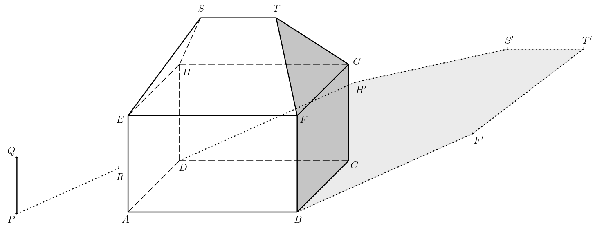

---
keywords:
- cabinet axonometry
- lighting
is_finished: False
---

# Shadow of House

Martin wants to set up a space on his canvas to draw a house on a sunny day.
Therefore, he visualized a simple model of a house 
in a parallel (orthographic) projection, standing on a horizontal flat ground. 
House is formed by a rectangular cuboid with a simple hip roof.
*Hip roof* is a roof formed by two isosceles triangles and two 
isosceles trapezoids. All four roof planes have the same slope. On a canvas next to the house, he placed a vertical rod and its shadow(see the figure).
<!--“cabinet axonometry” nejspíš není špatně, ale po zkoumání tohoto termínu si myslím, že patří do odborné technické praxe a na střední škole se to nepoužívá. Nejsem odborník na stereometrii, ale nějak si myslím, že na to co je v úloze použito stačí “parallel projection” nebo “orthographic projection” což by měly být termíny se kterými se stuenti ve stereometrii setkají.

“pole” měním na “rod” protože v dalším textu používáte termín “rod”, tak ať je název stejný, když jde pořád o stejnou tyč. -->

To describe the solution, we will need the following terms:

* *The self shadow* of an object is the unlit part of the object's surface.
A closed line on the surface of the object that separates the lit
and the unlit parts is called *the boundary of the self shadow*.
* *The cast shadow* of an object is the projection of the object
in the direction of the light rays onto the given plane.
It holds that *the boundary of the cast shadow is the cast shadow
of the boundary of the self shadow*

>**Exercise 1.** Mark on the figure  the self shadow of the house and 
>the shadow of the house cast on the ground by the sun. (The distance from the Sun to the surface of the Earth is so great that we can consider the sun rays to be parallel to each other.)
>

<!-- V první větě zadání doporučuji zůstat u termínu “figure”, když byl použit v prvním odstavci při odkazu na obrázek.  Tj . myslím je celkem jedno jestli budeme používat “picture” nebo “figure”, ale v rámci textu doporučuji konzistenci.
V české verzi je věta o tom, že paprsky slunce lze považovat za rovnoběžné, tak jsem ji přidala i do EN verze.-->

*Solution.* Let $P$ denote the base of the rod, $Q$ its upper end, and $R$ the cast shadow of point $Q$.
The oriented segment $QR$ thus determines the direction and orientation of the light rays.
The line $PR$ is the orthogonal projection of the line $QR$ into plane of the ground.
In the following text, we denote the plane of the ground by $\pi$. Next, let us denote the vertices of the rectangular cuboid $ABCDEFGH$ and denote the endpoints of the roof’s ridge by $S$ and $T$.

The illuminated part of the house includes the left side and the front side 
of the rectangular cuboid and the corresponding parts of the roof.
The boundary of the self shadow is thus the closed polygonal chain $ABFTSHDA$.
To determine the boundary of the cast shadow of the house, it is sufficient 
to construct the cast shadows of the vertices of this polygonal chain.
Of these, $A$, $B$ and $D$ already lie in the plane  $\pi$
and that's why they also are their own cast shadows. Therefore, 
it is sufficient to construct the cast shadows of points $F$, $T$, $S$, and $H$.

The shadow cast by point $T$ is the intersection of the light ray
passing through it with the perpendicular projection of this ray into
the plane $\pi$. Recall that the direction of the light rays is
determined by the line $QR$, and the direction of the
perpendicular projection of the rays into the plane $\pi$ is
determined by the line $PR$.
The perpendicular projection of the ray further passes through point $T_1$,
which is the perpendicular projection of the point $T$ onto the plane $\pi$.
If we denote the cast shadow of point $T$ as $T'$,
its construction is shown in the figure.

We construct the cast shadows $F'$, $S'$, $H'$ of the points $F$, $S$,
and $H$ similarly.
The boundary of the cast shadow of the house is then the polygon $ABF'T'S'H'D$. 
When shading, we consider only the visible parts of the self and cast shadows.

> **Exercise 2.** Draw the cast shadow of the house if there is an
> opaque wall behind the house, which is parallel to the front and
> back walls of the house.  

*Solution.* The house's self shadow, its boundary, and the cast shadows of
points into the plane $\pi$, which are from our prospective located in front of the wall, remain unchanged.  Let us denote by $\sigma$
the plane in which the front side of the added wall lies.
For the trio of points $T$, $S$, and $H$, it is necessary to
construct their cast shadows onto this plane.  We will describe the
construction only for  point $T$ again.

Consider the points $T_1$ and $T'$ from the previous exercise. 
Let $\tau$ denote the plane $TT_1T'$, and further let us denote 
by $U$ the intersection of the line $T_1T'$ 
and the bottom edge of the wall (i.e., $\sigma\cap\pi$). 

The intersection of the planes $\sigma$ and $\tau$ must also pass
through this point, i.e., the shadow $T_1T$ cast onto the 
plane $\sigma$.
Moreover, this intersection must be vertical because both $\tau$ and
$\sigma$ are vertical.
The cast shadow of the point $T$ into the  plane $\sigma$ (let's denote it by $T''$)
then lies on the said intersection and the line $TT'$.

We construct the cast shadows $S''$, $H''$ of points $S$ and $H$
similarly.  The boundary of the self shadow is then the closed
polygonal chain $ABF'KT''S''H''LDA$, where $K$ (resp. $L$) lies on the
intersection of the planes $\sigma$ and $\pi$, and also lies on the
segment $F'T'$ (resp. $DH'$).  We shade only the visible parts
of the self and cast shadows, we do not shade the parts of the
shadow obscured by the house.

*Note.* For better visualization, an interactive applet in GeoGebra may also help. 
In the applet, the direction of the sun's rays can be modified to a certain extent, see https://www.geogebra.org/m/ecyqv4qg

## Literature 

1. Pomykalová E. *Deskriptivní geometrie pro střední školy.* Prometheus. 2010. 106—107.
