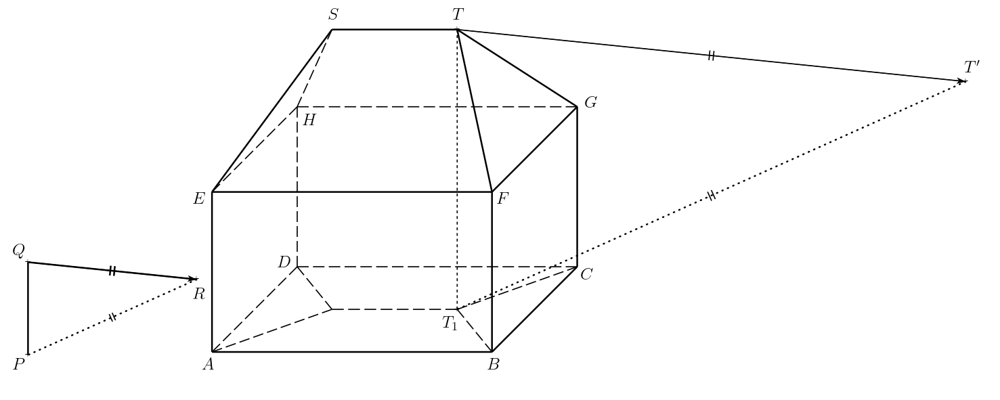
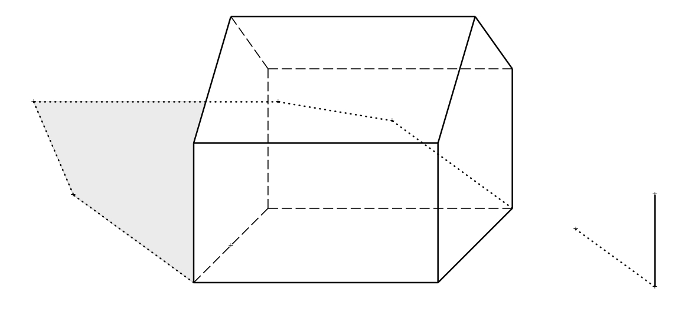

---
keywords:
- geometría en el espacio
- axonometría de armarios
- iluminación
is_finished: true
---

# La sombra de una casa

Martin quiere buscar un espacio en el lienzo para pintar una casa en un día soleado. Por tanto, visualiza un modelo sencillo de una casa en una proyección paralela (ortográfica), situada sobre un suelo plano horizontal. La casa está formada por un prisma rectangular con un tejado sencillo a cuatro aguas. 
*Un tejado a cuatro aguas * consiste en un tejado formado por dos triángulos isósceles y dos trapecios isósceles. Las cuatro figuras planas del tejado presentan la misma pendiente. Al lado de la casa, sobre el lienzo, coloca una varilla vertical y su sombra (ver la imagen).

Para describir la solución, necesitaremos los siguientes términos:

* *La sombra propia* de un objeto es la parte no iluminada de la superficie del objeto. La línea creada en la superficie del objeto que separa las partes iluminada y no iluminada se denomina *límite de la sombra propia*.
* *La sombra proyectada* de un objeto es la proyección del objeto en la dirección de los rayos de luz sobre el plano dado. Se cumple que el  *límite de la sombra proyectada es la sombra proyectada del límite de la sombra propia*

>**Problema 1.** Señala en la figura la sombra propia y la sombra proyectada de la casa proyectada sobre el suelo por el Sol. (La distancia del Sol a la superficie de la Tierra es tan grande que podemos considerar los rayos solares paralelos entre ellos).
>
>

\iffalse

*Solución.* Sea $P$ la base de la varilla, $Q$ su extremo superior, y $R$ la sombra proyectada del punto $Q$.
El segmento orientado $QR$ determina entonces la dirección y la orientación de los rayos de luz. La recta $PR$ es la proyección ortogonal de la recta $QR$ en el plano del suelo. En el siguiente texto, denotamos el plano del suelo como $\pi$. A continuación, denotamos los vértices del prisma rectangular $ABCDEFGH$ y los extremos de la arista de arriba del tejado como $S$ y $T$.

La parte iluminada de la casa incluye el lado izquierdo y el lado delantero del prisma rectangular y sus correspondientes partes del tejado. El límite de la sombra propia es, por tanto, la cadena poligonal cerrada $ABFTSHDA$.
Para determinar el límite de la sombra proyectada de la casa, es suficiente construir las sombras proyectadas de los vértices de esta cadena poligonal. De ellos $A$, $B$ y $D$ ya se encuentran en el plano $\pi$
y por eso ellos mismos son sus propias sombras proyectadas. Por lo tanto, es suficiente con construir las sombras proyectadas de los puntos $F$, $T$, $S$, y $H$.

La sombra proyectada por el punto $T$ es la intersección del rayo de luz que pasa por él con la proyección perpendicular de este rayo en el plano $\pi$. Recordemos que la dirección de los rayos de luz está determinada por la recta $QR$, y la dirección de la proyección perpendicular de los rayos en el plano $\pi$ está determinada por la recta $PR$.
La proyección perpendicular del rayo pasa además por el punto $T_1$,
que es la proyección perpendicular del punto $T$ sobre el plano $\pi$.
Si denotamos la sombra proyectada del punto $T$ como $T'$,su construcción se muestra en la figura.

Construimos las sombras proyectadas $F'$, $S'$, $H'$ de los puntos  $F$, $S$,
y $H$ de la misma forma.
El límite de la sombra proyectada de la casa es entonces el polígono $ABF'T'S'H'D$. 
Al sombrear, consideramos solamente las partes visibles de las sombras propia y proyectada.

\fi

> **Problema 2.** Dibuja la sombra proyectada de la casa si hay un muro opaco detrás de la misma, que es paralelo a las paredes delantera y trasera de la casa.
  

\iffalse

*Solución.* La sombra propia de la casa, su límite, y las sombras proyectadas de los puntos sobre el plano $\pi$, que desde nuestra perspectiva están localizadas delante del muro, permanecen inalterados. Denotemos por $\sigma$
al plano en el que se encuentra la parte delantera del muro añadido. Para el trío de puntos $T$, $S$, y $H$, es necesario construir sus sombras proyectadas sobre este plano. De nuevo, describiremos la construcción solo para el punto $T$.

Consideramos los puntos $T_1$ y $T'$ del anterior ejercicio. Sea $\tau$ el plano $TT_1T'$, y además denotemos por $U$ la intersección de la recta $T_1T'$ 
y el borde inferior del muro (i.e., $\sigma\cap\pi$).

La intersección de los planos $\sigma$ y $\tau$ debe pasar también por este punto, i.e., la sombra $T_1T$ proyectada sobre el plano $\sigma$.
Además, esta intersección debe ser vertical porque tanto $\tau$ y
$\sigma$ son verticales.
La sombra proyectada del punto $T$ sobre el plano $\sigma$ (denotémosla $T''$)
se encuentra entonces en dicha intersección y en la recta $TT'$.

Construimos las sombras proyectadas $S''$, $H''$ de los puntos $S$ y $H$
de la misma forma. Luego el límite de la sombra propia es el polígono cerrado $ABF'KT''S''H''LDA$, donde $K$ (resp. $L$) se encuentra en la intersección de los planos $\sigma$ y $\pi$, y también en el segmento $F'T'$ (resp. $DH'$).  Sombreamos solo las partes visibles de las sombras propia y proyectada, no sombrearemos las partes de la sombra oscurecidas por la casa.

*Observación.* Para una mejor visualización, un applet interactivo en GeoGebra también puede ayudar.  En el applet, la dirección de los rayos del Sol se pueden modificar hasta cierto punto, véase https://www.geogebra.org/m/ecyqv4qg

\fi

>**Problema 3.** Señala en la figura la sombra propia y la sombra proyectada de la casa proyectada sobre el suelo por el Sol. (La distancia del Sol a la superficie de la Tierra es tan grande que podemos considerar los rayos solares paralelos entre ellos).
>
>

\iffalse

*Solución.*

\fi

## Bibliografía

1. Pomykalová E. *Deskriptivní geometrie pro střední školy.* Prometheus. 2010. 106—107.

