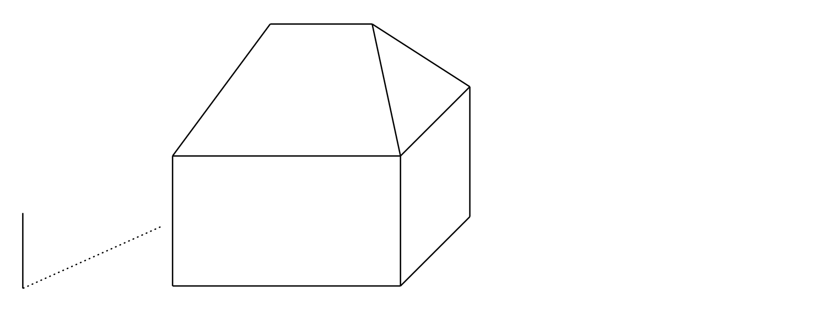
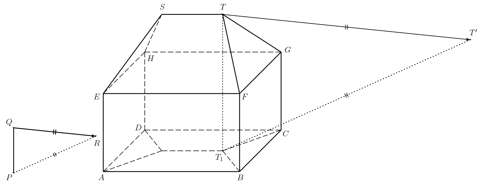
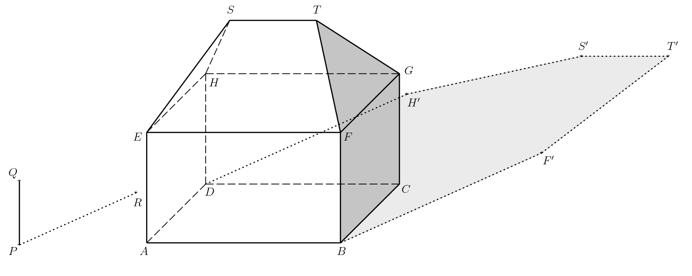
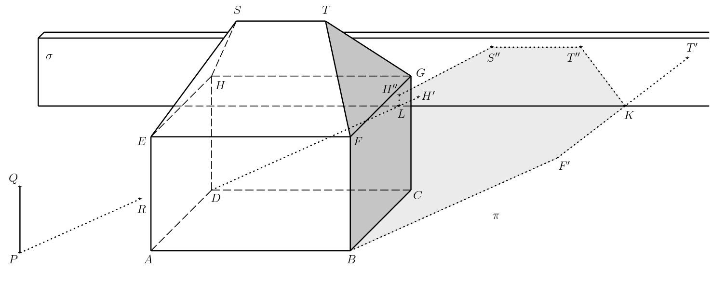
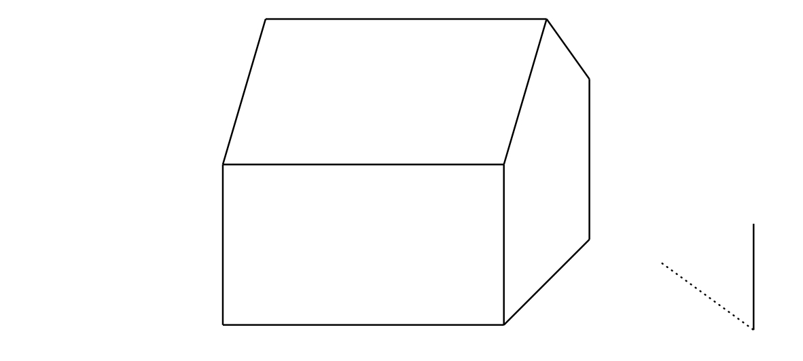

---
keywords:
- geometria w przestrzeni
- aksonometria
- oświetlenie
is_finished: true
---

# Cień domu

Martin chce przygotować miejsce na płótnie, aby narysować dom w słoneczny dzień.
Dlatego zwizualizował prosty model domu
w rzucie równoległym (ortograficznym), stojąc na poziomym płaskim podłożu.
Dom ma kształt prostopadłościanu z prostym czterospadowym dachem.
*Dach biodrowy* to dach utworzony przez dwa trójkąty równoramienne i dwa trójkąty prostokątne.
trapez równoramienny. Wszystkie cztery płaszczyzny dachu mają takie samo nachylenie. Na płótnie obok domu umieścił pionowy pręt i jego cień (patrz rysunek).

Aby opisać rozwiązanie, będziemy potrzebować następujących terminów:

* *Cień własny* obiektu to nieoświetlona część jego powierzchni.
Zamknięta linia na powierzchni obiektu, która oddziela świecące elementy
a nieoświetlone części nazywane są *granicą cienia jaźni*.
* *Cień rzucany* obiektu jest jego projekcją.
w kierunku promieni świetlnych na daną płaszczyznę.
Stwierdza on, że *granicą rzucanego cienia jest rzucany cień.
granicy własnego cienia*

>**Zadanie 1.** Zaznacz na rysunku własny cień domu i
>cień domu rzucany na ziemię przez słońce. (Odległość od Słońca do powierzchni Ziemi jest tak duża, że możemy uznać promienie słoneczne za równoległe do siebie).
>

\iffalse

*Rozwiązanie.* Niech $P$ oznacza podstawę pręta, $Q$ jego górny koniec, a $R$ cień rzucany przez punkt $Q$.
Zorientowany segment $QR$ określa zatem kierunek i orientację promieni świetlnych.
Linia $PR$ jest rzutem prostopadłym linii $QR$ na płaszczyznę podłoża.
W dalszej części tekstu oznaczymy płaszczyznę podłoża przez $\pi$. Następnie oznaczmy wierzchołki prostopadłościanu $ABCDEFGH$ i punkty końcowe kalenicy dachu przez $S$ i $T$.

Oświetlona część domu obejmuje lewą i przednią stronę
prostopadłościanu i odpowiadających mu części dachu.
Granicą cienia własnego jest zatem zamknięty wielokątny łańcuch $ABFTSHDA$.
Aby określić granicę cienia rzucanego przez dom, wystarczy
 skonstruować cienie rzucane na wierzchołki tego wielokątnego łańcucha.
Spośród nich $A$, $B$ i $D$ leżą już w płaszczyźnie $\pi$
i dlatego o również są swoimi własnymi cieniami. Dlatego,
wystarczy skonstruować cienie punktów $F$, $T$, $S$ i $H$.
Cień rzucany przez punkt $T$ jest przecięciem promienia świetlnego
przechodzący przez nią z rzutem prostopadłym tego promienia na
płaszczyznę $\pi$. Przypomnijmy, że kierunek promieni świetlnych to
wyznaczony przez linię $QR$ i kierunek linii $QR$.
Rzut prostopadły promieni na płaszczyznę $\pi$ wynosi
określony przez linię $PR$.
Prostopadły rzut promienia przechodzi dalej przez punkt $T_1$,
który jest rzutem prostopadłym punktu $T$ na płaszczyznę $\pi$.
Jeśli oznaczymy cień rzucany przez punkt $T$ jako $T'$,
jego konstrukcja jest pokazana na rysunku.

Konstruujemy cienie rzutowane $F'$, $S'$, $H'$ punktów $F$, $S$,
i $H$ podobnie.
Granicą cienia rzucanego przez dom jest wtedy wielokąt $ABF'T'S'H'D$.
Podczas cieniowania bierzemy pod uwagę tylko widoczne części siebie i rzucane cienie.

\fi

> **Zadanie 2.** Narysuj cień rzucany przez dom, jeśli istnieje
> nieprzezroczysta ściana za domem, która jest równoległa do frontu i
> tylnej ściany domu.  

\iffalse

*Rozwiązanie.* Cień własny domu, jego granica i rzucane cienie
do płaszczyzny $\pi$, które z naszej perspektywy znajdują się przed ścianą, pozostają niezmienione. Oznaczmy przez $\sigma$
płaszczyznę, w której leży przednia strona dodanej ściany.
Dla  punktów $T$, $S$ i $H$, konieczne jest, aby
tworzyły swoje cienie rzucane na tę płaszczyznę. Opiszmy to
 dla punktu $T$.

Rozważmy punkty $T_1$ i $T'$ z poprzedniego ćwiczenia.
Niech $\tau$ oznacza płaszczyznę $TT_1T'$, a dalej oznaczmy
przez $U$ przecięcie linii $T_1T'$
a dolną krawędzią ściany (tj. $\sigma\cap\pi$).

Przecięcie płaszczyzn $\sigma$ i $\tau$ również musi przechodzić
przez ten punkt, tj. cień $T_1T$ rzucany na punkt
w płaszczyźnie $\sigma$.
Co więcej, to przecięcie musi być pionowe, ponieważ zarówno $\tau$, jak i
$\sigma$ są pionowe.
Cień rzucany przez punkt $T$ na płaszczyznę $\sigma$ (oznaczmy go przez $T''$)
leży na wspomnianym przecięciu i linii $TT'$.

Konstruujemy cienie rzutowane $S''$, $H''$ punktów $S$ i $H$.  Granicą własnego cienia jest wtedy zamknięty
wielokątny  $ABF'KT''S''H''LDA$, gdzie $K$ (resp. $L$) leży na
przecięciu płaszczyzn $\sigma$ i $\pi$, a także leży na $F'T'$ (odpowiednio $DH'$). Zacieniamy tylko widoczne części
jaźni i rzucane cienie, nie zacieniamy części
cienia zasłoniętego przez dom.

\fi

*Uwaga.* W celu lepszej wizualizacji pomocny może być również interaktywny aplet w programie GeoGebra.
W aplecie można do pewnego stopnia modyfikować kierunek promieni słonecznych, zob.https://www.geogebra.org/m/ecyqv4qg

>**Zadanie 3.** Zaznacz na rysunku własny cień domu i
>cień domu rzucany na ziemię przez słońce. (Odległość od Słońca do powierzchni Ziemi jest tak duża, że możemy uznać promienie słoneczne za równoległe do siebie).
>

\iffalse

*Rozwiązanie.*

\fi

## Literatura 

1. Pomykalová E. *Deskriptivní geometrie pro střední školy.* Prometheus. 2010. 106—107.

