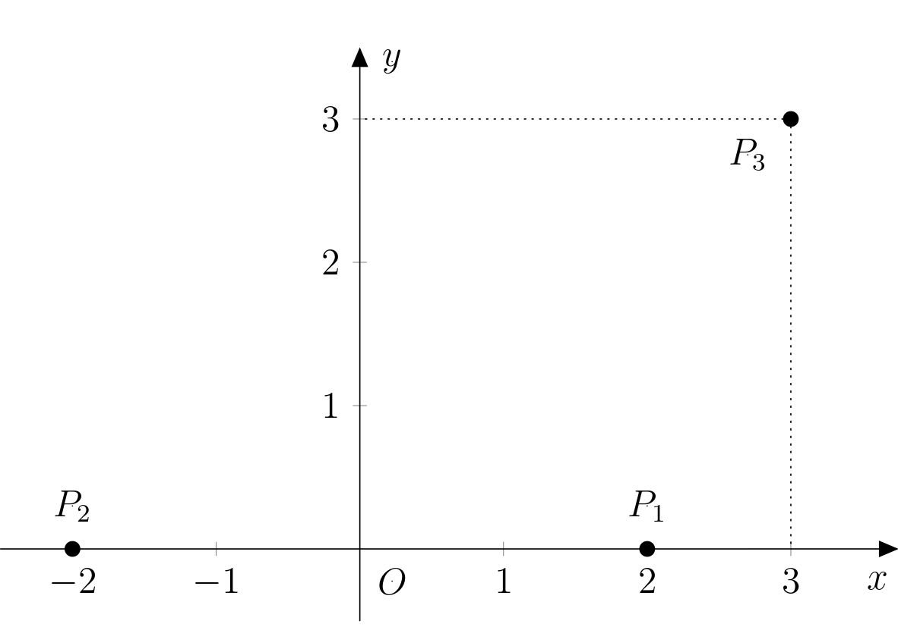

---
keywords:
- analytic geometry
- conic sections
- hyperbola
is_finished: true
---
# Hyperbolic navigation

Progress in the field of electrical engineering enabled the development of new navigation systems
based on the transmission of electromagnetic waves.
An example of such a system is LORAN-C marine navigation,
which was developed during World War II in the USA.
In this type of navigation, 
the vessel receives a synchronized signal from a pair of transmitters. 
The signal from the more distant transmitter is received by the vessel later, 
so the signal delay determines the difference between the distances of the vessel from the first and second transmitter.

The set of points that have a constant difference in distances 
from two given fixed points is a hyperbola. 
Thus, the vessel is located on a hyperbola, 
whose foci are the transmitters, and which is determined 
by the difference in the vessel’s distances from those transmitters.
The signal delay from another pair of stations then determines the second hyperbola on which the vessel must lie. If the vessel lies on both hyperbolas, 
it lies at their intersection.

> **Exercise.** Three receivers $P_1$, $P_2$, and $P_3$ are deployed in the landscape.
> The figure captures the distances we know:
> 
> 
>
> Adam's tourist navigation will send a signal to all three receivers.
> Signal arrives at receivers $P_1$ and $P_3$ at the same time
> and at receiver $P_2$ 80 microseconds later. 
> Where is Adam located?
> Assume the signal travels 300 000 km per second.
> Determine the position in a suitably established coordinate system.

\iffalse

*Solution.* First, in the figure, we choose a suitable Cartesian coordinate system. 
We justify this choice as follows: Since Adam is equidistant from receivers $P_1$ and $P_3$, 
he is positioned on the axis of line $P_1P_3$. 
The fact that his signal arrives at receiver $P_2$ 80 microseconds later than at receiver $P_1$ means that 
Adam is $24\,\text{km}$ further from receiver $P_2$ than from receiver $P_1$. 
His position is therefore also on the branch of the hyperbola $h$ with foci $P_1$ and $P_2$ 
(where the difference in Adam's distances from $P_1$ and $P_2$ is just $24\,\text{km}$).
It is advantageous to place the origin of the coordinate system in the center of the line segment $P_1P_2$ 
so that the equation of hyperbola $h$ has the simplest possible form.

Let us denote the origin of the system $O$ 
and place it in the center of the line segment $P_1P_2$. 
The positive direction of the $x$-axis will be determined by the semi-line $OP_1$ 
and we choose the positive direction of the $y$-axis so that the second coordinate of point $P_3$ is positive. 
Since all the given dimensions are multiples of $12$, 
we choose the units on both axes 
to correspond to a distance of $12\,\text{km}$. 
The situation is illustrated in the figure:

Let $A$ denote the unknown position of Adam. 
We know that the point $A$ lies on the axis of the line segment 
$P_1P_3$. We express this axis (let's denote it $o$) parametrically:
$$
o\colon X = S_{P_1P_3}+t\cdot \overrightarrow{u_o},
$$ 
where $S_{P_1P_3}\left[\frac{5}{2};\frac{3}{2}\right]$ 
and  $\overrightarrow{u_o}=(3;-1)$. Then

$$
\begin{aligned}
x &= \tfrac{5}{2} + 3t\\
y &= \tfrac{3}{2} - t,\quad t\in\mathbb{R}.
\end{aligned}
$$

To find the equation of the hyperbola, note that
the points $P_1$ and $P_2$ are the foci of the hyperbola $h$, 
with center $O$
and eccentricity $e$ equal to half of $|OP_1|$, thus $e=2$. Next, 
since the difference $|AP_1|-|AP_2|=2$ 
is twice the length of the major semiaxis of the hyperbola, 
the length of the major semiaxis $a$ is equal to $1$.
We calculate the length of the minor semiaxis $b$ by substituting into the relation
$b=\sqrt{e^2-a^2}=\sqrt{4-1}=\sqrt{3}$. 
Now, we can write down the equation of the required hyperbola 
$$h\colon x^2-\frac{y^2}{3}=1.$$
The point $A$ lies on its right branch (it is closer to the receiver $P_1$), 
i.e., its first coordinate must necessarily be $x_A>0$.

Let us now calculate the coordinates of the intersections 
of the line $o$ and the hyperbola $h$.
By substituting the parametric equations of the line $o$
into the equation of the hyperbola, we get:
$$
\begin{aligned}
\left(\frac{5}{2} + 3t\right)^2-\frac{\left(\frac{3}{2}-t\right)^2}{3} &= 1 \\
3\cdot \left(\frac{5}{2} + 3t \right)^2-\left(\frac{3}{2}-t\right)^2 &= 3 \\
\vdots & \\
52 t^2 +96t +27 &= 0 
\end{aligned}
$$
The roots of this quadratic equation are $t_1=-\frac{9}{26}$ and $t_2=-\frac{3}{2}$. We substitute $t_1$ into the parametric equations and get:
$$
\begin{aligned}
x_1 &= \tfrac{5}{2} + 3\cdot \left(-\tfrac{9}{26}\right) = \tfrac{19}{13}\\
y_1 &= \tfrac{3}{2} - \left(-\tfrac{9}{26}\right) = \tfrac{24}{13},
\end{aligned}
$$
that is $A_1\left[ \tfrac{19}{13};\tfrac{24}{13} \right]$. Similarly, by substituting $t_2$, we get:
$$
\begin{aligned}
x_2 &= \tfrac{5}{2} + 3\cdot \left(-\tfrac{3}{2}\right) = -2\\
y_2 &= \tfrac{3}{2} - \left(-\tfrac{3}{2}\right) = 3,
\end{aligned}
$$
i.e., $A_2 \left[ -2;3 \right]$. 
However, the point $A_2$ does not satisfy the condition $x_A > 0$ (it lies on the second branch of the hyperbola),
thus we get the only possible position of Adam,
namely $A\left[ \tfrac{19}{13};\tfrac{24}{13} \right]$. 
The solution is shown in the figure.

\fi

*Note.* If Adam was not equidistant from receivers $P_1$ and $P_3$, 
solving the problem would mean finding the intersection of the branches of two hyperbolas. 
However, such a calculation would be beyond the scope of high school mathematics.

## Literature

* Vondrák J. (2013). *Historie navigace – od kvadrantu k GNSS*. Pokroky matematiky, fyziky a astronomie, 58 (1), 11–20.
