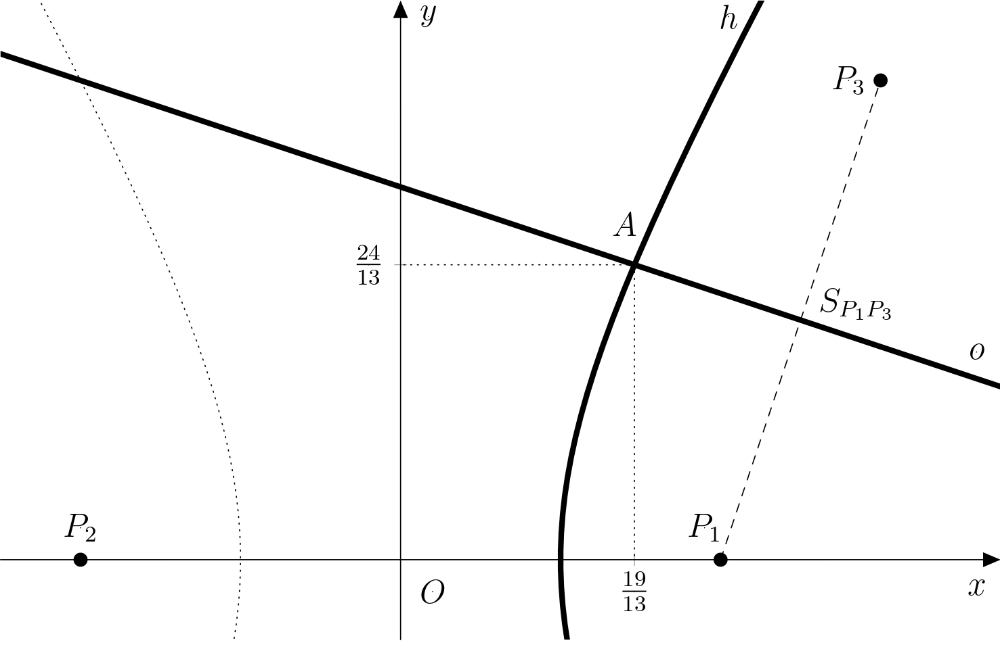

---
keywords:
- geometría analítica
- sección cónica
- hipérbola
is_finished: True
---

# Navegación hiperbólica

Los avances en el campo de la ingeniería eléctrica permitieron el desarrollo de nuevos sistemas de navegación
basados en la transmisión de ondas electromagnéticas.
Un ejemplo de este tipo de sistemas es la navegación marítima LORAN-C,
que fue desarrollada durante la Segunda Guera Mundial en EEUU.
En este tipo de navegación, 
el buque recibe una señal sincronizada de un par de transmisores. 
Este recibe más tarde la señal del transmisor que está más lejos, 
por lo que el retraso de la señal determina la diferencia entre las distancias del buque a cada transmisor.

El conjunto de puntos cuya diferencia de distancias a dos puntos fijos dados
es constante, se denomina hipérbola. 
Por tanto, el buque está localizado en una hipérbola, 
cuyos focos son los transmisores, y que está determinada 
por la diferencia de distancias del buque a dichos transmisores.
El retraso de la señal de otro par de estaciones determina, entonces, la segunda hipérbola en la que debe situarse el buque. Si el buque se encuentra en ambas hipérbolas, 
entonces se sitúa en su intersección.

> **Ejercicio.** Tres receptores $P_1$, $P_2$, y $P_3$ están distribuidos por el paisaje.
> La figura captura las distancias que conocemos:
> 
> La navegación turística de Adam enviará una señal a los tres receptores.
> La señal llega a los receptores $P_1$ y $P_3$ al mismo tiempo
> y al receptor $P_2$ 80 microsegundos después. 
> ¿Dónde se encuentra Adam?
> Supongamos que la señal viaja a 300 000 km por segundo.
> Determina la posición en un sistema de coordenadas adecuadamente establecido.

\iffalse

*Solución.* Para comenzar, en la figura, elegimos un sistema de coordenadas cartesianas adecuado.
Justificamos esta elección de la siguiente manera: Como Adam equidista de los receptores $P_1$ y $P_3$, 
está situado en el eje de la recta $P_1P_3$. 
El hecho de que su señal llegue al receptor $P_2$ 80 microsegundos más tarde que al receptor $P_1$ significa que 
Adam está $24\,\text{km}$ más lejos del receptor $P_2$ que del $P_1$. 
Entonces, su posición está también en la rama de la hipérbola $h$ con focos $P_1$ y $P_2$ 
(donde la diferencia entre las distancias de Adam a $P_1$ y $P_2$ es exactamente $24\,\text{km}$).
Conviene situar el origen del sistema de coordenadas en el centro del segmento de recta $P_1P_2$ 
para que la ecuación de la hipérbola $h$ sea de la forma más sencilla posible.

Denotemos el origen del sistema como $O$ 
y situémoslo en el centro del segmento de recta $P_1P_2$. 
La dirección positiva del eje $x$ vendrá determinada por la semirrecta $OP_1$ 
y elegimos la dirección positiva del eje $y$ para que la segunda coordenada del punto $P_3$ sea positiva. 
Como todas las dimensiones dadas son múltiplos de $12$, 
elegimos las unidades en ambos ejes 
correspondiendo con una distancia de $12\,\text{km}$. 
Esta situación se ilustra en la figura:

Sea $A$ la posición desconocida de Adam. 
Sabemos que el punto $A$ se sitúa en el eje del segmento de recta 
$P_1P_3$. Expresamos este eje (denotémoslo por $o$) con ecuaciones paramétricas:
$$
o\colon X = S_{P_1P_3}+t\cdot \overrightarrow{u_o},
$$ 
donde $S_{P_1P_3}\left[\frac{5}{2};\frac{3}{2}\right]$ 
y  $\overrightarrow{u_o}=(3;-1)$. Entonces

$$
\begin{aligned}
x &= \tfrac{5}{2} + 3t\\
y &= \tfrac{3}{2} - t,\quad t\in\mathbb{R}.
\end{aligned}
$$

Para hallar la ecuación de la hipérbola, obsérvese que
los puntos $P_1$ y $P_2$ son los focos de la hipérbola $h$, 
con centro $O$
y excentricidad $e$ igual a la mitad de $|OP_1|$, luego $e=2$. A continuación, 
como la diferencia $|AP_1|-|AP_2|=2$ 
es el doble de la longitud del semieje mayor de la hipérbola, 
la longitud de dicho semieje mayor $a$ es igual a $1$.
Calculamos la longitud del semieje menor $b$ sustituyendo en la relación
$b=\sqrt{e^2-a^2}=\sqrt{4-1}=\sqrt{3}$. 
Ahora, podemos escribir la ecuación de la hipérbola buscada 
$$h\colon x^2-\frac{y^2}{3}=1.$$
El punto $A$ se encuentra en su rama derecha (está más cerca del receptor $P_1$), 
i.e., su primera coordenada debe ser necesariamente $x_A>0$.

Calculemos ahora las coordenadas de las intersecciones 
de la recta $o$ y la hipérbola $h$.
Sustituyendo las ecuaciones paraméticas de la recta $o$
en la ecuación de la hipérbola, obtenemos:
$$
\begin{aligned}
\left(\frac{5}{2} + 3t\right)^2-\frac{\left(\frac{3}{2}-t\right)^2}{3} &= 1 \\
3\cdot \left(\frac{5}{2} + 3t \right)^2-\left(\frac{3}{2}-t\right)^2 &= 3 \\
\vdots & \\
52 t^2 +96t +27 &= 0 
\end{aligned}
$$
Las raíces de esta ecuación cuadrática son $t_1=-\frac{9}{26}$ y $t_2=-\frac{3}{2}$. Sustituimos $t_1$ en las ecuaciones paramétricas y obtenemos:
$$
\begin{aligned}
x_1 &= \tfrac{5}{2} + 3\cdot \left(-\tfrac{9}{26}\right) = \tfrac{19}{13}\\
y_1 &= \tfrac{3}{2} - \left(-\tfrac{9}{26}\right) = \tfrac{24}{13},
\end{aligned}
$$
esto es $A_1\left[ \tfrac{19}{13};\tfrac{24}{13} \right]$. De forma similar, sustituyendo $t_2$, se obtiene:
$$
\begin{aligned}
x_2 &= \tfrac{5}{2} + 3\cdot \left(-\tfrac{3}{2}\right) = -2\\
y_2 &= \tfrac{3}{2} - \left(-\tfrac{3}{2}\right) = 3,
\end{aligned}
$$
i.e., $A_2 \left[ -2;3 \right]$. 
Sin embargo, el punto $A_2$ no satisface la condición $x_A > 0$ (se sitúa en la segunda rama de la hipérbola),
luego llegamos a la conclusión de que la única posición posible para Adam
es $A\left[ \tfrac{19}{13};\tfrac{24}{13} \right]$. 
La solución se muestra en la figura.

\fi

*Nota.* Si Adam no equidistara de los dos receptores $P_1$ y $P_3$, 
resolver el problema habría consistido en encontrar la intersección de las ramas de las dos hipérbolas. 
Sin embargo, ese cálculo estaría fuera del alcance de las matemáticas escolares.

## Bibliografía

* Vondrák J. (2013). *Historie navigace – od kvadrantu k GNSS*. Pokroky matematiky, fyziky a astronomie, 58 (1), 11–20.

