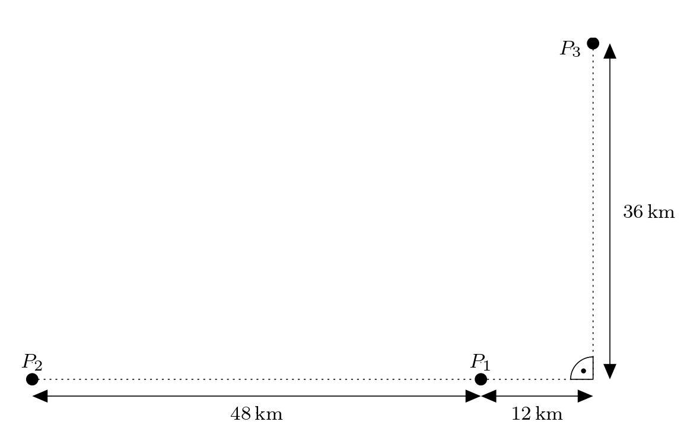

# Nawigacja hiperboliczna

Postęp w dziedzinie inżynierii elektrycznej umożliwił opracowanie nowych systemów nawigacji
opartych na transmisji fal elektromagnetycznych.
Przykładem takiego systemu jest nawigacja morska LORAN-C,
która została opracowana podczas II wojny światowej w USA.
W tym typie nawigacji,
statek odbiera zsynchronizowany sygnał z pary nadajników.
Sygnał z bardziej oddalonego nadajnika jest odbierany przez statek później,
więc opóźnienie sygnału określa różnicę między odległościami statku od pierwszego i drugiego nadajnika.

Zbiór punktów, które mają stałą różnicę odległości
od dwóch punktów stałych jest hiperbolą.
Zatem statek znajduje się na hiperboli,
której ogniskami są nadajniki i która jest określona przez
 różnicę odległości statku od tych nadajników.
Opóźnienie sygnału z innej pary stacji określa następnie drugą hiperbolę, na której musi znajdować się statek. Jeśli statek leży na obu hiperbolach,
to leży na ich przecięciu.

> **Zadanie.** Trzy odbiorniki $P_1$, $P_2$ i $P_3$ są rozmieszczone w terenie.
> Rysunek przedstawia znane nam odległości:
> 
> Nawigacja turystyczna Adama wyśle sygnał do wszystkich trzech odbiorników.
> Sygnał dociera do odbiorników $P_1$ i $P_3$ w tym samym czasie, a do odbiornika $P_2$ 80 mikrosekund później.
> Gdzie znajduje się Adam?
>Załóżmy, że sygnał pokonuje 300 000 km na sekundę.
> Określ pozycji w odpowiednio ustalonym układzie współrzędnych.

\iffalse

*Rozwiązanie.* Najpierw na rysunku wybieramy odpowiedni kartezjański układ współrzędnych. 
Uzasadniamy ten wybór w następujący sposób: Ponieważ Adam znajduje się w równej odległości od odbiorników $P_1$ i $P_3$, jest on umieszczony na osi linii $P_1P_3$.
Fakt, że jego sygnał dociera do odbiornika $P_2$ 80 mikrosekund później niż do odbiornika $P_1$ oznacza, że Adam znajduje się $24\,\text{km}$ dalej od odbiornika $P_2$ niż od odbiornika $P_1$.
Jego pozycja znajduje się zatem również na gałęzi hiperboli $h$ z ogniskami $P_1$ i $P_2$ (gdzie różnica w odległościach Adama od $P_1$ i $P_2$ wynosi zaledwie $24\,\text{km}$).
Korzystne jest umieszczenie początku układu współrzędnych w środku odcinka $P_1P_2$, tak aby równanie hiperboli $h$ miało najprostszą możliwą postać.

Oznaczmy początek układu $O$ i umieśćmy go w środku odcinka $P_1P_2$. Dodatni kierunek osi $x$ będzie wyznaczony przez półprostą $OP_1$, a dodatni kierunek osi $y$ wybierzemy tak, aby druga współrzędna punktu $P_3$ była dodatnia.
Ponieważ wszystkie podane wymiary są wielokrotnościami $12$, wybieramy jednostki na obu osiach, aby odpowiadały odległości $12\,\text{km}$.
Sytuację ilustruje rysunek:

Niech $A$ oznacza nieznane położenie Adama.
Wiemy, że punkt $A$ leży na osi odcinka $P_1P_3$. Wyrażamy tę oś (oznaczmy ją $o$) parametrycznie:
$$
o\colon X = S_{P_1P_3}+t\cdot \overrightarrow{u_o},
$$ 
gdzie $S_{P_1P_3}\left[\frac{5}{2};\frac{3}{2}\right]$ 
i  $\overrightarrow{u_o}=(3;-1)$.Wtedy

$$
\begin{aligned}
x &= \tfrac{5}{2} + 3t\\
y &= \tfrac{3}{2} - t,\quad t\in\mathbb{R}.
\end{aligned}
$$

Aby znaleźć równanie hiperboli, należy zauważyć, że punkty $P_1$ i $P_2$ są ogniskami hiperboli $h$ o środku $O$ i mimośrodzie $e$ równym połowie $|OP_1|$, a więc $e=2$. Następnie, ponieważ różnica $|AP_1|-|AP_2|=2$ jest dwa razy większa od długości głównej półosi hiperboli, długość głównej półosi $a$ jest równa $1$.
Obliczamy długość mniejszej półosi $b$ poprzez podstawienie do zależności
$b=\sqrt{e^2-a^2}=\sqrt{4-1}=\sqrt{3}$. 
Teraz możemy zapisać równanie wymaganej hiperboli
$$h\colon x^2-\frac{y^2}{3}=1.$$
Punkt $A$ leży na jego prawej gałęzi (jest bliżej odbiornika $P_1$),
tzn. jego pierwsza współrzędna musi koniecznie wynosić $x_A>0$.

Obliczmy teraz współrzędne punktów przecięcia
linii $o$ i hiperboli $h$.
Podstawiając równania parametryczne prostej $o$
do równania hiperboli, otrzymujemy:
$$
\begin{aligned}
\left(\frac{5}{2} + 3t\right)^2-\frac{\left(\frac{3}{2}-t\right)^2}{3} &= 1 \\
3\cdot \left(\frac{5}{2} + 3t \right)^2-\left(\frac{3}{2}-t\right)^2 &= 3 \\
\vdots & \\
52 t^2 +96t +27 &= 0 
\end{aligned}
$$
Pierwiastkami tego równania kwadratowego są $t_1=-\frac{9}{26}$ i $t_2=-\frac{3}{2}$. Podstawiamy $t_1$ do równań parametrycznych i otrzymujemy:
$$
\begin{aligned}
x_1 &= \tfrac{5}{2} + 3\cdot \left(-\tfrac{9}{26}\right) = \tfrac{19}{13}\\
y_1 &= \tfrac{3}{2} - \left(-\tfrac{9}{26}\right) = \tfrac{24}{13},
\end{aligned}
$$
czyli $A_1\left[ \tfrac{19}{13};\tfrac{24}{13} \right]$.Analogicznie, podstawiając $t_2$, otrzymujemy:
$$
\begin{aligned}
x_2 &= \tfrac{5}{2} + 3\cdot \left(-\tfrac{3}{2}\right) = -2\\
y_2 &= \tfrac{3}{2} - \left(-\tfrac{3}{2}\right) = 3,
\end{aligned}
$$
i.e., $A_2 \left[ -2;3 \right]$. 
Jednak punkt $A_2$ nie spełnia warunku $x_A > 0$ (leży na drugiej gałęzi hiperboli),
otrzymujemy więc jedyną możliwą pozycję Adama,
mianowicie $A\left[ \tfrac{19}{13};\tfrac{24}{13} \right]$. 
Rozwiązanie pokazano na rysunku.

\fi

*Uwaga.* Gdyby Adam nie był w równej odległości od odbiorników $P_1$ i $P_3$,
rozwiązanie zadaniu oznaczałoby znalezienie przecięcia gałęzi dwóch hiperbol.
Takie obliczenia wykraczałyby jednak poza zakres matematyki w szkole średniej.

## Literatura

* Vondrák J. (2013). *Historie navigace – od kvadrantu k GNSS*.Postępy w matematyce, fizyce i astronomii, 58 (1), 11–20.

