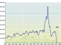
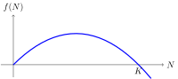
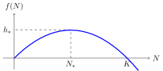
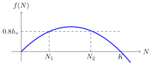

# Kolaps lovišť

Přímořské státy mají na dosah obrovské bohatství v podobě ryb v oceánech. Zdánlivě je toto bohatství nekonečné a stabilní. Že tomu tak není se však lidstvo poučilo v několika trpkých lekcích. Jedna z nich se datuje do roku 1992. Záliv u Newfoundlandu byl vždy bohatý na tresky (*Gadus morhua*, Treska obecná). Loď, která sem přijela lovit, nikdy neodjížděla s prázdnou. Situace se však časem začala měnit. Koncem osmdesátých let biologové volali po nutnosti omezení lovu na polovinu, aby nedošlo k vydrancování lovišť. Protože by však omezení lovu mohlo oblast stáhnout do recese, vláda k omezení lovu nepřistoupila. Bohužel, příroda si poručit nedá. Postupně situace dospěla do stavu, kdy zastavení lovu bylo nevyhnutelné. Stavy tresky se propadly na pouhé jedno procento původních hodnot. Proto bylo na lov vyhlášeno moratorium. Zprvu dvouleté, ale malé stavy tresky se jenom pozvolna obnovují. Proto omezení trvala mnohem déle, než bylo původně předpokládáno. Po určité naději na uvolnění v roce 2015 došlo k opětovnému snížení povolené míry lovu v roce 2018 po opětovném propadu populace. Moratorium na lov mělo za následek ztrátu zaměstnání pro 35 tisíc rybářů a zaměstnanců továren na zpracování ryb a obrovské ekonomické a sociologické dopady na celý region. 

Nutno dodat, že popsaný případ není nijak ojedinělý. Současně s kolapsem newfoundlandských lovišť došlo k podobné situaci i na dalších pěti kanadských lovištích, na kterých bylo vydáno moratorium lovu v roce 1993 (Southern Grand Bank, St. Pierre Bank, Northen Gulf of St. Lawrence, Southern Gulf of St. Lawrence, Eastern Scotian Shelf). A četli jste Steinbeckův román Na plechárně z roku 1945? V něm je popsán život v okolí továrny na zpracování sardinek v Kalifornii. Už krátce po vydání tohoto románu začala loviště vlivem neudržitelného lovu kolabovat a v roce 1967 zde musel být komerční lov zakázán. 

## Modelování růstu populace

Aby ke kolapsům lovišť nedocházelo a abychom dokázali realisticky a účinně modelovat růst populací v přírodě, byly vyvinuty účinné a časem prověřené matematické modely. Jeden z jednoduchých ale dostatečně přesných modeluje rychlost růstu populace pomocí kvadratické funkce 

$$ f(N) = r N \left(1-\frac NK\right), $$

kde $N$ je velikost populace, $f(N)$ je rychlost růstu populace, a $r$ a $K$ jsou konstanty. Konstanta $K$ se nazývá nosná kapacita prostředí. Konstanty $r$ a $K$ určují reprodukční schopnosti populace a vliv životního prostředí na populaci. Tyto konstanty daly i název dvěma základním životním strategiím, které slouží k tomu, aby se populace v přírodě úspěšně uchytila a prosperovala. Populace, které se řadí mezi *r*-stratégy, se dokáží rychle množit. O potomky příliš nepečují a péči vynahrazují množstvím. Tyto populace mají velkou hodnotu konstanty $r$. Oproti tomu *K*-stratégové mají mláďat málo, ale pečují o ně a dokáží se lépe vyrovnávat se změnami v životním prostředí. Proto jsou velikosti jejich populace blíže k nosné kapacitě prostředí, než je tomu u *r*-stratégů.

Rychlost růstu udává, o kolik se zvětší velikost populace za jednotku času. Je-li nulová, velikost populace se nemění. Je-li rychlost růstu kladná a numericky velká, velikost populace roste rychle. Je-li rychlost růstu záporná, velikost populace se snižuje a populace vymírá. Průběh funkce modelující růst je zachycen na obrázku. Tento model zachycuje známá fakta, že populace malé velikosti se rozmnožuje pomalu (malá populace má málo jedinců a tím pádem i málo jedinců schopných reprodukce) a že větší populace se rozmnožuje rychleji, ale pouze do určité míry, kterou povolí nosná kapacita prostředí. 

## Úlohy

Uvažujme hypotetickou populaci vystavenou lovu. Velikost populace budeme měřit ve vhodných jednotkách. To může být v počtu jedinců, v tisících jedinců, v tunách a podobně. Uvažujme například parametry $K=1000$ a $r=0{,}1$. To znamená, že velikost populace, která se v prostředí trvale uživí, je 1000 a malá populace, která netrpí vnitrodruhovou konkurencí, roste o 10% aktuální velikosti za jednotku času. 

> **Úloha 1.** Určete, pro jakou velikost populace 
> $N_*$ je rychlost růstu maximální a jak velká tato 
>rychlost je. Tuto hodnotu nadále budeme značit 
> $h_*$, protože to je současně maximální teoreticky 
> možná intenzita lovu (angl. harvesting). Hodnota 
> $N_*$ je velikost populace při této maximální 
> intenzitě.

\iffalse

*Řešení.*  Funkce
$$f(N) = r N \left(1-\frac NK\right),$$
která popisuje růst, je kvadratická a jejím grafem je parabola. Přičemž tento graf má smysl uvažovat jen pro $N\geq0$.

 Jelikož je funkce dána ve tvaru součinu kořenových činitelů tak vidíme, že kořeny jsou $N=0$ a $N=K$. Funkce 
$f$ má maximum ve vrcholu paraboly, tj. pro $N_*=\frac{K}{2}$. Funkční hodnota v tomto bodě je 

$$
h_* = f(N_*) =f\left(\frac{K}{2}\right)= r \frac{K}2 \left(1-\frac{\frac K2}{K}\right)=\frac{rK}4
$$ 

a pro zadané hodnoty dostáváme 
$$h_* = \frac{0{,}1 \times 1000}{4} = 25,\qquad N_*=500.$$
Porovnáním s nosnou kapacitou prostředí (1000) vidíme, že tato hodnota $h_*$ je 2,5 procenta nosné kapacity 
prostředí. Protože se při takovém lovu ustálí velikost populace na polovině nosné kapacity, znamená to, že lov 
probíhá takovou rychlostí, že za jednotku času je odloveno 5 procent aktuální populace.

\fi

> **Úloha 2.** Určete, kolikrát se zmenší rychlost 
> růstu populace, pokud velikost populace klesne z 
> velikosti $N_*$ dovolující maximální možnou
>  intenzitu lovu, na jednu setinu této velikosti. To je hodnota, 
> na kterou by bylo nutné snížit lov, aby nedocházelo
> k dalšímu úbytku. (V praxi bychom však chtěli 
> obnovení stavů, a proto omezení určené v tomto 
> kroku samo o sobě nestačí.)

\iffalse

*Řešení.* Označme stav populace po klesnutí $N_2$. 
Pak 
$$
N_2=0{,}01N_*=0{,}01 \frac K2
$$ 
a dostáváme 
$$f(N_2) = r \times 0{,}01 \frac K2 \left(1-\frac{0{,}01 \frac K2}{K}\right) = 0{,}004975 rK$$
a 
$$\frac{f(N_2)}{f(N_*)} = \frac{0{,}004975 rK}{0{,}25 rK} \approx 0{,}02.$$
Pokud velikost populace klesne na jedno procento, je nutné intenzitu lovu pro další nepokles omezit na dvě procenta původní intenzity.

\fi

>**Úloha 3.** Předpokládejme, že lov je opatrný na 80 
> procentech maximálního udržitelného lovu $h_*$. Ani 
> v tomto případě není vyhráno. Pokud bude populace 
> malá, nedokáže se s lovem vyrovnat. Určete, jaká 
> minimálně musí být velikost populace, aby se s 
> lovem uvedené velikosti dokázala vyrovnat a 
> nezkolabovala.

\iffalse

*Řešení.* Podle zadání je nutno vyřešit rovnici 

$$ r N \left(1-\frac NK\right) = 0{,}8 \frac{rK}{4}.$$

Tuto rovnici je možno po roznásobení závorky a 
převedení všech členů na jednu stranu zapsat ve tvaru 

$$ -\frac {r}{K} N^2 + rN - 0{,}8 \frac{rK}{4} = 0.$$

Pro hodnoty $r=0.1$ a $K=1000$ dostáváme

$$ -0{,}0001 N^2 +0{,}1 N - 20 = 0$$

a po úpravě

$$N^2 - 1\,000 N + 200\, 000 = 0$$

Kořeny této rovnice jsou 
$$N_{1,2}=\frac{1000\pm \sqrt{1000^2-4\times 200000}}{2}$$
a odsud $$N_1\approx 276$$ a $$N_2\approx 724$$

Obrázek ukazuje vzájemnou polohu paraboly definující 
růst, čárkovaně vyznačené intenzity lovu a průsečíky 
$N_1$ a $N_2$. Pro velikost populace menší než $N_1$ 
lov dominuje nad růstem. V této situaci růst populace 
nestačí dorovnávat úbytky způsobené lovem, populace 
je přelovena, vymírá a dojde k jejímu kolapsu. Aby se 
mohl lov nastavit na úroveň 80 procent maximálního 
udržitelného lovu, je nutné počkat, dokud populace 
nedoroste do velikosti $N_1=276$. Tato hodnota je o 
něco více než polovina hodnoty $N_*$, tj. více než 
polovina hodnoty, na které se velikost populace 
ustálí při maximální trvale udržitelné intenzitě lovu.

Tato poslední část ukazuje, že po kolapsu populace 
není možné nastavit dřívější trvale udržitelnou 
intenzitu lovu a doufat v samovolné obnovení 
původního stavu. Populace musí mít dostatečnou 
dynamiku vývoje, aby se s tímto lovem vyrovnala. S 
obnovením lovu je nutné počkat, dokud opětovné 
nastavení lovu není bezpečné.

\fi

## Odkazy a literatura

### Literatura

* Wikipedie, *Collapse of the Atlantic northwest cod fishery*, <https://en.wikipedia.org/wiki/Collapse_of_the_Atlantic_northwest_cod_fishery>, October 1, 2023
* Ransom A. Myers; Jeffrey A. Hutchings; Nicholas J. Barrowman (1997). *Why do fish stocks collapse? The example of cod in Atlantic Canada* (PDF). Ecological Applications. 7 (1): 91–106. doi:10.1890/1051-0761(1997)007[0091:WDFSCT]2.0.CO;2. JSTOR 2269409. 
* *Collapse of the Pacific Sardine (Again)*, <https://fishbio.com/collapse-pacific-sardine/>, October 1, 2023
* *r/K selection theory*, Wikipedie, <https://en.wikipedia.org/wiki/R/K_selection_theory>, October 1, 2023

### Zdroje obrázků

*  Millennium Ecosystem Assessment: Ecosystems and Human Well-being: Opportunities and Challenges
for Business and Industry Ecosystems, <https://www.millenniumassessment.org/documents/document.353.aspx.pdf>, October 1,2023

