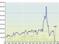
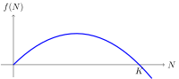

---
keywords:
- functions
- quadratic function
- quadratic equation
is_finished: true
---

# Collapse of Cod Fisheries

Coastal states have a vast wealth of fish in the oceans within their
grasp. This wealth is seemingly endless and stable. However, people
have learned some bitter lessons that this is not the case. One significant lesson dates back to 1992. The Gulf off Newfoundland had always been
rich in cod (*Gadus morhua*, Atlantic cod). A boat that came to fish there never left
without a rich catch. But over time, the situation began to change. In
the late 1980s, biologists called for a 50% reduction in fishing to avoid plundering the fishery. However, because a reduction in
fishing would drag the area into recession, the government did not
decide to impose limits. Unfortunately, nature follows its own
laws. Gradually, the situation reached the point where halting fishing was inevitable. The cod population fell to just one percent of its original level. A moratorium on fishing was therefore
declared. Initially, the moratorium was to last two years. However, the
small cod population did not recover substantially. Therefore, the
restrictions have lasted much longer than originally
anticipated. Despite some hope of easing restrictions in 2015, the allowable
harvest rate was reduced again in 2018 after the population collapsed
again. The moratorium on fishing resulted in job losses for 35,000
fishermen and fish processing factory workers. This had huge economic and
sociological impacts on the entire region.

It should be added that the case described above is not
unique. Simultaneously with the collapse of the Newfoundland
fisheries, a similar situation occurred in five other Canadian
fisheries where a moratorium on fishing was issued in 1993 (Southern
Grand Bank, St. Pierre Bank, Northern Gulf of St. Lawrence, Southern
Gulf of St. Lawrence, Eastern Scotian Shelf). And have you read
Steinbeck's 1945 novel *Cannery Row*? It describes life around a
sardine factory in California. Shortly after the novel was published,
the fishery began to collapse due to unsustainable fishing, and
commercial fishing had to be banned in 1967.

## Modeling Population Growth

In order to prevent fisheries collapses and to be able to
realistically and effectively model population growth in nature,
effective and time-tested mathematical models have been developed. One
simple yet reasonably accurate model describes the population growth rate
using a quadratic function:

$$ f(N) = r N \left(1-\frac NK\right), $$

where $N$ is the population size, $f(N)$ is the population growth
rate, and $r$ and $K$ are constants. The constant $K$ is called the
carrying capacity of the environment. The constants $r$ and $K$
determine the reproductive capabilities of the population and the impact
of the environment on the population. These constants have also given
names to the *r*/*K* selection theory which describes two basic life strategies that help populations in nature to establish and thrive successfully. <!-- Tento překlad více odpovídá české verzi a myslím je i smysluplnější -->
 Populations that qualify as *r*-strategists are
able to reproduce rapidly. They do not care much for their offspring
and compensate for care by abundance. These populations have a large
value of the constant $r$. In contrast, *K*-strategists have few
offspring, but care for them and can cope better with environmental
changes. Therefore, their population sizes are closer to the carrying
capacity of the environment than is the case for *r*-strategists.

The growth rate indicates how much the population size increases per
unit time. If it is zero, the population size does not change. If the
growth rate is positive and numerically large, the population size
grows rapidly. If the growth rate is negative, the population size
decreases and the population dies out. The graph of the function
modelling growth rate is shown in the figure. This model captures the
well-known facts that a population of small size reproduces slowly (a
small population has few individuals and hence few individuals capable
of reproduction). The model also captures the fact that a larger
population reproduces faster, but only to a certain extent that the
carrying capacity of the environment allows.

## Problems

Consider a hypothetical population exposed to harvesting. We will measure
the population size in appropriate units. This can be in numbers of
individuals, in thousands of individuals, in tons, and so on. For
example, consider the parameters $K=1000$ and $r=0.1$. That is, the
size of the population that can sustain in the environment is
1000, and a small population that does not suffer from intraspecific
competition grows at 10% of its current size per unit time.

> **Problem 1.** Determine the population size $N_*$ which guaranties
> the maximum growth rate. Find this maximum growth rate. We will
> henceforth denote this value by $h_*$, as it is also the
> maximum theoretical possible harvesting rate (also called harvesting intensity). The value $N_*$ is the
> population size at this maximum rate.

\iffalse

*Solution.* Function
$$
f(N) = r N \left(1-\frac NK\right),
$$
which describes growth is a quadratic function and its graph is a parabola. This graph is only meaningful for $N\geq0$.

Since the function is given in the form of a product of the root
Factors, we see that the roots are $N=0$ and $N=K$. The function takes
its maximum at the vertex of the parabola, i.e., for $N_*=\frac
{K}{2}$. The function value is

$$
h_* = f(N_*) =f\left(\frac{K}{2}\right)= r \frac{K}2 \left(1-\frac{\frac K2}{K}\right)=\frac{rK}4
$$ 

and for the given values of the constants $K$ and $r$ we get 

$$
h_* = \frac{0.1 \cdot 1000}{4} = 25,\qquad N_*=500.
$$

Comparing this to the carrying capacity of the environment ($K=1000$),
we see that this value $h_*$ is 2.5 percent of the carrying capacity of the
environment. Since the population stabilizes at half
of the carrying capacity when harvesting is at this rate, this means that the fishing proceeds at such a
rate that 5 percent of the current population is harvested per unit
time.

\fi

> **Problem 2.** Determine how many times the population growth rate
> decreases if the population size drops from the size $N_*$,  which allows
> the maximum possible harvesting intensity, to one percent of this size. 
> This is the
> value to which the harvest would have to be reduced to prevent > further decline. (In practice, however, we would want population recovery,
> and therefore, the restriction specified in this step alone is not
> sufficient.)

\iffalse

*Solution.* Let $N_2$ be the size of the population after the decline. 
Then 
$$
N_2=0.01N_*=0.01 \frac K2
$$ 
and we get 
$$
f(N_2) = r \cdot 0.01 \frac K2 \left(1-\frac{0.01 \frac K2}{K}\right) = 0.004975\cdot \,r\,K
$$
and 
$$
\frac{f(N_2)}{f(N_*)} = \frac{0.004975 rK}{0.25 rK} \approx 0.02.
$$
If the population size drops to one percent, the harvesting intensity must
be reduced to two percent of the original intensity to avoid further
decline.

\fi

>**Problem 3.** Assume the careful fishing  at 80 percent of the
> maximum sustainable harvest $h_*$. Even in this case a caution is
> necessary. If the population is too small, it cannot cope with fishing. Determine what is the minimum size of the population capable
> of coping with fishing at the rate equal to 80 percent of $h_*$ without collapsing.

\iffalse

*Solution.* According to the assignment, we need to solve the equation 

$$ r N \left(1-\frac NK\right) = 0.8 \frac{rK}{4}.$$

We can expand the parentheses and 
move all terms to one side to obtain the form 

$$ -\frac{r}{K} N^2 + rN - 0{,}8 \frac{rK}{4} = 0.$$

For $r=0.1$ and $K=1000$ we get

$$ -0.0001 N^2 +0.1 N - 20 = 0$$

which can be rewritten as

$$N^2 - 1000 N + 200000 = 0$$

The roots of this quadratic equation are 
$$N_{1,2}=\frac{1000\pm \sqrt{1000^2-4\cdot 200000}}{2}$$
and hence $$N_1\approx 276$$ and $$N_2\approx 724.$$

The figure shows the parabola defining the growth rate, the horizontal
line defining the harvesting rate and the intersections $N_1$ and
$N_2$. For population sizes smaller than $N_1$ harvesting exceeds the
growth. In this situation, population growth is not capable of
compensating the harvesting rate. The population is overfished, declines,
and collapses.  To set fishing at 80 percent of the
maximum sustainable harvest, it is necessary to wait until the
population grows to a size of $N_1=276$. This value is slightly
more than half of $N_*$, i.e., more than half the value at which the
population stabilizes at the maximum sustainable harvesting intensity.

This last part shows that after a population collapse, it is not
possible to set an earlier sustainable harvesting intensity and hope
for a spontaneous recovery of the population. The population
must have sufficient growth dynamics to cope with this level of harvesting. It is
necessary to wait until the fish population returns to sufficiently
large stocks. It is possible to return to the previous harvesting
rate only if the population size, which prevents extinction, is achieved.

\fi

## References and literature

### Literature

* Wikipedie, *Collapse of the Atlantic northwest cod fishery*, <https://en.wikipedia.org/wiki/Collapse_of_the_Atlantic_northwest_cod_fishery>, October 1, 2023
* Ransom A. Myers; Jeffrey A. Hutchings; Nicholas J. Barrowman (1997). *Why do fish stocks collapse? The example of cod in Atlantic Canada* (PDF). Ecological Applications. 7 (1): 91–106. doi:10.1890/1051-0761(1997)007[0091:WDFSCT]2.0.CO;2. JSTOR 2269409. 
* *Collapse of the Pacific Sardine (Again)*, <https://fishbio.com/collapse-pacific-sardine/>, October 1, 2023
* *r/K selection theory*, Wikipedie, <https://en.wikipedia.org/wiki/R/K_selection_theory>, October 1, 2023

### Image sources

*  Millennium Ecosystem Assessment: Ecosystems and Human Well-being: Opportunities and Challenges
for Business and Industry Ecosystems, <https://www.millenniumassessment.org/documents/document.353.aspx.pdf>, October 1,2023

