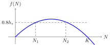

# La Caída de la Pesca del Bacalao

Los países costeros tienen a su alcance una gran riqueza pesquera en los
océanos. Esta riqueza es aparentemente interminable y estable. Sin embargo, se ha
demostrado en numerosas y amargas ocasiones que esto no es verdad. Una bastante significativa sucedió en 1992. El Golfo de Newfoundland siempre había sido
rico en bacalao (*Gadus morhua*, bacalao del Atlántico). Cada barco que iba a pescar allí nunca se iba
sin una buena captura. Pero con el tiempo, la situación empezó a cambiar. A
finales de 1980, los biólogos pidieron una reducción del 50% de la captura para evitar el expolio de la pesca. Sin embargo, debido a que una reducción de
la pesca arrastraría a la zona a una recesión, el gobierno decidió
no imponer límites. Por desgracia, la naturaleza sigue sus propias
leyes. Poco a poco, la situación llegó a un punto en el que era inevitable detener la pesca. La población de bacalao se redujo al 1% de su nivel original. Por ello, se declaró una moratoria de la
pesca. Al principio, la moratoria iba a durar dos años. Sin embargo, a la
pequeña población de bacalao no le dio tiempo a recuperarse. Por lo tanto, las
restricciones han durado mucho más de lo previsto en un 
inicio. A pesar de algunas esperanzas de suavizar las restricciones en 2015, la tasa
de captura permitida se redujo de nuevo en 2018 tras otro desplome de la
población. La moratoria de la pesca provocó la pérdida de empleo de 35 000
pescadores y trabajadores de fábricas de procesamiento de pescado. Esto tuvo enormes repercusiones económicas
y sociales en toda la región.

Hay que añadir que lo descrito anteriormente no es un caso
aislado. De forma simultánea con la caída de la pesca en
Newfoundland, una situación similar ocurrió en otras cinco pesquerías
canadienses donde se decretó una moratoria de la pesca en 1993 (Southern
Grand Bank, St. Pierre Bank, Northern Gulf of St. Lawrence, Southern
Gulf of St. Lawrence, Eastern Scotian Shelf). ¿Y has leído la novela de
Steinbeck de 1945 *Cannery Row*? Describe la vida alrededor de una
fábrica de sardinas en California. Poco después de publicarse la novela,
la pesquería empezó a decaer debido a la pesca no sostenible, y
hubo que prohibir la pesca comercial en 1967.

## Modelización del Crecimiento Demográfico

Con el fin de prevenir las caídas de la pesquería y poder
modelizar de forma realista y efectiva el crecimiento de las poblaciones en la naturaleza,
se han desarrollado modelos matemáticos de eficacia contrastada a lo largo del tiempo. Un
modelo sencillo pero razonamblemente preciso describe la tasa de crecimiento de la población
usando una función cuadrática:

$$ f(N) = r N \left(1-\frac NK\right), $$

donde $N$ es el tamaño de población, $f(N)$ es la tasa de crecimiento de la
población, y $r$ y $K$ son constantes. La constante $K$ se llama la
capacidad de carga del entorno. Las constantes $r$ y $K$
determinan la capacidad reproductiva de la población y el impacto
del entorno en la población. Estas constantes también han dado
nombre a la teoría de la selección *r*/*K* que describe dos estrategias vitales básicasque ayudan a las poblaciones de la naturaleza a establecerse y prosperar con éxito.
Las poblaciones que se califican como *r*-estratégicas son
capaces de reproducirse rápidamente. No se preocupan mucho por su descendencia
y compensan los cuidados mediante la abundancia. Estas poblaciones presentan un alto
valor de la constante $r$. En cambio, las *K*-estratégicas tienen poca
descendencia, pero cuidan de ella y pueden hacer frente a los cambios
medioambientales. por lo tanto, el tamaño de sus poblaciones está más cerca de la capacidad
de carga del entorno que en el caso de las *r*-estratégicas.

La tasa de crecimiento indica cuánto aumenta el tamaño de la población por
unidad de tiempo. Si es cero, el tamaño de la población no cambia. Si la
tasa de crecimiento es positiva y numéricamente grande, el tamaño de la población
crece rápidamente. Si la tasa de crecimiento es negativa, el tamaño de la población
disminuye y la población se extingue. En la figura se muestra
el gráfico de la función que modela la tasa de crecimiento. Este modelo refleja el
hecho bien conocido de que una población de pequeño tamaño se reproduce lentamente (una
población pequeña tiene pocos individuos, luego pocos individuos que puedan
reproducirse). El modelo también refleja el hecho de que una gran
población se reproduce más rápido, pero solo hasta el punto permitido
por la capacidad de carga del entorno.

## Problemas

Consideremos una población hipotética expuesta a la recolección. Mediremos
el tamaño de la población en las unidades adecuadas. Esto puede consistir en número de
individuos, en miles de individuos, en toneladas, etc. Por
ejemplo, consideremos los parámetros $K=1000$ y $r=0.1$. Es decir, el
tamaño de la población que puede mantenerse en el entorno es
1000, y una población pequeña que no sufre competencia
con otras especies crece al 10% de su tamaño por unidad de tiempo.

> **Problema 1.** Determina el tamaño de la población $N_*$ que garantiza
> la máxima tasa de crecimiento. Halla esta tasa máxima de crecimiento. A partir
> de ahora denotaremos este valor por by $h_*$, ya que también es la
> máxima tasa de recolección teórica posible (también llamada intensidad de recolección). El valor $N_*$ es el
> tamaño de la población con esta tasa máxima.

\iffalse

*Solución.* La función
$$f(N) = r N \left(1-\frac NK\right),$$
que describe el crecimiento es una función cuadrática y su gráfica es una parábola. Esta gráfica solo tiene sentido para $N\geq0$.

Como la función viene dada en la forma de producto de los factores de las
raíces, vemos que las raíces son $N=0$ y $N=K$. La función tiene
su máximo en el vértice de la parábola, i.e., para $N_*=\frac
{K}{2}=500$. El valor de la función es

$$
h_* = f(N_*) = r \frac{K}2 \left(1-\frac{\frac K2}{K}\right)=\frac{rK}4
$$ 

y para los valores dados de las constantes $K$ y $r$ obtenemos 

$$h_* = \frac{0.1 \cdot 1000}{4} = 25.$$

Comparándolo con la capacidad de carga del entorno ($K=1000$),
vemos que este valor es el 2.5% de la capacidad de carga del
entorno. Dado que la población se estabiliza en la mitad
de la capacidad de carga cuando la recolección se realiza con esta tasa, esto significa que la pesca se realiza a una
tasa tal que se captura el 5% de la población actual por unidad de
tiempo.

\fi

> **Problema 2.** Determina cuántas veces disminuye la tasa de crecimiento
> de la población si su tamaño baja de $N_*$, lo que permite
> la máxima intensidad de recolección posible, al 1%. 
> Esto es el
> valor al que habría que reducir ka captura para evitar un mayor declive.  (En la práctica, sin embargo, querríamos la recuperación de la población,
> por tanto, la restricción especificada en este caso por sí sola no es
> suficiente.)

\iffalse

*Solución.* Sea $N_2$ el tamaño de la población después del declive. 
Entonces 
$$
N_2=0.01N_*=0.01 \frac K2
$$ 
y obtenemos 
$$
f(N_2) = r \cdot 0.01 \frac K2 \left(1-\frac{0.01 \frac K2}{K}\right) = 0.004975\cdot \,r\,K
$$
y 
$$
\frac{f(N_2)}{f(N_*)} = \frac{0.004975 rK}{0.25 rK} \approx 0.02.
$$
Si el tamaño de la población baja al 1%, la intensidad de recolección debe
reducirse al 2% de la intensidad original para evitar un mayor
declive.

\fi

>**Problema 3.** Supongamos que se pesca con cuidado al 80% de la
> captura máxima sostenible $h_*$. Incluso en este caso es necesaria una cierta
> precaución. Si la población es demasiado pequeña, no podrá hacer fente a la pesca. Determina cuál es el tamaño mínimo de la población capaz
> de hacer frente a la pesca a una tasa igual al 80% de $h_*$ sin decaer.

\iffalse

*Solución.* De acuerdo con el enunciado, necesitamos resolver la ecuación 

$$ r N \left(1-\frac NK\right) = 0.8 \frac{rK}{4}.$$

Podemos resolver los paréntesis y 
mover todos los términos a un miembro de la ecuación obteniendo 

$$ -\frac{r}{K} N^2 + rN - 0{,}8 \frac{rK}{4} = 0.$$

Para $r=0.1$ y $K=1000$ tenemos

$$ -0.0001 N^2 +0.1 N - 20 = 0$$

que se puede reescribir como

$$N^2 - 1000 N + 200000 = 0$$

Las raíces de esta ecuación cuadrática son 
$$N_{1,2}=\frac{1000\pm \sqrt{1000^2-4\cdot 200000}}{2}$$
luego $$N_1\approx 276$$ y $$N_2\approx 724.$$

La figura muestra la parábola que define la tasa de crecimiento, la recta 
horizontal que define la tasa de recolección y las intersecciones $N_1$ y
$N_2$. Para tamaños de población inferiores a $N_1$ la recolección supera el
crecimiento. En esta situación, el crecimiento de la población no es capaz de
compensar la tasa de recolección. La población sufre sobrepesca, decae,
y se desploma. Para fijar la pesca al 80% de la
captura máxima sostenible, es necesario esperar a que la
población crezca hasta un tamaño de $N_1=276$. Este valor es algo
más de la mitad de $N_*$, i.e., más de la mitad del valor en el que
la población se estabiliza con la intensidad de recolección máxima sostenible.

Esta última parte demuestra que, tras un desplome de la población, no es
posible fijar antes una intensidad de recolección sostenible y esperar
una recuperación espontánea de la población. La población
debe tener una dinámica de crecimiento suficiente para hacer frente a este nivel de recolección. Es
necesario esperar a que la población de peces vuelva a ser suficientemente
grande. Solo es posible volver a la intensidad de recolección anterior
si se alcanza el tamaño de población que impida la extinción.

\fi

## Referencias y bibliografía

### Bibliografía

* Wikipedie, *Collapse of the Atlantic northwest cod fishery*, <https://en.wikipedia.org/wiki/Collapse_of_the_Atlantic_northwest_cod_fishery>, October 1, 2023
* Ransom A. Myers; Jeffrey A. Hutchings; Nicholas J. Barrowman (1997). *Why do fish stocks collapse? The example of cod in Atlantic Canada* (PDF). Ecological Applications. 7 (1): 91–106. doi:10.1890/1051-0761(1997)007[0091:WDFSCT]2.0.CO;2. JSTOR 2269409. 
* *Collapse of the Pacific Sardine (Again)*, <https://fishbio.com/collapse-pacific-sardine/>, October 1, 2023
* *r/K selection theory*, Wikipedie, <https://en.wikipedia.org/wiki/R/K_selection_theory>, October 1, 2023

### Fuentes de las Imágenes

*  Millennium Ecosystem Assessment: Ecosystems and Human Well-being: Opportunities and Challenges
for Business and Industry Ecosystems, <https://www.millenniumassessment.org/documents/document.353.aspx.pdf>, October 1,2023

