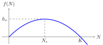

# Kolabs rybolovu

Pobrežné štáty majú obrovské bohatstvo rýb v oceánoch na dosah. Toto bohatstvo sa javí ako nekonečné a stabilné. Ľudia sa však naučili trpké lekcie, že to tak nie je. Jedna z významných lekcií siaha do roku 1992. V zálive pri Newfoundlande bol vždy dostatok tresky (Gadus morhua, atlantická treska). Loď, ktorá tam prišla loviť, nikdy neodchádzala bez bohatého úlovku. Postupom času sa však situácia začala meniť. Koncom 80. rokov biológovia volali po nutnosti obmedzenia lovu na polovicu, aby nedošlo k vyplieneniu. Keďže by však zníženie rybolovu uvrhlo túto oblasť do recesie, vláda sa nerozhodla zaviesť obmedzenia. Príroda však nasleduje svoje vlastné zákony. Postupne sa situácia dostala do bodu, keď bolo zastavenie rybolovu nevyhnutné. Populácia tresky klesla na iba jedno percento pôvodnej úrovne. Preto bolo vyhlásené moratórium na rybolov. Spočiatku malo moratórium trvať dva roky. Malá populácia tresky sa však výrazne nezotavila. Obmedzenia preto trvajú oveľa dlhšie, než sa pôvodne očakávalo. Napriek určitej nádeji na zmiernenie obmedzení v roku 2015, bola povolená miera úlovkov v roku 2018 opäť znížená po opätovnom poklese populácie. Moratórium na rybolov viedlo k strate pracovných miest pre 35 000 rybárov a pracovníkov v továrňach na spracovanie rýb. To malo obrovské ekonomické a sociologické dôsledky na celý región.

Treba dodať, že vyššie opísaný prípad nie je ojedinelý. Súčasne s kolapsom rybolovu v Newfoundlande nastala podobná situácia v ďalších piatich kanadských rybolovných oblastiach, kde bolo v roku 1993 vydané moratórium na rybolov (Southern Grand Bank, St. Pierre Bank, Northern Gulf of St. Lawrence, Southern Gulf of St. Lawrence, Eastern Scotian Shelf). A čítali ste Steinbeckov román Na plechárni z roku 1945? Opisuje život okolo továrne na spracovanie sardiniek v Kalifornii. Krátko po vydaní románu začal rybolov kolabovať kvôli neudržateľnému lovu a komerčný rybolov musel byť v roku 1967 zakázaný.

## Modelovanie rastu populácie

Aby sa predišlo kolapsu rybolovu a bolo možné realisticky a efektívne modelovať rast populácie v prírode, boli vyvinuté účinné a časom overené matematické modely. Jeden jednoduchý, ale pomerne presný model popisuje rýchlosť rastu populácie pomocou kvadratickej funkcie:

$$ f(N) = r N \left(1-\frac NK\right), $$
kde $N$ je veľkosť populácie, $f(N)$ je rýchlosť rastu populácie a $r$ a $K$ sú konštanty. Konštanta $K$ sa nazýva únosná kapacita prostredia. Konštanty $r$ a $K$ určujú reprodukčné schopnosti populácie a vplyv prostredia na populáciu. Tieto konštanty dali názov teórii r/K selekcie, ktorá popisuje dve základné životné stratégie, ktoré populáciám v prírode pomáhajú úspešne sa etablovať a prosperovať. 
Populácie, ktoré spadajú medzi r-stratégov, sa dokážu rýchlo rozmnožovať. O svoje potomstvo sa príliš nestarajú a nedostatok starostlivosti kompenzujú množstvom. Tieto populácie majú vysokú hodnotu konštanty $r$. Naopak, K-stratégovia majú málo potomkov, ale starajú sa o nich a dokážu sa lepšie prispôsobiť zmenám v prostredí. Preto sú veľkosti ich populácií bližšie k únosnej kapacite prostredia než v prípade r-stratégov.

Rýchlosť rastu udáva, o koľko sa veľkosť populácie zvýši za jednotku času. Ak je nulová, veľkosť populácie sa nemení. Ak je rýchlosť rastu kladná a číselne veľká, populácia rýchlo rastie. Ak je rýchlosť rastu záporná, veľkosť populácie klesá a populácia vymiera. Graf funkcie modelujúcej rast je znázornený na obrázku. Tento model zachytáva známe fakty, že populácia s malou veľkosťou sa rozmnožuje pomaly (malá populácia má málo jedincov, a teda málo jedincov schopných rozmnožovania). Model tiež zachytáva fakt, že väčšia populácia sa rozmnožuje rýchlejšie, ale len do určitej miery, ktorú umožňuje únosná kapacita prostredia.

## Úlohy

Uvažujme hypotetickú populáciu vystavenú lovu. Veľkosť populácie budeme merať v príslušných jednotkách, ktoré môžu byť v počtoch jedincov, v tisícoch jedincov, v tonách a podobne. Napríklad, uvažujme parametre $K=1000$ a $r=0,1$. To znamená, že veľkosť populácie, ktorú dokáže prostredie udržať, je 1000, a malá populácia, ktorá netrpí vnútrodruhovou konkurenciou, rastie o 10 % svojej aktuálnej veľkosti za jednotku času.

> **Úloha 1.** 
Určte veľkosť populácie $N_*$, ktorá zaručuje maximálnu rýchlosť rastu. Nájdite túto maximálnu rýchlosť rastu. Túto hodnotu budeme ďalej označovať ako 
$h_*$, pretože predstavuje aj maximálnu teoreticky možnú rýchlosť lovu (nazývanú tiež intenzita lovu, angl. harvesting). Hodnota $N_*$ je veľkosť populácie pri tejto maximálnej intenzite.

\iffalse

*Riešenie.* Funkcia
$$f(N) = r N \left(1-\frac NK\right),$$
ktorá popisuje rast, je kvadratická funkcia a jej grafom je parabola. Tento graf má význam iba pre $N\geq0$.

Keďže je funkcia daná vo forme súčinu koreňových činiteľov, vidíme, že korene sú $N=0$ a $N=K$. Funkcia dosahuje svoje maximum vo vrchole paraboly, t. j., pre $N_*=\frac
{K}{2}=500$. Funkčná hodnota je

$$
h_* = f(N_*) = r \frac{K}2 \left(1-\frac{\frac K2}{K}\right)=\frac{rK}4
$$ 

a pre dané hodnoty konštánt $K$ a $r$ dostaneme

$$h_* = \frac{0,1 \cdot 1000}{4} = 25.$$

V porovnaní s únosnou kapacitou prostredia  ($K=1000$), vidíme, že táto hodnota predstavuje 2,5 percenta únosnej kapacity prostredia. Keďže sa populácia stabilizuje na polovici únosnej kapacity pri tejto miere lovu, znamená to, že rybolov prebieha takou rýchlosťou, že za jednotku času sa uloví 5 percent aktuálnej populácie.

\fi

> **Úloha 2.** Určte, koľkokrát sa rýchlosť rastu populácie zníži, ak veľkosť populácie klesne z veľkosti $N_*$, ktorá umožňuje maximálnu možnú intenzitu lovu, na jedno percento. Toto je hodnota, na ktorú by sa musel lov znížiť, aby sa zabránilo ďalšiemu úbytku. (V praxi by sme však chceli obnovu populácie a samotné obmedzenie uvedené v tomto kroku nie je dostatočné.)

\iffalse

*Riešenie.* Označme stav popolácie po poklese $N_2$. 
Potom 
$$
N_2=0,01N_*=0,01 \frac K2
$$ 
a dostávame 
$$f(N_2) = r \cdot 0,01 \frac K2 \left(1-\frac{0,01 \frac K2}{K}\right) = 0,004975\cdot \,r\,K$$
a 
$$\frac{f(N_2)}{f(N_*)} = \frac{0,004975 rK}{0.25 rK} \approx 0,02.$$
Ak veľkosť populácie klesne na jedno percento, intenzita lovu musí byť znížená na dve percentá pôvodnej intenzity, aby sa zabránilo ďalšiemu poklesu.

\fi

>**Úloha 3.** Predpokladajme opatrný rybolov na úrovni 80 percent maximálneho udržateľného úlovku $h_*$. Aj v tomto prípade je potrebná obozretnosť. Ak je populácia príliš malá, nedokáže zvládnuť rybolov. Určte, aká je minimálna veľkosť populácie schopná zvládnuť rybolov pri rýchlosti rovnajúcej sa 80 percentám $h_*$ bez kolapsu.

\iffalse

*Riešenie.* Podľa zadania musíme vyriešiť rovnicu 

$$ r N \left(1-\frac NK\right) = 0,8 \frac{rK}{4}.$$

Môžeme roznásobiť zátvorky a presunúť všetky členy na jednu stranu, aby sme dostali tvar 

$$ -\frac{r}{K} N^2 + rN - 0{,}8 \frac{rK}{4} = 0.$$

Pre $r=0,1$ a $K=1000$ dostávame

$$ -0,0001 N^2 +0.1 N - 20 = 0$$

ktorý môžeme prepísať ako

$$N^2 - 1000 N + 200000 = 0.$$

Korene tejto kvadratickej rovnice sú 
$$N_{1,2}=\frac{1000\pm \sqrt{1000^2-4\cdot 200000}}{2}$$
a odtiaľ $$N_1\approx 276$$ a $$N_2\approx 724.$$

Obrázok zobrazuje parabolu určujúcu rýchlosť rastu, vodorovnú čiarkovanú os určujúcu intenzitu lovu a priesečníky $N_1$ a $N_2$. Pre veľkosti populácie menšie ako $N_1$ presahuje lov rýchlosť rastu. V tejto situácii nie je rast populácie schopný kompenzovať intenzitu lovu. Populácia je nadmerne lovená, klesá a kolabuje. Na nastavenie lovu na úrovni 80 percent maximálneho udržateľného úlovku je potrebné počkať, kým populácia narastie na veľkosť $N_1=276$. Táto hodnota je o niečo viac ako polovica $N_*$, t. j., viac ako polovica hodnoty, pri ktorej sa populácia stabilizuje pri maximálnej udržateľnej intenzite lovu.

Táto posledná časť ukazuje, že po kolapse populácie nie je možné nastaviť skoršiu udržateľnú mieru lovu a dúfať v spontánnu obnovu populácie. Populácia musí mať dostatočnú dynamiku rastu, aby zvládla túto úroveň lovu. Je potrebné počkať, kým sa rybia populácia vráti do dostatočne veľkých stavov. K pôvodnej intenzite lovu je možné sa vrátiť len vtedy, ak sa dosiahne veľkosť populácie, ktorá zabráni vyhynutiu.

\fi

## Odkazy a literatúra

### Literatúra

* Wikipedie, *Collapse of the Atlantic northwest cod fishery*, <https://en.wikipedia.org/wiki/Collapse_of_the_Atlantic_northwest_cod_fishery>, October 1, 2023
* Ransom A. Myers; Jeffrey A. Hutchings; Nicholas J. Barrowman (1997). *Why do fish stocks collapse? The example of cod in Atlantic Canada* (PDF). Ecological Applications. 7 (1): 91–106. doi:10.1890/1051-0761(1997)007[0091:WDFSCT]2.0.CO;2. JSTOR 2269409. 
* *Collapse of the Pacific Sardine (Again)*, <https://fishbio.com/collapse-pacific-sardine/>, October 1, 2023
* *r/K selection theory*, Wikipedie, <https://en.wikipedia.org/wiki/R/K_selection_theory>, October 1, 2023

### Zdroje obrázkov

*  Millennium Ecosystem Assessment: Ecosystems and Human Well-being: Opportunities and Challenges
for Business and Industry Ecosystems, <https://www.millenniumassessment.org/documents/document.353.aspx.pdf>, October 1,2023

