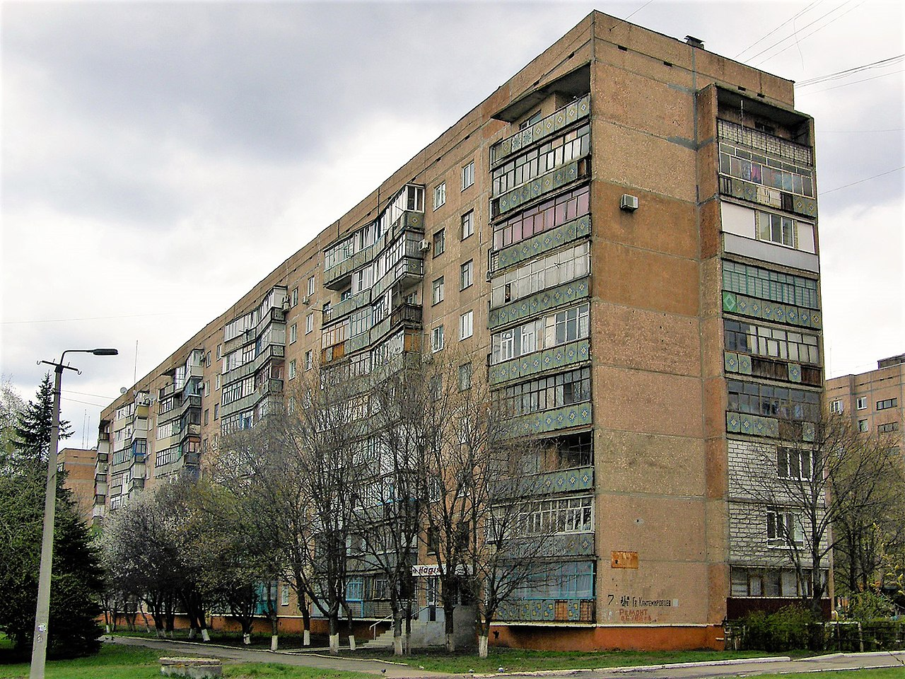
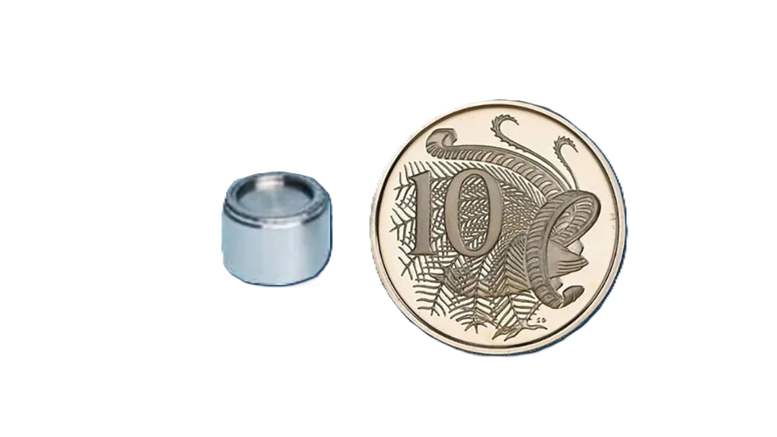

---
keywords:
- exponenciály a logaritmy
- exponenciální funkce
- logaritmická funkce
- radioaktivita
is_finished: true
workflow: in progress
# workflow: translating
# workflow: finished
difficulty: 2
time: 20
---

# Smrtící byt v Kramatorsku

Byt číslo 85, dům 7, Kramatorsk (dříve SSSR, dnes Ukrajina), ulice Mariyi
Pryimachenko byl vskutku prokletý a svým nájemníkům přinesl
jenom samé utrpení. V letech 1980 až 1989 zde postupně žily dvě rodiny
a bezmocně sledovaly, jak jim děti umírají na leukémii. V roce 1980
náhle zemřela osmnáctiletá dcera, kterou v roce 1982 následovali i
její šestnáctiletý bratr a matka. Nic z toho nepřitáhlo pozornost
úřadů a byt naopak dostali noví nájemníci. Ani jim však byt štěstí
nepřinesl a jejich syn zakrátko zemřel, také na leukémii.

### Nehoda v lomu Karansky

Teprve po dalším úmrtí a díky vytrvalosti nového nájemníka byl byt
prohlédnut. Šokovaní inspektoři zjistili, že v dětském pokoji je silný
zdroj radioaktivního záření. Velká část zdi byla vyříznuta a
prozkoumána. Pečlivý průzkum objevil v panelu radioaktivní zářič, jaký
se používá v lomech. Díky značení radiokativních zdrojů bylo zjištěno,
že zmíněný zářič byl ztracen koncem sedmdesátých let v lomu Karansky. Jednalo se o malou kapsli s radioaktivním izotopem cesia-137 vyzařující nebezpečné gama záření. Kapsle se ztratila v lomu a nešťastnou náhodou skončila ve štěrku použitém pro výrobu panelu právě v tomto bytě. V lomech se radioaktivní materiály mohou použít například ke stanovení
hustoty hornin nebo naplněnosti neprůhledných nádob. Jakkoliv se
zacházení s těmito materiály podrobuje přísným pravidlům, k nehodě
někdy dojde. 

#### Pro přehlednost si ještě jednou shrňme, co všechno se stalo:  
- V 70. letech se v kamenolomu u Kramatorsku ztratil radioaktivní zdroj cesia-137 z průmyslového zařízení.
- Štěrk a materiál z lomu se použil k výrobě betonových panelů pro panelový dům.
- V jednom panelu tvořícím stěnu dětského pokoje bytu č. 85 se ocitl pevně zabetonovaný malý zdroj.
- V těsné blízkosti stěny stála dětská postel, kde děti trávily mnoho času (spánek, hraní,  učení).
- Během zhruba jednoho desetiletí postupně onemocnělo a zemřelo několik obyvatel bytu (především dětí) na leukémii. Teprve poté se začalo uvažovat o pravé příčině záhadných úmrtí.
- Nakonec příbuzní a lékaři přizvali odborníky, kteří v bytě naměřili extrémně vysoké dávky záření a objevili kapsli se silným zdrojem cesia-137 přímo ve zdi. 

Tento příběh ukazuje, jak silný může být vliv radioaktivního záření na lidské zdraví, jak zákeřná je "neviditelnost"  radiace a jak důležitá je bezpečná manipulace s radioaktivními látkami.

### Radioaktivní látky a radioaktivní záření
Radioaktivní látkou rozumíme látku obsahující  nestabilní atomová jádra (radionuklidy), která se spontánně rozpadají a produkují přitom záření. 
Rozeznáváme následující druhy záření:  

- Alfa záření: proud těžkých částic (jádra helia), má malý dosah a snadno se odstíní tenkou vrstvou materiálu (např. papírem nebo pokožkou).
- Beta záření: proud elektronů nebo pozitronů, má větší dosah než alfa, ale stále se dá poměrně snadno zastavit například kovem nebo silnější vrstvou plastu.
- Gama záření: velmi pronikavé elektromagnetické záření s velkou energií, odstínění vyžaduje silnou vrstvu hustého materiálu (olovo, beton).

V našem příběhu hraje hlavní roli radioaktivní látka cesium-137, která 
vyzařuje gama záření. To dokáže pronikat stavební konstrukcí i lidským tělem a způsobuje poškození buněk a DNA.

### Radioaktivní rozpad a poločas rozpadu
Radioaktivita (radioaktivní rozpad) je samovolný proces, při kterém se nestabilní jádra atomů samovolně přeměňují na stabilnější jádra a přitom se uvolňuje radioaktivní záření. V souboru velkého počtu jader se tento proces řídí dobře popsatelným zákonem.
Pro počet nerozpadlých jader platí vztah 

$$
\tag{1}
 N(t)=N_0 \mathrm{e}^{-\lambda t}, 
$$

kde 

* $N(t)$ značí množství nerozpadnuté látky v čase $t \geq 0$;

* $N_0$ je počáteční množství látky, tj. množství v čase $t=0$;
* $\lambda$ je konstanta, která charakterizuje předpokládanou rychlost rozpadu;
* $t$ je čas. 

Poločas rozpadu radioaktivní látky (budeme ho označovat jako $T$) je doba, za kterou se počet radioaktivních jader (a spolu s tím i intenzita radioaktivního záření) zmenší na polovinu. Poločas rozpadu $T$ přitom úzce souvisí s konstantou $\lambda$ ze vztahu $(1)$.

Například cesium-137 má poločas rozpadu přibližně 30 let, takže za 30 let klesne množství radioaktivní látky na polovinu. Za dalších 30 let (tj. celkem za 60 let) na čtvrtinu (polovina z poloviny), za 90 let na osminu,  atd.

### Intenzita záření
Intenzita záření je fyzikální veličina, která udává množství energie nebo částic záření procházející jednotkou plochy za jednotku času. 

V dané vzdálenosti od zářiče je intenzita záření přímo úměrná množství nerozpadnutého materiálu ve zdroji. Pokud chceme intenzitu záření snížit například $36\times$, musíme snížit počet jader také $36\times$.   

Bodový zdroj vyzařuje energii rovnoměrně do všech směrů. Čím dál jsme od zdroje záření, tím se energie musí rozprostřít na větší plochu (kulová plocha). Pokud jsme ve vzdálenosti $r$ od zářiče, je obsah této kulové plochy roven $4\pi r^2$. Je tedy přímo úměrný druhé mocnině vzdálenosti. 

Zvětší-li se vzdálenost od zářiče, pak se příslušná dávka záření rozloží na větší plochu, která (jak je uvedeno výše) je přímo úměrná druhé mocnině vzdálenosti. To znamená, že intenzita záření bude naopak s druhou mocninou vzdálenosti klesat. 
Pokud se vzdálenost od zářiče zvětší $k$-krát, intenzita záření klesne $k^2$-krát. 

### Dávka záření a zdravotní riziko 
Dávka záření vyjadřuje, kolik energie záření je absorbováno v určitém množství tkáně. Běžně se používá jednotka gray (Gy) nebo sievert (Sv) pro efekt na biologické tkáně. Dlouhodobé vystavení vyšší dávce záření zvyšuje riziko vzniku nádorů, leukémie a dalších zdravotních problémů. V Kramatorsku šlo o kombinaci relativně malé vzdálenosti, stálé přítomnosti v místnosti (mnoho hodin denně) a dlouhého časového období (roky).

Nyní je již možné pustit se do řešení následujících úloh.

> **Úloha 1.** V panelu tvořícím stěnu dětského pokoje je radioaktivní
> zářič. Nešťastnou shodou okolností právě v místě vedle postele
> jednoho z dětí. Určete, jak by se intenzita radioaktivního záření snížila, pokud
> by dětská postel nebyla u této stěny, ale na opačné straně
> postiženého pokoje. Předpokládejte, že vzdálenost zářiče od dětské postele byla půl metru a
> po přestěhování postele na opačnou stranu pokoje by narostla na tři
> metry, tj. šestkrát.

\iffalse

*Řešení.* Z předchozího víme, že pokud se vzdálenost od zářiče zvětší $k$-krát, intenzita záření klesne $k^2$-krát. Pokud tedy vzdálenost naroste $6\times$, intenzita radioaktivního záření klesne $36\times$. 

\fi

> **Úloha 2.** Cesium-137  použité jako zdroj radioaktivního záření v
> popsaném incidentu má poločas rozpadu 30 let. Určete, za jak dlouho by množství nerozpadnutého cesia v panelu kleslo tak, že by intenzita záření ve vzdálenosti půl metru byla stejně nízká jako původní intenzita ve vzdálenosti $3$ metry ($6\times$ větší vzdálenost). 

\iffalse

*Řešení.* Z úlohy 1 víme, že zvětší-li se vzdálenost $6\times$,  intenzita radioaktivního záření klesne $36\times$. Protože intenzita radioaktivního záření je přímo úměrná množství nerozpadnutého materiálu, chceme zjistit, v jakém čase $t$ bude množství radioaktivního
materiálu $36\times$ menší. 

Můžeme tedy využít vztah $(1)$, tj. 

$$
 N(t)=N_0 \mathrm{e}^{-\lambda t}
$$

s tím, že hledáme $t$ takové, že $N(t)=\frac{1}{36}N_0$. Jednoduchou úpravou a následným logaritmováním vztahu $(1)$ dostáváme: 

$$
\mathrm{e}^{-\lambda t} = \frac{N(t)}{N_0} 
$$

$$
-\lambda t  = \ln \frac{N(t)}{N_0}\tag{2}
$$

Protože po třiceti letech klesne množství radioaktivní látky na polovinu (poločas rozpadu je 30 let), znamená to, že $N(30)=\frac{1}{2}N_0$. Dosazením $t=30$ do vztahu $(2)$ pak dostaneme 

$$
-\lambda \cdot 30  = \ln \frac 12, 
$$
a tedy 
$$
\lambda = -\frac{1}{30} \ln \frac{1}{2} = \frac {\ln 2}{30}.
$$ 

Po dosazení vypočtené konstanty $\lambda$ zpět do $(2)$  dostáváme 
$$
-\frac{\ln 2}{30} \cdot t  = \ln \frac{N(t)}{N_0}
$$
a následně 
$$
t  = -30 \frac{\ln \frac{N(t)}{N_0}}{\ln 2}.
$$
Hledáme čas $t$, v němž bude $N(t)$ (množství radioaktivní látky) $36\times$ menší než v čase $0$, tj. $N(t)=\frac {1}{36}N_0$. Pro tento čas dostáváme
$$
t  = -30 \frac{\ln \frac{1}{36}}{\ln 2}=
30 \frac{\ln {36}}{\ln 2} \doteq 155 \; \text{let}.
$$

Poklesu ozáření ekvivalentnímu přesunu postele na druhou stranu pokoje
bychom se dočkali přibližně po 155 letech.

\fi

>**Úloha 3.** Pokuste se vyřešit úlohu 2 obecně, tj. pro jakoukoliv radioaktivní látku s poločasem rozpadu $T$ a pro případ, že vzdálenost od zářiče vzroste $k$-krát. 
>
>Podrobněji: V čase $t=0$ (začátek pozorování) je postel u stěny. Určete, za jak dlouho ($t>0$) by množství nerozpadnutého materiálu v panelu kleslo tak, že intenzita záření v místě u stěny by byla stejně nízká jako intenzita záření v čase $t=0$ ve vzdálenosti $k$-násobné.  

\iffalse

*Řešení.*
Stejným způsbem jako v úloze 2 bychom dostali, že v případě použité radioaktivní látky s poločasem rozpadu $T$ platí 

$$
 \lambda = \frac{\ln 2}{T}. 
$$

Následně bychom se (opět stejným způsobem) dostali ke vztahu 

$$
 t  = -T \frac{\ln \frac{N(t)}{N_0}}{\ln 2}. 
$$

Nyní si stačí uvědomit, že pokud vzdálenost od zářiče vzroste $k$-krát, intenzita záření je $k^2$-krát menší. Protože intenzita radioaktivního záření je přímo úměrná množství nerozpadnutého materiálu, chceme zjistit, v jakém čase $t$ bude množství radioaktivního
materiálu $k^2$-krát menší. 

Proto pro čas $t$, pro který platí $N(t)=\frac{1}{k^2}N_0$, dostáváme 

$$
 t  = -T \frac{\ln \frac{1}{k^2}}{\ln 2}=
T \frac{\ln (k^2)}{\ln 2} = \frac{2\ \!T \ln k}{\ln 2}. 
$$

**Poznámka.**
Můžeme se přesvědčit, že po dosazení $T=30$ a $k=6$ do posledního vztahu obdržíme $t \doteq 155$ (stejně jako v úloze 2). 

\fi

V následující úloze odvodíme jiný vzorec popisující radioaktivní rozpad. Jeho výhodou je, že se v něm přímo objevuje poločas rozpadu radioaktivní látky. V mnohých situacích se s ním navíc pracuje lépe než se vzorcem $(1)$. 

>**Úloha 4.**
Ukažte, že vztah $(1)$, tj. 
$N(t) = N_0\mathrm{e}^{-\lambda t}$, lze psát ve tvaru 
>
>$$
 N(t)=N_0 \left( \frac{1}{2} \right)^{\!\small{\frac{t}{T}}}, 
>$$
>
>kde $T$ je poločas rozpadu radioaktivní látky.  

\iffalse

*Řešení.*
Dosazením $t=T$ do vztahu $(1)$  dostaneme (uvědomme si, že $T$ je poločas rozpadu, tj. $N(T)=\frac{1}{2}N_0$):

$$
\begin{aligned}
 N(T) &= N_0 \mathrm{e}^{-\lambda T} \\
 \frac{1}{2}N_0 &= N_0 \left( \mathrm{e}^{-\lambda} \right)^T 
\end{aligned}
$$

Postupnými úpravami dostáváme:  

$$
\begin{aligned}
 \frac{1}{2} &= \left( \mathrm{e}^{-\lambda} \right)^T  \\
 \mathrm{e}^{-\lambda} &= \left( \frac{1}{2} \right)^{\!\small{\frac{1}{T}}} 
\end{aligned}
$$

Dosazením poslední rovnosti zpět do vztahu $(1)$ obdržíme 

$$
 N(t)=N_0 \mathrm{e}^{-\lambda t} = N_0 \left( \mathrm{e}^{-\lambda} \right)^t = N_0 \left[ \left(\frac{1}{2}\right)^{\!\small{\frac{1}{T}}} \right]^{{t}} = N_0 \left( \frac{1}{2} \right)^{\!\small{\frac{t}{T}}}. 
$$

\fi

**Poznámka.** 
Ze vztahu $N(t)=N_0 \left( \frac{1}{2} \right)^{\!\small{\frac{t}{T}}}$ je například pěkně vidět, že v případě poločasu rozpadu $T=30 \;\text{let}$ zůstane za $t=90 \; \text{let}$ jedna osmina původního množství látky, protože 

$$
 N(t)=N_0\left( \frac{1}{2} \right)^{\!\small{\frac{t}{T}}} = N_0\left( \frac{1}{2} \right)^{\!\small{\frac{90}{30}}} = N_0\left( \frac{1}{2} \right)^{\!3}=\frac{1}{8}N_0.
$$ 

### Otázky k zamyšlení (bez počítání)
* Proč si lidé v Kramatorsku tak dlouho nevšimli, že problém je ve stěně bytu a ne "jen" v náhodě nebo genetice?

* Jakou roli hraje v tomto příběhu skutečnost, že radioaktivní záření není vidět, cítit ani slyšet?

* Co by se stalo, kdyby byl stejný zdroj umístěn třeba ve zdi sklepa nebo technické místnosti, do které lidé chodí jen zřídka?

* Jak by se změnilo riziko, kdyby v pokoji nespaly děti, ale jen dospělí, kteří tam tráví méně času?

* Jaké povinnosti mají podle vašeho názoru firmy a instituce, které pracují s radioaktivními zdroji (označování, evidence, kontrola)?

* Může být využití radioaktivních látek užitečné (např. medicína, průmysl, energetika)?

### Nehoda nebyla jediná  

Podobná nehoda jako v lomu Karansky se stala začátkem
roku 2023 v Austrálii, kde byl zářič vytroušen během transportu na
vzdálenost 1400 kilometrů. Hledání bylo vskutku hledáním jehly v kupce
sena, protože zářičem je váleček velikosti knoflíkové baterie o
velikosti 8 milimetrů. Australský zářič se naštěstí podařilo najít u
silnice, po které se transport pohyboval. 

## Odkazy a literatura

### Literatura

* Wikipedie, Kramatorsk radiological accident,
  <https://en.wikipedia.org/wiki/Kramatorsk_radiological_accident>,
  September 28, 2023

* <https://www.irozhlas.cz/zpravy-svet/australie-radiace-nebezpeci-varovani-radioaktivita-cesium-137-ozareni_2301311701_har>,
  September 28, 2023

* <https://edition.cnn.com/2023/02/01/australia/australia-radioactive-capsule-found-intl-hnk/index.html>, September 28, 2023

* <https://en.wikipedia.org/wiki/Kramatorsk_radiological_accident2.>

* <https://www.iflscience.com/the-devastating-kramatorsk-radiological-accident-almost-killed-an-entire-apartment-block-67384> 

* <https://www.curiousarchive.com/death-in-apartment-85-the-kramatorsk-radiological-accident/5>

* <https://www.amusingplanet.com/2023/11/the-building-that-gave-its-residents.html> 

* <https://www.reddit.com/r/interestingasfuck/comments/zqrz3p/in_the_1970s_a_capsule_with_radioactive>

### Zdroje obrázků

* Artemka, Own work, <https://commons.wikimedia.org/wiki/File:%D0%A3%D0%BB%D0%B8%D1%86%D0%B0_%D0%9C%D0%B0%D1%80%D0%B8%D0%B8_%D0%9F%D1%80%D0%B8%D0%B9%D0%BC%D0%B0%D1%87%D0%B5%D0%BD%D0%BA%D0%BE,_7.jpg>, September 28, 2023

* <https://edition.cnn.com/2023/02/01/australia/australia-radioactive-capsule-found-intl-hnk/index.html>, September 28, 2023

