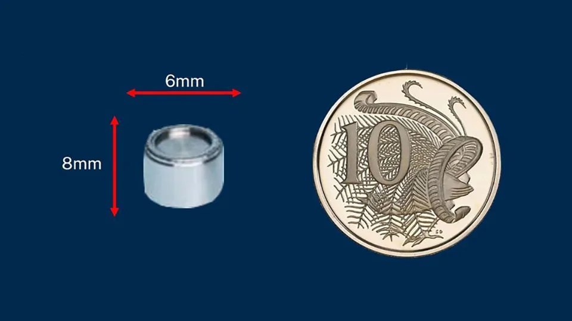

---
keywords:
- exponenciály a logaritmy
- exponenciální funkce
- logaritmická funkce
- radioaktivita
is_finished: true
difficulty: 2
time: 20
---

# Smrtící byt v Kramatorsku

Byt číslo 85, dům 7, Kramatorsk (dříve SSSR, dnes Ukrajina), ulice Mariyi
Pryimachenko byl vskutku prokletý a svým nájemníkům přinesl
jenom samé utrpení. V letech 1980 až 1989 zde postupně žily dvě rodiny
a bezmocně sledovaly, jak jim děti umírají na leukémii. V roce 1980
náhle zemřela osmnáctiletá dcera, kterou v roce 1982 následovali i
její šestnáctiletý bratr a matka. Nic z toho nepřitáhlo pozornost
úřadů a byt naopak dostali noví nájemníci. Ani jim však byt štěstí
nepřinesl a jejich syn zakrátko zemřel, také na leukémii.

## Nehoda v lomu Karansky

Teprve po dalším úmrtí a díky vytrvalosti nového nájemníka byl byt
prohlédnut. Šokovaní inspektoři zjistili, že v dětském pokoji je silný
zdroj radioaktivního záření. Velká část zdi byla vyříznuta a
prozkoumána. Pečlivý průzkum objevil v panelu radioaktivní zářič, jaký
se používá v lomech. Díky značení radiokativních zdrojů bylo zjištěno,
že zmíněný zářič byl ztracen koncem sedmdesátých let v lomu Karansky.

V lomech se radioaktivní materiály mohou použít například ke stanovení
hustoty hornin nebo naplněnosti neprůhledných nádob. Jakkoliv se
zacházení s těmto materiály podrobuje přísným pravidlům, k nehodě
někdy dojde. Podobná nehoda jako v lomu Karansky se stala začátkem
roku 2023 v Austrálii, kde byl zářič vytroušen během transportu na
vzdálenost 1400 kilometrů. Hledání bylo vskutku hledáním jehly v kupce
sena, protože zářičem je váleček velikosti knoflíkové baterie o
velikosti 8 milimetrů. Australský zářič se naštěstí podařilo najít u
silnice, po které se transport pohyboval. Ukrajinský zářič bohužel
takové štestí neměl a skončil v panelu, ze kterého byl postaven
nešťastný dům.

> **Úloha 1.** V panelu tvořícím stěnu dětského pokoje je radioaktivní
> zářič. Nešťastnou shodou okolností právě v místě vedle postele
> jednoho z dětí. Pokuste se odhadnout, jak by se dávka snížila, pokud
> by dětská postel nebyla u této stěny, ale na opačné straně
> postiženého pokoje. Předpokládejte, že zářič září všemi směry
> rovnoměrně, že vzdálenost zářiče od dětské postele byla půl metru a
> po přestěhování postele na opačnou stranu pokoje by narostla na tři
> metry, tj. šestkrát.

\iffalse

*Řešení.* Podle zadání je možné předpokládát, že záření se rovnoměrně rozloží na
kulovou plochu.

Povrch koule o poloměru $r$ je dán vzorcem 

$$S = 4\pi r^2.$$

Odsud plyne, že kulová plocha mající šestinásobný poloměr má 36-krát
větší povrch. Veškerý výkon zářiče se tedy rozloží na 36-krát větší
povrch. Proto je intenzita radiace v šestinásobné vzdálenosti celkem
36-krát menší.

\fi

> **Úloha 2.** Cesium použité jako zdroj radioaktivního záření v
> popsaném incidentu má poločas rozpadu 30 let. Určete, za jak dlouho
> by radioaktivita klesla stejným násobkem, jako odpovídá přestěhování
> postele v předchozí úloze.

\iffalse

*Řešení.* Z fyziky je známo, že aktivita zářiče a množství nerozpadnuté látky
jsou úměrné a obě klesají exponenciálně s časem podle vztahu

$$N(t) = N_0\mathrm{e}^{-\lambda t},\tag{1}$$

kde

* $N(t)$ značí množství nerozpadnuté látky v čase;
* $N_0$ je počáteční množství látky;
* $\lambda$ je přeměnová konstanta, která charakterizuje předpokládanou rychlost přeměny;
* $t$ je čas. 

Je tedy nutné najít, v jakém čase bude množství radioaktivního
materiálu 36-krát menší. Logaritmováním vztahu (1) dostáváme

$$-\lambda t  = \ln \frac{N(t)}{N_0}\tag{2}.$$

Protože po třiceti letech klesne množství na polovinu, 
tj. $N(30)=\frac{1}{2}N_0$, tak platí

$$
-\lambda 30  = \ln \frac 12
$$
a
$$
\lambda = \frac 1{30}\ln 2.
$$ 

Po dosazení do (2) dostáváme 
$$
-\frac 1{30}t\ln 2  = \ln \frac{N(t)}{N_0}
$$
a 
$$
t  = -30 \frac{\ln \frac{N(t)}{N_0}}{\ln 2}.
$$
Pro čas, kdy platí $\frac{N(t)}{N_0}=\frac {1}{36}$ dostáváme
$$
t  = -30 \frac{\ln \frac{1}{36}}{\ln 2}=
30 \frac{\ln {36}}{\ln 2} \doteq 155.
$$

Poklesu ozáření ekvivalentnímu přesunu postele na druhou stranu pokoje
bychom se dočkali po 155 letech.

\fi

## Odkazy a literatura

### Literatura

* Wikipedie, Kramatorsk radiological accident,
  <https://en.wikipedia.org/wiki/Kramatorsk_radiological_accident>,
  September 28, 2023

* <https://www.irozhlas.cz/zpravy-svet/australie-radiace-nebezpeci-varovani-radioaktivita-cesium-137-ozareni_2301311701_har>,
  September 28, 2023

* <https://edition.cnn.com/2023/02/01/australia/australia-radioactive-capsule-found-intl-hnk/index.html>, September 28, 2023

### Zdroje obrázků

* Artemka, Own work, <https://commons.wikimedia.org/wiki/File:%D0%A3%D0%BB%D0%B8%D1%86%D0%B0_%D0%9C%D0%B0%D1%80%D0%B8%D0%B8_%D0%9F%D1%80%D0%B8%D0%B9%D0%BC%D0%B0%D1%87%D0%B5%D0%BD%D0%BA%D0%BE,_7.jpg>, September 28, 2023

* <https://edition.cnn.com/2023/02/01/australia/australia-radioactive-capsule-found-intl-hnk/index.html>, September 28, 2023

