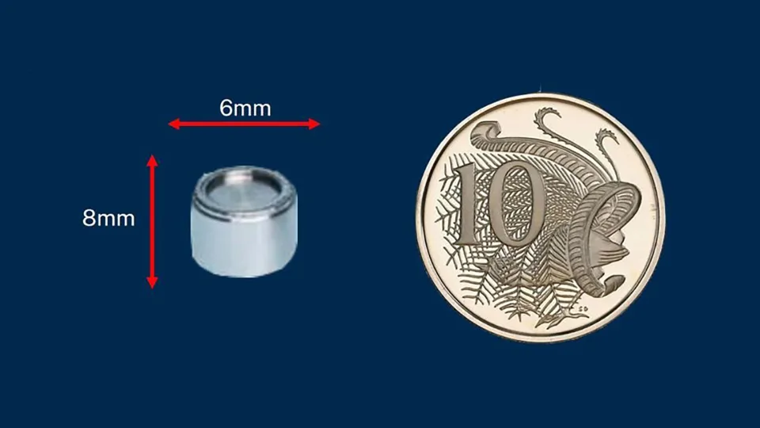

---
keywords:
- exponentials and logarithms
- exponential function
- logarithmic function
- radioactivity
is_finished: true
---

# Deadly Flat in Kramatorsk

Apartment number 85, building 7, Mariyi Pryimachenko Street, Kramatorsk (formerly USSR, now Ukraine),
was truly cursed and brought its tenants
nothing but misery. Between 1980 and 1989, two families lived here in
turn and watched helplessly their children die from leukemia. An
18-year-old daughter died suddenly in 1980, followed by her 16-year-old brother
and mother in 1982.  Neither of this deaths attracted the attention
of the authorities, and the apartment was given to new tenants. 
Unfortunately, they were not lucky either, as their son soon died of leukemia as well.

## Karansky Quarry Accident

Only after another death, and thanks to the persistence of a new tenant, was the apartment inspected. The inspectors were shocked. They
discovered that the children's room was a strong source of radioactive
radiation. A large part of the wall had been cut out and
examined. Careful examination revealed a radiation emitter in the
panel, the kind used in quarries. The marking on the emitter revealed
that it was lost in the late 1970s at the Karansky Quarry.

In quarries, radioactive materials can be used, for example, to
determine the density of rocks or the fill level of opaque
containers. Despite the fact that the handling of these materials is
subject to strict regulations, an accident sometimes occurs. Similar
accident happened in early 2023 in
Australia. There, an emitter was lost during transport over a distance of
1,400 kilometers. The search was indeed like looking for a needle in
a haystack. The emitter is a button-battery-sized cylinder, 8
millimeters in size. Fortunately, the Australian emitter was found at
the road the transport was travelling on. Unfortunately, the Ukrainian
emitter was not so lucky and ended up in the panel which was used in
the construction of the ill-fated house.

> **Problem 1.** The panel forming the wall of the children's room contains
> a radioactive emitter. By unfortunate coincidence, it is located right next to one of the children’s beds. Try to estimate how much the
> radiation dose would be reduced if the child's bed was moved to the
> opposite side of the affected room. Assume that the emitter radiates evenly in all directions. Also, assume that the distance
> of the emitter from the child's bed was half a meter, and that after moving  the
> bed to the opposite side of the room, the distance increases to three
> meters, i.e., six times.

\iffalse

*Solution.* According to the problem assignment, we can assume that the radiation is evenly distributed over
a spherical area.

The surface area of a sphere with radius $r$ is given by the formula: 

$$S = 4 \pi r^2.$$

From this, it follows that a spherical surface with six times the
radius has 36 times the surface area. Therefore, the total power of the emitter
is spread over a 36 times larger surface area. Hence, the
radiation intensity at six times the distance is 36 times lower.

\fi

> **Problem 2.** The cesium used as the source of radioactive radiation
> in the incident described has a half-life of 30 years. Determine how
> long it would take for the radioactivity to decrease by the same
> factor as after the relocation of the bed as in the previous problem.

\iffalse

*Solution.* From physics, we know that the activity of a radiator
and the amount of undecayed material are proportional and both
decrease exponentially with time according to the equation:

$$
N(t) = N_0\mathrm{e}^{-\lambda t},\tag{1}
$$

where

* $N(t)$ denotes the amount of undecayed substance at time $t$;
* $N_0$ is the initial amount of the substance;
* $\lambda$ is the decay constant, which characterizes the expected rate of transformation;
* $t$ is time.

It is therefore necessary to find at what time the amount of radioactive
material is 36 times smaller. By taking the logarithm of both sides of equation (1), we get:

$$
-\lambda t = \ln \frac{N(t)}{N_0}\tag{2}.
$$

Since the quantity halves in thirty years, i.e. $N(30)=\frac{1}{2}N_0$, we have:

$$
-\lambda\,30 = \ln \frac 12
$$

and

$$
\lambda = \frac 1{30}\ln 2.
$$ 

Substituting into equation (2), we get: 

$$
-\frac 1{30}t\ln 2 = \ln \frac{N(t)}{N_0}
$$

and 

$$
t = -30 \frac{\ln \frac{N(t)}{N_0}}{\ln 2}.
$$

We have to determine the time, which ensures $\frac{N(t)}{N_0}=\frac {1}{36}$. We get:

$$t = -30 \frac{\ln \frac{1}{36}}{\ln 2} =
30 \frac{\ln {36}}{\ln 2} \doteq 155.$$

The radiation level drops to the equivalent to moving the bed to the other side of the room after approximately 155 years.

\fi

## References and Literature

### Literature

* Wikipedie, Kramatorsk radiological accident,
  <https://en.wikipedia.org/wiki/Kramatorsk_radiological_accident>,
  September 28, 2023

* <https://www.irozhlas.cz/zpravy-svet/australie-radiace-nebezpeci-varovani-radioaktivita-cesium-137-ozareni_2301311701_har>,
  September 28, 2023

* <https://edition.cnn.com/2023/02/01/australia/australia-radioactive-capsule-found-intl-hnk/index.html>, September 28, 2023

### Image Sources

* Artemka, Own work, <https://commons.wikimedia.org/wiki/File:%D0%A3%D0%BB%D0%B8%D1%86%D0%B0_%D0%9C%D0%B0%D1%80%D0%B8%D0%B8_%D0%9F%D1%80%D0%B8%D0%B9%D0%BC%D0%B0%D1%87%D0%B5%D0%BD%D0%BA%D0%BE,_7.jpg>, September 28, 2023

* <https://edition.cnn.com/2023/02/01/australia/australia-radioactive-capsule-found-intl-hnk/index.html>, September 28, 2023
                                                      

